:::note 前言
pink老师的JavaScript基础教程
:::

## 初识javascript 

### JavaScript 组成： <br />
ECMAScript、DOM、BOM <br />
ECMAScript 是由CMA国际进行标准化的一门编程语言，这种语言在万维网上应用广泛。 <br />

DOM----文档对象模型 <br />
是W3C组织推荐的处理可扩展标记语言格标准汇编语言。<br />
通过DOM提供的接口可以对页面上的各种元素进行操作（大小、位置、颜色）。 <br />

BOM----浏览器对象模型 <br />
BOM是指浏览器对象模型，它提供了独立于内容的，可以于浏览器进行交互的对象结构，通过BO可以操作浏览器窗口，比如弹窗、控制浏览器跳转，获取分辨率。 <br />

### JS引入方法
1. 行内式 JS <br .>
2. 内嵌式
```js
<script>
    alert'hello Word!')
</script>
```
3. 外部式 
```js
<script src="mt.js"> </script>
```
### JS 注释
单行注释： ctrl + /
```js
//单行注释
```
多行注释： shift + alt + a
```js
/* 多行注释
多行注释 */
```
### JS 输入输出语句
输入语句：
```js
<script> 
    prompt('请输入：')
</script>
```
弹出警示框：输出展示给用户
```js
<script>
    alert('这是一个提示！')
</script>
```
控制台输出：程序员测试
```js
<script>
    console.log('程序员可以看到')
</script>
```

## 变量

### 变啦的概述
白话：变量就是一个装东西的盒子。 <br />
通俗：变量用于存储数据的容器，我们通过变量名获取数据，甚至数据可以修改。 <br />

1. 变量在内存中的存储 <br />
本质、变量是程序在内存中申请的一块用来存放数据的空间。 <br />

### 变量的使用
变量在使用时分为两步： 1.声明变量 2.赋值 <br />

1. 声明变量
```js
// 声明一个名称为age的变量
var: age; 
```

2.赋值 
```js
// 给age赋值为 10
age = 10;
```
3. 变量的初始化 <br />
声明一个变量并赋值，我们称之为变量的初始化。
```js
// 声明变量同时赋值为10
var age = 10 
```

### 变量的语法扩展

1.更新变量 <br />
一个变量被重新赋值后，它原始的值就会被覆盖，变量值将以最后一次附的值为准。 <br />
```js
var myname = '卡卡西';
var myname = '鸣人';
console.log(myname);
```

2. 声明多个变量
```js
var age = 18,
    address = '地址',
    gz = 2000;
```

3. 声明变量的特殊情况 <br />
(1) 只声明不赋值 <br />
```js
var age;
console.log(age); //undefined
// 系统也不知道输出的是什么，所示显示undefined 未定义的意思。
```
（2） 不声明变量不赋值 然后输出 ，会报错 <br />
(3) 不声明直接赋值使用
```js
qq = 110;
console.log(qq);  //输出结果：110
```

### 变量命名规范
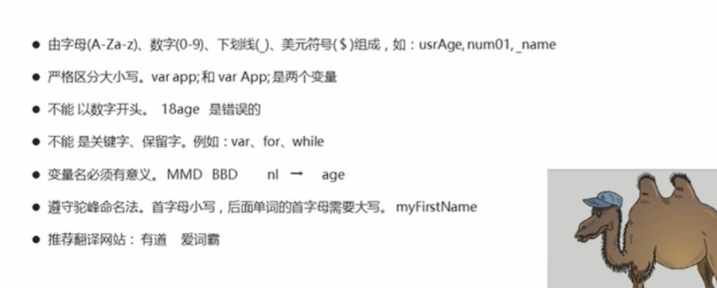

## 数据类型

### 数据类型简介
不同数据占用的存储空间不同，把数据分成不同类型。 <br />

### 简单的数据类型
<strong>1. 变量的数据类型 <br /></strong>
javascript 是一种弱类型或者说是动态语言，这意味着不用提前声明变量的类型，在程序运行过程中，类型会被自动的确定，变量的数据类型是可以变化的。 <br />

```js
var num = 10; //num属于数字类型
```

<strong>2. 数据类型的分类 <br /></strong>
js 把数据类型分为两类: (Number,String,Boolean,Undefined,Null) <br />
简单数据类列，复杂数据类型:(object)<br />

<strong>3. 简单的数据类型 <br /></strong>
<strong>(1) 数字型 Number</strong>

```js
var age = 21; // 整数
var age = 21.333; // 小数（浮点数）
```
数字型 进制转换 <br />
```js
// 八进制 0 ~ 7 我们程序里面数字前面加 0 表示八进制
var num = 101;
console.log(num); // 010 八进制 转换为 10进制为 8
// 十六进制 0 ~ 9 a ~ f  如果数字的前面加 0x 那么表示十六进制
var num1 = 0x9
console.log(num1); //0x9 十六进制 转换为 十进制为 9
```

数字型的最大值和最小值 <br />
```js
// 数字型的最大值
console.log(Number.MAX_VALUE); 
// 数字型的最小值
console.log(Number.MIN_VALUE)
```
数字型三个特殊值 <br />

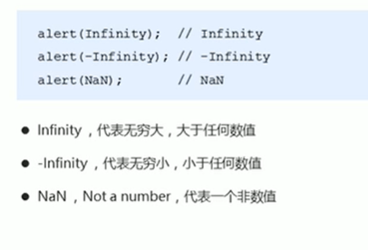
无穷大： 
```js
console.log(Number.MAX_VALUE * 2) ;// 输出Infinity 无穷大
console.log(-Number.MAX_VALUE * 2); // 输出-Infinity 无穷小
```
非数字：
```js
console.log('字符' - 10); // 输出 NaN 不是一个数字
```
isNaN（）  <br />
这方法用来判断是不是非数字，并且返回一个值，如果是数字返回false，如果不是数字返回true。 <br />
```js
console.log(isNaN(12)); //false
console.log(isNaN('字符'))  //true
```

<strong>（2）字符串型 String <br /></strong>
字符串型 可以是引号中的任何文本，其语法为双引号和单引号。 <br />
<strong> 因为HTML里面用双引号，javascript里推荐使用单引号。</strong> <br />

字符串引号嵌套 <br />
js可以用单引号嵌套双引号，或者床引号嵌套单引号（外双内丹，外单内双）<br />

```js
var SteNsg = '你好“中国”哦'; //外双内单
var SteNsg = "你好'中国'哦"; //外单内双
```

字符串转义符 <br />
字符串转义符 都是用 \ 开头，但是转义符要写在单引号或者双引号里面。 
```js
console.log('你好\n世界');
\n  换行符 
\\  斜杠\
\'  ' 单引号
\"  " 双引号
\t  tab 缩进
\b   空格
```

字符串长度 <br />
字符车是由若干字符组成的，这些字符的数量就是字符串的长度，通过字符串的<strong> length </strong> 属性可以获取整个字符串的长度。 <br />
```js
var str = 'my name is andy';
console.log(str.length); // 15
```

字符串的拼接 <br />
多个字符串之间可以使用 + 进行拼接，可以生成新的字符串 <br />
```js
 console.log('你好'+ '，' + '世界' +'!');//你好，世界!
 console.log('你好'+ '，' + '世界' +'!' + 18); //你好，世界!18
 console.log('你好'+ '，' + '世界' +'!' + true); //你好，世界!true
 console.log(12 + 12) // 24
 console.log('12' + 12) //1212
 // 只要由字符串和其他类型的拼接，最后得到的都是字符串类型。
```

字符串拼接加强 <br />
```js
var age = 18;
console.log('我今年'+ age + '岁'); // 我今年18岁
// 变量和字符串相连的口诀：  引引加加
console.log('我今年'+age+'岁'); 
```

案例：
```js
var age = prompt('请输入你的年龄：');
alert('你的年龄是：' + age + '岁')
console.log('你的年龄是：' + age + '岁')
```
<strong>(3) 布尔型 Boolean <br /></strong>
布尔型有两个值：true 和 false <br />

```js
var flag = true; 
var flag1 = false;
console.log(flag + 1); //true 参与加法运算当1来看 2
console.log(flag1 + 1); //true 参与加法运算当1来看 1
```

<strong>（4） Underfined 和Null <br /></strong>
一个声明后没有被赋值，会有一个默认值 undefined <br />

```js
var str;
console.log(str); // underfined
var veriable = undefined;
console.log(undefined + '你好'); // undefined你好
console.log(undefined + 1); // NaN endefined 和数字相加结果是 NaN
//null
var space = null;
console.log(space + '你好'); //null你好
console.log(space + 1); // 1
```

### 获取变量数据类型
<strong>1. tpeof 可以获取检测变量的数据类型 <br /></strong>

```js
var num = 16;
console.log(typeof num); //number
var str = '你好世界';
console.log(typeof str);  //string
var flag = true;
console.log(typeof flag); //boolean
var vari = undefined;
console.log(typeof vari); //undefined
var timer = null;
console.log(typeof timer); //objact
```

<strong>2. 字面量 <br /></strong>
字面量是在源代码有一个固定值的表示方法，通俗的说，就是字面量表示如歌表达这个值。 <br />
数字字面量： 1 2 3  <br />
字符串字面量： '你好世界'  <br />
布尔型：true false  <br />

### 数据类型的转换
我们通常会实现的三种方式的转换： <br />
(1)转换为字符串 <br />
(2)转换为数字类型 <br />
(3)转换为布尔型 <br />

<strong>1. 转换为字符串 <br /></strong>

```js
// 把数字型转换为字符串 变量.toString
var num = 10;
var str = num.toString();
//把数字强制转换字符串 String(变量)
var num1 = 10;
var str1 = num.String();
console.log(typeof String(num));
//利用拼接字符串的方法实现转换字符串 隐式转换
var num2 = num + '';
console.log(typeof num2);
po
```

<strong>2. 转换为数字类型 <br /></strong>

```js
//  parseInt(变量) 可以把字符转换为数字型 但是是整数,不会进位
var age = prompt('请输入你的年龄：');
console.log(typeof parseInt(age));
console.log(parseInt('120px')); // 120 会去掉px这个单位 
// parseFloat  可以把字符转换为数字型 可以得到的是小数（浮点数）
console.log(parseFloat(3.14)); // 3.14
console.log(parseFloat('120px')); // 120 会去掉px这个单位 
// Number(变量) 强制转换为数字型 
var str = '123';
console.log(Number(str)); // 123
// 利用了素数愠色 - * /  隐式转换
console.log('12' - 0); // 12
console.log('123' - 120); // 3
console.log(typeof ('123' - 120));// number
```

案例：年龄
```js
var age = prompt('请输入出生年份：');
alert('你今年的年龄是：' + (2021 - age) + '岁');
```
案例： 两个数字相加
```js
var num1 = prompt('输入第一个数字：');
var num2 = prompt('输入第二个数字：');
var num3 = parseFloat(num1) + parseFloat(num2);
alert('最后相加的结果是：'+ num3);
```

<strong>3. 转换为布尔型 <br /></strong>
代表<strong>空、否定的值 </strong> 会被转换为false，如''，0，NaN，null，UNDERFINED <br />
其余的值都会转换为 true <br />
```js
console.log(Boolean(数值));
```

## 解释型语言和编译型语言
计算机不能直接理解任何机器语言以外的语言，所以必须要把程序员所写的程序语言翻译成计算机语言才能执行程序，程序语言翻译成机器语言的工具，被称为翻译器。 <br />
翻译器翻译的方式有两种：一个是编译，一个是解释，两种方式之间的区别在于翻译的时间点不同。 <br />
编译器是在代码执行之前进行编译，生成中间代码文件。 <br />
解释器是在运行时间进行及时解释，并立即执行（当前编译器以解释的方式运行的时候，称为解释器） <br />
<strong>1. 执行过程 <br /> </strong>
类似于请客吃饭： <br />
编译语言：首先把所有的菜做好，才能上桌吃饭。<br />
解释语言：比如吃火锅，边吃边涮，同时进行。 <br />
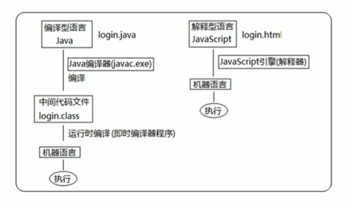

## 标识符、关键字、保留字

### 标识符
标识（zhi）符，就是指开发人员为变量、属性、函数、参数取得数字。 <br />
标识符不能是关键字或者保留字。 <br />

### 关键字
关键字：是指js本身已经使用了的字，不能在用它们当做变量名、方法名。 <br />
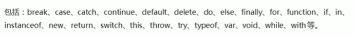

### 保留字
保留字：实际上就是预留的“关键字”，意思是现在虽然还不是关键字，但是未来可能会成为关键字，同样不能视同它们当变量名或者方法名。  <br />
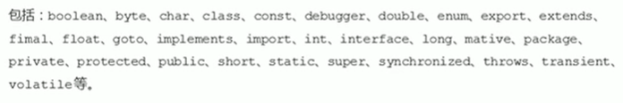

案例：输入信息并打印出来

```js
var myname = prompt('输入你的名字：');
var age = prompt('输入你的年龄：');
var xingbie = prompt('输入你的性别：');
alert('你的姓名：' + myname + '\n' + '你的年龄：' + age + '\n' + '你的性别：' + xingbie )
```

## JavaScript 运算符
运算符被称为操作符，是用于实现赋值，比较和执行算数运算等功能的符号。 <br />

### 算术运算符
概念：算数运算使用的符号，用于执行两个变量或值得算术运算。 <br />
<strong>加 减 乘 除 取余 </strong>

```js
console.log(1 + 1); //2
console.log(1 - 1); //0
console.log(1 * 1); //1
console.log(1 / 1); //1
// 取余数
console.log(4 % 2); //0
console.log(3 % 5); // 3
console.log(5 % 3); //2
// 浮点数 素数运算里面会有问题
console.log(0.1 + 0.2);  // 0.30000000000000004
console.log(0.07 * 100); //7.000000000000001
```

<strong>浮点数的精度问题  </strong><br /> 
浮点数值得 最高精度是17位小数，但在进行算数运算时其精度远远不如整数。 <br />

<strong>1. 表达式和返回值 </strong>
简单理解： 是由数字、运算符、变量等组成的式子。 <br />
<strong> 表达式最终都会有一个结果，返回给我们，我们称为返回值。</strong>

```js
console.log(1 + 1); // 2就是返回值
// 在我们程序里面 2 = 1 + 1 把我们右边表达式计算完毕把返回值给左边
var mun = 1 + 1;
```

### 递增和递减运算符
如果需要反复给数字变量添加或减去 1 ，可以使用递增（++） 递减（--）运算符来完成。 <br />
```js
var num = 1;
num = ++num;
console.log(num); // 2
```
在javascript 炸，递增（++）和 递减（--） 既可以放在变量的前面，也可以放在变量的后面。 <br />
放在变量的前面，我们称为前置递增（递减）运算符，放在后面，我们称为后置递增（递减）运算符。 <br />
<strong>注意：递增和递减运算符必须和变量配合使用 </strong>

<strong>1.  前置递增运算符 </strong> <br />
++num 前置递增，就是自加1，类似num = num + 1，但是++num写起来更简单。 <br />

```js
var age = 10;
++age; // 类似于 age = age + 1
// 先加1，然后返回值。
var p = 10;
console.log(++p + 10); // 最后结果是 21
```

<strong>2.  后置递增运算符 </strong> <br />
num++ 后置递增，就是自加1，类似num = num + 1，但是++num写起来更简单。 <br />

```js
// 前置递增和后置递增 单独使用增加的效果是一样的
var num = 10;
num++; // 最后结果是 11
++num; // 最后结果也是 11
// 后置递增 先返回原值，后自增。
var age = 10;
console.log(age++ + 10); //输出的结果是： 20
console.log(age);  //输出结果是： 11
```

### 比较运算符 
比较运算符（关系运算符）是两个数据进行比较时所使用的的运算符，比较运算后，会返回一个布尔值（true/false）作为比较运算符的结果。 <br />

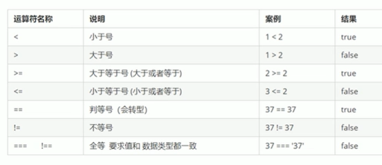

```js
console.log(3 >= 5); //false
console.log(2 <= 5); //true
// == 会默认转换数据类型 会把字符串的转换为数字型的，然后比较。
console.log(3 == 5); //false
console.log(18 == 18); //true
console.log(18 == '18'); //true 
console.log( 10 != 10); //false
// 我们程序里有全等这个概念，一模一样
console.log(18 === 18)； //true
console.log(18 === '18'); //false
```

<strong> 等号小结 </strong>

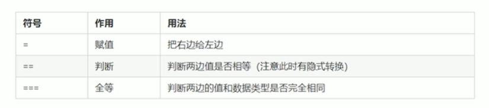

### 逻辑运算符
逻辑运算符是用来进行布尔运算的运算符，其返回追也是布尔值，后面开发中经常用于多个条件的判断。 <br />

<strong> 逻辑 与 && </strong>

```js
// 逻辑 与 两侧都为 true 结果为 true 只要一个false 结果就为 false
console.log(3 > 5 && 3 > 2) //false
console.log(3 <> 5 && 3 > 2) //true
```

<strong> 逻辑 或 || </strong>

```js
// 逻辑 或 || 两侧为false 结果为false，只要一个true 结果为true
console.log(3 > 5 || 3 > 2) // true
console.log(3 > 5 || 3 < 2) // false
```

<strong> 逻辑 非 ！ </strong>

```js
console.log(!true) //false
```

<strong> 短路运算（逻辑中断） </strong> <br />
短路运算的原理： 当有很多格表达式（值）时，左边的表达式值可以确定结果时，就不在继续运算右边的表达式， <br />

<strong>逻辑与  </strong><br/>
语法：表达式1 && 表达式2 <br/>
如果第一个表达式为真，则返回表达式2 <br/>
如果第一个表达式为假，则返回表达式1 <br/>

```js
console.log(123 && 456); // 456
console.log(0 && 456); //  0
console.log(0 && 1 + 2 && 123 * 789); // 0
```

<strong>逻辑咯  </strong><br/>
语法：表达式1 && 表达式2 <br/>
如果第一个表达式为真，则返回表达式1 <br/>
如果第一个表达式为假，则返回表达21 <br/>

```js
console.log(123 || 456); // 123
console.log(0 || 456); //  456
```

案例 ：中断运算会影响程序的运算结果

```js
var num = 0;
console.log(123 || ++num)
console.log(num)
// 最后num的值为： 0
```

### 赋值运算符
用来把数据赋值给变量的运算符 <br />

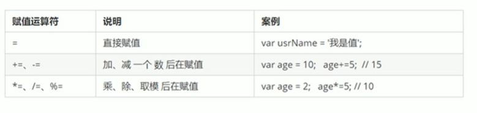

```js
var num = 10;
num = num + 2; // num += 2
num += 2;
console.log(num); // 12
```

### 运算符的优先级

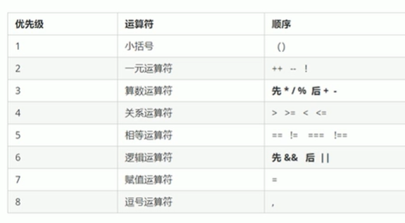

一元运算符里面的逻辑非的优先级很高 <vr />
逻辑与比逻辑或的优先级高 <br />

## JavaScript 流程控制 -- 分支
 
### 流程控制
在一个程序执行的过程中，各条代码执行的顺序对程序的结果是有直接影响的。 <br />
很多时候我们要通过控制代码的指令顺序来实现我们要完成的功能。 <br />
简单理解: 流程控制就是来控制我们的代码按照什么结构顺序来执行。 <br />
流程控制主要有三种结构： <strong>顺序结构、分支结构和循环结构 </strong>，这三种结构代码三种代码执行的顺序。 <br />

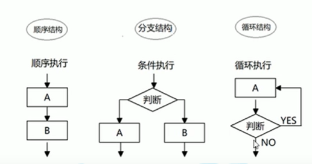

#### 顺序结构

顺序结构是程序中最简单、最基本的流程控制，他没有特定的语法结构，程序会按照 <strong> 代码的先后顺序，依次执行。 </strong>
 
#### 分支结构
由上到下执行代码的过程中，根据不同的条件，执行不同的路径代码（执行代码多选一的过程），从而得到不同的结果。 <br />
JS 语言提供了两种分支结构语句： <strong> if语句和switch语句 </strong> <br />

### if语句
<strong> 语法结构：</strong> 

```js
if(条件表达式) {
    //执行语句
}
```
<strong> 执行思路：</strong>  <br />
如果if 里面的条件表达式结果为 true，则执行大括号里面的 执行语句。 <br />
如果if条件表达式结果为 false ，则不执行大括号里面的语句，执行if语句后面的代码。 <br />

```js
if(3 > 5){
    alert('判断3 > 5 为真');
}
```

<strong> 案例： 进网吧</strong>  <br />

```js
var age = parseInt(prompt('请输入你的年龄：'));
if (age >= 18) {
    alert('欢迎进入本网吧！');
}
```

### if else语句(双分支语句)
<strong> 语法结构：</strong> 

```js
if (条件表达式) {
    // 执行语句1
} else {
    // 执行语句2
}
```
<strong> 执行思路：</strong>  <br />
如果 if 条件表达式为 true 执行语句1，如果为 false 执行语句2. <br />

<strong> 案例：判断闰年</strong>  <br />

```js
var year = parseInt(prompt('请输入年份：'));
if(year % 4 == 0 && year % 100 != 0 || year % 400 == 0) {
    alert(year + '是闰年');
}
else{
    alert(year + '是平年');
}
```

:::important 总结
if 里面的语句1和else 里面的语句2，最终只能执行一个操作。 <br />
else 后面跟大括号，不能跟小括号，否则会报错。
:::

### if else if 语句(多分支语句)
多分支语句就是利用多个条件来选择不同的语句执行，得到不同的结果，多选一的过程。 <br />
<strong> 语法结构：</strong> 

```js
if (条件表达式1) {
    // 语句1
} else if (条件表达式2) {
    // 语句2
} else if (条件表达式3) {
    // 语句3
} else {
    // 最后的语句
}
```
<strong> 执行思路：</strong>  <br />
条件满足执行语句，不满足判断下一个条件表达式，直到判断结果为 true，执行大括号里面的语句。 <br />
<strong>最后只执行一个语句。 </strong> <br /> 

<strong> 案例：判断成绩级别</strong>  <br />

```js
var results = parseInt(prompt('请你的成绩份：'));
if (results >= 90) {
    alert('你的成绩是：' + results + '\n' + '成绩级别是： A');
} else if (results >=80 && results < 90) {
    alert('你的成绩是：' + results + '\n' + '成绩级别是： B');
} else if (results >= 70 && results < 80) {
    alert('你的成绩是：' + results + '\n' + '成绩级别是： C');
} else if (results >= 60 && results < 70) {
    alert('你的成绩是：' + results + '\n' + '成绩级别是： D');
} else {
    alert('你的成绩是：' + results + '\n' + '成绩级别是： E');
}
```

### 三元表达式
三元表达式也能做一些简单的条件选择，有三种运算符组成的式子被称为三元表达式。 <br />
<strong> 语法结构：</strong>  

```js
条件表达式 ? 表达式1 : 表达式2
```

<strong> 执行思路：</strong>  <br />
如果条件表达式为 true 返回表达式1的值。 <br /> 
如果条件表达式为 false 返回表达式2的值。 <br />

```js
var num = 10;
var result = num > 5 ? '这个数大于5' : '这个数小于5'; // 表达式是有返回值的
alert(result);
```

<strong> 案例：数字补0</strong>  <br />

```js
var num = prompt('请输入一个数字：');
var resu;t = num < 10 ? '0' + num : num;
alert(result);
```

### 分支流程控制 switch 语句
witch语句也是多分支语句，它用于基于不用的条件来执行不同的代码，当要针对变量设置一系列的特定值得选项时，就可以使用switch。 <br />

<strong> 语法结构：</strong>  
switch 转换、开关 case 小例子或者是选项的意思。

```js
switch (表达式) {
    case value1:
        执行语句1；
        break;
    case value2:
        执行语句2;
        break;
    default:
        执行最后的语句;
}
```
 
<strong> 执行思路：</strong>  <br />
利用我们表达式的值和case 后面的选项值相匹配，如果相匹配，执行case里面的语句。 <br />
如果没有匹配的值，则执行default 里面的值。 <br />

```js
switch (2) {
    case 1:
        console.log('这是1。');
        break;
    case 2:
        console.log('这是2。');
        break;
    case 3:
        console.log('这是3.');
        break;
    default:
        console.log('没有匹配结果。');
}
```

<strong> switch 注意事项 </strong> 

```js
var num = 3;
switch (num) {
    case 1:
        console.log('这是1');
        break;
}
```
:::caution 注意
我们开发里面，表达式我们经常写成变量。 <br />
我们num的值 和 case里面的值相匹配的时候是 全等。 <br />
如果当前的case里面没有break，则不会退出switch，是继续执行下一个case。
:::

<strong>案例：查询水果 </strong>

```js
var fruit = prompt('请输入查询的水果：');
switch (fruit) {
    case '苹果':
        alert(fruit + '：是3.5元一斤');
        break;
    case '榴莲':
        alert(fruit + '：是35元一斤');
        break;
    default:
        alert('没有' + fruit + '这个水果。');
        break;
}
```

#### switch语句 和 if else if语句的区别

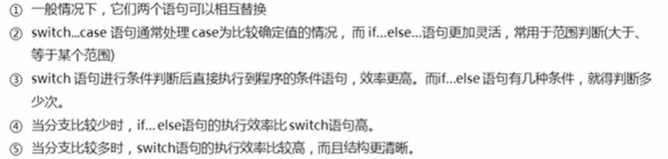

<strong> 案例总结： </strong>

```js
// 判断时间段
var time = prompt('请输入现在级是几点：');
var time1 = time < 10 ? '0' + time : time;
if (time1 >= 0 && time1 < 12 ) {
    alert('早上好！');
} else if (time1 >= 12 && time1 < 18) {
    alert('下午好！');
} else if (time1 >= 18 && time1 < 22) {
    alert('傍晚好！');
} else if (time1 >= 22 && time1 <=23) {
    alert('深夜好！');
} else {
    alert('请输入正确的时间！！');
}
```

```js
// 输入两个数字，输出最大的数字
var num = prompt('请输入一个数字：');
var num2 = prompt('请在输入一个数字：');
if (num > num2) {
    alert('最大的数字是：' + num);
} else {
    alert('最大数字是：' + num2)
}
```

```js
// 输入两个数字，判断奇偶
var num = prompt('请输入一个数字：');
if (num % 2 == 0) {
    alert(num + '这个数字是偶数');
} else {
    alert(num + '这个数字是奇数');
}
```

## JavaScript 流程控制 -- 循环

### 循环
主要类型有三种的循环语句:  <br />
for循环，while循环，do...while循环。 <br />


### for 循环
在程序中，一组被重复执行的语句被称为循环体，能否继续重复执行，取决于循环的终止条件。 <br />
由循环体及循环的终止条件组成的语句，被称之为<strong> 循环语句 </strong>
<strong> 语法结构： </strong>

```js
for (初始化变量; 条件表达式; 操作变大时) {
    // 循环体
}
```
:::tip
for 循环执行某些代码，通常跟奇数有关系。 <br />
初始化变量 就是var 声明的一个普通变量，通常用于作为计数器使用。 <br />
条件表达式 就是用来决定每一次循环是否继续执行，就是终止条件。 <br />
做操表达式 是每次循环最后执行的代码，经常用于我们计数器变量进行更新(递增或者递减) 。
:::

```js
for (var i = 1; 1 <= 10; i++) {
    console.log('你好！');
}
```
<strong> 执行过程： </strong> <br />
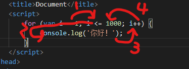
首先执行里面的计数器变量 var i = 1.但是这句话在for里面只执行一次。 <br />
去i <= 100 来判断是否满足条件，如果满足条件 就去执行 循环体，不满足条件退出循环， <br/>
最后去执行i++ ，i++是单独写的代码，递增第一轮结束。 <br />
接着去执行 i <= 100 如果满足条件 就去执行循环体, 不满足条件退出循环 第二轮。 <br />

#### 重复执行相同代码

```js
var num = prompt('输入想要循环的次数：');
for (var i = 1; i <= 10; i++) {
    console.log('你好！');
}
```

#### 重复执行不相同代码

```js
for (var i = 1; i <= 100; i++) {
    if (i == 1) {
        console.log('出生了。')
    } else if (i == 100) {
        console.log('死亡了')
    } else {
        console.log('他现在'+ i + '了')
    }
}
```

#### 重复某些相同操作

```js
var num = prompt('输入想要累加到的数字：');
var sum=0;
for (var i = 1; i <= num; i++) {
    // sum = sum +i;
    sum += i;
}
alert(sum)
```

#### for 循环案例总结

<strong>1. 输入一个数字，求出1到这个数的和的平均数 </strong>

```js
var num = prompt('输入一个数字，从1到这个数字和的平均数：');
var sum = 0; 
for (var i = 1; i <= num; i++) {
    sum += i;
}
var average = sum / num;
alert('1-'+ num + '的和是：' + sum)
alert('1-'+ num +'数和的平均数是：' + average);
```
<strong> 2. 求出1到输入数字的偶数，奇数分别的和 </strong>

```js
var num = prompt('输入一个数字，从1到这个数字偶数的和，奇数的和，分别是：');
var sum = 0; 
var sum2 = 0;
for (var i = 1; i <= num; i++) {
    if (i % 2 == 0) {
        sum += i;
    } else {
        sum2 += i;
    }
}
alert('1-'+ num + '偶数的和是：' + sum + '\n' + '1-'+ num + '奇数的和是：' + sum2);
```
<strong> 3. 求出1到输入数可以被三整除的和 </strong>

```js
var num = prompt('输入一个数字，从1到这个数字可以被3整除的和是：');
var sum = 0; 
for (var i = 1; i <= num; i++) {
    if (i % 3 == 0) {
        sum += i;
    }
}
alert('1-'+ num + '可以被3整除的和是：' + sum);
```
<strong>4. 输入学生的个数，输入成绩，求出成绩的总和，平均成绩</strong>

```js
var student = prompt('输入班级的学生数：');
var results = 0;
var sum = 0;
var average = 0;
for (var i = 1; i <= student; i++){
    var results = prompt('输入' + i + '的学生成绩：')
    sum += parseInt(results);
}
average = sum / student;
alert('所有学生的成绩和是：' + sum + '\n' + '平均成绩为' + average);
```
<strong> 一行打印五个星星 </strong>

```js
var str = '';
for (var i = 1; i <= 5; i++) {
    str = str + '☆';
}
console.log(str);
```

### 双重 for 循环
循环嵌套是指 在一个循环语句中再定义一个循环语句的语法结构， <br />
在for 循环语句中，再嵌套一个for 循环，这样的for循环语句我们称之为 双重for循环。 <br />

<strong> 语法结构: </strong>

```js
for (外层的初始化标量； 外层的条件表达式； 外层的操作表达式) {
    for (里层的初始化变量； 里层的条件表达式； 里层的操作表达式) {
        // 执行语句
    }
}
```
:::tip 注意
我们可以把里面的循环看卓成外层循环的语句。 <br />
外层循环一次，里面的循环全部执行完。 <br />
:::

<strong>案例：打印n行n列 </strong>

```js
var num = prompt('输入打印几行：');
var num2 = prompt('输入打印几列：');
var str = '';
for (var i = 1; i <= num; i++) {
    for (var j = 1; j <= num2; j++) {
        str = str + '1';
    }
    str = str + '\n';
}
console.log(str);
```

<strong>案例：打印倒三角 </strong>

```js
var str = '';
for (var i = 1; i <= 10; i++) {
    for (var j = i; j <= 10; j++) {
        str = str + '1';
    }
    
    str = str + '\n';
}
console.log(str);
```

<strong> 案例：打印九九乘法表 </strong> 

```js
var str = '';
for (var i = 1; i <= 9; i++) {
    for (var j = 1; j <= i; j++) {
            str += j + '*' + i + '=' + (j * i) + '\t';
    } 
    str = str + '\n';
}
console.log(str)
```

### for 循环小结
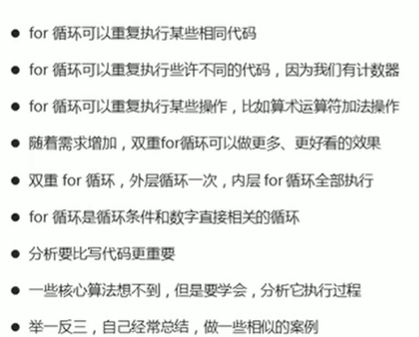


### while 循环
while 语句可以在条件表达式为 true前提下，循环执行指定的一段代码，知道表达式不为 true是结束循环。 <br />
<strong> 语法结构： </strong>

```js
while (条件表达式) {
    // 循环体代码
}
```

<strong> 执行思路： </strong>
房条件表达式结果为 true 则执行循环体，否则退出循环。 <br />

```js
var num = 1;
while num <= 100() {
    console.log('hello wrod!');
    num++;
}
```
:::tip
里面也会有计数器，初始化完成。 <br />
里面应该也有操作表达式，完成计数器的更新，防止死循环。
:::

<strong> 案例：打印人的一生 </strong>

```js
var year = 1;
while (year <= 100) {
    console.log('现在' + year  + '岁了');
    year++;
}
```
<strong> 案例：打印0-100 所有数的和 </strong>

```js
var num = 1;
var sum = 0;
while (num <= 100) {
    sum += numl
}
console.log(sum)
```
<strong> 案例：弹出你爱我吗，输入我爱你程序终止，否则无限循环 </strong>

```js
var str = prompt('你爱我吗')
while (num != "我爱你") {
    var str = prompt('你爱我吗？');
}
```
### do while 循环
do while 语句其实是while 语句的一个变体。 <br />
<strong> 语法结构： </strong>

```js
do {
    // XO换题
} while (条件表达式) 
```

<strong> 执行思路： </strong>
该循环会先执行一次代码块，然后对条件表达式进行更新，如果条件为 true ，就会重复执行循环体，否则透出循环。 <br />

```js
var i = 1;
do {
    console.log('how are you?')
    i++;
} while (i <= 100)
```
:::tip 注意
先再执行循环体，再判断，我们会发现do while 循环语句至少会执行一次循环体代码。
:::

<strong> 案例：打印人的一生 </strong>

```js
var year = 1;
do {
    console.log('我今年' + year + '岁了');
    year++;
} while (year <= 100)
```
<strong> 案例：打印0-100 所有数的和 </strong>

```js
var num = 1;
var sum = 0;
do {
    sum += num;
    num++;
} while (num <= 100)
console.log(sum);
```
<strong> 案例：弹出你爱我吗，输入我爱你程序终止，否则无限循环 </strong>

```js
do {
    var str = prompt('你爱我吗');
} while (str != '我爱你')
```
### 循环小结


### continue break

#### coontinue 关键字

continue 关键字用于立即跳出本次循环，继续下一下循环(本次循环体中 continue之后的代码就会少执行一次)

```js
for (var i= 1; i <= 5; i++ ) {
    if (i == 3) {
        continue;
    }
    console.log('我正在吃第' + i + '个包子')
}
```

<strong> 案例： 求1~100之间，除了能被7整除之外的整数和 </strong>

```js
var sum = 0;
for (var i= 1; i <= 100; i++ ) {
    if (i % 7 == 0) {
        continue;
    }
    sum += i;
}
console.log('1-100被7整除之外整数和是：' + sum);
```

#### break 关键字
break 关键字用于立即跳出整个循环（循环结束） <br />

```js
for (var i = 1; i <= 5; i++) {
    if (i == 3) {
        break;
    }
    console.log('我吃了' + i + '个包子')
}
```

### 循环案例

<strong> 求出100以内7的倍数的总和 </strong>

```js
var sum = 0;
for (var i = 1; i <= 100; i++) {
    if (i % 7 == 0) {
        sum += i;
    }
}
console.log('100以内7的倍数的总和:' + sum);
```
<strong> 用户输入用户名admin，密码123456，登录成功，失败一直输入 </strong>

```js
do {
    var user = prompt('请输入用户名：');
    var password = prompt('请输入密码：');
    str = ''
    if (user == 'admin' && password == '123456') {
        alert('登录成功！');
        str = '登录成功';
    }
} while (str != '登录成功')
```
<strong> 求整数1~100的累加值，但要求跳过所有个位是3的数 </strong>

```js
var sum = 0;
for (var i = 1; i <= 100; i++) {
    if (i % 10 == 3 ) {
        continue;
    }
    sum += i;
}
console.log('整数1~100的累加值，但要求跳过所有个位是3的数:' + sum);
```
<strong> 简易ATM </strong>

```js
var money = 100;
do {
    var atm = parseInt(prompt('输入您想要的操作：\n 1.存钱 \n 2.取钱 \n 3.显示余额 \n 4.退出'));
    switch (atm) {
        case 1:
            money = money + parseInt(prompt('请输入存入金额：'));
            alert('您现在的余额是：' + money);
            break;
        case 2:
            money = money - parseInt(prompt('请输入取出金额：'));
            alert('您现在的余额是：' + money);
            break;
        case 3:
            alert('您现在的余额是：' + money);
            break;
        default:
            break;
    }
} while (atm != 4)
```

## JavaScript 命名规范以及语法格式

:::tip
变量、函数的命名必须要有意义 <br />
变量的名称一般用名词 <br />
函数的名称一般用动词 <br />
操作符的左右两侧名称保留一个空格 <br />
单行注释的时候两个杠后面也有一个空格
:::

## JavaScript 数组

### 数字概念
数组是指一组数据的集合，其中的每个数据被称为元素，在数组中可以存放任意类型的元素。 <br />
数组是一个钟将一组数据存储在单个变量名下的优雅方式。 <br />

### 创建数组

#### 数组的创建方式

<strong>JS 中创建数组有两种方式： <br /> </strong>
利用 new 创建数组 <br />
利用数组字面量创建数组 <br />

#####  利用 new 创建数组 
```js
var arr = new Array(); // 创建了一个空的数组
```

##### 利用数组字面量创建数组
```js
// 空数组
var 数组名 = [];
// 带初始值的数组
var 数组名 = ['小白','小黑','大黄','小红'];
var arr = [];
var arr1 = [1, 2, 'hello', true];
```
:::tip 注意
数组的组棉量方括号[] <br />
声明数组并赋值称为数组的初始化 <br />
这种字面量方式也是我们以后最多使用的方式 <br />
我们数组里面的数据一定使用逗号隔开 <br />
数组里面的数据，比如1,2 我们称为数组元素
:::

<strong> 数组的数据类型: </strong> <br />
数组中可以存放任意类型的数据，例如字符串、数字、布尔值等。 <br />

### 获取数组中的元素

#### 数组的索引
索引（下标）：用来访问数组元素的序号（数组下标从0开始） <br />

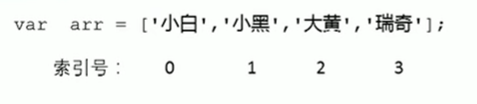

数字可以通过索引来访问，设置，修改对应的数字元素。 <br />
我们可以通过<strong> ‘数组名[索引]’ </strong>的形式来获取数组中的元素。 <br />

```js
var arr1 = [1, 2, 'hello', true];
console.log(arr1[2]); // hello
console.log(arr1[4]); // undedined 因为没有这个元素
```
<strong> 案例：打印出星期日 </strong>

```js
var arr = ['星期一', '星期二', '星期三', '星期四', '星期五', '星期六', '星期日'];
console.log(arr[6]);
```

### 遍历数组
遍历：就是把数组中的每一个元素从头到尾都访问一次（类似我们每天早上学生的点名） <br />

```js
var arr = ['red', 'green', 'blue'];
for (var i = 0; i < 3; i++) {
    console.log(arr[i]);
}
```
:::tip 注意
因为我们的数组索引号从0开始，所以 i 必须从 0开始， i < 3 <br />
输出的时候 arr[i]，i 计数器当做索引号来用。
:::

#### 数组长度
使用’数组名.length‘ 可以访问数组元素的数量（数组长度） <br />

```js
var arr = ['red', 'green', 'blue'];
console.log('数组的长度是：' + arr.length);
```

#### 案例总结
<strong> 数组求和及平均数 </strong>

```js
var arr = [2, 6, 1, 7, 4]
var sum = 0;
for (var i = 0; i < arr.length; i++) {
    sum = sum + arr[i];
}
var average = sum / arr.length;
console.log('这个数字的总和：' + sum+ '\n' + '平均数：' + average);
```
<strong> 求数组中最大的数 </strong>

```js
var arr = [100, 98, 2, 6, 1, 123,  77, 52, 25, 7, 90];
var max = arr[0];
for (var i = 0; i < arr.length; i++) {
    if (arr[i] > max) {
        max = arr[i];
    }
}
console.log(max);
```
<strong> 数组转换为分割字符 </strong>

```js
var str = '';
var sep = '|';
var arr = ['red', 'green', 'blue', 'pink'];
for (var i = 0; i < arr.length; i++) {
    str += arr[i] + sep;
}
console.log(str);
```

### 数组中新增元素

#### 通过修改 length长度新增数组元素
可以通过修改length 长度来实现数组扩容的目的。 <br />
length 属性是可读可写的。 <br />

```js
var arr = ['red', 'green', 'blue', 'pink'];
console.log(ar.lengthr);
arr.length = 5;
console.log(arr); // ["red", "green", "blue", "pink", empty]
console.log(arr[5]); // undefined
```

#### 通过修改数组索引新增数组元素
相当与追加数组元素。
```js
var arr = ['red', 'green', 'blue', 'pink'];
arr[4] = 'black';
console.log(arr);
// 替换数组元素
arr[0] = 'yellow';
console.log(arr);
// 不能直接给数组赋值，
arr = '有点意思';
console.log(arr);  //有点意思
```
:::tip 注意
可以通过修改数组索引的方式追加数据元素 <br />
不能直接给数组赋值，否则会覆盖掉以前的数据。 <br />
:::

<strong> 案例：数组新增元素 </strong>

```js
var arr = [];
var sum = prompt('想要添加多少个数：');
for (var i = 0; i < sum; i++) {
    var j = i + 1;
    arr[i] = prompt('输入第' + j + '数：');
}
alert('这个数组是：' + arr);
console.log('这个数组是：' + arr);
```
<strong> 案例：筛选数组，数组中大于10的数，取出来组成新数组 </strong>

```js
var arr = [10, 12, 2, 6, 1, 29,  0, 52, 25];
var newArr = [];
var j = 0;
for (var i = 0; i < arr.length; i++) {
    if (arr[i] >= 10) {
        newArr[j] = arr[i];
        j++;
    }
}
console.log(newArr);
// 第二种方法
var arr = [10, 12, 2, 6, 1, 29,  0, 52, 25];
var newArr = [];
for (var i = 0; i < arr.length; i++) {
    if (arr[i] >= 10) {
        newArr[newArr.length] = arr[i];
    }
}
console.log(newArr);
```

### 数组案例

<strong> 翻转数组 </strong>

```js
var arr = ['red', 'green', 'blue', 'pink'];
var newArr = [];
for (var i = (arr.length - 1); i > 0; i--) {
    newArr[newArr.length] = arr[i];
}
console.log(newArr);
```

<strong> 数组排序 （冒泡排序） </strong>

```js
var arr = [10, 0, 12, 2, 6, 1, 29,  0, 52, 25, 0];
var num;
for (var i = 0; i <= arr.length - 1; i++) {
    for (var j =0; j <= arr.length - i -1; j++) {
        if (arr[j] > arr[j + 1]) {
            num = arr[j];
            arr[j] = arr[j +1];
            arr[j + 1] = num;
        }
    }
}
console.log(arr);
```

## JavaScript 函数

### 函数的概念
在JS里面，可能会定义非常多的相同代码或者功能相同的代码，这些代码可能需要大量重复使用。 <br />
虽然 for循环语句也能实现一些简单的重复操作，但是比较具有局限性，此时我们就可以使用JS中的函数。  <br />
函数就是封装了一段可以重复执行的代码块。 <br />

### 函数的使用
#### 声明函数
```js
function 函数名() {
    // 函数体
}
function sayHi() {
    console.log('Hi~~');
}
```
:::tip 提示
function 声明甘薯的关键词，都是小写 <br />
函数是做某件事，函数名一般都是动词：sayHi <br />
函数不调用自己不执行
:::

#### 调用函数
```js
函数名();
sayHi();
```
:::tip 提示
调用函数的时候千万不要忘记小括号。
:::

#### 函数的封装
函数的封装是把一个或者多个功能通过函数的方式封装起来，对外只能提供一个简单地函数接口。 <br />
简单理解：封装类似于将电脑配件整合到电脑机箱内 （类似快递打包） <br />


<strong> 案例：1-100的累加和 </strong>

```js
function getSum() {
    var sum = 0;
    for (var i = 0; i <= 100; i++) {
        sum += i;
    }
    console.log(sum);
}
getSum();
```

### 函数的参数

#### 形参和实参
形参：形式上的参数 <br />
实参：实际上的参数
```js
function 函数名(形参1，形参2，...) {
    // 函数体
}
函数名(实参1.实参2，...);
```

<strong> 执行过程： </strong> <br />

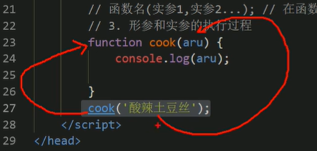

:::tip 提示
形参是接受实参的 <br />
形参类似于一个变量 <br />
函数的草书可以有，也可以没有，个数是不限的 <br />
函数的作用：在函数内部某些值不能固定，我们可以通过参数在调用函数时传递不同的值进去。
:::

<strong> 案例：求任意两个数的和 </strong>

```js
function getSum(sum1, sum2) {
    var sum = sum1 + sum2
    console.log('这两个数的和是：' + sum);
}
getSum(100, 200);
```
<strong> 案例：求任意两个数之间的和 </strong>

```js
function getSum(start, end) {
    var sum = 0;
    for (var i = start; i <= end;  i++) {
        sum = sum +i;
    }
    console.log(start +  '~' + end + '的和是：' + sum);
}
getSum(1, 100);
```
:::tip 提示
多个参数之间用逗号隔开。 <br />
形参可视看做是不用声明的变量 
:::

#### 函数形参和实操个数不匹配的问题
```js
function getSum(num1, num2) {
    console.log(num1 + num2);
}
getSum(1, 2); // 3，相匹配正常输出
getSum(1, 2, 3); //,3，实参多余形参，最终取得是形参的个数
getSum(1); // NaN,因为num2 的值是undefined
```
:::tip 提示
我们尽量让实参的个数和形参的个数相匹配。 <br />
在JavaScript中，形参默认值是 undefined
:::

### 小结
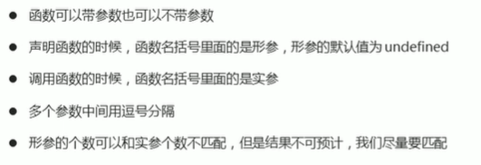


### 函数的返回值

#### return 语句
有时候，我们贵希望函数将值返回给调用者，此时通过使用return语句就可以实现。 <bt />
<strong> 函数的返回值格式 </strong>

```js
funcyion 函数名() {
    return 需要返回的结果;
}
函数名(); // 把值返回给调用者

```
<strong> 执行过程： </strong>
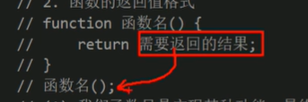

```js
function getResult() {
    return 666;
}
console.log(getResult()); // 666, grtResult() = 666

function getSum(sum1, sum2) {
    return sum1 + sum2;
}
console.log('这两个数的和是：' + getSum(1, 2));
```

<strong> 案例：利用函数求任意两个数的最大值 </strong>

```js
function getMax(num1, num2) {
    // if (num1 > num2) {
    //     return num1;
    // } else {
    //     return num2;
    // }
    return num1 > num2 ?  num1 : num2;
}
console.log('这两个数最大的是：' + getMax(200, 10));
```
<strong> 案例：利用函数求任意一个数组中的最大值 </strong>

```js
function getMax(arr) {
    var maxNum = arr[0];
    for (var i = 0; i < arr.length; i++) {
        if (arr[i] > maxNum) {
            maxNum = arr[i];
        }
    }
    return maxNum;
}
// console.log('这个数组中最大数的是：' + getMax([5, 2, 9, 101, 67, 77]));
// 在我们实际开发里面，我们经常使用一个变量来接收返回结果
var result = getMax([5, 2, 9, 101, 67, 77]);
console.log('这个数组中最大数的是：' + result);
```
#### return 终止函数
return 语句之后的代码不被执行。 <br />
```js
function getSum(num1, num2) {
    return num1 + num2;
    alert(''); // 不会被执行
}
console,log(getSum(1, 2));
```

#### return 的返回值
return 只能返回一个值，如果用逗号隔开多个值，以最后一个为准。 <br />
```js
function fr(num1, num2) {
    return num1, num2;
}
console.log(fr(1, 2)); // 最后结果是2，以最后一个值为准
```
<strong> 我们求任意两个数的 加减除结果 </strong> <br />
如果我们需要 return 多个值的时候，我们就要用到数组。

```js
function getNum(num1, num2) {
    // var arr = [];
    // arr[0] = num1 + num2;
    // arr[1] = num1 - num2;
    // arr[2] = num1 * num2;
    // arr[3] = num1 / num2;
    // return arr;
    return [num1 + num2, num1 - num2, num1 * num2, num1 / num2];
}
var sum = getNum(4, 6); // 返回的是一个数组
console.log('两数和：' + sum[0] + '\n' 
+ '两数差' + sum[1] + '\n' 
+ '两数乘积：' + sum[2] + '\n' 
+ '两数差' + sum[3] );
```
#### 函数没有return 返回 undefined
:::tip 
函数都是有返回值的： <br />
我们的函数如果有return，则返回return后面的值。 <br />
如果函数没有 retrun，则返回undefined。
:::
```js
function fan() {
    return 666;
}
console.log(fan()); // 666
function fan2() {
}
console.log(fan2()); // undefined
```

#### break, continue, return 的区别
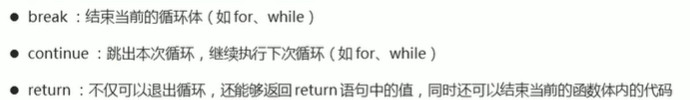

#### 通过榨汁机看透函数
榨汁机： 输入原料 --> 内部处理 --> 输出果汁  输入不同的原料，输出的不同的果汁<br />
函数： 输入参数 --> 内部处理 --> 返回结果  输入不同的参数，返回不同的结果 <br />


<strong> 案例：函数简易计算器 </strong>

```js
function cal(num3,num1,num2) {
    switch (num2) {
        case '+':
            return num3 + num1;
        case '-':
            return num3 - num1;
        case '*':
            return num3 * num1;
        case '/':
            return num3 / num1;
        default:
            return '请输入正确的运算符！'

    }
}
var num3 = parseInt(prompt('输入第一个数字：'));
var num1 = parseInt(prompt('输入第二个数字：'));
var num2 = (prompt('输入运算符：'));
alert('最后结果是：' + cal(num3,num1,num2));
```

### arguments的使用
当我们不确定有多少个草书传递的时候，可以用arguments 来获取。 <br />
在JavaScript中，arguments实际上它是当前函数的一个内置对象。 <br />
所有函数都内置了arguments对象，arguments对象中存储了传递所有实参。 <br />

```js
function fn() {
    console.log(arguments);
    console.log(arguments.length); // 3
    console.log(arguments[2]);
    // 遍历数组
    for (var i = 0; i < arguments.length; i++) {
        console.log(arguments[i]);
    }
}
fn(1, 2, 3)
```

arguments 展示形式是一个伪数组，因此可以进行便利，伪数组有以下特点：<br />
具有length属性 <br />
按索引方式存储结果 <br />
不具有数组的 push，pop等方法 <br />

:::tip
只有函数才有 arguments对象 <br />
而且是每个函数都内置好了这个arguments
:::

<strong> 案例：利用函数求任意个数的最大值 </strong>

```js
function getMax() {
    var max = 0;
    for (var i = 0; i < arguments.length; i++) {
        if (arguments[i] > max) {
            max = arguments[i];
        }
    }
    return max;
}
var num = getMax(1, 100, 999, 0, 20);
console.log('最大值是：' + num);
```

### 函数的案例

<strong> 案例：利用函数翻转任意一个数组 </strong>

```js
function reverse() {
    var newArr = [];
    for (var i = arguments.length - 1; i >= 0; i--) {
        newArr[newArr.length] = arguments[i];
    }
    return newArr;
}
console.log(reverse(1, 2, 3, 4, 5));
console.log(reverse(1, 2, 3, 4, 5, 6, 7, 8, 9));
```
<strong> 案例：利用函数对数组排序-冒泡法 </strong>

```js
function sorting(arr) {
    var num = 0;
    for (var i = 0; i <= arr.length - 1 ; i++) {
        for (var j = 0; j <= arr.length - i - 1; j++) {
            if (arr[j] > arr[j + 1]) {
                num = arr[j];
                arr[j] = arr[j + 1];
                arr[j + 1] = num;
            }
        }
    }
    return arr;
}
console.log(sorting([9, 10, 1, 100, 6, 12]));
console.log(sorting([100, 1, 0, 99, 55, 25, 66,3]));
```
<strong> 案例：判断闰年 </strong>

```js
function judge(num) {
    if (num % 4 ==0 && num % 100 != 0 || num % 400 == 0) {
        return '是闰年'
    } else {
        return '是平年'
    }
}
var year = judge(prompt('输入年份：'));
alert(year);
// 第二种方法
function judge(num) {
    var flag = false;
    if (num % 4 ==0 && num % 100 != 0 || num % 400 == 0) {
        flag = true;
    } 
    return flag;
}
var year = judge(prompt('输入年份：'));
if (year == true) {
    alert('是闰年');
} else {
    alert('是平年');
}
```

#### 函数可以调用另外一个函数
因为每个函数都是独立的代码块，由于完成特殊任务，因此经常会用到函数相互调用的情况。 <br >

```js
function fun1() {
    console.log(11);
    fun2() // 调用了fn2 函数
}
fun1()
function fun2() {
    console.log(22);
}
```
<strong> 案例：用户输入年份，输出这年2月份的天数 </strong>

```js
function judge(num) {
    var flag = false;
    if (num % 4 ==0 && num % 100 != 0 || num % 400 == 0) {
        flag = true;
    } 
    return flag;
}
function judge2() {
    var year = judge(prompt('输入年份：'));
    if (year) {
        alert('是闰年，29天');
    } else {
        alert('是平年，28天');
    }
}
judge2();
```

### 函数的两种声明方式

#### 利用函数关键词自定义函数 (命名函数)
```js
function fn() {

}
fun();
```

#### 函数表达式 （匿名函数）
```js
var 变量名 = function( ) { };
var fun = function(str) {
    console.log('我是函数表达式');
    console.log(str);
}
fun('Holle Word!'); // 调用fun 这个函数
```
:::tip
fun 是变量名，不是函数名。 <br />
函数式表达式声明方式和声明变量差不多,<br />
变量里面存储的是值，函数表达式里面存储的是函数。 <br />
函数表达式也可以进行传递参数
:::

## JavaScript 作用域
### 作用域
通常来说，一段程序代码中所用到的名字并不总是有效和可用的，而限定这个名字的可用性代码范围就是这个名字的作用域。 <br />
作用域的使用提高了程序逻辑局部性，增加了程序的可靠性，减少了名字冲突。 <br />

<strong> JS的两种作用域（ES6 之前）： </strong> 
全局作用域和局部作用域。 <br />

<strong> 全局作用域： </strong>
整个script标签，或者是一个单独的jd文件。 <br />
<strong> 局部作用域： </strong>
在函数内部就是局部作用域，这个代码的名字只在函数内部起作用<br />

```js
var num = 10; // 全局作用域
console.log(num); /// 10
function fn() {
    // 局部作用域
    var num = 20;
    console.log(num); 
}
fn(); // 20
```
### 变量的作用域
在JavaScript中，根据作用域的不同，变量可以分为两种： 全局变量，局部变量。 <br />
全局变量：在全局作用域下的变量,在全局下都可以使用。 <br />
布局变量：在局部作用域下的变量，在函数内部的变量，就局部变量 <br />

```js
var num = 10; // num就是一个全局变量
console.log(num); // 10
function fn() {
    var num1 = 10; // num1客气啊局部变量，只能在函数内部使用。 
    console.log(num);
    num2 = 20; // 
}
fn(); // 10
console.log(num2); // 20
```
:::tip 注意
如果在函数内部，没有声明直接赋值的变量也属于全局变量。 <br />
函数的形参也快成看做布局变量。 
:::
<storng> 从执行效率来看全局变量和局部变量 </strong>
全局变量只有在浏览器关闭的时候才会销毁，比较占内存资源。 <br />
局部某良在程序执行完毕就会销毁,比较节约内存资源。 <br />

#### JS块级作用域
我们JS 也是在 es6的时候新增的块级作用域。 <br />
块级作用域 {} if {}  for {} <br />

### 作用域链
只要是代码就至少有一个作用域。 <br />
写在函数内部的局部作用域。 <br />
如果函数中还有函数，那么在这个作用域中就又可以诞生一个作用域。 <br />
根据在内部函数可以访问外部函数变量的这种机制， <br />
用链式查找决定那些数据能被内部函数访问，就称为作用域链。 <br />
就近原则。
```js
var num = 10;
function fn() { // 外部函数
    var num = 20;
    function fn2() {  // 内部函数
        console.log(num)
    }
    fn2();
}
fn()
```

## JavaScript 预解析
### 预解析
我们js引擎运行js 分为两步：预解析，代码执行。 <br />
预解析：js引擎会把js 里面所有的var 还有function 提升到当前作用域的最前面。 <br />
代码执行：按照代码书写的顺序从上往下执行。 <br />、

### 变量预解析和函数预解析
预解析分为：变量预解析（变量提升） 和 函数预解析（函数提升） <br />
变量提升： 就是把所有的变量声明提升到当前作用域最前面，不提升赋值操作。 <br />
```js
console.log(num);  // undefined
var num = 10;
// 相当于执行了以下代码
var num;
console.log(num);
var num = 10;
-------------------------------------
fun(); // 会报错
var fun = function() {
    console.log(22);
}
// 相当于执行了以下代码
//函数表达式，调用必须写在函数表达式的下面
var fun;
fun();
var fun = function() {
    console.log(22);
}
```
函数提成：就是把所有的函数声明提升到当前作用域的最前面，不调用函数。 <br />
```js
fn();
function fn() {
    console.log(11);
}
// 预解析后
function fn() {
    console.log(11);
}
fn();
```
### 预解析案例

<strong> 案例： </strong>

```js
var num = 10;
fun();
function fun() {
    console.log(num);
    var num = 20;
}
// 相当于执行了以下代码
var num;
function fun() {
    var num;
    console.log(num); // undefined
    var num = 20;
}
var num = 10;
fun();
```
```js
fn();
console.log(c);
console.log(b);
console.log(a);

function fn() {
    var a = b = c = 9;
    // 相当于 var a = 9;  b = 9;  c = 9;  b和c前面没有var
    console.log(a);
    console.log(b);
    console.log(c);
}
// 相当于执行了以下代码
function fn() {
    var a；
    a = b = c = 9;
    console.log(a); //9
    console.log(b); //9
    console.log(c); //9
}
fn();
console.log(c); //9
console.log(b); //9
console.log(a); // 报错
```

## JavaScript 对象
### 对象
#### 什么是对象
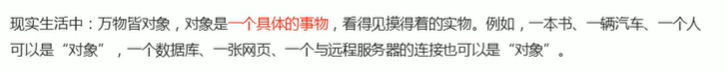

在JavaScript中，对象是一组无序相关属性和方法的集合，损友的事物都是对象。 <br />
例如字符串、数值、数组、函数等。<br />
<strong>对象是由属性和方法组成的。 </strong>  <br />
属性： 事物的特征，在对象中用属性来表示（常用名词） <br />
方法： 事物的行为，在对象中用方法来表示（常用动词） <br />

#### 为什么需要对象
保存一个值时，可以使用变量，保存多个值时，可以使用数组，如果保存一个人的完整信息呢？ <br />
把一个人的信息保存在数组中:<br />
```js
var arr = ['张三丰', '男', 128, 154]
```

Js中的对象表达结构清晰，更强大，一个人的信息在对象中的表达： <br />
```js
张三丰.姓名 = '张三丰';
张三丰.性别 = '男'；
张三丰.年龄 = '128';
张三丰.身高 = '154';
```

### 创建对象的三种方式
在 javascript中，现阶段我们可以采用三种方式创建对象（object）：<br />
利用字面量创建对象<br />
利用new new Object创建对象 <br />
利用构造函数创建对象 <br />

#### 利用字面量创建对象
对象字面量： 就是花括号 {} 里面包含了表达这个具体事物（对象）的属性和方法 <br />

```js
var obj = {}; //创建了一个空的对象
var obj2 = {
    uname: '张三丰',
    age: 18,
    sex: '男',
    sayHi: function() {
        console.log('Hi~');
    }
}
```
:::tip
里面的属性或者方法我们采用键值对的形式。属性名: 属性值。<br />
多个属性或者方法中间用逗号隔开。 <br />
方法冒号后面跟的是一个匿名函数。 
:::

##### 使用对象
调用对象的属性，<strong>对象名.属性名 </strong>

```js
var obj = {
    uname: '张三丰',
    age: 18,
    sex: '男',
    sayHi: function() {
        console.log('Hi~');
    }
}
console.log(obj.uname); // 张三丰  
console.log(obj['age']); // 18  
obj.sayHi();
```
调用对象的属性的另一种方法，<strong>对象名['属性名'] </strong> <br />
调用对象的方法： 对象名.方法名() <br />

#### 变量、属性、函数、方法总结

<strong> 变量和属性的相同点: </strong> <br />
都是用来储存数据的。

```js
var num =10;
var obj = {
    age: 18
}
console.log(obj.age);
```
<strong> 变量和属性的不同点 </strong> <br />
变量：单独声明并赋值，使用的时候直接写变量名，单独存在。 <br />
属性：在对象里面的不需要声明，使用的时候需要，对象名.属性名 <br />

<strong> 变量和方法的相同点 </strong> <br />
都是实现某种功能，做某件事。 <br />

```js
var num =10;
var obj = {
    age: 18
    fn: function() {

    }
}
function fn() {
    
}
```
函数： 是单独声明，并且调用的，函数名(),单独存在;的。 <br />
方法; 在对象里面，调用的时候，对象.方法名(). <br />

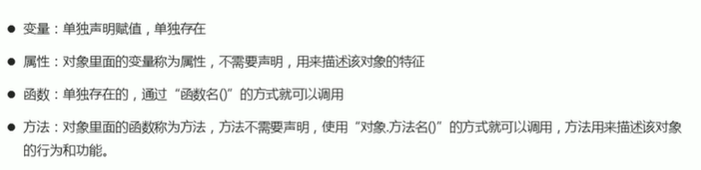

#### 利用new Object创建对象
和我们前面学的 new Array() 原理一样。 <br />
```js
var obj = new Object(); // 创建了一个空的对象
obj.uname = '张三丰'；
obj,age = 18;
obj.sex = '男';
obj.sayHi = function() {
    console.log('Hi~');
}
```
:::tip
我们是利用等号赋值方法，添加对象的属性和方法。 <br />
每个属性和方法之间用分号结束。
:::

#### 利用构造函数创建对象
<strong> 我们为什么需要使用构造函数 </strong> <br />
我们其他两种方法一次只能创建一个对象。 <br />

```js
var ldh = {
    uname: '刘德华',
    age: 55,
    sing: function() {
        console.log('啦啦啦啦');
    }
}
```
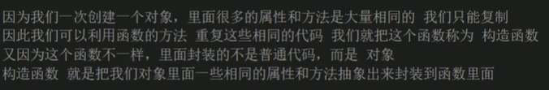

<strong> 语法格式：</strong>

```js
function 构造函数名() {
    this.属性 = 值；
    this.方法 = function() { }
}
new 构造函数名(); // 调用构造函数
```
```js
function Star(uname, age, sex) {
    this.uname = uname;
    this.age =  age;
    this.sex = sex;
    this.sing = function(sang) {
        console.log(sang);
    }
}
var ldh = new Star('刘德华', 18, '男'); // 调用函数返回的是一个对象
console.log(typeof ldh); //object
console.log(ldh.uname); //刘德华
ldh.sing('冰雨'); // 冰雨
```
:::tip
构造函数的函数名首字母要大写。 <br />
构造函数不需要return 就可以返回结果。<br />
我们调用构造函数，必须使用 new <br />
我们只要new Star() 就创建了一个对象。 <br />
我们的属性和方法前面必须添加 this
:::

#### 构造函数和对象
构造函数：如Star()，抽象了对象的公共部分，封装到了函数里面，它泛指某一大类（class）<br />
创建对象：如new Star()，特指某一个，通过new关键字创建对象的过程我们也称为对象实例化。 <br />

### new 关键字
<strong> new关键字执行过程: </strong>
new 构造函数可以在内存中创建了一个空的对象。 <br />
this 就会指向刚才创建的空对象。 <br />
执行构造函数里面的代码，给这个空对象添加属性和方法。 <br />
返回这个对象。<br />

### 遍历对象属性

<strong> for...in语句 </strong>
for..in语句用于对数组或者对象的属性进行循环操作。 <br>
<strong> 语法格式： </strong>

```js
for (变量 in 雕像) {

}
```
```js
var obj = {
    name: 'pink',
    age: 18,
    sex: '男',
}
for (var k in obj) {
    console.log(k); // k 变量 输出 得到的是属性名
    console.log(obj[k]); // obj[k] 得到的是属性值
}
```
:::tip
我们使用for in 里面的变量，我们喜欢写k 或者 key 
:::

### 小结
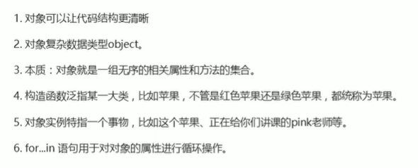

## JavaScript 内置对象
### 内置对象
javascript中的对象分为三种：自定义对象、内置对象、浏览器对象。 <br />
前面两种对象是jd基础内容，属于ECMAScript，第三个浏览器对象属于JS独有的。 <br />
<strong>内置对象：</strong> <br />
就是指js语言自定的一些对象，这些对象提供开发者使用，并提供了一些常用的或是最基本而必要的功能（属性和方法）。 <br />
内置对象最大的优点就是帮助我们快速开发。 <br />
JS提供了多个内置对象：Math、Date、Array、String等。 <br />

### 查阅文档
<a href="https://developer.mozilla.org/zh-CN/" target="_black"> MDN官网 </a> <br />
<a href="https://www.w3school.com.cn/index.html" target="_black"> W3C官网 </a>

#### 如何学习对象中的方法
查阅该方法的功能 <br />
查询里面参数的意义和类型 <br />
查看返回值得意义和类型 <br />
通过 demo 进行测试

### Math对象
与其他全局对象不同的是，Math 不是一个构造器。Math 的所有属性与方法都是静态的。<br /> 
```js
console.log(Math.PI); //一个属性，圆周率
console.log(Math.max(1,2,9,0,65,25,3)); //65 
```
<strong> 案例：封装自己的数学对象 </strong>

```js
var myMath = {
    PI: 3.141592653,
    max: function(){
        var max = arguments[0];
        for (var i = 0; i <= arguments.length; i++) {
            if (arguments[i] > max) {
                max = arguments[i];
            }
        }
        return max
    },
    min: function(){
        var min = arguments[0];
        for (var i = 0; i <= arguments.length; i++) {
            if (arguments[i] < min) {
                min = arguments[i];
            }
        }
        return min;
    }
}
console.log(myMath.PI);
console.log(myMath.max(1, 3, 10, 25, 0));
console.log(myMath.min(1, 3, 10, 25, 0));
```
<strong> 绝对值方法： </strong>

```js
console.log(Math.abs(10)); // 10
console.log(Math.abs(-10)); // 10
console.log(Math.abs('-10')); // 10
```
<strong> 三个取整方法： </strong> <br />
<strong> 向下取整: </strong>

```js
console.log(Math.floor(1.1)) // 1
console.log(Math.floor(1.9)) // 1
```
<strong> 向上取整: </strong>

```js
console.log(Math.ceil(1.1)) // 2
console.log(Math.ceil(1.9)) // 2
```
<strong> 四舍五入，其他数字都是四舍五入，但是0.5特殊，往大了取 </strong>

```js
console.log(Math.round(1.1)) // 1
console.log(Math.round(1.5)) // 2
console.log(Math.round(1.9)) // 2
console.log(Math.round(-1.5)) // -1
```
<strong> 随机数方法 random() </strong> <br />
函数返回一个浮点数,  伪随机数在范围从0到小于1，也就是说，从0（包括0）往上，但是不包括1（排除1），然后您可以缩放到所需的范围。实现将初始种子选择到随机数生成算法;它不能被用户选择或重置。

```js
console.log(Math.random());
console.log(Math.round(Math.random() * 10));
```
<strong> 得到一个两数之间的随机整数，包括两个数在内 </strong>

```js
function grtRandom(max, min) {
    return Math.floor(Math.random() * (max - min + 1)) + min; //含最大值，含最小值 
}
console.log(grtRandom(1, 100));
```
<strong> 随机点名 </strong>

```js
function grtRandom(max, min) {
    return Math.floor(Math.random() * (max - min + 1)) + min; //含最大值，含最小值 
}
console.log(grtRandom(1, 100));
var arr = ['张三', '李四', '王五', '王麻子', '张三丰'];
console.log(arr[grtRandom(0, arr.length - 1)]);
```

<strong> 案例：猜数字游戏 </strong>

```js
function grtRandom(max, min) {
    return Math.floor(Math.random() * (max - min + 1)) + min;
}
var num = grtRandom(1, 10);
do {
    var putnum = prompt('请输入数字猜大小：');
    if (putnum > num) {
        alert('猜大了！')
    } else if (putnum < num) {
        alert('猜小了！')
    } else {
        alert('恭喜你，猜对了！')
    }
} while (num != putnum) 
```
<strong> 案例：猜数字游戏2.0版， 1~50只有10次机会 </strong>

```js
function grtRandom(max, min) {
    return Math.floor(Math.random() * (max - min + 1)) + min;
}
var num = grtRandom(1, 50);

for (var i = 1; i <= 12; i++) {
    if (i == 11) {
        alert('你的10次机会用完了，再见！')
        break;
    }
    var putnum = prompt('请输入数字猜大小：');
    if (putnum > num) {
        alert('猜大了！')
    } else if (putnum < num) {
        alert('猜小了！')
    } else {
        alert('恭喜你，猜对了！')
        break;
    } 
}
```

### 日期对象
Date() 日期对象，是一个构造函数，必须使用new，来调用创建日期对象。 <br />
```js
var arr = new Array(); // 创建一个空数组
var obj = new Object(); // 创建一个空对象
```
<strong> 默认Date属性,返回当前时间 </strong>

```js
var date = new Date();
console.log(date);  // Wed Apr 28 2021 09:12:55 GMT+0800 (中国标准时间)
```
<strong> 参数常用的写法 </strong>

```js
var date2 = new Date(2021, 04, 28);
console.log(date2); //Fri May 28 2021 00:00:00 GMT+0800 (中国标准时间)
var date3 = new Date('2021-04-28 09:30:30');
console.log(date3); //Wed Apr 28 2021 09:30:30 GMT+0800 (中国标准时间)
```
<strong> 格式化日期 年月日 </strong>

```js
var date = new Date();
console.log(date.getFullYear()); // 2021,返回当前日期的年
console.log(date.getMonth() + 1); // 3 返回值比当前月份小1
console.log(date.getDate()); // 28,返回当前日期的日
console.log(date.getDay()); // 3 周一返回1，周六返回6，周日返回0 
```
<strong> 2021年 4月 28日 星期三 </strong>

```js
var date = new Date();
var year = date.getFullYear();
var month = date.getMonth() + 1;
var dates = date.getDate();
var arr = ['星期日', '星期一', '星期二', '星期三', '星期四', 'X星期五', '星期六']
var day = date.getDay();
console.log('今天是：' + year + '年' + month + '月' + dates + '日' + ' ' +  arr[day]);
```
<strong> 格式化日期 时分秒 </strong>

```js
var date = new Date();
console.log(date.getHours()); // 10，返回当前时
console.log(date.getMinutes()); // 7,返回当前份
console.log(date.getSeconds()); // 8,返回当前秒
```

<strong> 08时 08分 08秒 </strong>

```js
function getTimes() {
    var date = new Date();
    var h = date.getHours();
    h = h < 10 ? '0' + h : h;
    var m = date.getMinutes();
    m = m < 10 ? '0' + m : m;
    var s = date.getSeconds();
    s = s < 10 ? '0' + s : s;
    return h + '时 ' + m + '分 ' + s + '秒';
}
console.log(getTimes());
```
<strong> 获取Date总的毫秒数(时间戳)，距离1970.1.1过了多少毫秒,总的毫秒数 </strong>、 <br />
通过 valueOf(),getTime()

```js
var date = new Date();
console.log(date.valueOf());
console.log(date.getTime());
```
<strong> 简单写法(最常用的写法) </strong>

```js
var date = +new Date(); // +new Date() 返回的就是总的毫秒数
console.log(date);
```
<strong> h5 新增的，获取总的毫秒数 </strong>

```js
console.log(Date.now());
```
<strong> 案例： 倒计时 </strong>

```js
function countDown(time) {
    var nowTime = +new Date(); // 返回的是当前时间总毫秒数
    var inputTime = +new Date(time); // 返回的是用户输入时间的总毫秒数
    var times = (inputTime - nowTime) / 1000; // 把剩余时间的毫秒转换成秒
    var d = parseInt(times / 60 / 60 / 24); // 天
    d = d < 10 ? '0' + d : d;
    var h = parseInt(times / 60 / 60 % 24); // 时
    h = h < 10 ? '0' + h : h;
    var m = parseInt(times / 60 % 60); // 分
    m = m < 10 ? '0' + m : m;
    var s = parseInt(times % 60); // 秒
    s = s < 10 ? '0' + s : s;
    return d + '天 ' + h + '时 ' + m + '分 ' + s + '秒'
}
console.log(countDown('2021-4-28 12:00:01'))
```

### 数组对象
<strong> 创建数组的两种方式 </strong>

```js
var arr = []; //字面量创建数组
var arr1 = new Array(); //创建了一个空数组
var arr2 = new Array(2); //表示数组长度为二，但是是两个空值
var arr3 = new Array(2, 3); // 有两个数组元素， 2,3
```
<strong> 检测是否为数组 </strong>

```js
var arr = [];
console.log(arr instanceof Array); // true
console.log(Array.isArray(arr)); // true
```
<strong> 添加数组元素的方法 </strong> <br />
<strong> push() 在数组末尾，添加一个或者多个数组元素 </strong>

```js
var arr = [1, 2, 3];
arr.push(4,5);
console.log(arr); // (5) [1, 2, 3, 4, 5]
```
:::tip
push 是可以给数组后面添加新元素 <br />
push() 参数直接写 数组元素就可以了 <br />
push完毕之后，返回的结果是 新数组的长度 <br />
原数组也会发生变化
:::
<strong> unshift() 在数组开头，添加一个或者多个数组元素 </strong> <br />

```js
var arr = [1, 2, 3];
arr.unshift('Holle', 'Word');
console.log(arr); // (5) ["Holle", "Word", 1, 2, 3]
```
:::tip
unshift 是可以给数组前面添加新元素 <br />
unshift() 参数直接写 数组元素就可以了 <br />
unshift完毕之后，返回的结果是 新数组的长度 <br />
原数组也会发生变化
::: 
<strong> 删除数组元素的方法 </strong> <br />
<strong> pop() 可以删除数组的最后一个元素 </strong> <br />

```js
var arr = [1, 2, 3];
arr.unshift('Holle', 'Word');
arr.pop(arr);
console.log(arr); // (4) ["Holle", "Word", 1, 2]
```
:::tip
pop可以删除数组最后一个元素，但是一次只能删除一个元素。 <br />
pop() 没有参数 <br />
popt完毕之后，返回的结果是 删除的元素 <br />
原数组也会发生变化
::: 
<strong> shiift() 可以删除数组的第一个元素 </strong> <br />

```js
var arr = [1, 2, 3];
arr.unshift('Holle', 'Word');
arr.shift(arr);
console.log(arr); // (4) ["Word", 1, 2, 3]
```
:::tip
shift可以删除数组第一个元素，但是一次只能删除一个元素。 <br />
shift() 没有参数 <br />
shift完毕之后，返回的结果是 删除的元素 <br />
原数组也会发生变化
::: 

<strong> 案例：筛选数组 </strong>

```js
var arr = [1500, 1200, 2000, 2100, 1000] 
var newArr = [];
for (var i = 0; i <= arr.length; i++) {
    if (arr[i] < 2000) {
        // newArr[newArr.length] = arr[i];
        newArr.push(arr[i]);
    }
}
console.log(newArr);
```
<strong> 数组排序 </strong> <br />
<strong> 翻转数组： </strong> 

```js
var arr = [1, 2, 3, 4, 5];
arr.reverse();
console.log(arr); //新建文本文档 (2).html:11 (5) [5, 4, 3, 2, 1]
```

<strong> 数组排序（冒泡排序）： </strong> 

```js
var arr = [3, 13, 4, 7, 26, 1,];
arr.sort(function(a, b) {
   // return a - b; // 升序的顺序排列
   return b -a;  // 降序的顺序排列
});
console.log(arr);
```
<strong> 数组元素索引方法 </strong> 

```js
var arr = ['Holle', 'Word', '你好', '世界'];
console.log(arr.indexOf('你好')); //2
console.log(arr.indexOf('你好吗')); // -1
console.log(arr.lastIndexOf('你好')); //2
```
:::tip
indexOf从前往后查找 <br />
lastIndexOf从后往前查找 <br />
它只返回第一个满足条件的 <br />
如果在数组里找不到钙元素，则返回 -1
:::

<strong> 案例： 数组去重 </strong> 

```js
function unique(arr) {
    var newArr =  [];
    for (var i = 0; i <= arr.length - 1; i++) {
        if (newArr.indexOf(arr[i]) == -1) {
            newArr[newArr.length] = arr[i];
        }
    }
    return newArr;
}

var demo = unique(['c', 'a', 'z', 'a', 'x', 'a', 'x', 'c', 'b']); 
console.log(demo); // (5) ["c", "a", "z", "x", "b"]
```
<strong> 数组转换为字符串 </strong> <br />
<strong> toString() 将数组转换为字符串 </strong> 

```js
var arr = [1, 2, 3];
console.log(arr.toString()); // 1,2,3
```
<strong> join(分隔符) 将数组转换为字符串 </strong> 

```js
var arr = ['green', 'blue', 'pink'];
console.log(arr.join());  // green,blue,pink
console.log(arr.join('&')); // green&blue&pink
```

### 字符串对象
<strong> 基本包装类型 </strong> 
基本包装类型：就是把简单数据类型，包装称为复杂数据类型、 <br />

```js
var str = 'andy';
console.log(str.length); // 4
// 相当于执行了以下代码
var temp = new String('andy'); // 包装为复杂类型
str = temp; // 把临时变量的值给 str
temp = null; //销毁临时变量
```

<strong> 字符串不可变 </strong> 
里面的值是不可变的，虽然看上去可以改变，但其实是地址变了，内存中新开辟了一个内存空间。 <br />
因为我们字符串的不可变所以不要大量对的拼接字符串。 <br />

<strong> 根据字符返回值 </strong> 
字符串所有方法，都不会修改字符串本身，操作完成会返回一个新的字符串。 <br />

```js
var str = '改革春风吹满地，春天来了';
console.log(str.indexOf('春')); // 2
console.log(str.indexOf('春', 3)); // 8，str.indexOf('要查找的字符', [起始的位置])
```

<strong> 案例：返回字符位置 </strong> 

```js
function getstring(str) {
    var j = 0;
    var arr = [];
    var index = str.indexOf('o');
    while (index !== -1) {
        arr[arr.length] = index;
        j++;
        index =  str.indexOf('o', index + 1);
    }
    return 'o,的位置是：' + arr + '\n' + 'o出现的次数：' + j;
}
var str = getstring('abcopfoddo');
console.log(str);
```
<strong> 根据位置返回字符 </strong> 
<strong> charAt(index) 根据位置返回字符： </strong> 

```js
var str = 'abcdefg';
console.log(str.charAt(2)); // c
// 遍历所有字符
for (var i = 0; i <= str.length; i++) {
    console.log(str.charAt(i));
}
```
<strong> charCodeAt(index) 返回相应索引号字符的ASCII值，可以判断用户按下了哪个键 </strong> 

```js
var str = 'Aabcdefg';
console.log(str.charCodeAt(0)); // 65
```
<strong> str[index] H5,新增的 </strong> 

```js
var str = 'Aabcdefg';
console.log(str[0]); // A
```
<strong> 案例： 返回字符的位置,查找一个字符串中，出现最多的字符是什么，最多次数是多少 </strong> 

```js
function getMaxStr(str) {
    var o = {};
    var max = 0;
    var char = '';
    for (var i = 0; i <= str.length; i++) {
        var mstr = str.charAt(i);
        if (o[mstr]) {
            o[mstr]++;
        } else {
            o[mstr] = 1;
        }
        if (o[mstr] > max) {
            max = o[mstr];
            char = mstr;
        }
    }
    console.log(o);
    return '出现此处最多的是：' + char + '\n' +  '出现的次数是：' +  max + '\n' ;

}
var astr = getMaxStr('abcdaasaaa');
console.log(astr);
```

<strong> 字符串操作方法 </strong>  <br />
<strong> concat('字符串1', '字符串2', ...) </strong> 

```js
var str = 'Hello';
console.log(str.concat('Word', '你好', '世界'))； // HelloWord你好世界
```
<strong> substr('截取的起始位置', '截取的几个字符'); </strong> 

```js
var str = '改革春风吹满地';
console.log(str.substr(2, 2)); // 春风
```
<strong> 替换字符 replace('被替换的字符', '替换的字符') ,只会替换第一个字符</strong> 

```js
var str = 'andy';
console.log(str.replace('d', 'b')); // anby
```
<strong> 案例：把advdcooaaoo，这个字符串里的o全部替换成* </strong> 

```js
var str = 'advdcooaaoo';
var mstr = '';
for (var i = 0; i <= str.length; i++) {
    str = str.replace('o', '*');
}
console.log(str); // advdc**aa**
```
<strong> 字符转换为数组 split('分隔符') </strong> 

```js
var str = 'andy, pink, red, blue';
console.log(str.split(',')); //  (4) ["andy", " pink", " red", " blue"]
var str2 = 'andy&pink&red&blue';
console.log(str2.split('&')); // (4) ["andy", "pink", "red", "blue"]
```

## JavaScript 简单类型与复杂类型
### 简单类型与复杂类型
简单类型又叫做基本数据类型或者<strong> 值类型 </strong>, 复杂类型又叫做 <strong> 引用类型 </strong>
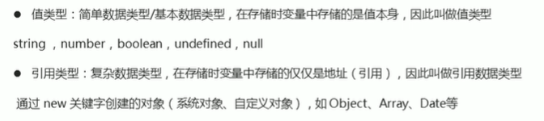
```js
var obj = null; // 返回的是一个空的对象，object
console.log(typrof obj) // object
```
:::tip
如果有个变量我们以后打算存储为对象，还没想好放什么，可以给一个null
:::

### 堆与栈
栈（操作系统）：由操作系统自动分配释放函数的参数值，局部变量的值等，其操作方式类似于数据结构中的栈；<strong> 简单数据类型存储放到栈里面 </strong> <br />
堆（操作系统）：存储复杂类型（对象），一般由程序分配释放，若程序员不释放，由垃圾回收机制回收；<strong> 复杂数据类型存储放到堆里面 </strong>

### 简单类型的内存分类
简单数据类型是存放在栈里面 ，里面直接开辟一个空间存放的是值. <br />
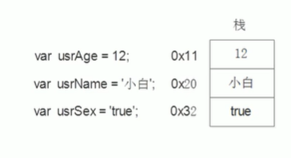

### 复杂类型的内厝分配
复杂数据烈性，首先在栈里面存放地址，用十六进制表示，然后指向堆里面的数据。 <br />
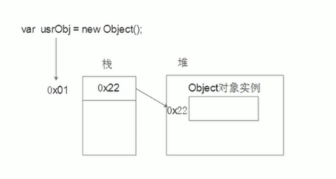

### 简单类型的传参
函数的形参也可以看做是一个变量，当我们把一个值类型变量作为参数传给函数的形参时，其实是把变量在栈空间里的值复制了一份给形参，那么在方法内部对形参做任何修改，都不会影响到的外部变量。 <br />

### 复杂类型的传参
函数的形参也可以看做是一个变量，当我们把引用类型变量传给形参时，其实是把变量在栈空间里保存的堆地址复制给了形参，形参和实参其实保存的是同一个堆地址，所以操作的是同一个对象。 <br />


