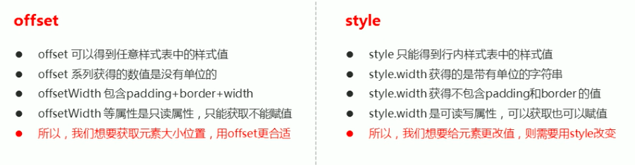
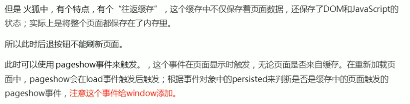
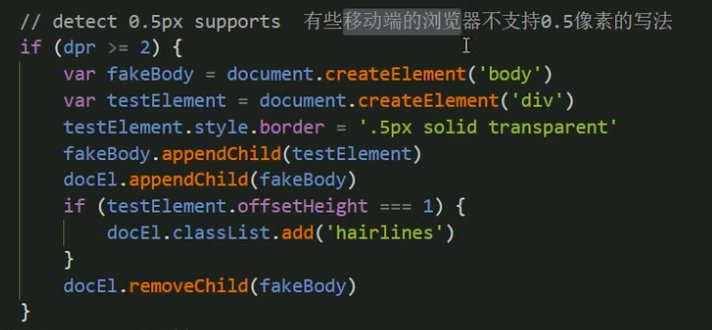
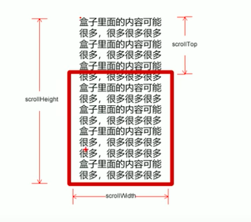
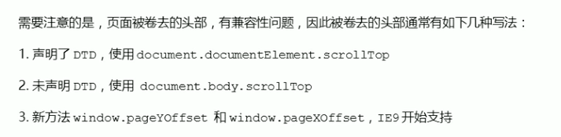
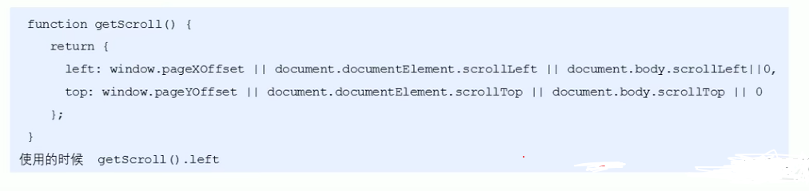

:::note 前言
基础网页特效。
:::

## PC 端网页特效
### 元素偏移量 offset 系列
#### offset 概述
offset 翻译过来就是偏移量，我们使用offset 系列相关属性可以动态的得到该元素的位置（偏移）、大小等。 <br />
+ 获得元素距离带有定位父元素的位置
+ 获得元素自身的大小（宽度高度）
+ 注意：返回的数值都不带单位

<strong> offset 系列常用属性 </strong>

+ element.offsetParent : 返回作为该元素带有定位的父级元素，如果父元素都没有定位则返回body。
+ element.offsetTop：返回元素相对带有定位父元素上方的偏移。
+ element.offsetLfet：返回元素相对带有定位父元素左边的偏移。
+ element.offsetWidth：返回自身包括padding、边距、内容区的宽度、返回数值不带单位。
+ element.offsetHeight：返回自身包括padding、边距、内容区的高度、返回数值不带单位。

```html
<!-- css部分 -->
  <style> 
  .father {
    position:relative;
    width: 200px;
    height: 200px;
    background-color: teal;
    margin: 100px;
  }
  .son {
    width: 100px;
    height: 100px;
    background-color: tomato;
    margin: 0 auto;
  }
  </style>
<!-- js部分 -->
  <div class="father">
    <div class="son"></div>
  </div>
  <script>
    var father = document.querySelector('.father');
    var son = document.querySelector('.son');
    console.log(father.offsetTop); // 100
    console.log(father.offsetLeft) // 100
    console.log(son.offsetTop); // 0
    console.log(son.offsetLeft); // 50
    console.log(son.offsetWidth); // 100
    console.log(son.offsetHeight); // 100
    console.log(father.offsetWidth); // 200
    console.log(father.offsetHeight); // 200
    console.log(son.offsetParent)  // 返回带有定位的父亲
    console.log(son.oarentNode) // 返回父亲 返回最近一级的父亲
  </script>
```
#### offset 与 style 区别


<strong> 案例：获取鼠标在盒子内的坐标 </strong>

```html
  <div></div>
  <script>
    var box = document.querySelector('div');
    div.addEventListener('mousemove', function(e) {
      var top = e.pageX - this.offsetTop;;
      var left = e.pageY - this.offsetLeft;
      this.innerHTML =  'x坐标是：' + left +  ' Y坐标是：' + top;
    })
  </script>
```

<strong> 案例：模态框拖拽</strong>
```html
<!-- css部分 -->
  <style>
    button {
      margin-left: 50%;
      width: 50px;
      height: 25px;
    }
    div {
      position: absolute; 
      /* margin: 100px auto; */
      width: 400px;
      height: 200px;
      background-color: rgb(19, 193, 224);
      display: none;
    }
    a {
      text-decoration: none;
      float:right;
      color: red;
      margin-right: 10px;
      margin-top: 10px;
    }
  </style>
<!-- html部分 -->
  <button>登录</button>
  <div >
    <a href="javascript:;">关闭</a>
  </div>
<!-- js部分 -->
  <script>
    var body = document.body
    var div = document.querySelector('div');
    var btn = document.querySelector('button');
    var a = document.querySelector('a');
    console.log(btn);
    btn.addEventListener('click', function() {
      div.style.display = 'block';
      body.style.backgroundColor = 'seashell';
    });
    a.addEventListener('click', function() {
      div.style.display = 'none';
      body.style.backgroundColor = '#eee';
    });
    div.addEventListener('mousedown', function(e) {
      var top = e.pageY - div.offsetTop;;
      var left = e.pageX - div.offsetLeft;
      document.addEventListener('mousemove', fn )
        function fn(e) {
          div.style.left = e.pageX - left + 'px';
          div.style.top = e.pageY - top + 'px';
        }
      document.addEventListener('mouseup', function() {
        document.removeEventListener('mousemove', fn)
      })
    })
  </script>
```

<strong> 案例：仿京东放大镜 </strong>
```html
<!-- css部分 -->
<style>
    .box {
      position: relative;
      width: 300px;
      height: 300px;
      background-color: aqua;
      cursor: move;
      overflow: hidden; 
    }
    .box2 {
      position: absolute;
      top: 0;
      left: 400px;
      width: 400px;
      height: 400px;
      overflow: hidden; 
      display: none;
    }
    .box2 img {
      width: 600px;
    }
    .son {
      position: absolute;
      top: 0;
      left: 0;
      width: 200px;
      height: 200px;
      background-color: #fede4f;
      opacity: .5;
      display: none;
    }
    .box img {
      width: 300px;
    }
    .img {
      position: relative;
      top: 0;
      left: 0;
    }
  </style>
  <!-- html部分 -->
   <div class="box">
    
      <div class="son"></div>
  </div>
  <div class="box2">
    
  </div>
  <!-- js部分 -->
   <script>
    var box = document.querySelector('.box');
    var box2 = document.querySelector('.box2');
    var son = document.querySelector('.son');
    var img = document.querySelector('.img');
    console.log(son)
    box.addEventListener('mouseover', function() {
      son.style.display = 'block'
      box2.style.display = 'block'
    })
    box.addEventListener('mouseout', function() {
      son.style.display = 'none'
      box2.style.display = 'none'
    })
    box.addEventListener('mousemove', function(e) {
      var top = e.pageY - box.offsetTop;;
      var left = e.pageX - box.offsetLeft;
      var Y = top - son.offsetHeight / 2;
      var X = left - son.offsetWidth / 2;
      if (X <= 0) {
        X = 0;
      } else if (X >= 100) {
        X = 100;
      }
      if (Y <= 0) {
        Y = 0;
      } else if (Y >= 100) {
        Y = 100;
      }
      son.style.top = Y + 'px'
      son.style.left = X + 'px';
      img.style.top = -Y * 2 + 'px'
      img.style.left = -X * 2 + 'px'
      })
  </script>
```

### 元素可视区client 系列
client翻译过来就是客户端，使用client系列的相关属性来获取元素可视区的相关信息。 <br />
通过client系列的相关属性可以动态的得到该元素的边框大小，元素大小。 <br>
+ element.clientTop：返回元素上边框的大小。
+ element.clientLeft：返回元素左边框的大小。
+ element.clientWidth：返回自身包括padding，内容区的宽度，不含边框，返回数值不带单位。
+ element.clientHeight:返回自身包括padding，内容区的高度度，不含边框，返回数值不带单位。

<strong> 案例：淘宝flexible.js 源码分析 </strong>

+ 立即执行函数（function() {}）()
主要作用：创建一个独立的作用域，不需要调用，立马能够自己执行的函数。

```html
  <script>
    (function() {})() 或者 (function() {} ())
    // 1.
    (function(m) {
      console.log(m);
    })('你好，世界');
    // 2.
    (function(a) {
      console.log(a);
    } ('Holle,Word'))
  </script>
```
:::tip 提示
立即执行函数最大的作用就是：独立创建了一个作用域，里面所有的变量都是局部变量，不会有命名冲突的情况。
:::
+ 物理像素比 dpr

```html
  <script>
    var dpr = window.devicePixelRatio || 1;
  </script>
```
+ 设置body 的字体大小

```html
  <script>
    function setBodyFontSize() {
      // 如果页面有body 这个元素，就设置body的字体大小
      if (document.body) {
        document.body.style.fontSize = (12 * dpr) + 'px';
      } else {
        // 如果页面中没有body 这个元素，则等待页面的DOM元素加载完毕 再去设置body的字体大小
        document.addEventListener('DOMContentLoaded', setBodyFontSize);
      }
    }
    setBodyFontSize()
  </script>
```
+ 设置html元素的字体大小
```html
  <script>
    var docEl = document.documentElement;
    // 设置html 元素的文字大小
    function setRemUnit() {
      var rem = docDl.clientWidth / 10;
      docEl.style.fontSize = rem + 'px';
    }
    setRemUnit()
  </script>
```
+ 当页面尺寸大小发生变化的时候，要重新设置下rem的大小
下面三种情况都会刷新页面都会触发load事件：<br />
1.a标签的超链接：<br />
2.F5或者刷新按钮（强制刷新）：<br />
3.前进后退按钮：<br />


```html
  <script>
    //当页面尺寸大小发生变化时，要重新设置rem的大小
    window.addEventListener('resize', setRemUnit);
    // pageshow 时重新加载页面触发事件
    window.addEventListener('pageshow', function(e) {
      // persisted 返回的是true螨去除这个页面从缓存取过来的页面，也需要重新计算rem大小
      if (e.persisted) {
        setRemUnit()
      }
    })
  </script>
```


### 元素滚动scroll
scroll 翻译过来就是滚动的，使用scroll系列的相关属性可以动态的得到该元素大小，滚动距离等。 <br />
+ element.scrollTop：返回被卷去的上侧距离，返回数值不带单位。
+ element.scrollLeft：返回被卷去的左侧距离，返回数值不带单位。
+ element.scrollWidth：返回元素自身实际的宽度，不含边距，返回的值不带单位。
+ element.scrollHeight：返回元素自身实际的高度，不含边距，返回的值不带单位。

#### 页面被卷去的头部
如果浏览器的高（或宽）度不足以显示整个页面时，会自动出现滚动条，当滚动条向下滚动时，页面上面被隐藏掉的高度。 <br />
就称为页面被卷去的头部，滚动条在滚动时会触发onscroll事件。 <br />

```html
  <div></div>
  <script>
    document.addEventListener('scroll', function() {
      console.log('你好，世界')
    })
  </script>
```
<strong> 案例：仿淘宝固定右侧侧边栏 </strong>
```html
<!-- css部分 -->
  <style>
    .box {
      margin: 0 auto;
      width: 800px;
      height: 300px;
      background-color: brown;
      padding: 10px;
      margin-top: 10px;
    }
    .father {
      position:absolute;
      top: 400px;
      left: 1070px;
      width: 50px;
      height: 220px;
      background-color: chocolate;
    }
    span {
      display: none;
    }
  </style>
  <!-- html部分 -->
  <div class="father"> 
    <span class="goBack">返回顶部</span>
  </div>
  <div class="box"></div>
  <div class="box banner"></div>
  <div class="box min"></div>
  <div class="box"></div>
  <div class="box"></div>
  <!-- js部分 -->
  <script>
    var father = document.querySelector('.father');
    var banner = document.querySelector('.banner');
    var min = document.querySelector('.min');
    var goBack = document.querySelector('.goBack')
    var bannerTop = banner.offsetTop;
    var fatherTop = father.offsetTop;
    document.addEventListener('scroll', function() {
      // 通过window.pageYOffset可以获得卷去头部的数值是多少
      if (pageYOffset > bannerTop) {
        father.style.position = 'fixed';
        father.style.top = fatherTop - bannerTop + 'px';
      } else {
        father.style.position = 'absolute';
        father.style.top = '400px';
      }
    })
      var minTop = min.offsetTop;
      document.addEventListener('scroll', function() {
        if (pageYOffset > minTop) {
          goBack.style.display = 'block'
        } else {
          goBack.style.display = 'none'
        }
    })
  </script>
```

#### 页面被卷去的头部兼容性解决方案




### 三大系列总结
+ element.offsetWidth：返回自身包括padding，边框，内容区的宽度，返回数值不带单位
+ element.clientWidth：返回自身包括padding，内容区的宽度，不含边框，返回的数值不带单位
+ element.scroll：返回自身实际的宽度，不含边框，返回数值不带单位。

<strong> 他们的主要用法： </strong> <br />

+ offset系列经常用于获取元素的位置，offsetLeft、offsetTop
+ client经常用于获取元素的大小，clientWidth、clientHeight
+ scroll经常用于获取滚动距离，scrollTop、scrollLeft

:::waening 主题
页面滚动的距离通过 window.pageXOffset 获取
:::
### mouseenter 和 mouseover 的区别
#### mouseenter 鼠标事件
+ 当鼠标移动到元素上时候会触发mouseenter事件
+ 类似mouseover，它们两者之间的差别是：
+ mouseover 鼠标经过自身盒子触发，经过子盒子还会触发，mouseenter 只经过自身盒子触发
+ mouseenter 不会冒泡
+ 跟mouseenter搭配 鼠标离开mouseleave 同样不会冒泡

### 动画函数封装
#### 动画实现原理
核心原理：通过定时器setInterval() 不断移动盒子位置。 <br />
<strong>实际步骤： </strong>

+ 获得盒子当前的位置
+ 让盒子在当前位置加上1个移动距离
+ 利用定时器不断重复这个操作
+ 加一个结束定时器的条件
+ 注意此元素需要添加定位，才能使用element.style.left
```html
<!-- css部分 -->
  <style>
    div {
      position: absolute;
      top: 0;
      width: 200px;
      height: 200px;
      background-color: teal;
    }
  </style>
<!-- html和js部分 -->
  <div></div>
  <script>
    var div = document.querySelector('div');
    // 获取盒子当前的位置,在盒子当前位置加上1个移动距离
    var timer = setInterval(function() {
      if (div.offsetLeft >= 400) {
        // 停止定时器
        clearInterval(timer);
      } else {
        div.style.left = div.offsetLeft  + 5 + 'px';
      }
    }, 100)
  </script>
```

#### 动画函数简单封装
注意函数需要传递两个参数，动画对象和移动到的距离。 <br />
```html
  <div></div>
  <span></span>
  <script>
    // ojb 目标对象，tatget目标位置
    function animate(obj, target){
      var timer = setInterval(function() {
        if (obj.offsetLeft >= target) {
          clearInterval(timer);
        } else {
          obj.style.left = obj.offsetLeft  + 1 + 'px';
        }
      }, 100)
    }
    var div = document.querySelector('div');
    // 调用函数
    animate(div, 400);
    var span = document.querySelector('span')
    animate(span, 400);
  </script>
```
#### 动画函数给不同元素记录不同d;uiqi
如果多个元素都是用这个动画函数，每次都要var 声明定时器，不同的元素使用不同的定时器（自己专门用自己的定时器）。 <br />
核心原理：利用JS是一门动态语言，可以很方便的给当前对象添加属性。 <br />
```html
  <button>点击橘色才走</button>
  <div></div>
  <span></span>
  <script>
    // ojb 目标对象，tatget目标位置
    function animate(obj, target){
      clearInterval(obj.timer); // 清除上一次的计时器
      obj.timer = setInterval(function() {
        if (obj.offsetLeft >= target) {
          clearInterval(obj.timer);
        } else {
          obj.style.left = obj.offsetLeft  + 1 + 'px';
        }
      }, 100)
    }
    var div = document.querySelector('div');
    // 调用函数
    animate(div, 400);
    var span = document.querySelector('span');
    var  btn = document.querySelector('button');
    //  不断的点击按钮，这个元素的速度会越来越快，因为开启了太多的定时器
    // 解决方案，让元素只有一个定时器执行
    btn.addEventListener('click', function() {
      animate(span, 400);
    })
  </script>
```
#### 缓动动画原理
缓动动画就是让元素运动速度有所变化，最常见的是让速度慢慢停下来。 <br />
<strong> 思路： </strong>

+ 让盒子每次移动的距离慢慢变小，速度就会慢慢落下来
+ 核心算法：（目标值 - 现在的位置） / 10， 作为每次移动的距离步长
+ 停止定时器：让当前盒子的位置等于目标位置就停止计时器
```html
  <button>点击</button>
  <div></div>
  <script>
    function animate(obj, target){
      clearInterval(obj.timer)
      obj.timer = setInterval(function() {
        // 步长值一定要写在计时器里面
        // var step = Math.ceil((target - obj.offsetLeft) / 10);
        var step = (target - obj.offsetLeft) / 10;
        // 判断step是否为负数，如果负数向下取整
        var num = step > 0 ? Math.ceil(step) : Math.floor(step);
        if (obj.offsetLeft == target) {
          clearInterval(obj.timer);
        } else {
          obj.style.left = obj.offsetLeft + num + 'px';
        }
      }, 10)
    }
    var div = document.querySelector('div');
    var btn500 = document.querySelector('.btn500');
    btn500.addEventListener('click', function() {
      animate(div, 500);
    })
    var btn800 = document.querySelector('.btn800');
    btn800.addEventListener('click', function() {
      animate(div, 800);
    })
  </script>
```
:::tip 提示
匀速动画就是：盒子当前的位置 加 固定的值 <br />
缓动动画就是：盒子当前的位置 加 变化的值（目标值 - 现在的位置） / 10
:::
#### 动画函数添加回调函数
回调函数原理：函数可以作为一个参数，将这个函数作为参数传到另一个函数里面，当那个函数执行完之后，在执行穿进去的这个函数，这个过程就叫做回调。 <br />

```html
  <button class="btn500">点击到500</button>
  <button class="btn800">点击到800</button>
  <div></div>
  <script>
    function animate(obj, target, callback){
      // callbakc = function () {}; 调用callback
      clearInterval(obj.timer)
      obj.timer = setInterval(function() {
        // 步长值一定要写在计时器里面
        // var step = Math.ceil((target - obj.offsetLeft) / 10);
        var step = (target - obj.offsetLeft) / 10;
        var num = step > 0 ? Math.ceil(step) : Math.floor(step);
        if (obj.offsetLeft == target) {
          clearInterval(obj.timer);
          // 回调函数写到计时器结束里面，判断这个函数是否存在
          if(callback) {
            // 调用函数
            callback();
          }
        } else {
          obj.style.left = obj.offsetLeft + num + 'px';
        }
      }, 10);
    }
    var div = document.querySelector('div');
    var btn500 = document.querySelector('.btn500');
    btn500.addEventListener('click', function() {
      animate(div, 500, function() {
        div.style.backgroundColor = 'pink';
        alert('你好，世界！')；
      });
    });
    var btn800 = document.querySelector('.btn800');
    btn800.addEventListener('click', function() {
      animate(div, 800, function() {});
    });
  </script>
```
#### 动画函数封装到单独JS文件里面
因为以后经常使用这个动画函数，可以单独封装到一个JS文件里面，使用的时候引用这个JS文件即可。 <br />

<strong> 案例：京东滑块 </strong>

```html
<!-- css部分 -->
 <style>
    .sliderbar {
      line-height: 50px;
      font-size: 12px;
      text-align: center;
      position: fixed;
      width: 50px;
      height: 50px;
      top: 0;
      right: 0;
      background-color: violet;
    }
    .con {
      position:absolute;
      top:0;
      width: 150px;
      height: 50px;
      background-color: teal;
      z-index: -1;
    }
  </style>
  <!-- html部分 -->
    <div class="sliderbar">
    <span>《-</span>
    <div class="con">问题反馈</div>
  </div>
  <!-- js部分 -->
  <script>
       function animate(obj, target, callback){
      clearInterval(obj.timer)
      obj.timer = setInterval(function() {
        var step = (target - obj.offsetLeft) / 10;
        var num = step > 0 ? Math.ceil(step) : Math.floor(step);
        if (obj.offsetLeft == target) {
          clearInterval(obj.timer);
          if(callback) {
            callback();
          }
        } else {
          obj.style.left = obj.offsetLeft + num + 'px';
        }
      }, 10);
    }
    var sliderbar = document.querySelector('.sliderbar');
    var con = document.querySelector('.con');
    var span = document.querySelector('span')
    sliderbar.addEventListener('mouseenter', function() {
      animate(con, -100, function() {
        span.innerHTML = '-》'
      });
    })
    sliderbar.addEventListener('mouseleave', function() {
      
      animate(con, 0, function() {
        span.innerHTML = '《-'
      });
    })
  </script>
```
### 常见网页特效案例

<strong> 案例：网页轮播图 </strong>

```html
<!-- CSS部分 -->
  <style>
    * {
      list-style: none;
      padding: 0;
      margin: 0;
    }
    .box {
      position: relative;
      margin: 0 auto;
      width: 600px;
      height: 337px;
      background-color: aqua;
      overflow:hidden;
    }
    .diandian {
      position: absolute;
      top: 92%;
      left: 45%;
      z-index: 2;
      background-color: rgba(238, 238, 238, 0.504);
    }
    .diandian li {
      float: left;
      margin-left: 5px;
      width: 10px;
      height: 10px;
      border-radius: 50%;
      border: 1px white solid;
    }
    .left {
      display: block;
      width: 50px;
      height: 50px;
      background-color: teal;
      position: absolute;
      left: 0;
      top: 125px;
      z-index: 1;
      display: none;
    }
    .right {
      display: block;
      width: 50px;
      height: 50px;
      background-color: teal;
      position: absolute;
      left: 550px;
      top: 125px;
      z-index: 1;
      display: none;
    }
    .imgs{
      position: absolute;
      top: 0;
      left: 0;
      width: 3000px;
      height: 300px;
    }
    .imgs ul li {
      float: left;

    }
    .imgs a {
      top: 0;
      left: 0;
    }
    .imgs img {
      width: 600px;
      margin-right: 0;
      float: left;
    }
  </style>
<!-- HTML部分 -->
  <div class="box">
    <a href="javascript:;" class="left"></a>
    <a href="javascript:;" class="right"></a>
    <ol class="diandian">
    </ol>
    <ul class="imgs">
      <li><a href="javascript:;"></a></li>
      <li><a href="javascript:;"></a></li>
      <li><a href="javascript:;"></a></li>
      <li><a href="javascript:;"></a></li>
    </ul>
  </div>
<!-- JS部分 -->
<script>
window.addEventListener('load', function() {
  // 引入封装的animate
  function animate(obj, target, callback){
    clearInterval(obj.timer)
    obj.timer = setInterval(function() {
      var step = (target - obj.offsetLeft) / 10;
      var num = step > 0 ? Math.ceil(step) : Math.floor(step);
      if (obj.offsetLeft == target) {
        clearInterval(obj.timer);
        if(callback) {
          callback();
        }
      } else {
        obj.style.left = obj.offsetLeft + num + 'px';
      }
    }, 10);
  }
  var box = document.querySelector('.box');
  var left = document.querySelector('.left');
  var right = document.querySelector('.right');
  var ul = box.querySelector('ul');
  var ol = box.querySelector('.diandian');
  // 鼠标经过box 左右两边的按钮显示，离开隐藏
  box.addEventListener('mouseenter', function() {
    left.style.display = 'block';
    right.style.display = 'block';
    clearInterval(timer);
    timer = null; // 清除定时器变量
  });
  box.addEventListener('mouseleave', function() {
    left.style.display = 'none';
    right.style.display = 'none';
    timer = setInterval(function() {
      //手动调用右侧按钮点击事件，right.click()
      right.click();
    }, 2000);
  });
  // 动态生成下面的小小圆圈
  for (var i = 0; i < ul.children.length; i++) {
    var li = document.createElement('li');
    // 记录当前小圆圈的索引号，通过自定义属性
    li.setAttribute('index', i);
    // 把生成的li 添加到ol中
    ol.appendChild(li);
    // 排他思想 做出小圆点一个选中，其他取消选中
    li.addEventListener('click', function() {
      for (var i = 0; i < ol.children.length; i++) {
        ol.children[i].style.backgroundColor = '';
      }
      this.style.backgroundColor = 'white';
      // 点击小圆圈 ，移动图片
      // ul 移动的距离，是小圆圈的索引号 乘 图片的宽度 ， 是负值
      var boxWidth = box.offsetWidth;
      var index = this.getAttribute('index');
      // 当我们点击了某个小li，就要把这个li 的索引号给 num
      num = index;
      // 当我们点击了某个小li，就要把这个li 的索引号给 circle
      circle = index;
      animate(ul, -boxWidth * index);
    });
  };
  // 把到一个小圆圈选出来 添加选中
  ol.children[0].style.backgroundColor = 'white';
  // 克隆ul 第一个li cloneNode() 加true 深克隆，复制里面的子节点，false 浅克隆
  // 克隆完成之后，小圆圈不会增加，因为克隆在小圆圈生成的后面，所以不会增加小圆圈
  var first = ul.children[0].cloneNode(true);
  ul.appendChild(first);
  // 给左右两边的按钮添加启动动画
  var num = 0;
  // circle 控制小圆圈的变化
  var circle = 0;
  var boxWidth = box.offsetWidth;

  left.addEventListener('click', function() {
    // 如果周到了最后复制的一张图片，此时，让ul快速的复原left 改为0
    if (num == 0) {
      num = ul.children.length - 1;
      ul.style.left = -boxWidth * num + 'px';
    }
    num--;
    animate(ul, -boxWidth * num);
    circle--;
    // 如果circle < 0 说明小圆点走到了克隆的那一张图片,把ciecle复原为0
    if (circle < 0) {
      circle = ol.children.length - 1;
    }
    circleChange();
  });
  
  right.addEventListener('click', function() {
    // 如果周到了最后复制的一张图片，此时，让ul快速的复原left 改为0
    if (num == ul.children.length - 1) {
      ul.style.left = 0;
      num = 0;
    }
    num++;
    animate(ul, -boxWidth * num);
    circle++;
    // 如果circle == 4 说明小圆点走到了克隆的那一张图片,把ciecle复原为0
    if (circle == ol.children.length) {
      circle = 0;
    }
    circleChange();
  });

  function circleChange() {
    // 先清除其余小圆圈的current 类名
    for (var i = 0; i < ol.children.length; i++) {
      ol.children[i].style.backgroundColor = '';
    }
    // 留下当前的小圆圈的current 类名
    // ol.children[circle].className = 'index';
    ol.children[circle].style.backgroundColor = 'white';
  };
  // 自动播放轮播图
  var timer = setInterval(function() {
    //手动调用右侧按钮点击事件，right.click()
    right.click();
  }, 2000);
})
</script>
```
#### 节流阀
防止轮播图按钮连续点击造成播放过快。 <br />
节流阀的目的：当上一个函数动画内容全部执行完毕，在去执行下一个函数动画，让事件无法连续触发。 <br />
核心实现思路：利用回调函数，添加一个变量来控制，锁住函数和解锁函数。 <br />
+ 开始设置一个变量var flag = true
+ if (falg){flag = false; do something} 关闭水龙头
+ 利用回调函数，动画执行完毕，flag = true，打开水龙头
```html
<script>
  // 设置变量
  var flag = true;
  left.addEventListener('click', function() {
    // 判断是否运行动画
    if (flag) {
      // 关闭动画运行
      flag = false;
      if (num == 0) {
        num = ul.children.length - 1;
        ul.style.left = -boxWidth * num;
      }
      num--;
      // 使用回调函数，等待上一个动画结束，在开启下一个动画
      animate(ul, -boxWidth * num, function() {
        flag = true;
      });
      circle--;
      if (circle < 0) {
        circle = ol.children.length - 1;
      }
      circleChange();
    }
  });
</script>
```
:::tip 提示
```
if (callback) {
  callback()
}
```
可以简化写成
```
callback && callback();
```
:::

<strong> 案例： 返回顶部 </strong>

```html
  <script>
    function animate(obj, target, callback){
      clearInterval(obj.timer)
      obj.timer = setInterval(function() {
        var step = (target - window.pageYOffset) / 10;
        var num = step > 0 ? Math.ceil(step) : Math.floor(step);
        if (window.pageYOffset == target) {
          clearInterval(obj.timer);
          if(callback) {
            callback();
          }
        } else {
          window.scroll(0, window.pageYOffset + num)；
        }
      }, 10);
    }
    goBack.addEventListener('click', function() {
      // 里面的x和y不带单位，直接就可以写数字
      // window.scroll(0, 0);
      // 因为是狂口移动，所以对象是window
      animate(window, 0)
    });
  </script>
```
<strong> 案例：筋斗云 </strong>

```html
<!-- css部分 -->
  <style>
    * {
      list-style: none;
      padding: 0;
      margin: 0;
      text-decoration: none;
    }
    * a {
      color: black;
    }
    .box {
      position: relative;
      margin: 0 auto;
      width: 500px;
      height: 50px;
      background-color: teal;
    }
    .colorBox {
      position: absolute;
      left: 0;
      top: 0;
      width: 70px;
      height: 50px;
      background-color: brown;
      z-index: 0;
    }
    ul li a{
      position: relative;
      float: left;
      width: 50px;
      /* margin-left: 10px; */
      padding: 0 20px;
      line-height: 50px;
      z-index: 0;
    }
  </style>
  <!-- html部分 -->
  <div class="box">
    <div class="colorBox"></div>
    <ul>
      <li><a href="javascript:;">首页</a> </li>
      <li><a href="javascript:;">菜单2</a> </li>
      <li><a href="javascript:;">菜单3</a> </li>
      <li><a href="javascript:;">菜单4</a> </li>
      <li><a href="javascript:;">菜单5</a> </li>
    </ul>
  </div>
  <!-- js部分 -->
   <script>
    var ul = document.querySelector('ul');
    var colorBox = document.querySelector('.colorBox');
    var as = ul.querySelectorAll('a');
    var timer = function animate(obj, target, callback){
      clearInterval(obj.timer)
      obj.timer = setInterval(function() {
        var step = (target - obj.offsetLeft) / 10;
        var num = step > 0 ? Math.ceil(step) : Math.floor(step);
        if (obj.offsetLeft == target) {
          clearInterval(obj.timer);
          if(callback) {
            callback();
          }
        } else {
          obj.style.left = obj.offsetLeft + num + 'px';
        }
      }, 10);
    }
    var current = 0;
    for (var i = 0; i < as.length; i++) {
      // 鼠标经过把当前的小li 的位置作为目标值
      as[i].addEventListener('mouseenter', function() {
        timer(colorBox, this.offsetLeft + 5);
      })
      // 鼠标离开复原为0
      as[i].addEventListener('mouseleave', function() {
        timer(colorBox, current + 5);
      })
      // 当我们鼠标点击的时候，就把当前位置作为目标值
      as[i].addEventListener('click', function() {
          current = this.offsetLeft;
      })
    }
  </script>
```


