:::note 前言
JavaScript 第一阶段学完了，接下来冲Web AIP。
:::

## Web APIs 简介
### Web PAIs 和 JS 基础关联性
<strong> JS基础阶段 </strong>
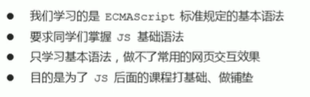

<strong> Web-APIs 阶段 </strong>
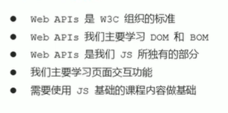

<strong> 关联性: </strong>
学习基础语法为了后面的铺垫，web-apis是js的应用，大量使用js基础语法做交互效果。 <br/>

### API 和 Web API
<strong> API: </strong> <br />
APl(Application Programming lnterface,应用程序编程接口)是一些预先定义的函数，目的是提供应用程序与开发人员基于某软件或硬件得以访问一组例程的能力，而又无需访问源码，或理解内部工作机制的细节。 <br />
简单理解:  API是给程序员提供的一种工具，以便能更轻松的实现想要完成的功能。 <br />
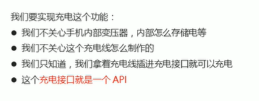

<strong> Web API: </strong> <br />
Web API 是浏览器提供的一套操作浏览器功能和页面元素的API（BOM和DOM） <br />
现阶段我们主要针对于浏览器讲解常用的API,主要针对浏览器做交互效果比如我们想要浏览器弹出一个警示框，直接使用alert(“弹出”)  <br />
<a href="https://developer.mozilla.org/zh-CN/docs/Web/API" target="_black"> MDN详细</a>
因为WebAPI很多，所以我们将这个阶段称为Web APls <br/>

<strong> API 和 Web API 总结 </strong>
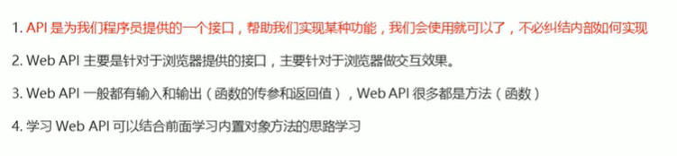

## DOM
### DOM 简介
文档对象模型（DOM），是W3C组织推荐的处理可扩展标记语言（HTML或者XML）的标准编程接口。 <br/ >
W3C 已经定义了一系列的DOM接口，通过这些DOM接口可以改变网页的内容、结构和样式。 <br />

#### DOM 树
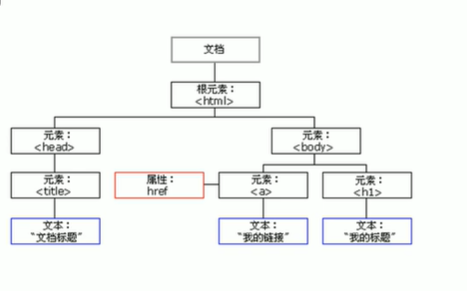
文档：一个页面就是一个文档，DOM中使用document表示。 <br />
元素：页面中所有标签就是元素，DOM中使用element 表示。 <br />
节点：网页中所有内容都是节点（标签、属性、文本、注释等），DOM中使用node表示 <br />
<strong> DOM把以上内容都看做是对象 </strong>

### 获取元素
#### 如何获取页面元素
通过 ID 获取 <br />
根据标签名获取 <br />
通过HTML5新增的方法获取 <br />
特殊元素获取 <br />

#### 根据 ID 获取
使用getElementById() 方法可以获取带有ID的元素对象。 <br />
Document的方法 getElementById()返回一个匹配特定 ID的元素. 由于元素的 ID 在大部分情况下要求是独一无二的，这个方法自然而然地成为了一个高效查找特定元素的方法。 <br />

```html
<h1 id="holle">  你好，世界！</h1>
<script>
    // 因为文档页面从上往下加载，所以script写到标签的下面
    // get 获得  element 元素 by 通过 id 驼峰命名法
    // 参数 id是大小姐敏感的字符串
    // 返回的是一个元素对象
    var hellos = document.getElementById('holle');
    console.log(hellos); 
    console.log(typeof hellos); // object
    // console.dir()，打印返回元素对象，查看里面的属性和方法。
    console.dir(hellos);
</script>
```
#### 根据标签名获取
使用getElementsByTagName() 的方法可以返回带有指定标签名的对象集合。<br />
返回一个包括所有给定标签名称的元素的HTML集合HTMLCollection。 <br />

```html
<ul>
    <li>我是标签1</li>
    <li>我是标签2</li>
    <li>我是标签3</li>
    <li>我是标签4</li>
    <li>我是标签5</li>
</ul>

<script>
    // 返回的是获取元素对象的集合，以伪数组的形式存储。
    var lis = document.getElementsByTagName('li');
    console.log(lis);
    console.log(lis[0]);
    // 如果想要打印里面元素，可以通过遍历的方式
    for(var i = 0; i < lis.length; i++) {
        console.log(lis[i]);
    }
</script>
</body>
```
:::warning 注意
因为得到的是一个对象集合，所以我们想要操作里面的元素就需要遍历。 <br />
得到元素对象是动态的，html里面的值变化，js里面的值也变化。 <br />
如果页面只有一个li，返回的还是伪数组的形式。 <br />
如果页面没有这个元素，返回的是一个空的伪数组。
:::

<strong> element.getElenmentsByTagName('标签名') </strong> <br />
还可以获取某个元素（父元素）内部所有指定标签名的子元素 <br />

```html
<body>
    <ul>
        <li>我是标签1</li>
        <li>我是标签2</li>
        <li>我是标签3</li>
    </ul>
    <ol id="ol">  
        <li>我是标签4</li>
        <li>我是标签5</li>
    </ol>
    <script>
        // var ol =document.getElementsByTagName('ol');
        // console.log(ol[0].getElementsByTagName('li'));
        var ol = document.getElementById('ol');
        console.log(ol.getElementsByTagName('li'));
    </script>
</body>
```

:::warning 注意
父元素必须是单个对象必须指明哪一个元素对象，获取的时候不包括父元素自己。
:::

#### 通过 HTML5 新增的方法获取类
<strong> document.getElenmentsByClassName('标签名') </strong> <br />
根据类名返回对象集合。 <br />
<strong> document.querySelector('选择器') </strong> <br />
根据指定选择器赶回第一个元素对象。 <br />

```html
<div class="box">盒子1</div>
<div class="box">盒子2</div>
<div id="nav">
    <ul>
    <li>首页</li>
    <li>产品</li>
    </ul>
</div>
<script>
    var box = document.getElementsByClassName('box');
    console.log(box);
    var firstbox = document.querySelector('.box')
    console.log(firstbox)
    var nav = document.querySelector('#nav');
    console.log(nav);
    var li = document.querySelector('li');
    console.log(li);
</script>
```
<strong> document.querySelectorAll('选择器')； </strong> <br />
根据指定选择器返回所有元素对象的集合。 <br />

```js
<div class="box">盒子1</div>
<div class="box">盒子2</div>
<div id="nav">
    <ul>
    <li>首页</li>
    <li>产品</li>
    </ul>
</div>
<script>
    var boxAll = document.querySelectorAll('.box');
    console.log(boxAll);
</script>
```

#### 获取特殊元素 （body，html）
##### 获取body元素
```js
var bodyEle = document.body;
console.log(bodyEle);
console.dir(bodyEle);
```

##### 获取html元素
```js
var htmlEle = document.documentElement;
console.log(htmlEle);
console.dir(htmlEle);
```

### 事件基础
JavaScript使我们有能力创建动态页面，而事件是可以被JavaScript侦测到的行为。<br />
简单理解：触发---响应机制 <br />
网页中的每一个元素都可产生某些可以触发JavaScript的事件。 <br />
例如：用户点击某个按钮时产生一个事件，然后执行某些操作。<br />
<strong>事件三部分组成(事件三要素)： </strong> 事件源。事件类型。事件处理程序。 <br />
<strong>
 + 事件源：事件被触发的对象，谁被触发。 <br />
 + 事件类型：如何触发，什么事件，比如鼠标点击(onclick)，鼠标经过，键盘按下等。 <br />
 + 事件处理程序：通过一个函数赋值的方式完成。
</strong>
```html
<button id="anniu">按钮</button>
<script>
    // 事件源
    var anniu = document.getElementById('anniu');
    console.log(anniu)
    // 事件类型，事件处理程序
    anniu.onclick = function() {
        alert('欢迎来到我的页面！')
    }
</script>
```

#### 执行事件的步骤
+ 获取事件源
+ 注册事件（绑带事件）
+ 添加事件处理程序（采取函数赋值形式）

```html
<div>Holle,Word!</div>
<script>
    var div = document.querySelector('div');
    console.log(div);
    div.onclick = function() {
        console.log('我被选中了。');
    }
</script>
```
#### 常见的鼠标事件
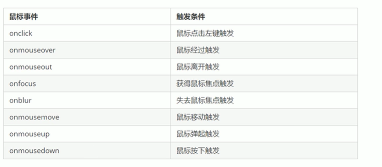

### 操作元素
JavaScript的DOM操作可以改变网页内容、结构和样式，可以利用DOM操作元素来改变元素里面的内容、属性等。注意以下都是属性。<br />

#### 改变元素内容
##### element.innerText （非标准）
从起始位置到终止位置的内容，但它去除html标签，同时空格和换行也会去掉。不识别HTML标签 <br />
```html
<h1>某个时间</h1>
<div>
    <button>显示当前系统时间</button>
</div>
<p> 某个时间 </p>
<script>
    var btn = document.querySelector('button');
    var time = document.querySelector('h1');
    btn.onclick = function() {
        time.innerText = getDates() +  ' ' + getTimes();
    }
    function getDates() {
        var date = new Date();
        var year = date.getFullYear();
        var month = date.getMonth() + 1;
        var dates = date.getDate();
        var arr = ['星期日', '星期一', '星期二', '星期三', '星期四', 'X星期五', '星期六']
        var day = date.getDay();
        return  '今天是：' + year + '年' + month + '月' + dates + '日' + ' ' +  arr[day];
    }
    function getTimes() {
        var date = new Date();
        var h = date.getHours();
        h = h < 10 ? '0' + h : h;
        var m = date.getMinutes();
        m = m < 10 ? '0' + m : m;
        var s = date.getSeconds();
        s = s < 10 ? '0' + s : s;
        return h + '时 ' + m + '分 ' + s + '秒';
    }
    // 元素可以不用添加事件
    var p = document.querySelector('p');
    p.innerText = getDates() +  ' ' + getTimes();
</script>
```

##### element.innerHTML （W3C标准）
起始位置到终止位置的全部内容，包括html标签，同时保留空格和换行。 <br />
```js
<div></div>
<script>
    var div = document.querySelector('div');
    div.innerHTML = '<strong>你好世界</strong>,你好世界';
</script>
```
```html
<p>
    我是文本
    <span>123 </span>
</p>
<script>
    var p = document.querySelector('p');
    console.log(p.innerHTML);
</script>
```
#### 常用元素的属性操作
<strong> 修改元素属性 src</strong>

```html
<div>
    <button id="bizhi1"> 壁纸1</button>
    <button id="bizhi2">壁纸2</button>
</div>

<script>
    var bizhi1 = document.querySelector('#bizhi1');
    var bizhi2 = document.querySelector('#bizhi2');
    var img = document.querySelector('img');
    bizhi1.onclick = function() {
        img.src = "image/1.png";
        img.title = '壁纸1';
    };
    bizhi2.onclick = function() {
        img.src = "image/2.jpg";
        img.title = '壁纸2';
    }
</script>
```
<strong> 案例：分时显示不同图片，显示不同问候语 </strong>

```html
<div>
    <h1>：) 加载中....</h1>
    
</div>
<script>
    var text = document.querySelector('h1');
    var img = document.querySelector('img');
    var date = new Date();
    var h = date.gethours;
    if (h < 12) {
        img.src = 'image/1.jpg';
        text.innerHTML = '早上好！'
    } else if (h >= 12 || h < 14) {
        img.src = 'image/2.jpg';
        text.innerHTML = '中午好！'
    } else if (h >= 14 || h < 18) {
        img.src = 'image/3.jpg';
        text.innerHTML = '下午好！'
    } else {
        img.src = 'image/4.jpg';
        text.innerHTML = '晚上好！'
    }
</script>
```
#### 表单元素的属性操作
利用DOM可以操作这些表单元素的属性：type,value,checked,selected,disabled <br />
```html
<button>按钮</button>
<input type="text" value="请输入内容...">
<script>
    var btn = document.querySelector('button');
    var imp = document.querySelector('input');
    btn.onclick = function() {
        imp.value = '被点击了';
        // 点击按钮过后，按钮禁用
        this.disabled = true;
        // this 指向的是事件函数的使用者
    }
</script>
```
<strong> 案例： 密码的显示与隐藏 </strong>

```html
<style>
    div {
        width: 300px;
        height:30px;
        margin: 100px auto;
        border-bottom: 1px solid rgb(75, 74, 74);
    }
    input {
        width: 150px;
        height: 28px;
        border: 0;
        outline: none;
    }
</style>
<div class="box">
    <label for="666">点击</label>
    <input type="password" name="" id="666" value="请输入密码"> 
    <button>显示密码</button>
</div>
<script>
    var but = document.querySelector('button');
    var imp = document.querySelector('input');
    var flag = 0;
    but.onclick = function() {
        if (flag == 0) {
            imp.type = 'text';
            flag = 1;
            but.innerHTML = '隐藏密码'
        } else {
            imp.type = 'password';
            flag = 0;
            but.innerHTML = '显示密码'
        }
    }
</script>
```
#### 样式属性操作
#####  element.style 行内样式操作 
```html
<style>
    div {
        width: 200px;
        height: 200px;
        background-color: red;
    }
</style>
<div></div> 
<script>
    var div = document.querySelector('div');
    div.onclick = function() {
        // div.style = 'background-color: black';
        this.style.backgroundColor = 'pink';
        this.style.width = '400px';
        this.style.height = '400px';
    }
</script>
```
:::warning 注意
里面的样式采取驼峰命名法，比如：fontSize、backgroundColor等。 <br />
修改 style 样式操作，产生的是行内样式，css权重比较高。 <br />
:::

<strong> 案例： 点击关闭二维码 </strong>

```html
<style>
    div {
        text-align: center;
        display: block;
    }
    img {
        width: 200px;
    }
</style>
<div>
    <button>按钮</button>
    
</div>
<script>
    var div = document.querySelector('div');
    var btn = document.querySelector('button');
    var img = document.querySelector('img');
    btn.onclick = function() {
        div.style.display = 'none';
    }
</script>
```
<strong> 案例： 显示隐藏文本框内容 </strong> <br />
<strong> 获得焦点（onfocus），失去焦点（onblur） </strong>

```html
<input type="text" value="请输入内容">
<script>
    var imp = document.querySelector('input');
    var htmls = document.documentElement;
    imp.style.color =  'red';
    imp.onfocus = function() {
        if (this.value == "请输入内容") {
            this.value = '';
        }
        this.style.color =  'black';
    }
    imp.onblur = function() {
        if (this.value == "") {
            this.value = '请输入内容';
        }
        this.style.color =  'red';
    }
</script>
```
##### element.className 类型样式操作
通过修改元素的className更改元素的样式，适合样式较多或者功能复杂在的情况。
```html
<style>
    div {
        width: 200px;
        height: 200px;
        background-color: wheat;
        color: black;
        font-size: 50px;
    }
    .change {
        width: 200px;
        height: 200px;
        margin-top: 200px;
        background-color: black;
        color: white;
    }
</style>
<div>你好</div>
<script>
    var div = document.getElementsByTagName('div')
    div[0].onclick = function() {
        this.className = 'change';
    }
</script>
```
:::warning 注意
如果样式修改较多，可以采取操作类名的方式更改元素样式。 <br />
class因为是个保留字，因此使用className来操作元素类名属性。 <br />
className 会直接更改元素的类名，会覆盖原有的类名。 <br />
如果不想覆盖原来的类名，element.className = '原有的类名 新的类名';
:::

<strong> 案例：密码框格式提示错误星期 </strong>

```html
<style>
    div {
        margin-left: 40%;
    }

    p {
        display: inline-block;
    }
    .change {
        color: green;
    }
    .change2 {
        color: red;
    }
</style>
<div>
    <input type="password" >
    <p>请输入6~16位密码</p>
</div>
<script>
    var div = document.getElementsByTagName('div');
    var imp = document.querySelector('input');
    var p = document.querySelector('p');
    imp.onblur = function() {
        if (this.value.length < 6 || imp.value.length > 16) {
            p.innerHTML = '密码长度不正确！';
            p.className = 'change2';
        } else {
            p.innerHTML = '密码正确';
            p.className = 'change';
        }
    }
</script>
```
#### 操作元素总结
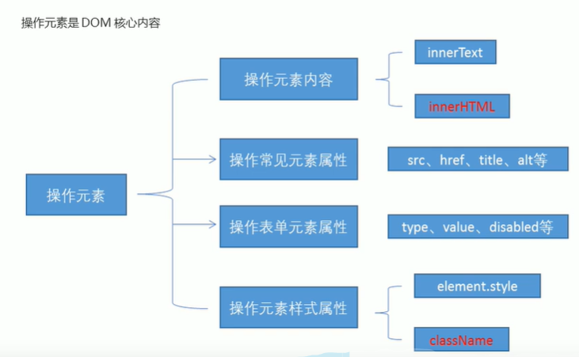

#### 排他思想
如果一组元素，我们想要某一个元素实现某种样式，需要用到循环的排他算法：<br />
1. 所有元素全部清除样式（干掉其他人） <br />
2. 给当前元素设置样式（留下我自己） <br />
3. 注意顺序不能颠倒，首先干掉其他人，在设置自己。 <br />
```html
<button>按钮1</button>
<button>按钮2</button>
<button>按钮3</button>
<button>按钮4</button>
<button>按钮5</button>
<script>
    var btns = document.getElementsByTagName('button')
    for (var i = 0; i < btns.length; i++) {
        btns[i].onclick = function() {
            for (var i = 0; i < btns.length; i++) {
                btns[i].style.backgroundColor = '';
            }
            this.style.backgroundColor = 'pink';
        }
    }
</script>
```

<strong> 案例：百度换肤 </strong>

```html
<style>
    * {
        list-style: none;
        margin: 0;
        padding: 0;
    }
    body {
        background-size: cover;
        background-image: url(image/11.jpg);
    }
    .box {
        margin: 100px auto;
        width: 500px;
        height: 60px;
        background-color: #eee;

    }
    .box ul li img {
        float:left;
        margin-left: 5px;
        height: 60px;
    }
</style>
<div class="box">
    <ul>
        <li></li>
        <li></li>
        <li></li>
        <li></li>
    </ul>
</div>
<script>
    var imgs = document.getElementsByTagName('img');
    var bodys = document.body;
    console.log(imgs[0].src)
    for (var i = 0; i < imgs.length; i++) {
        imgs[i].onclick = function() {
            bodys.style.backgroundImage = 'url(' + this.src + ')';
        }
    }
</script>
```
<strong> 案例：表格隔行变色 </strong>
需要用到鼠标经过（onmouserover）,鼠标离开（onmouseut）

```html
<script>
    var tbody = document.querySelector('tbody').querySelectorAll('TR');
    for (var i = 0; i < tbody.length; i++) {
        tbody[i].onmouseover = function() {
            this.className = 'colorchange';
        }
        tbody[i].onmouseout = function() {
            this.className = '';
        }
    }
</script>
```
<strong> 案例：表单全选取消全选 </strong>

```html
<script>
    var j_ckAll = document.getElementById('j_ckAll');
    var j_tbs = document.getElementById('j_tb').getElementsByTagName('input');
    // 一个影响全部
    j_ckAll.onclick = function() {
        for (var i = 0; i < j_tbs.length; i++) {
            j_tbs[i].checked = this.checked;
        }
    }
    // 全部影响一个
    for (var i = 0; i < j_tbs.length; i++) {
        j_tbs[i].onclick = function() {
            var flag = true;
            for (var i = 0; i < j_tbs.length; i++) {
                if (j_tbs[i].checked == false) {
                    flag= false;
                    break;
                } 
            }
            j_ckAll.checked = flag;
        }
    }
</script>
```
#### 自定义属性的操作
##### 获取属性值
<strong> element.属性; </strong>

```html
<div id="hhhf"></div>
<script>
    var div = document.getElementsByTagName('div');
    console.log(div[0].id); // hhhf
</script>
```
<strong> element.getAttribute('属性')</strong>

```html
<div id="hhhf" index= '2'></div>
<script>
    var div = document.querySelector('div');
    console.log(div.getAttribute('id')); // hhhf
    console.log(div.getAttribute('index')) // 2
</script>
```
<strong> 两者区别 </strong>
element.属性: 只能获取到元素的内置属性。<br />
element.getAttribute('属性'): 可以获取到自定义属性，一般情况下自己添加的属性称为自定义属性。 <br />

##### 设置属性值
<strong> element.属性 = '值'; 设置内置属性值</strong>

```html
<div id="hhhf" index= '2'></div>
<script>
    var div = document.querySelector('div');
    div.id = 'test';
    console.log(div.id); // test
</script>
```
<strong> element.setAttibute('属性', '值')</strong>
主要针对自定义属性、 <br />

```html
<div id="hhhf" index= '2' class="footer"></div>
<script>
    var div = document.querySelector('div');
    div.getAttribute('class','index');
</script>
```
##### 溢出属性
<strong> element.removerAttribute('属性')</strong>

```html

<div id="hhhf" index= '2' class="footer"></div>
<script>
    var div = document.querySelector('div');
    div.removeAttribute('index')
</script>
```
<strong> tab 栏切换 </strong>

```html
<style>
    * {
        margin: 0;
        padding: 0;
        list-style: none; 
    }
    .box {
        margin: 100PX auto;
        margin-bottom: 0;
        width: 400px;
        height: 50px;
        background-color: darkgrey;
    }
    .box ul li {
        text-align: center;
        line-height: 50px;
        width: 20%;
        float: left;
    }
    .box2 {
        width: 400px;
        height: 400px;
        margin: 0 auto;
    }
    .box2 div {
        display: none;
    }
    .changeColor {
        background-color: red;
    }
</style>
<div class="box">
    <ul>
        <li class="changeColor">页面</li>
        <li>页面1</li>
        <li>页面2</li>
        <li>页面3</li>
        <li>页面4</li>
    </ul>
</div>
<div class="box2">
    <div style="display: block;">介绍页面1 </div>
    <div>介绍页面2</div>
    <div>介绍页面3</div>
    <div>介绍页面4</div>
    <div>介绍页面5</div>
</div>
<script>
    var box = document.querySelectorAll('li');
    var box2 = document.querySelector('.box2').querySelectorAll('div');
    for (var i = 0; i < box.length; i++) {
        box[i].setAttribute('num', i);
        box[i].onclick = function() {
            var j = i;
            for (var i = 0; i < box.length; i++) {
                box[i].removeAttribute('class');
                box2[i].style.display = 'none';
            }
            var index = this.getAttribute('num');
            box2[index].style.display = 'block';
            this.setAttribute('class', 'changeColor')
        }
    }
</script>
```
#### H5自定义属性
自定义属性目的：是为了保存并使用数据，有些数据可以保存到页面中而不用保存到数据库中。 <br />
自定义属性获取是通过getAttribute('属性') 获取 <br />
但是有些自定义属性很容易引起歧义，不容易判断是元素内置属性还是自定义属性。 <br />

#### 设置H5自定义属性
H5规定自定义属性date-开头作为属性名并赋值。 <br />
<strong>比如：</strong>

```html
<div date-index= '1'> </div>
<!-- 使用js设置属性 -->
<script>
element.setAttribute('date-time', 2);
</script>
<!-- 获取H5的值 -->
<script>
element.getAttridute('属性名');
</script>
<!-- H5新增获取属性的方法 -->
<script>
// 不用加data- 直接用后面的名字
element.dataset.属性名;
element.dataset['属性名'];
</script>
<div data-index-name= '6'> </div>
<script>
// 属性名要使用驼峰命名法
div.dataset.indexName;
div.dataset['indexName'];
</script>
```

### 节点操作

#### 为什么学节点操作
获取元素通常使用的两种方式 <br />
<strong> 1.利用DOM提供的方法获取元素 </strong> <br />

+ document.getElementById();
+ document.getElementsByTagName();
+ document.querySelector();等
+ 逻辑性不强，繁琐

<strong> 2.利用节点层级关系获取元素 </strong>

+ 利用父子级兄弟节点关系获取元素
+ 逻辑性强，但是兼容性较差
34 31

#### 节点概述
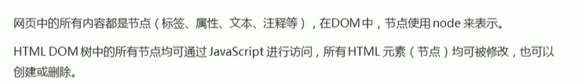


一般地，节点至少拥有nodeType(节点类型)、nodeName（节点名称）、=和nodeValue（节点值）这三个基本属性。<br />
+ 元素节点： nodeType 为1
+ 属性节点： nodeType 为2
+ 文本节点： nodeType 为3 （文本节点包含文字、空格、换行等）

<strong> 我们在实际开发中，节点操作主要操作的是元素节点 </strong> <br />

#### 节点层级
利用DOM 树可以把节点划分为不同的层级关系，常见的是父子兄层级关系。 <br />

##### 父级节点
<strong> node.parentNode </strong>

```html
<div class="box">
    <span class="erweima"></span>
</div>
<script>
    // DOM获取元素
    var span = document.querySelector('span');
    // var div = document.querySelector('div');
    // 节点获取元素
    var span = document.querySelector('span');
    // 得到的是离元素最近的父级节点
    var box = span.parentNode;
    console.log(box); 
</script>
```
##### 子节点

<strong> parentNode.childNodes (标准)</strong>
```html
<ul>
    <li>我是li</li>
    <li>我是li</li>
</ul>
<ol>
    <li>我是li</li>
    <li>我是li</li>
</ol>
<script>
    // parentNode.childNodes (标准)
    // parentNode.childNodes 返回包含指定节点的子节点的集合，该集合为实时更新集合
    // DOM 获取方法
    var ul = document.querySelector('ul');
    // var lis = ul.querySelectorAll('li');
    // console.log(lis)
    // 节点获取方法，childNodes 获取所有的子节点，包含元素节点，文本节点等
    var li = ul.childNodes;
    console.log(li);
</script>
```
:::warning 注意
返回值里面包含了所有的子节点、包括元素节点、文本节点。 <br />
如果只想要获取里面的元素节点，需要专门处理，所以我们一般不提倡使用childNodes
::::

<strong> 需要单独获取元素节点的方法：</strong>
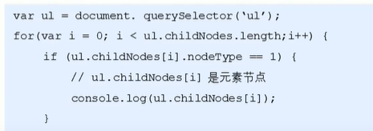

<strong> parentNode.children (非标准) </strong> <br />
这种方法可以很方便的获取所有子元素节点，是非标准的，但是支持所有浏览器。 <br />

```html
<ul>
    <li>我是li</li>
    <li>我是li</li>
</ul>
<script>
    var ul = document.querySelector('ul');
    var li = ul.children;
    console.log(li);
</script>
```
<strong> 获取第一个子节点，最后一个子节点 </strong> <br />
<strong> parentNode.firstChild </strong> <br />
firstChild 返回第一个子节点，找不到则返回null，同样，也是返回所有的节点。 <br />

<strong> parentNode.lastChild </strong> <br />
lastChild 返回最后一个子节点，找不到则返回null，同样，也是返回所有的节点。 <br />

```html
<ul>
    <li>我是li1</li>
    <li>我是li2</li>
    <li>我是li3</li>
    <li>我是li4</li>
</ul>
<script>
    var ul = document.querySelector('ul');
    var li = ul.firstChild;
    console.log(li); // 返回的是文本节点
    console.log(li.lastChild); // 返回的文本节点
</script>
```
<strong> parentNode.fristElementChild ,获取第一个子元素节点。</strong> <br />
<strong> parentNode.lastElementChild,获取最后一个子元素节点。 </strong> <br />

```html
<ul>
    <li>我是li1</li>
    <li>我是li2</li>
    <li>我是li3</li>
    <li>我是li4</li>
</ul>
<script>
    var ul = document.querySelector('ul');
    var firstLi = ul.firstElementChild;
    console.log(firstLi);
    var lastLi = ul.lastElementChild;
    console.log(lastLi)
</script>
```
:::warning 注意
这两个方法有兼容型问题，IE9以上才支持
:::

:::tip 解决方案
```html
<script>
    var ul = document.querySelector('ul');
    var firstLi = ul.children[0];
    console.log(firstLi);
    var lastLi = ul.children[ul.children.length - 1];
    console.log(lastLi)
</script>
```
:::
<strong>案例：下拉菜单 </strong>

```html
<ul class="nav">
    <li>
        <a href="#">菜单1</a>
        <ul>
            <li>下拉内容1</li>
            <li>下拉内容2</li>
            <li>下拉内容3</li>
        </ul>
    </li>
</ul>
<script>
    var box = document.querySelector('.nav');
    var lis = box.children;

    console.log(lis[0].children[1])
    for (var i = 0; i < lis.length; i++) {
        lis[i].onmouseover = function() {
            this.children[1].style.display = 'block';
        }
        lis[i].onmouseout = function() {
            this.children[1].style.display = 'none';
        }
    }
</script>
```

##### 兄弟节点
<strong> element.nextSibling </strong>
element.nextSibling:下一个兄弟节点，包含元素节点或者文本节点等等。 <br />
```html
<div></div>
<span></span>
<script>
    var div = document.querySelector('div');
    console.log(div.nextSibling);
</script>
```
<strong> element.previousSibling </strong>
element.previousSibling:上一个兄弟节点，包含元素节点或者文本节点等等。 <br />
```html
<div></div>
<span></span>
<script>
    var div = document.querySelector('div');
    console.log(div.nextSibling);
</script>
```

<strong> element.nextElementSibling ，得到下一个兄弟元素节点。</strong>

```html
<div></div>
<span></span>
<script>
    var div = document.querySelector('div');
    console.log(div.nextElementSibling);
</script>
```
<strong> element.previousElementSibling ，得到下一个兄弟元素节点。</strong>

```html
  <div></div>
  <span></span>
  <script>
    var div = document.querySelector('span');
    console.log(div.previousElementSibling);
  </script>
```
#### 创建节点
<strong> document.createSlement('tagName') </strong> <br />
这个方法创建由tagName指定HTML元素，因为这些元素原先不存在;，是根据我们的需求动态生成的，所以我们也称为动态创建元素节点。 <br />

#### 添加节点
<strong> node.appendChild(child) 在最后面添加元素节点</strong> <br />
node 是父级，child 是子级。 <br />
这个方法将一个节点添加到指定父节点的子节点列表末尾，类似于css里面的after伪元素。 <br />
```html
  <ul>
  <li>123</li>
  </ul>
  <script>
    var ul = document.querySelector('ul');
    var li = document.createElement('li');
    ul.appendChild(li);
  </script>
```
<strong> node.insertBefore(child, 指定元素)</strong> <br />
这个方法将一个节点添加到父节点的指定子节点的前面，类似于css里面的before伪元素。 <br />
```html
  <ul>
    <li>123</li>
  </ul>
  <script>
    var ul = document.querySelector('ul');
    var li = document.createElement('li');
    ul.appendChild(li);
    var lili = document.createElement('li');
    ul.insertBefore(lili, ul.children[0]);
  </script>
```
<strong>页面添加新的元素有两步： </strong> <br />

+ 创建元素
+ 添加元素

<strong>案例：简单版发布留言板 </strong>·

```html
<!-- CSS部分 -->
<style>
* {
    margin: 0;
    padding: 0;
}
body {
    background-color: rgb(52, 59, 59);
}
.box {
    width: 300px;
    margin: 100px auto;
}
textarea {
    width: 200px;
    height: 80px;
    text-align: initial;
}
.board {
    margin-top: 10px;
    width: 200px;
    
}
.board li {
    margin-top: 5px;
    background-color: rgba(54, 184, 239, 0.744);
}
</style>
<!-- html部分 -->
  <div class="box">
    <textarea name="text" id="" cols="30" rows="10"></textarea>
    <button>发布</button>
    <ul class="board">
      <li>我的第一条留言。</li>
    </ul>
  </div>
<!-- js部分 -->
  <script>
    var button = document.querySelector('button');
    var input = document.querySelector('textarea ');
    var ul = document.querySelector('ul');
    var flag = 0;
    button.onclick = function() {
      if (input.value == '') {
        alert('请输入内容！');
        return;
      } else {
        var li = document.createElement('li');
        li.innerHTML = input.value;
        // ul.appendChild(li);
        ul.insertBefore(li, ul.children[0]);
      }
    }
  </script>
```

#### 删除节点
<strong>node.removeChile(child) </strong> <br />
node.removechild(child) 方法从node删除一个子节点，返回删除的节点。 <br />

```html
  <button>删除</button>
  <ul>
    <li>我是li1</li>
    <li>我是li2</li>
    <li>我是li3</li>
  </ul>
  <script>
    var button = document.querySelector('button');
    var ul = document.querySelector('ul');
    console.log(ul.children.length)
    button.onclick = function() {
      ul.children.length == 0 ? button.disabled = true : ul.removeChild(ul.children[0]);
    }
  </script>
```
<strong>案例：删除留言 </strong>
```html
<!-- css,html 不需要修改 -->
  <script>
    var button = document.querySelector('button');
    var input = document.querySelector('textarea ');
    var ul = document.querySelector('ul');
    var flag = 0;
    button.onclick = function() {
      if (input.value == '') {
        alert('请输入内容！');
        return;
      } else {
        var li = document.createElement('li');
        // a链接不需要跳转，可以用 href= 'javascript:;'
        li.innerHTML = input.value + "<a href= 'javascript:;'> 删除 </a>";
        ul.insertBefore(li, ul.children[0]);
        var as = document.querySelectorAll('a');
        for (var i = 0; i < as.length; i++) {
          as[i].onclick = function() {
            ul.removeChild(this.parentNode);
          }
        }
      }
    }
  </script>
```

#### 复制节点（克隆节点）
<strong> node.cloneNode(); </strong> <br />
node.cloneNode() 方法返回调用该方法的节点的一个副本，也称为克隆节点/拷贝节点。 <br />
```html
  <ul>
    <li>你好，世界。</li>
  </ul>
  <script>
    var ul = document.querySelector('ul');
    var newLi = ul.children[0].cloneNode(true);
    ul.appendChild(newLi);
  </script>
</body>
```
:::warning 注意
如果括号参数为空或者为false，则是浅拷贝，只克隆复制节点本身，不克隆里面的子节点。<br />
如果括号里面为true，就是深拷贝，拷贝节点本身，包括里面的子节点。
:::

<strong> 案例： 动态生成表格 感觉应该这是一个重点</strong>

```html
<!-- css部分 -->
  <style>
    table {
      width: 300px;
      margin: 100px auto;
    }
    table thead th {
      background-color: #eee;
      border: 1px black solid;
    }
    table tbody tr td {
      margin-top: 1px;
      text-align: center;
      border: 1px black solid;
    }
    tbody a {
      text-decoration: none;
      color: red;
    }
  </style>
  <!-- html部分 -->
    <table cellspacing="0" cellpadding="0">
        <thead>
            <tr>
                <th>姓名</th>
                <th>科目</th>
                <th>成绩</th>
                <th>操作</th>
            </tr>
        </thead>
        <tbody>
        </tbody>
  </table>
  <!-- js部分 -->
    <script>
    // 准备学生的数据
    var datas =[ {
        name: '小红',
        subject: 'JavaScript',
        score: 100
      }, {
        name: '小白',
        subject: 'JavaScript',
        score: 95
      }, {
        name: '小兰',
        subject: 'JavaScript',
        score: 60
      },{
        name: '小黑',
        subject: 'JavaScript',
        score: 88
      },{
        name: '小66',
        subject: 'JavaScript',
        score: 88
      },
    ];
    // 往tbody 里面创建行，有几个人（通过数组的长度）就创建几行
    var tbody = document.querySelector('tbody');
    for (var i = 0; i < datas.length; i++) {
      var tr = document.createElement('tr');
      tbody.appendChild(tr)
      // 行里面创建单元格 td 单元格的数量取决于每个对象里面的属性个数
      // for 遍历对象
      for (var k in datas[i]) {
        // 创建单元格
        var td = document.createElement('td');
        // 把对象里面的属性值 给td
        // var obj = datas[i]
        // td.innerHTML = obj[k];
        td.innerHTML = datas[i][k];
        tr.appendChild(td);
      }
      // 创建有删除两个字的单元格
      var td = document.createElement('td');
      td.innerHTML = "<a href= 'javascript:;'>删除 </a>";
      tr.appendChild(td);
    }
    // 删除操作
    var as = document.querySelectorAll('a');
    console.log(as);
      for (var i = 0; i < as.length; i++) {
        as[i].onclick = function() {
        tbody.removeChild(this.parentNode.parentNode)
        }
      }
  </script>
```
#### 三种动态创建元素区别
+ document.write()
+ element.innerHTML
+ document.createElemetn();

<strong> document.write() </strong> <br />

```html
  <button>点击</button>
  <p>abc</p>
  <script>
    document.write('<div>123</dib>')
  </script>
```
<strong> element.innerHTML </strong>

```html
  <div class="inner"></div>
  <div class="create"></div>
  <script>
    var inner = document.querySelector('.inner');
    for (var i = 0; i <= 100; i++) {
        inner.innerHTML = "<a href= 'javascript:;'>链接</a>";
    }
  </script>
```
<strong> element.createElement() </strong>

```html
  <div class="inner"></div>
  <div class="create"></div>
  <script>
    var create = document.querySelector('.create');
    for (var i = 0; i <= 100; i++)  {
        a = document.createElement('a');
        create.appendChild(a);;
    }
  </script>
```
<strong> 三者区别 </strong>

+ document.write：是直接将内容写入页面的内容流，但是文档流执行完毕，则他会导致页面全部重绘。 
+ innerHTML：是将内容写入某个DOM节点，不会导致页面全部重绘。
+ innerHTML：创建多个元素效率更高（不要拼接字符串，采用数组形式拼接），结构复杂。
+ createElement()：创建多个元素效率高稍低一点点，但是结构更清晰。

:::tip 总结
不同浏览器下，innerHTML效率比 createElement()高。
:::

### DOM重点核心
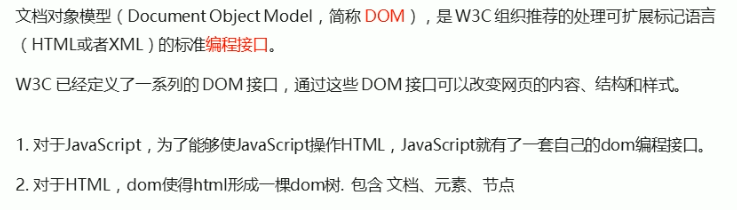

:::tip 提示
我们获取过来的DOM元素是一个对象（object），所以称为文档对象模型。 <br />
关于DOM操作，我们主要针对于元素的操作，主要有创建、增、删、改、差、属性操作、事件操作。
:::

#### 创建
+ document.write
+ innerHTML
+ createElement

#### 增
+ appendChild
+ insertBefore

#### 删
+ removeChild

#### 改
<strong>主要修改DOM的元素属性，DOM元素的内容、属性、表单的值等。</strong> <br />
+ 修改元素属性：str、href、tltle等
+ 修改普通元素内容：innerHTML、innerText
+ 修改表单元素：value、type、disabled等
+ 修改元素样式：style、className

#### 查
<strong>主要获取查询DOM的元素</strong> <br />

+ DOM提供的API方法：getElementById、getElementByTagName 古老的用法不太推荐。
+ H5提供的新方法：querySelector、querySelectorAll 提倡这个用法。
+ 利用节点操作获取元素：父级（partenNode）、子级（children）、兄弟级（previousElementSibling、nextElementSibling）提倡这些用法。

#### 属性操作
<strong>主要针对于自定义属性</strong> <br />

+ setAttribute：设置DOM的属性值
+ getAttribute：获取DOM的属性值
+ removeAttribute：移除属性

#### 事件操作
<strong>给元素注册事件、采取 事件源-事件类型-事件处理程序</strong> <br />

+ onclick：鼠标点击左键触发
+ onmouseover：鼠标经过触发
+ onmouseout：鼠标离开触发
+ onfocus：获得鼠标焦点触发
+ onblur： 失去鼠标焦点触发
+ onmousemove：鼠标移动触发
+ onouseuo：鼠标弹起触发
+ onmousedown：鼠标按下触发

## 事件高级
### 注册事件（绑定事件）
给元素添加事件，称为注册事件或者绑定事件。<br />
注册事件有两种方式：传统方式格方法监听注册方式。<br />

<strong> 传统注册方式：</strong>
```
利用 on开头的事件 onclick
<button onclick= "alert('Hi~')"> </button>
btn.onclick = function() {}
```

+ 特点：注册事件的唯一性
+ 同一个元素同一个事件只能设置一个处理函数，最后注册的处理函数将会覆盖前面注册的处理函数。

<strong> 方法监听注册方式：</strong>

+ W3C标准 推荐的方式
+ addEventListener() 它是一个方法。
+ IE9之前的IE不支持此方法，可以使用attachEvent()替代
+ 特点：同一个元素同一个事件可以注册多个监听器
+ 按注册循序依次执行

#### addEventListener 事件监听方式
```
eventTarget.addEventListener(type, listener,[useCapture])
```
eveTarget.addEventListener() 方法将指定的监听器注册到eventTarget(目标对象)上，当该对象触发指定的事件时，就会执行事件处理函数。 <br />
<strong> 该方法接受的三个参数： </strong>

+ type：事件类型字符串，比如：click、mouseover，注意这里不要带on
+ listener：事件处理函数，事件发生时，会调用改监听函数
+ useCapture：可选参数，是一个布尔值，默认false。学位DOM事件流以后，进一步学习
```html
  <button>方法监听注册事件</button>
  <script>
    var btn = document.querySelector('button');
   
    btn.addEventListener('click', function() {
      alert('你好世界！')
    })
    btn.addEventListener('click', function() {
      alert('Holle,Word!');
    })
  </script>
```
:::tip 提示
addEventListener 里面的事件类型是字符串，加引号，不带on. <br />
同一个元素同一个事件可以添加多个监听器（事件处理程序）
:::

#### attachEvent 事件监听方式，IE9以前的版本支持
```
eventTarget.attachEvent(eventNameWithOn, acllback);
```
eventTarget.attachEvent() 方法将指定的监听器注册到eventTarget（目标对象）上，当该对象触发指定的事件时，指定的回调函数就会被执行。 <br />

<strong> 该方法接受两个参数： </strong>

+ eventNameWithOn：事件类型字符串，比如：onclick、onmouseover，这里要带on。
+ callback：事件处理函数，当目标触发事件时回调函数调用

```html
  <button>ie9 attachEvent</button>
  <script>
    var btn = document.querySelector('button');
    btn.attachEvent('onclick', function() {
      alert('你好，世界！')
    })
  </script>
```
:::warning 注意
eventTarget.attachEvent() 这个方法只有IR9之前才起作用
:::

<strong> 注册事件兼容性解决方案 </strong>

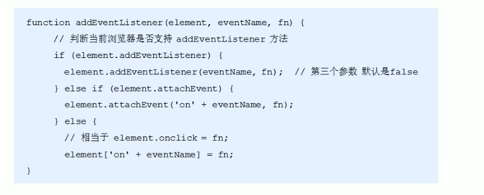

:::tip
兼容性处理的原则：首先照顾大多数浏览器，再处理特殊浏览器。
:::

### 删除事件（解绑事件）
#### 删除事件的方式
<strong> 传统注册方式 </strong> <br />
<strong> eventTarget/onclick = null </strong> <br />

```html
  <div>按钮</div>
  <script>
    var div = document.querySelector('div');
    div.onclick = function() {
      alert('你好，世界！');
      div.onclick = null;
    }
  </script>
```
<strong> 方法监听注册方式 </strong> <br />
<strong> eventTarget.removeEventListeber(type, listener, [useCapture]) </strong>

```html
  <div>按钮</div>
  <script>
    var div = document.querySelector('div');
    div.addEventListener('click', fn);
    function fn() {
      alert('你好，世界！');
      div.removeEventListener('click', fn);
    }
  </script>
```
<strong> IE9以下的注册方式 </strong> <br />
```html
  <div>按钮</div>
  <script>
    var div = document.querySelector('div');
    div.attachEvent('click', fn);
    function fn() {
      alert('你好，世界！');
      div.datachEvent('click', fn);
    }
  </script>
```

#### 删除事件兼容性解决方案
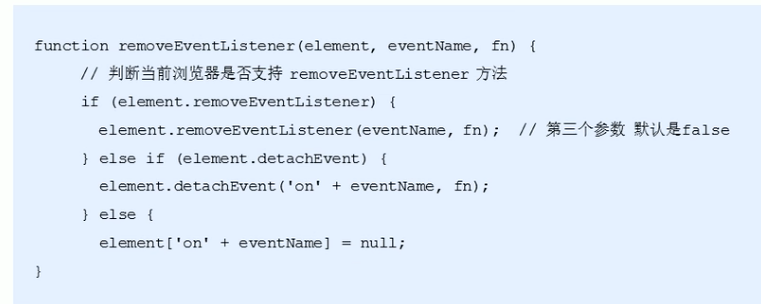

### DOM事件流
事件流描述的是从页面中接受事件的顺序。 <br />
事件发生时会在元素节点之间按照特定的顺序传播，这个传播过程就是DOM事件流。 <br />
<strong> DOM事件流分为3个阶段： </strong>

+ 捕获阶段
+ 当前目标阶段
+ 冒泡阶段
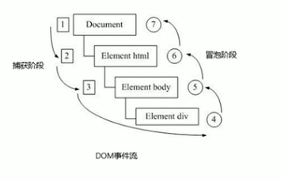

:::tip 提示
事件冒泡：IE最早提出，事件开始时由最具体的元素接受，然后逐级向上传播到DOM最顶层节点的过程。 <br />
事件捕捉：网景最早提出，由DOM顶层节点开始，然后逐级向下传播到具体的元素接受的过程。
:::
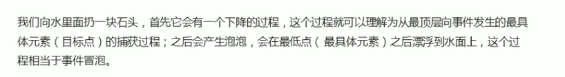

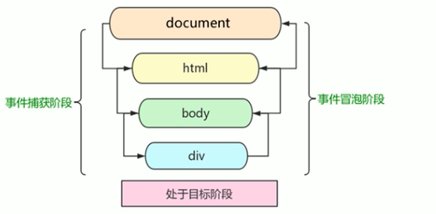

:::warning 注意
JS代码中中只能执行捕获或者冒泡其中的一个阶段。 <br />
onclick和attachEvent 只能得到冒泡阶段。 <br />
addEventListener(type, listener,[useCapture])第三个参数如果是true，表示在事件捕获阶段调用事件处理程序；如果是false（不写默认false），表示事件在冒泡阶段调用事件处理程序。
:::，

<strong> 捕获阶段 </strong>
```html
<!-- css代码部分 -->
  <style>
    .father {
      width: 200px;
      height: 200px;
      background-color: aqua;
    }
    .son { 
      width: 100px;
      height: 100px;
      background-color: burlywood;
    }
  </style>
<!-- html，js部分 -->
  <div class="father">
    <div class="son">son盒子</div>
  </div>
  <script>
    var son = document.querySelector('.son');
    // 捕获阶段，如果addEventListener 第三个参数是true,处于捕获阶段
    // document -> html -> body -> father -> son
    son.addEventListener('click', function() {
      alert('son(你好，世界)')
    }, true);
    var father = document.querySelector('.father');
    father.addEventListener('click', function() {
      alert('father(你好，世界)')
    }, true);
  </script>
```
<strong> 冒泡阶段 </strong>
```html
<!-- css代码部分 -->
  <style>
    .father {
      width: 200px;
      height: 200px;
      background-color: aqua;
    }
    .son { 
      width: 100px;
      height: 100px;
      background-color: burlywood;
    }
  </style>
<!-- html，js部分 -->
  <div class="father">
    <div class="son">son盒子</div>
  </div>
  <script>
    var son = document.querySelector('.son');
    // 冒泡阶段，如果addEventListener 第三个参数是false或者省略,处于冒泡阶段
    // son -> father -> body -> html -> document
    son.addEventListener('click', function() {
      alert('son(你好，世界)')
    }, false);
    var father = document.querySelector('.father');
    father.addEventListener('click', function() {
      alert('father(你好，世界)')
    }, false);
  </script>
```
:::warning 注意
实际开发中我们很少使用事件捕获，我们更关注事件冒泡。 <br />
有些事件是没有冒泡，比如 onblur、onfocus、onmouseenter、onmouseleave。 <br />
事件冒泡有时候会给我们带来麻烦，有时又会帮助很巧妙的做某些事件。
:::

### 事件对象
```html
  <div>点击</div>
  <script>
    var div = document.querySelector('div');
    // 传统绑定事件
    // div.onclick = function(event) {
    //   console.log(event);
    // }
    // 监听事件
    // 这个事件对象可以自己命名，比如event、evt、e
    div.addEventListener('click', function(event) {
      console.log(event);
    })
    // 兼容性处理方法
    div.onclick = function(e) {
        e =e || window.envent
        console.log(e);
    }
  </script>
```
:::tip 提示
event 就是一个事件对象，写在function的括号里面，当形参来看。 <br />
事件对象只有，有了事件才会存在，它是系统给我们自动创建的，不需要传递参数。 <br />
事件对象是，事件的一些列相关数据的集合，跟事件相关的，比如鼠标点击里面就包含了鼠标的相关事件，鼠标坐标，如果是键盘事件里面就包含的键盘事件的信息，比如判断用户按下了哪个键。 <br />
事件对象也有兼容性问题。IE678 通过window.event
:::
#### 事件对象的常见属性和方法
+ e.target: 返回触发事件的对象 标准
+ e.srcElement: 返回触发事件的对象， 非标准IE678 使用
+ e.type：返回事件的类型，比如：click，mouseover，不带on
+ e.cancelBubble：该属性阻止冒泡，非保准ie6~8使用
+ e.returnValue：该事件阻止默认事件（默认行为）非标准，ie6~8使用，比如，不让链接跳转
+ e.preventDefault()：该方法 阻止默认事件（默认行为）标准，比如 不让链接跳转
+ e.stopPropagation()：阻止冒泡 标准

<strong> e.target属性 </strong>
```html
  <ul>
    <li>点击</li>
  </ul>
  <script>
    var ul = document.querySelector('ul')
    // e.target 返回的是触发事件的对象，this 返回的是指定事件的对象（元素）
    // e.target 点击了哪个元素就返回哪个元素，this哪个元素绑定了这个点击事件，就返回谁
    ul.onclick = function(e) {
        console.log(e.target);
        console.log(this);
        console.log(e.currentTarget);
    }
    // 兼容性处理 了解
    ul.onclick = function(e) {
        e = e || window.event;
        var target = e.target || e.sreElement;
        console.log(target)
    }
    // 和this 有个非常相似的属性，currentTarget
  </script>
```
<strong> e.type属性 </strong>
```html
  <div>点击</div>
  <script>
    var div = document.querySelector('div')
    div.addEventListener('click', fn);
    div.addEventListener('mouseover', fn);
    div.addEventListener('mouseout', fn);
    function fn(e) {
      console.log(e.type)
    }
  </script>
```
<strong> 阻止默认行为（事件），让链接不跳转或者让提交按钮不提交</strong>

```html
  <a href="https://www.baidu.con">百度</a>
  <form action="https://www.baidu.con">
    <input type="submit" value="提交" name="sub">
  </form>
  <script>
    var a = document.querySelector('a');
    a.addEventListener('click', function(e) {
      e.preventDefault(); // dom 标准写法

    })
    // 传统的注册方式
    a.onclick = function(e) {
      // 普通浏览器
      e.preventDefault(); 
      // 低版本浏览器 ir6~8
      e.returValue;
      // 可以利用 return false 也能阻止默认行为，没有兼容性问题
      // 只限于传统的注册方式
      return false;
    }
  </script>
```

### 阻止事件冒泡
#### 阻止事件冒泡的两种方式
冒泡事件：开始时由最具体的元素接收，然后逐级向上传播到DOM最顶层节点。 <br />
#### 阻止事件冒泡
+ 标准写法：利用事件对象里面的 stopPropagtion() 方法


```html
  <div class="father">
    <div class="son">son盒子</div>
  </div>
  <script>
    var son = document.querySelector('.son');
    var father = document.querySelector('.father');
    son.addEventListener('click', function(e) {
      alert('son(你好，世界)')
      e.stopPropagation(); // stop 停止，Prepagation 传播
      e.cancelBubble = true; // cancel 取消，bubble 泡泡，兼容ie6~8
    }, false);
    father.addEventListener('click', function() {
      alert('father(你好，世界)')
    }, false);
  </script>
```
#### 阻止事件冒泡的兼容性解决方案
```html
  <script>
    var son = document.querySelector('.son');
    son.addEventListener('click', function(e) {
      alert('son(你好，世界)');
      if (e && e.stopPropagation) {
        e.stopPropagation();
      } else {
        window.event.cancelBubble = true;
      }
    }, false);
  </script>
```

### 事件委托（代理、委托）
事件冒泡本身的特性，会带来坏处，也会带来好处，需要我们灵活运用。 <br />
```html
<ul>
    <li> 我是li</li>
    <li> 我是li</li>
    <li> 我是li</li>
</ul>
```
点击每个li都需要弹出对话框，以前需要给每个li注册事件，是非常辛苦的，而且访问DOM的次数越多，就会延长整个页面的交互就绪时间。 <br />

#### 事件委托
事件委托也称为事件代理，在jQuery里面称为事件委派

#### 事件委托的原理
不是每个子节点单独设置事件监听，而是事件监听设置在其父节点上，然后利用冒泡原理影响设置每个子节点。 <br />

#### 事件委托的作用
我们只操作了一次DOM，提高了程序的性能。 <br />
```html
  <ul>
    <li>我是li</li>
    <li>我是li</li>
    <li>我是li</li>
    <li>我是li</li>
  </ul>
  <script>
    var ul = document.querySelector('ul');
    ul.addEventListener('click', fn);
    function fn(e) {
      // alert('你好世界');
      e.target.style.backgroundColor = 'pink';
    }
  </script>
```

### 常用的鼠标事件

+ onclick：鼠标点击左键触发
+ onmouseover：鼠标经过触发
+ onmouseout：鼠标离开触发
+ onfocus：获得鼠标焦点触发
+ onblur： 失去鼠标焦点触发
+ onmousemove：鼠标移动触发
+ onouseuo：鼠标弹起触发
+ onmousedown：鼠标按下触发

<strong> 禁止鼠标右键 </strong>
contextmenu 主要控制应该何时显示上下文菜单，主要用于程序员取消默认的上下文菜单。 <br />
```html
  我不愿意分享这个页面。
  <script>
    // contextmenu 我们可以禁用右键菜单
    document.addEventListener('contextmenu', function(e) {
      e.preventDefault();
    })
  </script>
```
<strong> 禁止鼠标选中 （selectstart 开始选中） </strong>

```html
  我不愿意分享这个页面。
  <script>
    document.addEventListener('selectstart', function(e) {
      e.preventDefault();
    })
  </script>
```

#### 鼠标事件对象
event对象代表事件的状态，跟事件相关一系列信息的集合，现阶段我们主要是用鼠标事件对象。<br />
MouseEvent和键盘事件对象KeyboardEvent。 <br />
<strong> 鼠标事件对象 MouseEvent </strong>

+ e.clientX：返回鼠标相对于浏览器窗口可视区的X坐标。
+ e.clientY：返回鼠标相对于浏览器窗口可视区的Y坐标。
+ e.pageX：返回相对于文档页面的X坐标 ，IE9+ 支持。
+ e.pageY：返回相对于文档页面的Y坐标 ，IE9+ 支持。
+ e.screenX：返回相对于电脑屏幕的X坐标。
+ e.screenY：返回相对于电脑屏幕的Y坐标。

<strong> e.clientX 和 e.clientY 距离浏览器可视区的距离</strong>
```html
  <script>
    document.addEventListener('click', function(e) {
      console.log(e.clientX);
      console.log(e.clientY);
    })
  </script> 
```
:::tip 提示
client 鼠标在可视区的x和y的坐标。
:::

<strong> e.pageX 和 e.pageY 距离文档的距离</strong>
```html
  <script>
    document.addEventListener('click', function(e) {
      console.log(e.pageX);
      console.log(e.pageY);
    })
  </script> 
```
<strong> 案例：跟随鼠标的天使 </strong>

```html
  
  <script>
    var pic = document.querySelector('img');
    document.addEventListener('mousemove', function(e) {
      // mousemove 只要鼠标移动1px，就会触发这个事件
      var x = e.pageX;
      var y = e.pageY;
      pic.style.left = x - 50 + 'px';
      pic.style.top = y - 50 + 'px';
    })
  </script>
```

### 常用的键盘事件
+ onkeyup：某个键盘按键被松开时触发
+ onkeydown：某个键盘被按下时触发
+ onkeypress：某个键盘被按下时触发，但是它不识别功能键，比如：ctrl，shift 箭头等。

<strong> keyup 事件</strong>
```html
  <script>
    // 传统注册方式
    document.onkeyup = function() {
      console.log('我弹起了')
    }
    // 监听事件注册方式
    document.addEventListener('keyup', function() {
      console.log('我弹起了');
    })
  </script>
```
<strong> keydown 事件</strong>
```html
  <script>
    // 传统注册方式
    document.onkeydown = function() {
      console.log('我按下了')
    }
    // 监听事件注册方式
    document.addEventListener('keydown', function() {
      console.log('我按下了');
    })
  </script>
```
<strong> keypress 事件</strong>
```html
  <script>
    // 传统注册方式
    document.onkeypress = function() {
      console.log('我按下了 press')
    }
    // 监听事件注册方式
    document.addEventListener('keypress', function() {
      console.log('我按下了 press');
    })
  </script>
```
:::warning 注意
如果使用addEventListener 不需要加on <br />
onkeypress 和前面两个的区别是，它不识别功能键，比如：左右箭头，shift等 <br />
三个事件的执行顺序：keydown -> keypress -> keyup
:::

#### 键盘事件对象
键盘事件对象中的keyCode属性可以得到相应键的ASCII码值。 <br />
```html
  <script>
    document.addEventListener('keyup', function(e) {
      console.log(e.keyCode);
      if (e.keyCode == 65) {
          alert('你按下了a键');
      } else {
          alert('你没有按下a键');
      }
    })
  </script>
```
:::tip 提示
keyup 和 keydown 事件不区分字母的大小写，A 和 a 得到的都是65.   <br />
ketpress 事件区分字母的大小写，A 65 和 a 97  <br />
我们可以利用keyCode 返回的ASCII码值来判断用户按下了哪个键
:::

<strong> 案例：模拟京东按键输入内容 </strong>
```html
  <input type="text">
  <script>
    var input = document.querySelector('input');
    document.addEventListener('keyup', function(e) {
      console.log(e.keyCode); // s是 83
      if (e.keyCode == 83) {
        input.focus();
      }
    })
  </script>
```
<strong> 案例：模拟京东快递单号查询 </strong>
```html
  <textarea name="text" id="" cols="30" rows="10"></textarea>
  <div class="box">123</div>
  <script>
    var div = document.querySelector('.box');
    var text = document.querySelector('textarea')
    text.addEventListener('keyup', function(e) {
      if (div.innerHTML == '') {
        div.style.display = 'none';
      } else {
        div.style.display = 'block';
        div.innerHTML = this.value;
      }
    });
    text.addEventListener('blur', function() {
      div.style.display = 'none'
    })
    text.addEventListener('focus', function() {
      if (div.innerHTML !== '') {
        div.style.display = 'block';
      } 
    })
    </script>
```
:::warning 注意
keydown 和 keypress 在文本框里面的特点：他们两个事件触发的时候，文字还没有落入文本框中。 <br />
keyup 事件触发的时候，文字已经落入了文本框里面了。
:::

## BOM 浏览器对象模型
### BOM 概述
#### 什么事BOM
BOM是浏览器对象模型，它提供了独立于内容而与浏览器窗口进行交互的对象，其核心对象是window。 <br />
BOM 由一系列相关的对象构成，并且每个对象都提供了很多方法与属性。 <br />
BOM缺乏标准，JavaScript语法的标准化组织是ECMA，DOM的标准化组织是W3C，BOM最初是Netscape浏览器标准的一部分。 <br />
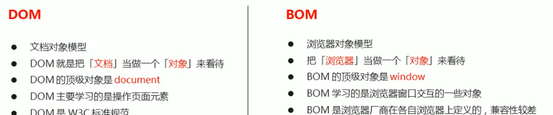

#### BOM的构成
BOM 比 DOM 更大，它包含DOM。
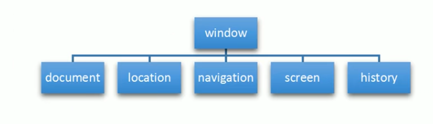
<strong>window对象是浏览器的顶级对象，</strong>它具有双重角色。 <br />

+ 它是JS访问浏览器窗口的一个接口。
+ 它是一个全局对象，定义在全局作用域的变量，函数都会变成window对象的属性和方法。
+ 在调用的时候可以省略window，前面学习的对话框都属于window对象方法，如alert()、prompt()等。

:::warning 注意
window下的一个特殊熟悉了 window.name
:::

### window 对象的常见事件
#### 窗口加载事件
<strong>window.onload = function() {}; 或者 window.addEventListener('load', function() {}); </strong> <br />
window。onload 是窗口（页面）加载事件，当文档内容完全加载完成会触发该事件（包括图像、脚本文件、CSS文件等），就调用的处理函数。 <br />

```html
  <script>
    window.onload = function() {
      var btn = document.querySelector('button');
      btn.addEventListener('click', function() {
        alert('欢迎进入我的页面！')
      })
    }
  </script>
  <button>点击</button>
```
:::warning 注意
有了window.onload 就可以把JS代码写到页面元素的上方，因为onload是等页面内容全部加载完毕，再去执行处理函数。 <br />
window.onload 传统注册事件注册方式只能写一次，如果有多个，后以最后一个window.onload为准。 <br />
如果使用addEventListener 怎没有限制。
:::

<strong> document.addEventListener('DOMContentLoaded', function() {})</strong> <br />
DOMContentLoaded 事件触发时，仅当DOM加载完成，不包括样式，图片，flash等等。IE9+ 才支持。加载速度比load快一点点 <br />
如果页面的图片非常多，从用户访问到onload触发可能需要较长事件，交互效果就不能实现，必然影响用户的体验，此时用DOMContentLoaded事件比较合适。 <br />
```html
  <script>
    document.addEventListener('DOMContentLoaded', function() {
      var btn = document.querySelector('button')
      btn.addEventListener('click', function() {
        alert('欢迎来到我的页面！');
      })
    })
  </script>
  <button>点击</button>
```

#### 调整狂口大小事件
+ window.onresize = function() {}
+ window.addEventListener('resize' function() {})

window.inresize 是调整窗口大小加载事件，当触发时就调用的处理函数。 <br />
:::warning 注意
只要窗口大小发生像素变化，就会触发这个事件。 <br />
经常利用这个事件完成响应式布局，window.innerWidth 当前屏幕的宽度。
:::
```html
  <div></div>
  <script>
    var div = document.querySelector('div');
    window.addEventListener('resize', function() {
      // console.log(window.innerWidth);
      if (window.innerWidth <= 800) {
        div.style.display = 'none';
      } else {
        div.style.display = 'block';
      }
    })
  </script>
```

### 定时器
window 对象给我们提供了2个非常好用的方法---定时器 <br />
+ setTimeout()
+ setInterval()

#### setTimeout() 定时器
```html
window.setTimeout(调用函数,[延迟的毫秒数]);
```
setTimeout() 方法用于设置一个定时器，该定时器在定时器到期后执行调用函数。 <br />
```html
  <script>
    setTimeout(function() {
      console.log('时间到了')
    }, 2000);
    // 在函数内容多的时候可以写函数名
    function fn() {
      console.log('时间到了')
    };
    var timeer1 = setTimeout(fn, 2000);
    var timeer2 = setTimeout(fn, 3000);
    // 或者下面这样调用
    setTimeout('fn()', 2000);// 不提倡这种写法
  </script>
```
:::tip 提示
这个window在调用的时候可以省略。 <br />
这个延时时间单位是毫秒，也可以省略，如果省略默认是0。 <br />
这个调用函数可以直接写函数，也可以写函数名。<br />
页面中可能有很多的定时器，经常给定时器加标识符 （名字）
:::
##### 回调函数
setTimeout() 这个调用函数我们也称为回调函数callback <br />
普通函数就是按照代码顺序直接调用。 <br />
而这个函数，需要等待时间，时间到了才会去调用这个函数，因残称为回调函数。 <br />
简单理解：回调，就是回头调用的意思，上一件事干完，再回头调用这个函数。 <br />
element.onclick = function() 或者 element.addEventListener('click', fn),里面的函数也是回调函数。 <br />

<strong> 案例：5秒后自动关闭广告 <br />

```html
  <script>
    window.addEventListener('load', function() {
      var div = document.querySelector('div');
      setTimeout(function() {
        div.style.display = 'none';
      }, 3000);
    })
  </script>
  <div></div>
```
#### 停止 setTimeout() 定时器
```
window.clearTimeout(timeoutID);
```
```html
  <script>
    window.addEventListener('load', function() {
      var btn = document.querySelector('button');
      var times = setTimeout(function() {
        console.log('爆炸了！')
      }, 3000);
      btn.addEventListener('click', function() {
        clearTimeout(times);
      })
    })
  </script>
  <button>点击停止</button>
```
:::warning 注意
window 可以省略 <br />
里面的参数就是定时器的标识符。
:::

#### setInterval() 定时器
```html
window.setInterval(回调函数，[间隔的毫秒数]);
```
setInterval() 方法重复调用一个函数，每隔这个时间，就去调用一次回调函数。 <br />
:::warning 注意
window 可以省略 <br />
这个调用函数可以直接写函数，或者写函数名，或者采取字符串'函数名('三种形式。 <br />
间隔的毫秒数可以省略默认是0，如果写，必须是毫秒，表示每间隔多少毫秒就自动调用这个函数。 <br />
因为定时器可能会有很多，所以可以给定时器赋值一个标识符。
:::
```html
<script>
  setInterval(function() {
    console.log('继续输出');
  }, 3000);
</script>
```
<strong> 案例： 倒计时 </strong>

```html
  <div>
    <span class="hour"></span>
    <span class="mintue"></span>
    <span class="second"></span>
  </div>
  <script>
    var hour = document.querySelector('.hour');
    var mintue = document.querySelector('.mintue');
    var second = document.querySelector('.second');
    var inputTime = +new Date('2021-5-4 18:00:00'); // 返回的是用户输入时间的总毫秒数
    countDown();
    function countDown() {
      var nowTime = +new Date(); // 返回的是当前时间总毫秒数
      var times = (inputTime - nowTime) / 1000; // 把剩余时间的毫秒转换成秒
      var h = parseInt(times / 60 / 60 % 24); // 时
      h = h < 10 ? '0' + h : h;
      hour.innerHTML = h;
      var m = parseInt(times / 60 % 60); // 分
      m = m < 10 ? '0' + m : m;
      mintue.innerHTML = m;
      var s = parseInt(times % 60); // 秒
      s = s < 10 ? '0' + s : s;
      second.innerHTML = s;
    }
    setInterval(countDown, 1000)
  </script>
```

##### 停止 setInterval() 定时器
```html
window.clearInterval(intervalID);
```
:::warning 注意
window 可以省略 <br />
里面的参数就是定时器的标识符。
:::
```html
  <button class="begin">开启计时器</button>
  <button class="stop">关闭计时器</button>
  <script>
    var begin = document.querySelector('.begin');
    var stop = document.querySelector('.stop');
    var timeer = null; // 全局变量，null是一个空对象
    begin.addEventListener('click', function() {
      timeer = setInterval(function() {
        console.log('计时开始');
      }, 1000)
    })
    stop.addEventListener('click', function() {
      clearInterval(timeer);
    })
  </script>
```

<strong> 案例： 发短信 </strong>

```html
  <div>
    <textarea name="text" id="" cols="30" rows="10"></textarea>
    <button>发送</button>
  </div>
  <script>
    var button = document.querySelector('button');
    button.addEventListener('click', function() {
      button.disabled = true;
      var flag = 60;
      var timer = setInterval(function() {
        if (flag == 0) {
          clearInterval(timer);
          button.innerHTML = '发送';
          button.disabled = false;
        } else {
          button.innerHTML = '还剩下' + flag + '秒ß';
          flag--;
        }
      }, 1000);
    })
  </script>
```
#### this 指向问题
this的指向在函数定义的时候是确定不了的，只有函数执行的时候才能确定this到底指向谁，一般情况下this的最终指向的是哪个调用它的对象。 <br />
##### 全局作用域或者普通函数中this指向全局对象window（注意定时器里面的this指向window）
```html
  <script>
    var button = document.querySelector('button');
    console.log(this)
    function fn() {
      console.log(this); // window
    }
    fn(); // window
  </script>
```

##### 方法通用中谁调用this，指向谁
```html
  <script>
    var o = {
      sayHi : function() {
        console.log(this); // this 指向的是 o这个对象
      }
    }
    o.sayHi();
  </script>
```
```html
  <button>点击</button>
  <script>
    var o = {
      sayHi : function() {
        console.log(this); // this 指向的是 o这个对象
      }
    }
    var btn = document.querySelector('button');
    btn.addEventListener('click', function() {
      console.log(this); // 指向这个按钮
    })
  </script>
```
##### 构造函数中的this指向构造函数的实例对象
```html
  <script>
    function Fn() {
      console.log(this); // this 指向的是fun，实例对象
    }
    var fun = new Fn();
  </script>
```

### JS执行机制
#### JS是单线程
JavaScript语言的一大特点就是单线程，也就是说，同一个时间只能做一件事情，这是因为JavaScript这门脚本语言诞生的使命所致----JavaScript是为处理页面中用户的交互，以及操作DOM而诞生的，比如我们对某个DOM元素进行添加和删除操作，不能同时进行。应该先进行添加，之后再删除。 <br />
<br />
单线程就意味着，所有的任务需要排队，前一个任务结束，才会执行后一个任务，这样所导致的问题是：如果JS执行的时间过长，这样就会造成页面的渲染不连贯，导致页面渲染加载阻塞的感觉。 <br />

#### 同步和异步
为了解决这个问题，利用多核cpu的计算能力，HTML5提出Web Woeker 标准，允许JavaScript脚本创建多个线程。于是出现了同步和异步。<br />
<strong> 同步 </strong>
第一个任务结束后再执行后一个任务，程序的执行顺序于任务的排列顺序是一致的、同步的。 <br />
比如：做饭的同步做法：我们要烧水煮饭，等水开了（10分钟之后），再去切菜，炒菜。 <br />

<strong> 异步 </strong>
你在做一件事时，因为这件事情会花费很长时间，在做这件事的同时，你还可以去处理其他的事情。 <br />
比如：做饭的异步做法，在烧水的同时，利用这10分钟，去切菜、炒菜。 <br />

:::tip
他们的本质区别：这条流水线上各个流程的执行顺序不同。
:::
<strong>第一个问题 </strong>

```html
  <script>
    console.log(1);
    setTimeout(function() {
      console.log(2);
    }, 0)
    console.log(3);
    // 顺序是 1 ， 3， 2 
  </script>
```
#### 同步任务
同步任务都在主线上执行，形成一个执行栈。

#### 异步任务
JS的异步是通过回调函数实现的 <br />
一般而言，异步任务有以下三种类型： <br />
+ 普通事件，如：click，resize等
+ 资源加载，如：load，error等
+ 定时器，包括setInterval，setTimeout

异步任务相关回调函数添加到任务队列中（任务队列也称为消息队列） <br />

#### JS 执行机制
先执行，执行栈中的同步任务 <br />
异步任务（回调函数），放入任务队列中。 <br />
一旦执行栈中的所有同步任务执行完毕，系统就会按次序读取任务队列中的异步任务，于是被读取的异步任务结束等待状态，进入执行栈，开始执行。<br />
:::tip 提示
由于主线程不断的重复获得任务，执行任务，在获取任务，在执行，所以这种机制被称为事件循环（event loop）。 <br />
:::

 
### location 对象
#### 什么事location 对象
window对象给我们提供了一个location 属性，用于获取或设置窗体的URL，并且可以用于解析URL。因此这个属性返回的是一个对象，所以我们将这个对象也称为location对象。 <br />

#### URL
统一资源定位符是互联网上标准资源的地址，互联网上的每个文件都有一个唯一的URL，它包含的信息指出文件的位置以及浏览应该怎么处理它。 <br />
URL 一般语法格式为：
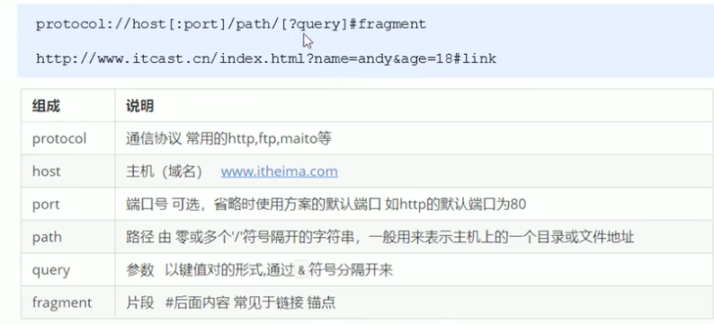

#### location 对象的属性
+ location.href：获取或者设置整个URL
+ location.host：返回主机（域名）
+ location.post：返回端口号，如果未填写返回 空字符串
+ loaction.pathname：返回路径
+ loaction.search：返回参数
+ loaction.bash:返回片段，#后面内容 常见于链接锚点。

```html
  <button>点击</button>
  <script>
    var btn = document.querySelector('button');
    btn.addEventListener('click', function() {
      location.href = 'http://www.baidu.com';
    })
  </script>
```
<strong> 案例：5秒后自动跳转页面 </strong>

```html
  <div></div>
  <script>
    var div = document.querySelector('div');
    var flag = 5;
    setInterval(function() {
      if (flag == 0) {
        location.href = 'http://www.baidu.com';
      } else {
        div.innerHTML = flag;
        flag--;
      }
    }, 1000);
  </script>
```

<strong> 案例：获取URL参数数据 </strong>
```html
<!-- 登录页面 -->
  <form action="index.html">
    <h1>登录</h1>
    <input type="text" name="username">
    <button>登录</button>
  </form>
<!-- 主页 -->
  <h1>主页</h1>
  <p></p>
  <script>
    console.log(location.search); // ?username=andy
    // 先去掉问号 substr('起始的位置', '截取几个字符')
    var parmas = location.search.substr(1);
    // 利用 = 把字符串分割为数组 split('=');
    var user = parmas.split('=');
    var p = document.querySelector('p');
    p.innerHTML = user[1] + ' 欢迎，进入本页面。';
  </script>
```

#### location 对象的方法
+ location.assign():跟href 一样，可以跳转页面（也称为重定向页面）

```html
  <button>点击</button>
  <script>
    var btn = document.querySelector('button');
    btn.addEventListener('click', function() {
      location.assign('https://baidu.com');
    })
  </script>
```
+ location.replace()：替换当前页面，因为不记录历史，所以不能回退页面。

```html
  <button>点击</button>
  <script>
    var btn = document.querySelector('button');
    btn.addEventListener('click', function() {
      location.replace('https://baidu.com');
    })
  </script>
```
+ location.reload()：重新加载页面，相当于刷新按钮或者 f5 如果参数为true 强制刷新ctrl + f5

```html
  <button>点击</button>
  <script>
    var btn = document.querySelector('button');
    btn.addEventListener('click', function() {
      location.reload();
    })
  </script>
```
### navigator 对象
nacigator对象包含有关浏览器的信息，它有很多属性，我们通常用的是userAgent，该属性可以返回有客户机发送服务器的user-agent头部值。 <br />
下面前端代码可以判断用户哪个终端打开页面，实现跳转。 <ve />
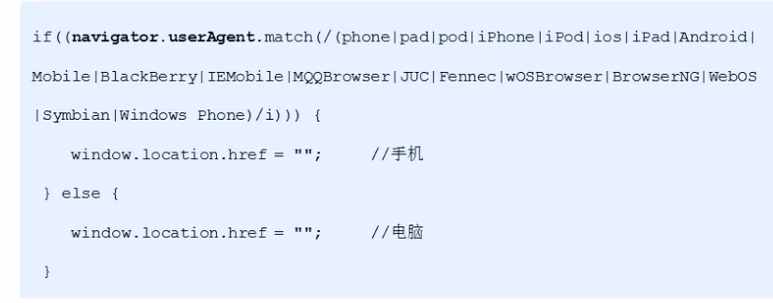

### history 对象
window 对象给我们提供了一个 histiry对象，与浏览器历史记录进行交互。该对象包含用户（在浏览器窗口中）访问过的URL。 <br />
+ back()：可以后退功能

```html
  <a href="index.html">点击去往首页</a>
  <button>返回</button>
  <script>
    var btn = document.querySelector('button');
    btn.addEventListener('click', function() {
      history.back();
    })
  </script>
```
+ forward()：前进功能

```html
  <a href="list.html">点击去往下一页</a>
  <button>前进</button>
  <script>
    var btn = document.querySelector('button');
    btn.addEventListener('click', function() {
      history.forward();
    })
  </script>
```
+ go(参数):前进后退功能，参数如果是1，前进一个页面，-1后退一个页面。


