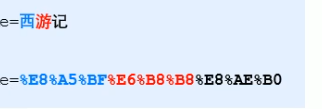
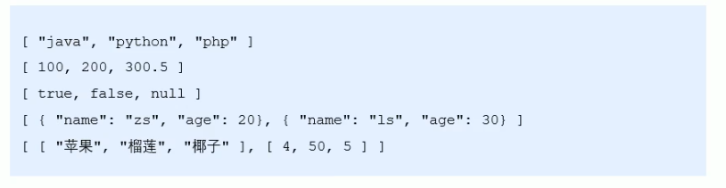
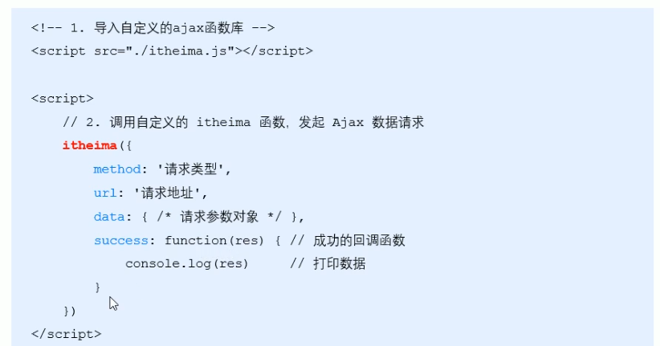
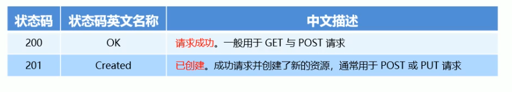

## 服务器的基本概念与初始 Ajax

### 客户端与服务器

#### 上网的目的

上网的本质目的：通过互联网的形式来获取和消费资源。 <br />

#### 服务器

上网过程中，负责存放和对外提供资源的电脑，叫做服务器。 <br />

#### 客户端

上网过程中，负责获取和消费资源的电脑，叫做客户端。 <br />

### URl 地址

#### URL 地址的概念

URL，中文叫统一资源定位符，用于标识互联网上每个资源的唯一存放位置，浏览器只有通过 URL 地址，才能正确定位资源的存放位置，从而成功访问到对应的资源。 <br />

- 常见的 URL 举例

http://www.baidu.com

#### URL 地址的组成部分

URL 地址一般由三部分组成： <br />

- 客户端与服务器之间的通信协议 https:// 或 http://
- 存储该资源的服务器名称 /www.baidu.com/
- 资源在服务器上具体的存放位置 /index.html

### 分析网页的打开过程

#### 图解客户端与服务器的通信过程


:::warning 注意
客户端与服务器之间的通信过程，分为 请求 - 处理 - 响应 三个步骤。 <br />
网页中的每一个资源都是通过 请求 - 处理 - 响应的方式从服务器获取回来的。 <br />
:::

#### 基于浏览器的开发者工具分析通信过程

- 打开了 Chrome 浏览器
- 打开网页开发者工具
- 切换到 Network 面板
- 选中 Doc 页签
- 刷新页面，分析客户端与服务器的通信过程

### 服务器对外提供了哪些资源

#### 例举网页中常见的资源

文字内容，image 图片，Audio 音频，Video 视频

#### 数据也是资源

网页中的数据，也是服务器对外提供的一种资源，例如股票数据、各行各业排行榜等。<br />

#### 数据是网页的灵魂

- HTML 是网页的骨架
- CSS 是网页的颜值
- JavaScript 是网页的行为
- 数据，则是网页的灵魂

:::tip 提示
骨架、颜值、行为皆为数据服务 <br />
数据，在网页中无处不在
:::

#### 网页中如何请求数据

如果要在网页中请求服务器上的数据资源，则需要用到 XMLHttpRequest 对象。 <br />
XMLHttpRequest (简称 xhr) 是浏览器提供的 js 成员，通过它，可以请求服务器上的数据资源。 <br />
最简单的用法：var xhrObj = new.XMLHttpRequest() <br />

#### 资源的请求方式

客服端请求服务器时，请求的方式有很多种，最常见的两种请求方式分别为 get 和 post 请求。 <br />

- get 请求通常用于获取服务器资源 （向服务器要资源） <br />
  例如：根据 URL 地址，从服务器获取 HTML 文件，css 文件，js 文件，图片文件，数据资源等。 <br />
- post 请求通常用于向服务器提交数据（往服务器发送资源）
  例如：登录时向服务器提交的登录信息，注册时向服务器提交的注册信息，添加用户时向服务器提交的用户信息等各种数据提交操作。 <br />

### 了解 Ajax

Ajax 的全称是（AsynChronous Javascript And XML）（异步 JavaScript 和 XML） <br />
通俗的理解：在网页中利用 XMLHttpRequest 对象和服务器进行数据交互的方式，就是 Ajax。 <br />

#### 为什么要学 Ajax

之前所学的技术，只能把网页做的更美观漂亮，或者添加一些动画效果，但是，Ajax 能让我们轻松实现网页与服务器之间的数据交互。 <br />

用户 <-- 交互 --> 网页，数据载体（Ajax）<-- 数据传输 --> 服务器

#### Ajax 的典型应用场景

用户名检测：注册用户时，通过 Ajax 的形式，动态检测用户名是否被占用。 <br />
搜索提示：当输入搜索关键字时，通过 Ajax 的形式，动态加载搜索提示列表。 <br />
数据分页显示：当点击页码值的时候，通过 Ajax 的形式，根据页码值动态刷新表格的数据。 <br />
数据的增删改查：数据的添加、删除、修改、查询操作，都需要通过 ajax 的形式，来实现数据的的交互。 <br />

### jQuery 中的 Ajax

#### 了解 jQuery 中的 Ajax

浏览器中提供了 XMLHttpReqest 用法比较复杂，所以 jQuery 对 XMLHttpRequest 进行了封装，提供了一系列 Ajax 相关的函数，极大地降低了 Ajax 的使用难度。 <br />

jQuery 中发起 Ajax 请求最常用的三个方法如下：

```
$.get() 获取数据
$.post() 提交数据
$.ajax() 可以从服务器获取数据也可以提交数据
```

#### $.get() 函数语法

jQuery 中 get() 函数的功能单一，专门用来发起 get 请求，从而将服务器上的资源请求到客户端来进行使用。 <br />
$.get() 函数的语法如下： <br />

```js
$.get(url, [data], [callback])
```

- url：string, 要请求的资源地址
- data：object，要请求资源期间要携带的参数
- callback：function，请求成功时的回调函数

#### $.get() 发起不带参数的请求

使用$.get() 函数发起不带参数的请求时，直接提供请求的 URL 地址，和请求成功之后的回调函数即可，。 <br />
实例如下： <br />

```js
$.get("http://www.liulongbin.top:3006/api/getbooks", funcrion(res) {
  console.log(res) // 这里的res是服务器返回的数据
})
```

#### $.get()发起带参数的请求

使用 $.get() 函数发起带参数的请求时，示例代码如下。 <br />

```js
$.get("http://www.liulongbin.top:3006/api/getbooks",{id: 1}, funcrion(res) {
  console.log(res)
})
```

#### $.post() 函数的语法

jQuery 中$.post() 函数的功能单一，专门用来发起 post 请求从而向服务器提交数据。 <br />

$.post() 函数的语法如下： <br />

```js
$.post(url, [data], [callback])
```

- url：string, 提交数据的地址
- data：object，要提交的数据
- callback：function，数据提交成功时的回调函数

#### $.post() 向服务器提交数据

```js
$.post(
  'http://www.liulongbin.top:3006/api/getbooks', // 提交地址
  {
    id: 232,
    bookname: '水浒传哈',
    author: '施耐庵1',
    publisher: '上海图书出版社1',
  }, // 提交数据
  function (res) {
    // 回调函数
    console.log(res)
  }
)
```

#### $.ajax()函数的语法

相比于$.get() 和 $.post() 函数，jQuery 中提供的 $.ajax() 函数，是一个功能比较综合的函数，它允许我们对 Ajax 请求进行更详细的配置。 <br />

ajax() 函数的基本语法如下： <br />

```js
$.ajax({
  type: '', // 请求的方式，例如 get 或 post
  url: '', // 请求的url地址
  data: '', // 这次请求要携带的数据
  success: function (res) {}, // 请求成功之后的回调函数
})
```

#### 使用$.ajax() 发起 GET 请求

使用 ajax() 发起 GET 请求时，只需要将’type 属性‘的值设置为’GET‘即可。 <br />

```js
$.ajax({
  type: 'GET', // 请求的方式，例如 get 或 post
  url: 'http://www.liulongbin.top:3006/api/getbooks', // 请求的url地址
  data: 'id: 1', // 这次请求要携带的数据
  success: function (res) {
    console.log(res)
  }, // 请求成功之后的回调函数
})
```

#### 使用$.ajax() 发起 POST 请求

使用 ajax() 发起 GET 请求时，只需要将’type 属性‘的值设置为’POST‘即可。 <br />

```js
$.ajax({
  type: 'POST',
  url: 'http://www.liulongbin.top:3006/api/addbook',
  data: { id: 4, bookname: '有人吗', author: '有人吗', publisher: '有人吗' },
  success: function (res) {
    console.log(res)
  },
})
```

### 接口

#### 接口的概念

使用 Ajax 请求数据时，被请求的 URL 地址，就叫做数据接口（简称：接口）。同时，每个接口必须有请求方式。 <br />
例如：<br />

```
http://www.liulongbin.top:3006/api/getbooks  获取图书列表的接口（GET请求）
http://www.liulongbin.top:3006/api/addbook  添加图书的接口（POST请求）
```

#### 分析接口的请求过程

##### 通过 GET 方式请求接口的过程


##### 通过 POST 方式请求接口的过程


#### 接口测试工具

##### 什么是接口测试工具

为了验证接口是否被正常访问，我们尝尝使用接口测试用具，来对数据接口进行检测。 <br />
好处：接口测试工具让我们在不写任何代码的情况下，对接口进行调用和测试。 <br />

##### 下载并安装 PostMan

<a href="https://www.postman.com/downloads/" target="_bloack">PostMan 官网</a><br />

##### 了解 PostMan 界面的组成部分

PostMan 界面的组成部分，从上到下，从左到右，分别是：<br />

- 菜单栏
- 工具栏
- 左侧历史记录与集合面板
- 请求页签
- 请求地址区域
- 请求参数区域
- 相应结果区域
- 状态栏

#### 使用 PostMan 测试 GET 接口

步骤：<br />

- 选择请求的方式
- 填写请求的 URL 地址
- 填写请求的参数
- 点击 Send 按钮发起 GET 请求
- 查看服务器响应的结构

#### 使用 PostMan 测试 POST 接口

- 选择请求的方式
- 填写请求的 URL 地址
- 选择 Body 面板并勾选数据格式
- 填写要发送到服务器的数据
- 点击 Send 按钮发起 POST 请求
- 查看服务器响应的结构

#### 接口文档

##### 什么是接口文档

接口文档，顾名思义就是接口的说明文档，它是我们调用接口的依据。好的接口文档包含了对接口 URL，参数以及输出内容的说明，我们参照接口文档就能方便的知道接口的作用，以及接口如何进行调用。 <br />

##### 接口文档的组成部分

接口文档可以包含很多信息，也可以按需求进行精简，不过，一个合格的接口文档，应该包含以下 6 项内容，从而为接口的调用提供依据。 <br />

- 接口名称：用来标识各个接口的简单说明，如登录接口，获取图书列表接口等。
- 接口 URL：捷豹的调用地址。
- 调用方式：接口的调用方式，如 GET 和 POST
- 参数格式：接口需要传递的参数，每个参数必须包含参数名称、参数类型、是否必选、参数说明这 4 项内容。
- 响应格式：接口的返回值的详细描述，一般包含数据名称、数据类型，说明 3 项内容。
- 返回实例（可选）：通过对象的形式，例举服务器返回数据的结构。

##### 接口文档示例


### 案例 -- 图书管理

```html
<body style="padding: 15px;">
  <!-- 添加图书的panel面板 -->
  <div class="panel panel-primary">
    <div class="panel-heading">
      <h3 class="panel-title">添加新图书</h3>
    </div>
    <div class="panel-body form-inline">
      <div class="input-group">
        <div class="input-group-addon">书名</div>
        <input
          type="text"
          class="form-control"
          id="iptbookname"
          placeholder="请输入书名"
        />
      </div>
      <div class="input-group">
        <div class="input-group-addon">作者</div>
        <input
          type="text"
          class="form-control"
          id="iptAuthor"
          placeholder="请输入作者"
        />
      </div>
      <div class="input-group">
        <div class="input-group-addon">出版社</div>
        <input
          type="text"
          class="form-control"
          id="iptPublisher"
          placeholder="请输入出版社"
        />
      </div>
      <button id="btnAdd" class="btn btn-primary">添加</button>
    </div>
  </div>

  <!-- 图书的表格 -->

  <table class="table table-bordered table-hover">
    <thead>
      <tr>
        <th>id</th>
        <th>书名</th>
        <th>作者</th>
        <th>出版社</th>
        <th>操作</th>
      </tr>
    </thead>
    <tbody id="tb"></tbody>
  </table>
  <script>
    $(function () {
      // 获取图书列表的数据
      function getBookList() {
        $.get('http://www.liulongbin.top:3006/api/getbooks', function (res) {
          if (res.status != 200) {
            return alert('获取图书失败')
          }
          var rows = []
          $.each(res.data, function (i, item) {
            rows.push(
              '<tr><td class="dataid">' +
                item.id +
                '</td><td>' +
                item.bookname +
                '</td><td>' +
                item.author +
                '</td><td>' +
                item.publisher +
                '</td><td><a href="javascript:;" class="del" >删除</a></td></tr>'
            )
          })
          $('#tb').empty().append(rows.join(''))
        })
      }
      getBookList()
      setInterval(function () {
        getBookList()
      }, 3000)
      // 通过代理的方式为动态生成的元素绑定点击事件
      $('tbody').on('click', '.del', function () {
        // var id = $(this).attr("data-id");
        console.log($(this))
        var id = $(this).parent().siblings('.dataid').html()
        console.log(id)
        $.get(
          'http://www.liulongbin.top:3006/api/delbook',
          { id: id },
          function (res) {
            if (res.status != 200) {
              return alert('删除图书失败')
            }
            getBookList()
          }
        )
      })
      $('#btnAdd').on('click', function () {
        var bookname = $('#iptbookname').val().trim()
        var author = $('#iptAuthor').val().trim()
        var publisher = $('#iptPublisher').val().trim()
        if (
          bookname.length <= 0 ||
          author.length <= 0 ||
          publisher.length <= 0
        ) {
          return alert('请填写完整的图书信息！')
        }
        $.post(
          'http://www.liulongbin.top:3006/api/addbook',
          {
            bookname: bookname,
            author: author,
            publisher: publisher,
          },
          function (res) {
            if (res.status != 201) {
              return alert('添加图书失败')
            }
            getBookList()
            $('#iptbookname').val('')
            $('#iptAuthor').val('')
            $('#iptPublisher').val('')
          }
        )
      })
    })
  </script>
</body>
```

### 案例 -- 聊天机器人

实现的步骤：<br />

- 梳理案例的代码结构
- 将用户输入的内容渲染到聊天窗口
- 发起请求获取聊天消息
- 将机器人的聊天内筒转换为语音
- 通过< audio >播放语音
- 使用回车键发送消息

#### 梳理案例的代码结构

- 梳理页面的 UI 布局
- 将业务代码抽离到 chat,js 中
- 了解 resetul()函数的作用

```
需要用到两个接口
聊天机器人接口：http://www.liulongbin.top:3006/api/robot
文字转换语音接口:http://www.liulongbin.top:3006/api/synthesize
```

## form 表单与模板引擎

### form 表单的基本使用

#### 什么是表单

表单在网页中主要负责数据采集功能。HTML 中的< form > 标签，就是用于采集用户输入的信息，并通过< form> 标签的提交操作，把采集到的信息提交到服务器端进行处理。 <br />

#### 表单的组成部分

表单是由三个基本部分组成的： <br />

- 表单标签
- 表单域：包含文本框、密码框、隐藏域、多行文本框、复选框、单选框、下拉选择框和文件上传框等。 <br />
- 表单按钮

#### <form> 标签属性

form 标签用来采集数据，form 标签的属性则是用来规定如何把采集到的数据发送到服务器。 <br />

- action: url 地址，规定当提交表单时，向何处发送表单数据。
- method：get 或 post，规定以何种方式把表单数据提交到 action url
- enctype：application/x-www-form-irlencoded、multipart/form-data、text/plain , 规定在发送表单数据之前如何对其编码。
- target：\_blanck/\_self/\_parent/\_top/franmename, 规定在何处打开 action URL

##### action

action 属性用来规定当提交表单时，向何处发送表单数据。 <br />
action 属性的值应该是后端提供的一个 URL 地址，这个 URL 地址专门负责接收表单提交过来的数据。 <br />
当 form 表单未指定 action 属性值的情况下，action 的默认值为当前页面的 URL 地址。 <br />

:::warning 注意
当提交表单后，页面会立即跳转到 action 属性指定的 URL 地址
:::

##### target

target 属性用来规定在何处打开 action URL <br />
它的可选值有 5 个，默认情况下，target 的值是\_self,表示在相同的框架中打开 action URL。 <br />

- \_blank：在新窗口中打开
- \_self：默认，在相同框架中打开
- \_parent：在框架集中打开（很少用）
- \_top:在整个窗口中的打开（很少用）
- framename：在指定的框架中打开（很少用）

##### method

method 属性用来规定以何种方式把表单数据提交到 action URL。 <br />
它的可选值有两个，分别是 get 和 post <br />
默认情况下，emthod 的值为 get，表示通过 URL 地址的形式，把表单数据提交到 action URL。 <br />

:::warning 注意
get 方式适合用来提交少量的、简单的数据。 <br />
post 方式适合用来提交大量的、复杂的，或包含文件上传的数据。 <br />
在实际开发中 < form> 表单的 post 提交方式用的最多，很少用 get，例如登录、注册、添加数据等表单操作，都需要使用 post 方式提交表单。 <br />
:::

##### enctype

enctype 属性用来规定在发送表单数据之前如何对数据进行编码。 <br />
它的可选值有三个，默认情况下，enctype 的值为 application/x-www-form-irlencoded，表示在发送前端编码所有的字符。 <br />

- application/x-www-form-irlencoded：发送前编码所有字符（默认）
- multipart/form-data：不对字符编码，在使用包含文件上传控件的表单时，必须使用该值。
- text/plain：空格转换为”+ “加号，但不对特殊字符编码。 （很少用）

:::warning 注意
在涉及到文件上传的操作时，必须将 enctype 的值设置为 multipart/form-data。 <br />
如果表单的提交不涉及到文件上传操作，则直接将 enctype 的值设置为 application/x-www-form-irlencoded 即可。
:::

#### 表单的同步提交及缺点

##### 什么是表单的同步提交

通过点击 submit 电钮，触发表单提交的操作，从而 使页面跳转到 action URL 的行为，叫做表单的同步提交。 <br />

##### 表单同步提交的缺点

- form 表单同步提交后，整个页面会发生跳转，跳转到 action URL 所指向的地址，用户体验很差。
- form 表单同步提交后。页面之前的状态和数据会丢失。

##### 如何解决表单同步提交的缺点

如果使用表单同步提交，导致两个问题：<br />

- 页面会跳转
- 页面之前的状态和数据会丢失

:::tip 解决方案
表单只负责采集数据，Ajax 负责将数据提交到服务器。
:::

### 通过 Ajax 提交表单数据

#### 监听表单提交事件

在 jQuery 中，可以使用以下两种方式，监听到表单的提交事件： <br />

```js
$('#form1').submit(function () {
  alert('监听到了表单的提交事件')
})
$('#form1').on('submit', function () {
  alert('监听到了表单的提交事件')
})
```

#### 阻止表单的默认提交行为

当监听到表单的提交事件以后， 可以调用事件对象的 event.preventDefault() 函数，来阻止表单的提交和页面的跳转。 <br />
示例代码如下：<br />

```js
$('#form1').submit(function (e) {
  // 阻止表单的提交和页面的跳转
  e.preventDefault()
})
$('#form1').on('submit', function (e) {
  // 阻止表单的提交和页面的跳转
  e.preventDefault()
})
```

#### 快速获取表单中的数据

- serialize() 函数
  为了简化表单中数据的获取操作，jQuery 提供了 serialize() 函数，其语法格式如下：<br />

```js
$(selector).serialize()
```

serialize() 函数的好处，可以一次性获取到表单中的所有的数据。 <br />

- serialize() 函数示例

```html
<form action="/login" id="f1">
  <input type="text" name="username" />
  <input type="password" name="password" />
  <button type="submit">提交</button>
</form>
<script>
  $(function () {
    $('#f1').on('submit', function e() {
      e.preventDefault()
      $(this).serialize()
      // 调用结果
      // username=用户名的值 & password=密码值
    })
  })
</script>
```

:::warning 注意
在使用 serialize() 函数款速获取表单数据时，必须为每个表单元素添加 name 属性。
:::

### 案例 -- 评论列表

```html
<body style="padding: 15px;">
  <!-- 评论面板 -->
  <div class="panel panel-primary">
    <div class="panel-heading">
      <h3 class="panel-title">发表评论</h3>
    </div>
    <form class="panel-body" id="formAddcmt">
      <div>评论人：</div>
      <input type="text" class="form-control" name="username" />
      <div>评论内容：</div>
      <textarea class="form-control" name="content"></textarea>
      <button type="submit" class="btn btn-primary">发表评论</button>
    </form>
  </div>

  <!-- 评论列表 -->
  <ul class="list-group" id="cmt-list"></ul>
  <script>
    $(function () {
      function getcommentlist() {
        $.ajax({
          type: 'GET',
          url: 'http://www.liulongbin.top:3006/api/cmtlist',
          success: function (res) {
            if (res.status != 200) {
              return alert('获取评论列表失败')
            }
            var rows = []
            $.each(res.data, function (i, item) {
              var str =
                '<li class="list-group-item"><span class="badge" style="background-color: #f6ac49;">评论时间：' +
                item.time +
                '</span><span class="badge" style="background-color: #52b8e6">评论人：' +
                item.username +
                '</span> ' +
                item.content +
                '</li>'
              rows.push(str)
            })
            $('#cmt-list').empty().append(rows.join(''))
          },
        })
      }
      getcommentlist()
      $('#formAddcmt').submit(function (e) {
        e.preventDefault()
        var data = $(this).serialize()
        $.ajax({
          type: 'POST',
          url: 'http://www.liulongbin.top:3006/api/addcmt',
          data: data,
          success: function (res) {
            if (res == 201) {
              return alert('发表评论失败')
            }
            getcommentlist()
            $('#formAddcmt')[0].reset()
          },
        })
      })
    })
  </script>
</body>
```

### 模板引擎的基本概念

#### 渲染 UI 结构时遇到的问题


上述代码是通过字符串拼接的形式，来渲染 UI 结构。 <br />
如果 UI 结构比较复杂，则拼接字符串的时候需要格外的注意引号之前的嵌套，且一旦需求发生变化，修改起来非常麻烦。 <br />

#### 什么是模板引擎

模板引擎，顾名思义，它可以根据程序员指定的模板结构和数据，自动生成一个完整的 HTML 结构。 <br />


#### 模板引擎的好处

- 减少字符串的拼接操作
- 使代码结构更清晰
- 使代码更易于阅读和维护

### art-template 模板引擎

#### art-template 简介

art-template 是一个简约、超快的模板引擎，<a href="http://aui.github.io/art-template/zh-cn/" target="_blank"> 中国官网首页</a>

#### art-template 的安装

<a href="http://aui.github.io/art-template/zh-cn/docs/installation.html" target="_blank"> art-template 文档</a>

#### art-template 模板引擎的基本使用

##### 使用传统方式渲染 UI 结构


```html
<body>
  <div id="title"></div>
  <div>姓名：<span id="name"></span></div>
  <div>年龄：<span id="age"></span></div>
  <div>会员：<span id="isVIP"></span></div>
  <div>注册时间：<span id="regTime"></span></div>
  <div>
    爱好：
    <ul id="hobby">
      <li>爱好1</li>
      <li>爱好2</li>
    </ul>
  </div>

  <script>
    var data = {
      title: '<h3>用户信息</h3>',
      name: 'zs',
      age: 20,
      isVIP: true,
      regTime: new Date(),
      hobby: ['吃饭', '睡觉', '打豆豆'],
    }

    $(function () {
      $('#name').html(data.name)
      $('#title').html(data.title)
      $('#age').html(data.age)
      $('#isVIP').html(data.isVIP)
      $('#regTime').html(data.regTime)

      var rows = []
      $.each(data.hobby, function (i, item) {
        rows.push('<li>' + item + '</li>')
      })
      $('#hobby').html(rows.join(''))
    })
  </script>
</body>
```

##### art-template 的使用步骤

- 导入 art-template
- 定义数据
- 定义模板
- 调用 template 函数

```html
  <!-- 导入模板引擎 -->
  <!-- 在window全局多了一个函数，叫做template("模板的id",需要渲染的数据对象) -->
  <script src="js/template-web.js"></script>
  <script src="js/jQuery.min.js"></script>
</head>

<body>
  <div id="container"></div>
  <!-- 定义模板 -->
  <!-- 模板的html结构必须定义到 script 标签中 -->
  <!-- 把scipt 里面的代码看在html去解析 -->
  <script type="text/html" id="tpl">
    <h1>{{name}}     ----      {{age}} </h1>
  </script>
  <!-- 默认的是 type="text/javascript"，就是把这个标签内的所有代码看做成js代码去解析 -->
  <script type="text/javascript">
    // 定义需要渲染的数据
    var data = { name: "zs", age: 18 }
    // 调用template函数
    var htmlstr = template('tpl', data)
    console.log(htmlstr);
    // 渲染html结构
    $("#container").html(htmlstr)
  </script>
</body>
```

#### art-template 标准语法

##### 什么是标准语法

art-template 提供了{{}}这种语法格式，在{{}}那可以进行变量输出，或循环数组等操作，这种{{}}语法在 art-template 中标称为标准语法。 <br />

##### 标准语法 - 输出

```
{{value}}
{{obj.key}}
{{obj['key']}}
{{a ? b : c}}
{{a || b}}
{{a + b}}
```

在 {{}} 语法中，可以进行变量的输出，对象属性的输出，三元表达式输出，逻辑或输出，加减乘除等表达式输出。 <br />

##### 标准语法 -- 原文输出

```
{{@ value}}
```

如果要输出的 value 中，包含了 HTML 标签结构，则需要使用原文输出语法，才能保证 HTML 标签被正常渲染。 <br />

```html
<div id="container"></div>
<script type="text/html" id="tpl">
  {{@ test}}
</script>
<script type="text/javascript">
  var data = { test: '<h2>测试原文输出</h2>' }
  var htmlstr = template('tpl', data)
  $('#container').html(htmlstr)
</script>
```

##### 标准语法 -- 条件输出

如果要实现条件输出，则可以在 {{}}中使用 if...else if .../if 的方式。进行按需输出。 <br />

```
{{if value}} 按需求输出的内容 {{/if}}

{{if v1}} 按需求输出的内容 {{else if v2}} 按需求输出的内容 {{/if}}
```

```html
<div id="container"></div>
<script type="text/html" id="tpl">
  {{if flag === 0}} flag = 0 {{else if flag === 1}} flag = 1 {{@ test}} {{/if}}
</script>
<script type="text/javascript">
  var data = { test: '<h2>测试原文输出</h2>', flag: 1 }
  var htmlstr = template('tpl', data)
  $('#container').html(htmlstr)
</script>
```

##### 标准语法 -- 循环输出

如果要实现循环输出，则可以在{{}}内，通过 each 语法循环体数组，当前循环的索引使用 $index 进行访问，当前的循环项使用 $value 进行访问。 <br />

```
{{each arr}}
  {{$index}} {{$value}}
{{/each}}
```

```html
<div id="container"></div>
<script type="text/html" id="tpl">
  {{each hobby}}
  <li>索引是：{{$index}}，循环项： {{$value}}</li>
  {{/each}}
</script>
<script type="text/javascript">
  var data = { hobby: ['吃饭', '睡觉', '写代码'] }
  var htmlstr = template('tpl', data)
  $('#container').html(htmlstr)
</script>
```

输出结果：<br />

```
索引是：0，循环项： 吃饭
索引是：1，循环项： 睡觉
索引是：2，循环项： 写代码
```

##### 标准语法 -- 过滤器


过滤器的本质，就是一个 function 处理函数。 <br />

```
{{value | filterName}}
```

过滤器语法类似于管道操作符，它的上一个输出作为一个输入。 <br />
定义过滤器的基本语法如下：<br />

```
template.defaults.imports.filterName = function(value) {return 处理结果}
```

案例：<br />

```
<div> 注册时间：{{regTime | dataFormat}} </div>
```

```html
<div id="container"></div>
<script type="text/html" id="tpl">
  <h1>注册时间：{{regTime | dateFormat}}</h1>
</script>
<script type="text/javascript">
  // 定义处理时间 的过滤器
  template.defaults.imports.dateFormat = function (data) {
    var y = data.getFullYear()
    var m = data.getMonth() + 1
    var d = data.getDate()
    return y + '-' + m + '-' + d // 注意过滤器最后一定要 return 一个值
  }
  var data = { regTime: new Date() }
  var htmlstr = template('tpl', data)
  $('#container').html(htmlstr)
</script>
```

#### 案例：新闻列表

实现步骤：<br />

- 获取新闻数据
- 定义 template 模板
- 编译模板
- 定义时间过滤器
- 定义时间的补领函数

```html
<div id="news-list"></div>
<script type="text/html" id="tpl-news">
  {{each data}}
  <div class="news-item">
    
    <div class="right-box">
      <h1 class="title">{{$value.title}}</h1>
      <div class="tags">
        {{each $value.tags}}
        <span>{{$value}}</span>
        {{/each}}
      </div>
      <div class="footer">
        <div>
          <span>{{$value.source}}</span>&nbsp;&nbsp;
          <span>{{$value.time | dataformat}}</span>
        </div>
        <span>评论数：{{$value.cmtcount}}</span>
      </div>
    </div>
  </div>
  {{/each}}
</script>
<script>
  $(function () {
    // 定义格式化的时间过滤器
    function padZero(n) {
      // 给时间补充0的函数
      if (n < 10) {
        return '0' + n
      } else {
        return n
      }
    }
    template.defaults.imports.dataformat = function (dtstr) {
      var dt = new Date(dtstr)
      var y = dt.getFullYear()
      var m = padZero(dt.getMonth() + 1)
      var d = padZero(dt.getDate())
      var hh = padZero(dt.getHours())
      var mm = padZero(dt.getMinutes())
      var ss = padZero(dt.getSeconds())
      return y + '-' + m + '-' + d + ' ' + hh + ':' + mm + ':' + ss
    }
    // 获取新闻列表的函数
    function getNewsList() {
      $.ajax({
        type: 'GET',
        url: 'http://www.liulongbin.top:3006/api/news',
        success: function (res) {
          if (res.status !== 200) {
            return alert('获取失败')
          }
          for (var i = 0; i < res.data.length; i++) {
            // 把每一项的tags 属性，从字符串改造成字符串的数组
            res.data[i].tags = res.data[i].tags.split(',')
          }
          console.log(res.data[0].time)
          var data = template('tpl-news', res)
          $('#news-list').append(data)
        },
      })
    }
    getNewsList()
  })
</script>
```

### 模板引擎的实现原理

#### 正则与字符串操作

##### 基本语法

exec() 函数用于检索字符串中的正则表达式的匹配 <br />
如果字符串中有匹配的值，则返回该匹配值，否则返回 null <br />

```
RegExpObject.exec(string)
```

示例代码如下：

```js
var str = 'hello'
var pattern = /o/
console.log(pattern.exec(str))
// 最后输出结果 ["o", index: 4, input: "hello", groups: undefined]
```

##### 分组

正则表达式中() 包起来的内容表示一个分组，可以通过分组来提取自己想要的内容，示例代码如下：<br />

```js
var str = '<div>我是{{name}}</div>'
var pattern = /{{([a-zA-Z]+)}}/
var patternResult = pattern.exec(str)
console.log(patternResult)
// 得到 name 相关信息
// ["{{name}}", "name", index: 7, input: "<div>我是{{name}}</div>", groups: undefined]
```

##### 字符串的 replace 函数

replace() 函数用于在字符串中用一些字符串替换另一些字符，语法格式如下：<br />

```js
var result = '123456'.replace('123', 'abc') // 得到的 result 的值为字符串 ‘abc456’
```

示例代码如下：<br />

```js
var str = '<div>我是{{name}}</div>'
var pattern = /{{([a-zA-Z]+)}}/
var patternResult = pattern.exec(str)
str = str.replace(patternResult[0], patternResult[1])
console.log(str)
// <div>我是name</div>
```

##### 多次 replace

```js
var str = '<div>{{name}}今年{{ age }}岁了</div>'
var pattern = /{{\s*([a-zA-Z]+)\s*}}/
// 第一次匹配
var res1 = pattern.exec(str)
str = str.replace(res1[0], res1[1])
console.log(str) // <div>name今年{{ age }}岁了</div>

str2 = pattern.exec(str)
str = str.replace(str2[0], str2[1])
console.log(str) // <div>name今年age岁了</div>

patternResult = pattern.exec(str)
console.log(patternResult) // null
```

##### 使用 while 循环 replace

```js
var str = '<div>{{name}}今年{{ age }}岁了</div>'
var pattern = /{{\s*([a-zA-Z]+)\s*}}/
var patternResult = null
while ((patternResult = pattern.exec(str))) {
  str = str.replace(patternResult[0], patternResult[1])
}
console.log(str) //  <div>name今年age岁了</div>
```

##### replace 替换为真值

```js
var data = { name: '张三', age: 20 }
var str = '<div>{{name}}今年{{ age }}岁了</div>'
var pattern = /{{\s*([a-zA-Z]+)\s*}}/
var patternResult = null
while ((patternResult = pattern.exec(str))) {
  str = str.replace(patternResult[0], data[patternResult[1]])
}
console.log(str) // <div>张三今年20岁了</div>
```

#### 实现简易的模板引擎

##### 实现步骤

- 定义模板结构
- 预调用模板引擎
- 封装 template
- 导入并使用自定义的模板引擎

##### 定义模板结构


##### 预调用模板引擎


##### 封装 template


```html
<body>
  <div id="user-box"></div>
  <!-- 定义模板结构 -->
  <script type="text/html" id="tpl-user">
    <div>姓名：{{name}}</div>
    <div>年龄：{{ age }}</div>
    <div>性别：{{ gender}}</div>
    <div>住址:{{ address }}</div>
  </script>
</body>

<script>
  // 定义数据
  var data = { name: '张三', age: 28, gender: '男', address: '北京通州' }
  // 调用模板引擎
  var datastr = template('tpl-user', data)
  // 渲染模板结构
  document.getElementById('user-box').innerHTML = datastr

  function template(id, data) {
    var str = document.getElementById(id).innerHTML
    var pattern = /{{\s*([a-zA-Z]+)\s*}}/
    var str1 = null
    while ((str1 = pattern.exec(str))) {
      str = str.replace(str1[0], data[str1[1]])
    }
    return str
  }
</script>
```

## Ajax 加强

### XMLHttpRequest 的基本使用

#### 什么是 XMLHttpReuquest

XMLHttpReuquest（简称：xhr）是浏览器提供的 JavaScript 对象，通过它，可以请求服务器上的数据资源。之前所学的 jQuery 中的 Ajax 函数，就是基于 xhr 对象封装出来的。 <br />


#### 使用 xhr 发起 get 请求

步骤：<br />

- 创建 xhr 对象
- 调用 shr.open()函数
- 调用 xhr.send()函数
- 监听 xhr.onreadystatechange 事件

```js
// 创建xhr对象
var xhr = new XMLHttpRequest()
// 调用open 函数 指定 请求方式 与 URL地址
xhr.open(‘GET’,'URL地址')
// 调用send 函数发起Ajax请求
xhr.send()
// 监听 onreadystatechange 事件
xhr.onreadystatechange = function() {
  // 监听 xhr 对象的请求状态 readyState，与服务器响应的状态 status
  if (xhr.readyState === 4 && xhr.status === 200) {
    // 打印服务器响应回来的数据
    console.log(xhr.responseText)
  }
}
```

```js
// 创建一个shr对象
var xhr = new XMLHttpRequest()
// 调用 open 函数
xhr.open('GET', 'http://www.liulongbin.top:3006/api/getbooks')
// 调用 send 函数
xhr.send()
// 监听onreadystatechange 事件
xhr.onreadystatechange = function () {
  if (xhr.readyState == 4 && xhr.status == 200) {
    console.log(xhr.responseText)
  }
}
```

#### 了解 xhr 对象的 readyState 属性

XMLHttpReuquest 对象的 readyState 属性，用来表示当前 Ajax 请求所处的状态。每个 Ajax 请求必然处于以下状态中的一个。 <br />


#### 使用 xhr 发起带参数的 GET 请求

使用 xhr 对象发起带参数的 GET 请求时，只需在调用 xhr.open() 期间，为 URL 地址指定参数即可。 <br />

```js
// 。。。省略不必要的代码
xhr, open('GET', 'URL地址?id=1')
// 。。。省略不必要的代码
```

:::tip 提示
这个在 URL 地址后面拼接的参数，叫做查询字符串
:::

```js
// 创建一个shr对象
var xhr = new XMLHttpRequest()
// 调用 open 函数
xhr.open('GET', 'http://www.liulongbin.top:3006/api/getbooks?id=1')
// 调用 send 函数
xhr.send()
// 监听onreadystatechange 事件
xhr.onreadystatechange = function () {
  if (xhr.readyState == 4 && xhr.status == 200) {
    console.log(xhr.responseText)
  }
}
```

#### 查询字符串

##### 什么是查询字符串

定义：查询字符串（URL 参数）是指在 URL 的末尾加上用于向服务器发送信息的字符串（变量）。<br />
格式：将英文的 ？ 放在 URL 的末尾，然后再加上参数 = 值，想加上多个参数的话，使用 & 符号进行分隔。以这个形式，可以将想要发送给服务器的数据添加到 URL 中。<br />

示例：<br />

```
// 不带参数
http://www.liulongbin.top:3006/api/getbooks
// 带一个参数的URL地址
http://www.liulongbin.top:3006/api/getbooks?id=1
// 带两个参数的URL地址
http://www.liulongbin.top:3006/api/getbooks?id=1&bookname=西游记
```

##### GET 请求携带参数的本质

无论使用 ajax(),还是使用 get(),又或者直接使用 xhr 对象发起 GET 请求，当需要携带参数的时候，本质上，都是直接将参数以查询字符串的形式，追加到 URL 地址的后面，发送到服务器的。 <br />

```js
$.get('url', { anme: 'xs', age: 20 }, function () {})
// 等价于
$.get('url?name=xs&age=20', function () {})

$.ajax({
  method: 'GET',
  url: 'url',
  data: { name: 'xs', age: 20 },
  success: function () {},
})
// 等价于
$.ajax({ method: 'GET', url: 'url?name=xs&ahe=20', success: function () {} })
```

#### URL 编码与解码

##### 什么是 URL 编码

URL 地址中，只允许出现英文相关的 字母、标点符号、数字，因此，在 URL 地址中不允许出现中文字符。 <br />
如果 URL 中需要包含中文这样的字符，则必须对中文字符进行编码（转义）。<br />
URL 编码的原则：使用安全的字符（没有特殊用途或者特殊意义的可打印字符）区表示那些不安全的字符。 <br />
URL 编码原则的通俗理解，使用英文字符去表示非英文字符。 <br />



##### 如何对 URL 进行编码与解码

浏览器提供了 URL 编码与解码的 API，分别是：<br />

- encodeURI() 编码的函数
- decodeURI() 解码的函数

```js
console.log(encodeURI('黑马程序员'))
// 输出结果 %E9%BB%91%E9%A9%AC%E7%A8%8B%E5%BA%8F%E5%91%98
console.log(decodeURI('%E9%BB%91%E9%A9%AC'))
// 输出结果是 黑马
```

##### URL 编码的注意事项

由于浏览器会自动对 URL 地址进行编码操作，因此，大多数情况下，程序员不需要关系 URL 地址的编码与解码操作。 <br />

#### 使用 xhr 发起 POST 请求

步骤：<br />

- 创建 xhr 对象
- 调用 shr.open()函数
- 设置 Content-Type 属性（固定写法）
- 调用 xhr.send()函数，同时指定要发送的数据
- 监听 xhr.onreadystatechange 事件

```js
// 创建 xhr 对象
var xhr = new XMLHttpReuquest()
// 调用 open()函数
xhr.open('POST', 'URL地址')
// 设置Content-Type 属性 （固定写法）
xhr.setReuquestReader('Content-Type', 'application/x-www-form-urlencoded')
// 调用 send() 函数,同时将数据以查询字符串的形式，提交给服务器
xhr.send('bookname=水浒传&author=施耐庵&publisher=天津图书出版社')
// 监听 onreadystatechange 事件
xhr.onreadystatechange = function () {
  if (xhr.readystate == 4 && xhr.status == 200) {
    console.log(xhr.responseText)
  }
}
```

```js
// 创建 xhr 对象
var xhr = new XMLHttpRequest()
// 调用open() 函数
xhr.open('POST', 'http://www.liulongbin.top:3006/api/addbook')
// 设置 Content-Type 属性
xhr.setRequestHeader('Content-Type', 'application/x-www-form-urlencoded')
// 调用send() 函数
xhr.send('bookname=你好&author=匿名&publisher=Web')
xhr.onreadystatechange = function () {
  if (xhr.readyState === 4 && xhr.status === 200) {
    console.log(xhr.responseText)
  }
}
```

### 数据交换格式

#### 什么是数据交换格式

数据交换格式，就是服务器与客户端之间进行数据传输与交换的格式。 <br />
前端领域，经常以及的两个数据交换格式分别是 XML 和 JSON，其中 XML 用的非常少，所以，我们重点学习数据交换格式就是 JSON。 <br />


#### XML

##### 什么是 XML

XML，及可扩展标记语言，因此，XML 和 HTML 类似，也是一种标记语言。 <br />


##### XML 和 HTML 的区别

XML 和 HTML 虽然都是标记语言但是，它们两者之间没有任何的关系。 <br />

- HTML 被设计用来描述网页上的内容，是网页内容的载体。 <br />
- XML 被设计用来传输和存储数据，是数据的载体。 <br />

##### XML 的缺点

- XML 格式臃肿，和数据无关的代码多，体积大，传输效率低
- 在 JavaScript 中解析 XML 比较麻烦

#### JSOn

##### 什么是 JSON

概念：JSON 的英文全称 JavaScript Object Notation，既‘javascript 对象表示法’。 <br />
简单来讲：JSON 就是 javascript 对象和数组的字符串表示法，它使用文本表示一个 JS 对象或者数组的信息。 <br />
因此：JSON 的本质是字符串。 <br />

作用：JSON 是一种轻量级的文本数据交换格式，在作用上类似 XML，专门存储和传输数据，但是 JSON 比 XML 更小、更快、更易解析。 <br />
现状：JSON 是在 2001 年开始被推广和使用的数据格式，到今为止，JSON 已经成为了主流的数据交换格式。 <br />

##### JSON 的两种结构

JSON 就是通字符串来表示 javascript 的对象和数组。所以，JSON 中包含对象和数组两种结构，通过这两种结构的相互嵌套，可以表示各种复杂的数据结构。 <br />

<strong> 对象结构：</strong> 对象结构在 JSON 中表示为{}括起来的内容，数据结构为{key:value,key:value,...}的键值对结构，其中，key 必须是使用英文的双引号包裹的字符串，value 的数据类型可以是数字、字符串、布尔值、null、数组、对象 6 种类型。 <br />


<strong> 数组结构：</strong> 数组结构在 JSON 中表示为[]括起来的内容。数据结构为["java","javascript",30,true...].数组中的数据的类型可以是数字、字符串、布尔值、null、数组、对象 6 种类型。<br />



##### JSON 语法注意事项

- 属性名必须使用双引号包裹
- 字符串类型的值必须使用双引号包裹
- JSON 中不允许使用单引号表示字符串
- JSON 中不能写注释
- JSON 的最外层必须是对象或者数组的格式
- 不能使用 undefined 或函数作为 JSON 的值

:::tip 提示
JSON 的作用：在计算机与网络之间存储和传输数据。 <br />
JSON 的本质：用字符串来表示 javascript 对象数据或数组数据。
:::

##### JSON 和 JS 对象的关系

JSON 是 JS 对象的字符串表示法，它使用文本表示一个 JS 对象的信息，本质是一个字符串。。例如：<br />

```js
// 这是一个对象
var obj = { a: 'Hello', b: 'World' }
// 这是一个JSON 字符串，本质是一个字符串
var json = '{"a": "Hello", "b": "world"}'
```

##### JSON 和 JS 对象的相互转换

要实现从 JSON 字符串转换为 JS 对象，使用 JSONparse() 方法：<br />

```js
var obj = JSON.parse('{"a": "Hello", "b": "world"}')
console.log(obj)
// 结果是 {a: "Hello", b: "world"}
```

要实现从 JS 对象转换为 JSON 字符串，使用 JSON。stringify()

```js
var json = JSON.stringify({ a: 'Hello', b: 'World' })
console.log(json)
// 结果是 {"a":"Hello","b":"World"}
```

```js
var xhr = new XMLHttpRequest()
xhr.open('GET', 'http://www.liulongbin.top:3006/api/getbooks')
xhr.send()
xhr.onreadystatechange = function () {
  if (xhr.readyState === 4 && xhr.status === 200) {
    var obj = JSON.parse(xhr.responseText)
    console.log(obj)
    console.log(typeof xhr.responseText)
    console.log(xhr.responseText)
  }
}
```

##### 序列化和反序列化

把数据对象转换为字符串的过程，叫做序列化，例如：调用 JSON.stringify()函数的操作，叫做 JSON 序列化。 <br />
把字符串转换为数据对象的过程，叫做反序列化，例如：调用 JSON.parse()函数的操作，叫做 JSON 反序列化。 <br />

### 封装自己的 Ajax 函数

#### 要实现的效果



#### 定义 options 参数选项

itheima() 函函数是我们自定义的 Ajax 函数，它接收一个配置对象作为参数，配置对象中可以配置如下操作； <br />

- method：请求的类型
- url：请求的 url 地址
- data：请求携带的数据
- success：请求成功之后的回调函数

#### 处理 dara 参数

需要把 data 对象，转换成查阅字符串的格式，从而提交给服务器，因此提前定义 resolveData 函数如下：<br />


```js
// 处理data函数
function resolveData(data) {
  var arr = []
  for (k in data) {
    var str = k + '=' + data[k]
    arr.push(str)
  }
  return arr.join('&')
}
var str = resolveData({ name: 'zs', age: 20 })
console.log(str)
```

#### 定义 itheima 函数

在 itheima() 函数中，需要创建 xhr 对象，并监听 onreadystatechange 事件。 <br />


#### 喷段请求的类型

不同的请求类型，对应 xhr 对象的不同操作，因此需要队请求类型进行 if...else...的判断。 <br />


```js
// 处理data函数
function resolveData(data) {
  var arr = []
  for (k in data) {
    var str = k + '=' + data[k]
    arr.push(str)
  }
  return arr.join('&')
}
// 封装 itheoma函数
function itheima(options) {
  var xhr = new XMLHttpRequest()

  // 把外界传进来的参数对象，转换为 查询字符串
  var qs = resolveData(options.data)

  // 喷段请求的类型
  if (options.method.toUpperCase() === 'GET') {
    // 发起GET请求
    xhr.open(options.method, options.url + '?' + qs)
    xhr.send()
  } else if (options.method.toUpperCase() === 'POST') {
    // 发起POST请求
    xhr.open(options.method, options.url)
    xhr.setRequestHeader('Content-Type', 'application/x-www-form-urlencoded')
    xhr.send(qs)
  }
  xhr.onreadystatechange = function () {
    if (xhr.readyState === 4 && xhr.status === 200) {
      var result = JSON.parse(xhr.responseText)
      options.success(result)
    }
  }
}
// 测试封装是否成功
itheima({
  method: 'GET',
  url: 'http://www.liulongbin.top:3006/api/getbooks',
  // data: { id: 1 },
  success: function (res) {
    // if (status !== 200) { return alert('获取数据失败') }
    console.log(res)
  },
})
itheima({
  method: 'POST',
  url: 'http://www.liulongbin.top:3006/api/addbook',
  data: {
    bookname: 'hello',
    author: '匿名',
    publisher: 'web',
  },
  success: function (res) {
    console.log(res)
  },
})
```

### XMLHttpReuquest Levl2 的新特性

#### 旧版 XMLhttpReuquest 的缺点

- 只支持文本数据的传输，无法用来读取和上传文件
- 传送和接收数据时，没有进度信息，只能提示有没有完成

#### XMLHttpReuquest Level2 的新功能

- 可以设置 HTTP 请求的时限
- 可是使用 FormData 对象管理表单数据
- 可以上传文件
- 可以获得数据传输的进度信息

#### 设置 HTTP 请求的时限

有时，Ajax 操作很耗时，而且无法预知要花费多少时间，如果网速很慢，用户可能要等待很久，新版的 XMLHttpReuquest 对象，增加了 timeoutuux;，可以设置 HTTP 请求的时限：<br />

```js
xhr.timeout = 3000
```

上面的语句，将最长等待时间设置为 3000 毫秒，过了这个时限，就自动停止 HTTP 请求。与之配置的还有一个 timeoutuijm，用来指定回调函数。 <br />

```js
xhr.ontimeout = funtion(event) {
  alert('请求超时！')
}
```

```js
var xhr = new XMLHttpRequest()
// 设置超时时间
xhr.timeout = 10
// 设置请求超时的处理函数
xhr.ontimeout = function () {
  alert('请求超时！')
}
xhr.open('GET', 'http://www.liulongbin.top:3006/api/getbooks')
xhr.send()
xhr.onreadystatechange = function () {
  if (xhr.readyState === 4 && xhr.status === 200) {
    console.log(xhr.responseText)
  }
}
```

#### FormData 对象管理表单数据

Ajax 操作往往用来提交表单数据，为了方便表单处理，HTML5 新增了一个 FormData 对象，可以模拟表单操作。 <br />

```js
// 创建FormData实例
var fd = new FormData()
// 调用 append 函数向 fd中追加数据
fd.append('name', 'zs')
fd.append('upwd', '123456')
// 创建 xhr 对象
var xhr = new XMLHttpRequest()
xhr.open('POST', 'http://www.liulongbin.top:3006/api/formdata')
xhr.send(fd)
xhr.onreadystatechange = function () {
  if (xhr.readyState === 4 && xhr.status === 200) {
    console.log(JSON.parse(xhr.responseText))
  }
}
```

FormData 对象也可以用来获取网页表单的值，示例代码如下： <br />

```html
<form id="form1">
  <!-- autocapitalize="off" 取消自动填充的效果 -->
  <input type="text" name="uname" autocapitalize="off" />
  <input type="password" name="upwd" />
  <button type="submit">提交</button>
</form>
<script>
  //  通过DOM操作，获取表单元素
  var form = document.querySelector('#form1')
  form.addEventListener('submit', function (e) {
    // 阻止表单的默认提交行为
    e.preventDefault()
    // 创建FormData， 快速获取表单数据
    var fd = new FormData(form)
    var xhr = new XMLHttpRequest()
    xhr.open('POST', 'http://www.liulongbin.top:3006/api/formdata')
    xhr.send(fd)
    xhr.onreadystatechange = function () {
      if (xhr.readyState === 4 && xhr.status === 200) {
        console.log(JSON.parse(xhr.responseText))
      }
    }
  })
</script>
```

#### 上传文件

新版的 XMLHttpReuquest 对象不仅可以发送文本信息，还可以上传文件。 <br />

实现步骤：<br />

- 定义 UI 结构
- 验证是否选择了文件
- 向 FormData 中追加文件
- 使用 xhr 发起上传文件的请求
- 监听 onreadystatechange 事件

##### 定义 UI 结构

```html
<!-- 文件选择框 -->
<input type="flie" id="file1" />
<!-- 上传文件的按钮 -->
<button id="btnUpload">上传</button>
<br />
<!-- img 标签 来显示上传成功的图片 -->

```

##### 验证是否选择了文件

```js
// 获取文件上传按钮
var btnUpload = document.querySelector('#btnUpload')
// 为按钮绑定单击事件处理函数
btnUpload.addEventListener('click', function () {
  var files = document.querySelector('#file1').files
  if (files.length == 0) {
    return alert('情选取上传的文件')
  } else {
    console.log('ok')
  }
})
```

##### 向 FormData 中追加文件

```js
// 创建FormData对象
var fd = new FormData()
// 将用户选择的文件，添加到FormData中
fd.append('avatar', files[0])
```

##### 使用 xhr 发起上传文件的请求

```js
var xhr = new XMLHttpRequest()
xhr.open('OPST', 'http://www.liulongbin.top:3006/api/upload/avatar')
xhr.send(fd)
```

##### 监听 onreadystatechange 事件

```js
xhr.onreadystatechange = function () {
  if (xhr.readyState === 4 && xhr.status === 200) {
    var data = JSON.parse(xhr.responseText)
    if (data.status === 200) {
      document.querySelector('#img').src =
        'http://www.liulongbin.top:3006' + data.url
    } else {
      console.log(data.message)
    }
  }
}
```

##### 显示文件上传进度

新版本的 XMLHttpReuquest 对象中，可以通过监听 xhr.upload.onprogress 事件，来获取上传文件的上传进度。 <br />
语法格式如下：<br />

```js
var xhr = new XMLHttpRequest()
// 监听文件上传进度
xhr.upload.onprogress = function (e) {
  // e.lengthComputable 是一个布尔值，表示当前上传的资源是否具有可计算的长度
  if (e.lengthComputable) {
    // e.loaded 已传输的字节
    // e.total 需传输的总字节
    var procentComplete = Math.ceil((e.loaded / e.total) * 100)
    console.log(procentComplete)
  }
}
```

##### 导入需要的库

```html
<div class="progress" style="width: 100px; margin: 15px 10px;">
  <div
    class="progress-bar progress-bar-striped active"
    style="width: 0%"
    id="perrcent"
  >
    0%
  </div>
</div>
```

##### 监听上传进度的事件

```js
xhr.upload.onprogress = function (e) {
  // e.lengthComputable 是一个布尔值，表示当前上传的资源是否具有可计算的长度
  if (e.lengthComputable) {
    // e.loaded 已传输的字节
    // e.total 需传输的总字节
    var procentComplete = Math.ceil((e.loaded / e.total) * 100)
    // 动态设置进度条
    $('#perrcent')
      .attr('style', 'width:' + procentComplete + '%')
      .html(procentComplete + '%')
  }
}
```

##### 监听上传完成的事件

```js
// 监听上传完成事件
xhr.upload.onload = function () {
  $('#perrcent').removeClass().addClass('progress-bar progress-bar-success')
}
```

### jQuery 高级用法

#### jQuery 实现文件上传

##### 定义 UI 结构

```html
<div>
  <!-- 文件选择框 -->
  <input type="file" id="file1" />
  <!-- 上传文件的按钮 -->
  <button id="btnUpload">上传</button>
  <!-- bootstrap 中的进度条 -->
  <div class="progress" style="width: 100px; margin: 15px 10px;">
    <div
      class="progress-bar progress-bar-striped active"
      style="width: 0%"
      id="perrcent"
    ></div>
  </div>
  <br />
  <!-- img 标签 来显示上传成功的图片 -->
  
</div>
```

##### 验证是否选择了文件

```js
$(function () {
  $('#btnUpload').on('click', function () {
    var files = $('#file1')[0].files
    if (files.length <= 0) {
      alert('请选择文件')
    } else {
      console.log('ok')
    }
  })
})
```

##### 向 FormData 内追加文件

```js
var fd = new FormData()
fd.append('avatar', files[0])
```

##### 使用 jQuery 发起上传文件的请求

```js
// 发去jQuery Ajax请求上传文件
$.ajax({
  method: 'POST',
  url: 'http://www.liulongbin.top:3006/api/upload/avatar',
  data: fd,
  // 不修改 Content-Type 属性，使用FormData 默认的 Content-Type值
  processData: false,
  // 不对FormData 中的数据进行 url编码，而是将 FormData数据原样发送到服务器
  contentType: false,
  success: function (res) {
    console.log(res)
  },
})
```

#### jQuery 实现 loading 效果

##### ajaxStart（callback）

Ajax 请求开始时，执行 ajaxStart 函数，可以在 ajaxStart 的 callback 中显示 loading 效果，实例代码如下：<br />

```js
// 自jQuery版本1.8起，该方法只能被附加到文档]
$(document).ajaxStart(function)() {
  $('#loading').show()
}
```

:::earning 注意
$(documeng).ajaxStart() 函数会监听当前文档内容所有的 Ajax 请求。
:::

###### ajaxStop(callback)

Ajax 请求结束时，执行 ajaxStop 函数， 可以在 ajaxStop 的 callback 中隐藏 loading 效果，实例代码如下：<br />

```js
$(document).ajaxStop(function () {
  $('#loading').hide()
})
```

### axios

#### 什么是 axios

Axios 是专注于网络数据请求的库。 <br />
相比于原生的 XMLHttpReuquest 对象，axios 简单易用。 <br />
相比于 jQuery，axios 要更加轻量化，只专注于网络数据请求。 <br />

#### axios 发起 GET 请求

axios 发起 GET 请求的语法：<br />

```js
axios.get('url', { params: { 参数 } }).then(callback)
```

具体的请求示例如下:<br />

```html
<button id="btn1">发起GET请求</button>
<script>
  $('#btn1').on('click', function () {
    // 请求时URL地址
    var url = 'http://www.liulongbin.top:3006/api/get'
    // 请求的参数对象
    var paramsObj = { name: '张三', age: 20 }
    // 调用 axios.get() 发起get请求
    axios.get(url, { params: paramsObj }).then(function (res) {
      // res.data 是服务器的数据
      var result = res.data
      console.log(result)
      console.log(res)
    })
  })
</script>
```

#### axios 发起 POST 请求

axios 发起 POST 请求的语法：<br />

```js
axios.post('url', { 参数 }).then(callback)
```

具体的请求示例如下:<br />

```html
<button id="btn1">发起post请求</button>
<script>
  $('#btn1').on('click', function () {
    // 请求时URL地址
    var url = 'http://www.liulongbin.top:3006/api/post'
    // 要提交到服务器的数据
    var dataObj = { loaction: '北京', address: '顺义' }
    // 调用 axios.get() 发起post的请求
    axios.post(url, { dataObj }).then(function (res) {
      // res.data 是服务器的数据
      var result = res.data
      console.log(result)
      console.log(res)
    })
  })
</script>
```

#### 直接使用 axios 发起请求

axios 也提供了 jQuery 中的 ajax()函数，语法如下：<br />

```js
axios({
  method: '请求类型',
  url: '请求的url地址',
  data: { post数据 },
  params: { get数据 },
}).then(callback)
```

##### 直接使用 axios 发起 GET 请求

```js
axios({
  method: 'GET',
  url: 'http://www.liulongbin.top:3006/api/get',
  params: {
    name: '张三',
    age: 20,
  },
}).then(function (res) {
  console.log(res.data)
})
```

##### 直接使用 axios 发起 POST 请求

```js
axios({
  method: 'POST',
  url: 'http://www.liulongbin.top:3006/api/post',
  data: {
    name: '张三',
    age: 20,
  },
}).then(function (res) {
  console.log(res.data)
})
```

## 跨域与 JSONP

### 了解同源策略和跨域

#### 同源策略

##### 什么是同源

如果两个页面的协议，域名和端口都相同，则两个页面具有相同的源。 <br />


##### 什么是同源策略

同源策略（英文全称：Same origin policy） 是浏览器提供的一个安全功能。 <br />
MDN 官方给定的概念：同源策略限制了从同一个源加载的文档或脚本如何与来自另一个源的资源进行交互，这是一个用于隔离潜在恶意文件的重要安全机制。 <br />
通俗的理解：浏览器规定，A 网站的 JavaSCript，不允许和非同源的网站 C 之间，进行资源的交互。例如：<br />

- 无法读取非同源网页的 Cookie、LoaclStorage 和 IndexexdDB
- 无法接触非同源网页的 DOM
- 无法向非同源地址发送 Ajax 请求

#### 跨域

##### 什么是跨域

同源就是两个 URL 的协议、域名、端口一致，反之，则是跨域。 <br />
出现跨域的根本原因：浏览器的同源则略不允许非同源的 URL 之间进行资源的交互。 <br />

```
网页：http://www.test.com/index.html
接口: http://www.api.com/userlist
```

##### 浏览器对跨域请求的拦截


:::warning 注意
浏览器允许发起跨域请求，但是，跨域请求回来的数据，会被浏览器拦截，无法被页面获取到。
:::

##### 如何实现跨域数据请求

如今实现跨域数据请求，最主要的两种解决方案，分别是 JSONP 和 CORS。 <br />

JSONP:出现的早，兼容性好（兼容低版本 IE）。是前端程序员为了解决跨域问题，被迫想出来的一种临时解决方案。缺点是只支持 GET 请求，不支持 POST 请求、 <br />

CORS:出现的较晚，它是 W#C 标准，属于跨域 Ajax 请求的根本解决方案。支持 GET 和 POST 请求，特点是不兼容某些低版本的浏览器。 <br />

### JSONP

#### 什么是 JSONP

JSONP（JSONP with Padding）是 JSON 的一种‘使用模式’，可用于解决主流浏览器的跨域数据访问的问题。 <br />

#### JSONP 的实现原理

由于浏览器同源策略的限制，网页中无法通过 Ajax 请求非同源的接口数据。但是 script 标签不受浏览器同源策略的影响，可以通过 src 属性，请求非同源的 js 脚本。 <br />

因此，JSONP 的实现原理，就是通过 script 标签的 src 属性，请求跨域的数据接口，并通过函数调用的形式，接收跨域接口响应回来的数据。<br />

```html
<!-- 自己的页面代码 -->
<script>
  function success(data) {
    console.log('拿到了Data数据')
    console.log(data)
  }
</script>
<script src="js/getdata.js?callback=abc"></script>
<!-- 服务器的代码 -->
<script>
  abc({
    name: 'zs',
    age: 20,
  })
</script>
```

#### 自己实现一个简单的 JSONP

```html
<script>
  function success(data) {
    console.log('拿到了Data数据')
    console.log(data)
  }
</script>
<script src="http://ajax.frontend.itheima.net:3006/api/jsonp?callback=success&name=ls&age=30"></script>
```

#### JSONP 的缺点

由于 JSONP 是通过，script 标签的 src 属性，来实现跨域数据获取，所以，JSONP 只支持 GET 数据请求，不支持 POST 请求。<br />
:::warning 注意
JSONP 和 Ajax 之间没有任何关系，不能把 JSONP 请求数据的方式叫做 Ajax，因为 JSONP 没有用到 XMLHttpReuquest 这个对象。

#### jQuery 中的 JSONP

jQuery 提供的 ajax 函数，除了可以发起真正的 Ajax 数据请求之外，还能够发起 JSONP 数据请求，例如：<br />

```js
$.ajax({
  url: 'http://www.liulongbin.top:3006/api/jsonp?name=ls&age=30',
  // 如果要使用ajax发起 JSONP请求，必须指定datatype 为jsonp
  dataType: 'jsonp',
  success: function (res) {
    console.log(res)
  },
})
```

:::top 提示
默认情况下，使用 jQuery 发起 JSONP 请求，会自动携带一个 callback=jQeryxxx 的参数，jQueryxxx 是随机生成的一个回调函数名称。
:::

#### 自定义参数及回调函数名称

在使用 jQuery 发起 JSONP 请求时，如果想要自定义 JSONP 的参数以及回调函数名称。可以通过如下两个参数来指定:<br />

```js
// 发送到服务器的参数名称，默认值为callback,一般；情况下不会修改
jsonp: 'callback',
// 自定义的回调函数名称，默认值为 jQueryxxx 格式
jsonpCallback: 'abc'
```

#### jQuery 中 JSONP 的实现过程

jQuery 中的 JSONP，也是通过 script 标签的 xrc 属性实现跨域数据访问的，只不过，jQuery 采用的是动态创建和移除 script 标签的方式，来发起 JSONP 数据请求。 <br />

- 在发起 JSONP 请求的时候，动态向 header 中 append 一个 script 标签
- 在 JSONP 请求成功以后，动态从 header 中移除刚才 append 进去的 script 标签

### 案例- 淘宝搜索

#### 获取用户输入的搜索关键词

为了获取到用户每次按下键盘输入的内容，需要监听输入框的 keyup 事件，示例如下：<br />

```js
// 监听文本框的keyup事件
$('#ipt').on('keyup', function () {
  // 获取用户输入的内容
  var keywords = $(this).val().trim()
  // 判断用户输入的内容是否为空
  if (keywords.length <= 0) {
    // 如果关键词为空，则清空后影藏搜索建议列表
    return $('#suggest-list').empty().hide()
  } else {
    // 伙计建议搜索列表
    getSuggestList(keywords)
  }
})
```

#### 封装 getSuggestList 函数

将获取搜索建议列表的到吗，封装到 getSuggestList 函数中，示例如下：<br />

```js
// 封装getSuggestList 函数
function getSuggestList(kw) {
  $.ajax({
    // 指定请求的URL地址，其中 q是用户输入的关键词
    url: 'https://suggest.taobao.com/sug?q=' + kw,
    // 指定要发起的是 JSONP请求
    dataType: 'jsonp',
    success: function (res) {
      console.log(res)
    },
  })
}
```

#### 渲染建议列表的 UI 结构

##### 定义搜索建议列表

```html
<!-- 搜索建议列表 -->
<div id="suggest-list"></div>
```

##### 定义模板结构

```html
<!-- 模板结构 -->
<script type="text/html" id="tpl-suggestList">
  {{each result}}
  <div class="suggest-item">{{$value[0]}}</div>
  {{/each}}
</script>
```

##### 定义渲染模板结构的函数

```js
// 渲染UI结构
function renderSuggestList(res) {
  if (res.result.length <= 0) {
    console.log('ok')
    return $('#suggest-list').empty().hide()
  } else {
    var htmlstr = template('tpl-suggestList', res)
    $('#suggest-list').html(htmlstr).show()
  }
}
```

### 防抖和节流

#### 输入框的防抖

##### 什么是防抖

防抖策略（debounce）是当事件被触发后，延迟 n 秒在执行桂雕，如果在这 n 秒内事件又被触发，则重新计时。 <br />


##### 防抖的应用场景

用户输入框中连续输入一串字符时，可以通过防抖策略，只在输入完成后，才行查询的请求，这样可以有效减少请求次数，节约请求资源。 <br />

##### 实现输入框的防抖

```js
// 防抖动的 timer
var timer = null
function debounceSearch(ketdords) {
  timer = serTimeout(function () {
    // 发起 JSONP请求
    getSuggestList(keywords)
  }, 500)
}
// 在触发 keyuo事件时，立即清空timer
$('#ipt').on('keyup', function () {
  clearTimeout(timer)
  // 省略其他代码
  debounceSearch(keywords)
})
```

#### 缓存搜索的建议列表

##### 定义全局缓存对象

```js
// 缓存对象
var cachObj = []
```

##### 将搜索的结果保存到缓存对象中

```js
// 渲染建议列表
function renderSuggestList(res) {
  // 。。其他代码
  //将搜索的结果，添加到缓存对象中
  // 用户输入的数据为键
  var k = $('#ipt').val().trim()
  // 服务器获取的数据为值
  cacheObj[k] = res
}
```

##### 优先从缓存中获取搜索建议

```js
// 监听文本框的 keyup事件
$('#ipt').on('keyup', function() {
  // 。。。省略其他代码

  // 优先从缓存中换取数据
  if(cecjeObj[ketwords]) {
    return renderSuggestList()cecjeObj[ketwords]
  } else {
      debounceSearch(keywords)
  }
})
```

#### 节流

##### 什么是节流

节流策略（throttle），顾名思义，可以减少一段时间内事件触发的频率。 <br />


##### 节流的应用场景

- 当鼠标连续不断的触发某事件（如点击），只有在单位时间内只触发一次
- 在懒加载时要监听计算滚动条的位置，但不必每次滚动都触发，可以降低计算的频率，而不必去浪费 CPU 资源。

##### 节流案例 - 鼠标跟随效果

###### 渲染 UI 结构并美化样式

```html
<style>
  * {
    padding: 0;
    margin: 0;
  }

  #box {
    position: absolute;
    width: 100px;
    height: 100px;
    background-color: aquamarine;
  }
</style>
<div id="box"></div>
```

###### 不使用节流实现鼠标跟随效果

```js
$(function () {
  // 获取到图片
  var box = $('#box')
  // 绑定mousemove事件
  $(document).on('mousemove', function (e) {
    // 设置图片的位置
    $(box)
      .css('top', e.pageY - 50 + 'px')
      .css('left', e.pageX - 50 + 'px')
  })
})
```

###### 节流阀的概念


节流阀为空，表示可以执行下次操作，不为空，表示不能执行下次操作。 <br />
当前操作执行完，必须将节流阀重置为空，表示可以执行下次操作了。 <br />
每次执行操作浅，必须先判断节流阀是否为空。 <br />

###### 使用节流优化鼠标跟随效果

```js
$(function () {
  // 获取到图片
  var box = $('#box')
  // 预定义一个 timer 节流阀
  var timer = null
  // 绑定mousemove事件
  $(document).on('mousemove', function (e) {
    // 判断节流阀是否为空，如果不为空，则证明距离上次执行间隔不足16毫秒
    if (timer) {
      return
    }
    timer = setTimeout(function () {
      // 设置图片的位置
      $(box)
        .css('top', e.pageY - 50 + 'px')
        .css('left', e.pageX - 50 + 'px')
      console.log('ok')
      // 当设置了鼠标跟随效果后，清空 timer节流阀，方便下次开启延时器
      timer = null
    }, 16)
  })
})
```

##### 总结防抖和节流的区别

- 防抖： 如果事件被频繁触发，防抖都保证只有最后一次触发生效，前面 N 多次的触发都会被忽略。
- 节流： 如果事件被频繁的触发，节流能够减少事件触发的频率，因此，节流是有选择地执行一部分事件

## HTTP 协议加强

### HTTP 协议简介

#### 什么是通信

通信，就是信息的传递和交互 <br />
通信三要素:<br />

- 通信的主体
- 通信的内容
- 通信的方式

##### 现实生活中的通信

案例：张三要把自己考上传智专修学院的好消息写信告诉自己的好朋友。 <br />
其中：<br />
通信的主体是：张三和李四<br />
通信的内容是：考上传智专修学院 <br />
通信的方式：写信<br />

##### 互联网中的通信

案例：服务器把传智专修学院的简介通过响应的方式发送给客户端浏览器。 <br />
其中：<br />
通信的主体是：服务器和客户端浏览器<br />
通信的内容是：传智专修学院的简介 <br />
通信的方式：响应的方式<br />

#### 什么是通信协议

通信协议（Communication Protocaol）是指通信的双方完成通信所必须遵守的规则和约定。 <br />
通俗的理解：通信双方采用约定好的格式来发送和接收消息，这种事先约定好的通信格式，就叫做通信协议。 <br />

##### 现实生活中通信协议

张三和李四采用写信的方式进行通信，在填写信封时，写信的双方需要遵守固定的规则，信封的填写规则就是一种通信的协议。 <br />


##### 互联网中的通信协议

客户端与服务器之间要实现网页内容的传输，则通信的双方必须遵守网页内容的传输协议。 <br />
网页内容又叫做超文本，因此网页内容的传输协议又叫做超文本传输协议（ HyperText Transfer Protocol），简称 HTTP 协议。 <br />

#### HTTP

##### 什么是 HTTP 协议

HTTP 协议既超文本传送协议（HyperText Transfer Protocol），它规定了客户端与服务器之间进行的网页内容传输时，所必须遵守的传输格式。 <br />

- 客户端要以 HTTP 协议要求的格式把数据提交到服务器
- 服务器要以 HTTP 协议要求的格式把内容响应给客户端

##### HTTP 协议的交互模型

HTTP 协议采用了请求/响应的交互模型。 <br />


### HTTP 请求消息

#### 什么是 HTTP 请求消息

由于 HTTP 协议属于客户端浏览器和服务器之间的通信协议，因此，客户端发起的请求叫做 HTTP 请求，客户端发送到服务器的消息，叫做 HTTP 请求消息。 <br />

:::warning 注意
HTTP 请求消息又叫做 HTTP 请求报文
:::

#### HTTP 请求消息的组成部分

HTTP 请求消息由请求行（request line）、请求头（header）、空行和请求体四个部分组成。 <br />


##### 请求行

请求行由请求方式、URL 和 HTTP 协议版本 3 各部分组成，它们之间使用空格隔开。 <br />


##### 请求头部

请求头部用来描述客户端的基本信息，从而把客户端相关的信息告知服务器，比如 User-Agent 用来说明当前是什么类型的浏览器，Content-Type 用来描述发送到服务器的数据类型，Accrpt 用来描述客户端能够接收什么类型的返回内容，Accept-Language 用来描述客户端期望接收哪种人类语言的文本内容。 <br />
请求头部由多行 键/值对 组成，每行的键和值之间用英文的冒号分隔。 <br />


###### 常见的请求头字段


##### 空行

最后一个请求头字段端后面是一个空行，通知服务器请求头部到此结束。 <br />
请求消息中的空行，用来分隔请求头部与请求体。 <br />


##### 请求体

请求体中存放的，是要通过 POST 方式提交到服务器的数据。 <br />

:::warning 注意
只有 POST 的请求才有请求体，GET 请求没有请求体。
:::

#### 总结


### HTTP 响应消息

#### 什么是 HTTP 响应消息

响应消息就是服务器应给客户端的消息内容，也叫响应报文。 <br />

#### HTTP 响应消息的组成部分

HTTP 响应消息由状态行、响应头部、空行和响应体四个部分组成，如下所示； <br />


##### 状态行

状态行由 HTTP 协议版本、状态码和状态码的描述文本 3 个部分组成，它们之间使用空格隔开。 <br />


##### 响应头部

响应头部用来描述服务器的基本信息，响应头部由多行键/值对组成，每行的键和值之间用英文的冒号分隔。 <br />


##### 空行

在最后一个响应头部字段结束之后，会紧跟一个空行，用来通知客户端响应头部就此结束。 <br />
响应消息中的空行，用来分隔响应头部和响应体。 <br />


##### 响应体

响应体存放着，是服务器响应给客户端的资源内容。 <br />


#### 总结


### HTTP 请求方法

#### 什么是 HTTP 请求方法

HTTP 请求方法，属于 HTTP 协议中的一部分，请求方法的作用是：用来表明要对服务器上的资源执行的操作。<br />
最常用的请求方法是 GET 和 POST。 <br />

#### HTTP 的请求方法


### HTTP 响应状态码

#### 什么是 HTTP 响应状态码

HTTP 响应状态码（HTTP Status Code），也属于 HTTP 协议的一部分，用来标识响应的状态。 <br />
响应状态码会随着响应消息一起被发送给客户端浏览器，浏览器根据服务器返回的响应状态码，就能知道这次 HTTP 请求的结果是成功了还是失败了。 <br />

#### HTTP 响应状态码的组成及分类

HTTP 状态码由三个十进制数字组成，第一个十进制数组定义了状态码的类型，后两个数字用来对状态码进行细分。 <br />
HTTP 状态码共分为 5 种类型：<br />


##### 2\*\* 成功相关的响应状态码

2\*\* 范围的状态码，表示服务器已成功接收到请求并进行处理，常见的 2\*\*类型的状态码如下：<br />


##### 3\*\* 重定向相关的响应状态码

3\*\* 范围的状态码，表示表示服务器要求客户端重定向，需要客户端进一步的操作以完成资源的请求，常见的 3\*\*类型的状态码如下:<br />


##### 4\*\* 客户端错误相关的响应状态码

4\*\* 范围的状态码，表示客户端的请求有非法内容，从而导致这次请求失败，常见的 4\*\* 类型的状态码如下：<br />


##### 5\*\* 服务器错误相关的响应状态码

5\*\* 范围的状态码，表示服务器未能正常处理客户端的请求而出现的意外错误。常见的 5\*\*类型的状态码如下：<br />


