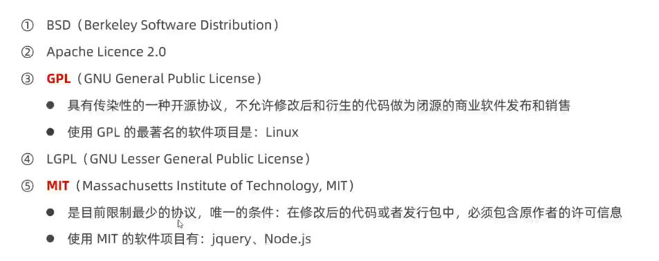
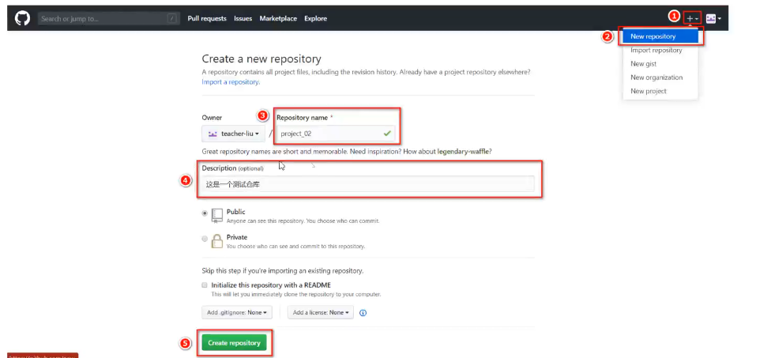
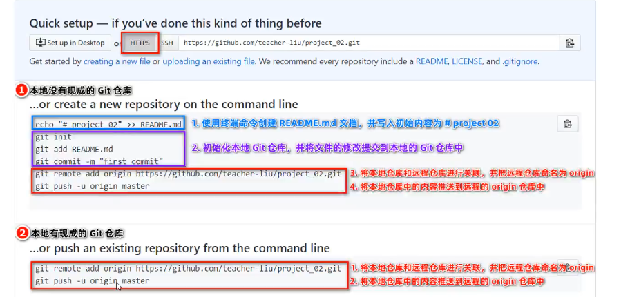

## Git

### 起步

#### 关于版本控制

##### 文件版本


- 操作麻烦：每次都需要复制 -> 粘贴 -> 重命名
- 命名不规范：无法通过文件名知道具体做了那些修改
- 容易丢失：如果硬盘故障或不小心删除，文件很容易丢失
- 协作困难：需要手动合并每个人对项目文件的修改;，合并时极容易出错

##### 版本控制软件

概念：版本控制软件是一个用来记录文件变化，以便将来查阅特定版本修订情况的系统，因此有时也叫做‘版本控制系统’。 <br />
通俗理解：把手工管理文件版本的方式，改为由软件管理文件的版本，这个负责管理文件版本的软件，叫做‘版本控制软件’。 <br />

##### 使用版本控制软件的好处

- 操作简便：只需识记几组简单的终端命令，即可快速上手常见的版本控制软件
- 易于对比：基于版本控制软件提供的功能，能够方便地比较文件的变化细节，从而查找出导致问题的原因
- 易于回溯：可以将选定的文件回溯到之前的状态，其至将整个项目都回退到过去某个时间点的状态

- 不易丢失：在版本控制软件中，被用户误删除的文件，可以轻松的恢复回来
- 协作方便：基于版本控制软件提供的分支功能，可以轻松实现多人协作开发时的代码合并操作

##### 版本控制系统的分类

- 本地版本控制系统：单机运行，使维护文件版本的操作工具化
- 集中化的版本控制系统：联网运行，支持多人协作开发，性能差，用户体验不好
- 分布式版本控制系统：联网运行，支持多人协作开发，性能优秀，用户体验好

###### 本地版本控制系统

特点：使用软件；；记录文件的不同版本，提高了工作效率，降低了手动维护版本的出错率。<br />
缺点：单机运行，不支持多人协作开发，版本数据库故障以后，所有历史更新记录会丢失。 <br />

###### 集中化的版本控制系统

典型代表：SVN <br />
特点：基于服务器，客户端的运行模式，服务器保存文件的所有更新记录，客户端只保留最新的版本文件 <br />
优点：联网运行，支持多人协作开发<br />
缺点：不支持离线提交版本更新，中心服务器崩溃后，所有人无法正常工作,版本数据库故障后，所有历史更新记录 会丢失 <br />

###### 分布式版本控制系统

典型代表：git <br />
特点：基于服务器、客户端的运行模式，服务器保存文件的所有更新版本，客户端是服务器的完整备份，并不是只保留文件的最新版本。 <br />
优点：联网运行，支持多人协作，客户端断网后支持离线本地提交版本更新，服务器故障或损坏后，可以使用任何一个客户端的备份进行恢复。 <br />

#### Git 概念

##### 什么是 Git

Git 是一个开源的分布式版本控制系统，是目前世界上最先进，最流行的版本控制系统，可以快速高效地处理从很小到非常大的项目版本管理。 <br />
特点：项目越大越复杂，协同开发者越多，越能体现出 Git 的高性能和高可用性。 <br />

##### Git 的特性

Git 之所以快速和高效，主要依赖于它的以下两个特性：<br />

- 直接记录快照，而非差异比较
- 近乎所有的操作都是本地执行

###### SVN 的差异比较

传统的版本控制系统（例如 SVN）是基于差异的版本控制，它们存储的是一组基本文件和每个文件随时间逐步积累的差异。 <br />
好处：节省磁盘空间。 <br />
缺点：耗时、效率低。每次切换版本的时候，都需要在基于文件的基础上，应用每个差异，从而生成目标版本对应的文件 <br />

###### Git 记录快照

Git 快照是在原有文件版本的基础上生成一份新的文件，类似于备份，为了效率，，如果文件没有修改，Git 不再重新存储该文件，而是只保留一个链接指向之前存储的文件。 <br />
缺点：占用磁盘空间比较大。 <br />
优点：版本切换的时非常快，因为每个版本都是完整的文件快照，切换版本时直接恢复目标版本的快照时间。 <br />
特点：用空间换取时间。 <br />

###### Git 几乎所有操作都是本地执行的

在 Git 中的绝大多数数据操作都只需要访问本地文件和资源，一般不需要来自互联网上其他计算机的信息。 <br />
特性：<br />

- 断网后依旧可以在本地对项目进行版本管理。
- 联网后，把本地修改的记录同步到云端服务器即可。

##### Git 中的三个区域

使用 Git 管理项目，拥有三个区域，分别是工作区域，暂存区，Git 仓库。 <br />

- 工作区：处理工作的区域
- 暂存区：已完成的工作的临时存放区域，等待被提交
- 仓库：最终的存放区域

##### Git 中的三种状态

已修改（modlified）- 已暂存（staged）- 已提交（committed）

- 已修改;：表示修改了文件，但还没有将修改的结果放到暂存区。
- 提暂存：表示已修改文件的当前版本做了标记，使之包含在下次提交的列表中
- 已提交：表示文件已经安全地保存在本地的 Git 仓库中

:::warning 注意
工作区的文件被修改了，但还没有放到暂存区，就是已修改状态。 <br />
如果文件已修改并放入暂存区，就属于已暂存状态。 <br />
如果 Git 仓库中保存着特定版本的文件，就属于已提交状态。 <br />
:::

##### 基本的 Git 工作流程

1. 在工作区修改文件 <br />
2. 将你想要下次提交的更改进行暂存 <br />
3. 提交更新，找到暂存区的文件，将快照永久性存储到 Git 仓库。 <br />

### Git 基础

#### 安装并配置 Git

在开始使用 Git 管理项目的版本之前，需要将它安装到计算机上，可以使用浏览器访问下面的网址，根据自己的操作系统，选择下载对应的 Git 安装包。 <br />
<a href="https://git-scm.com/downloads" target="_blank">git 下载地址</a>

##### 配置用户信息

安装完成 Git 之后，要做的第一件事就是设置自己的用户名和邮件地址，因为通过 Git 对项目进行版本管理时，Git 需要使用这些基本信息，来记录是谁对项目进行了操作。 <br />

```git
git config --global user.name "自己的用户名"
git.config --global user.email "自己的邮箱"
```

:::warning 注意
如果使用了 --global 选项，那么该命令只需要运行一次，即可永久生效
:::

##### Git 的全局配置文件

通过上面两条命令配置的用户名和邮箱地址，会被写入到 c:/Users/用户名文件/.gitconfig 文件中，这个文件是 Git 的全局配置文件，配置一次即可永久生效。 <br />
可以使用记事本打开此文件，从而查看自己曾经对 Git 做了哪些全局性的配置

##### 检查配置信息

除了使用记事本查看全局的配置信息之外，还可以运行以下的终端命令，快速的查看 GIt 的全局配置信息：<br />

```git
# 查看所有的全局配置项
git config --list --glodal
# 查看指定的全局配置项
git config user.name
git config user.email
```

##### 获取帮助信息

可以使用 git help< verb>命令，无需联网即可在浏览器中打开帮助手册<br />

```git
git help config
```

如果不想查看完整的手册，那么可以用 -h 选项获得更简明的 help 输出。 <br />

```git
git config -h
```

#### Git 的基本操作

##### 获取 Git 仓库的两种方式

- 将尚未进行版本控制的本地目录转换为 Git 仓库
- 从其他服务器克隆一个已存在的 Git 仓库

以上两种方式都能够在自己的电脑上得到一个可用的 Git 仓库。 <br />

##### 在现有目录中初始化仓库

如果自己有一个尚未进行版本控制的项目目录，想要用 Git 来控制它，需要执行如下两个步骤：<br />

- 在项目目录中，通过鼠标右键打开”Git Bash“
- 执行 git init 命令将当前的目录转化为 Git 仓库

git init 命令会创建一个名为。git 的隐藏目录，这个。git 目录就是当前项目的 Git 仓库，里面包含了初始化必要文件，这些文件是 Git 仓库的必要组成部分。 <br />

##### 工作区中文件的 4 种状态

工作区中的每一个文件可能有 4 种状态，这四种状态共分为两大类:<br />

- 未被 Git 管理：为跟踪（Untracked）不被 Git 所管理的文件（新建的文件）
- 已被 Git 管理：
- 未被修改（Unmodified）工作区中文件的内容和 Git 仓库中文件的内容保持一致
- 已被修改（Modified）工作区中文件的内容和 Git 仓库中文件的内筒不一致
- 已暂存（Staged）工作区中被修改的文件已被放到暂存区，准备将修改后的文件保存到 Git 仓库中

:::warning 注意
Git 操作的终极结果：让工作区中的文件都处于‘未修改’的状态。
:::

##### 检查文件的状态

可以使用 get status 命令查看文件处于什么状态 例如：<br />
在状态报告中可以看到新建的 index.html 文件出现在 Untracked files（未跟踪的文件）下面。 <br />
未跟踪的文件意味着 Git 在之前的快照（提交）中没有这些文件，Git 不会自动将之纳入跟踪范围，除非明确地告诉它 ‘我需要使用 Git 跟踪管理文件’ <br />

##### 以精简的方式显示文件状态

使用 git status 输出状态报告很详细，但有些繁琐，如果希望以精简的方式显示文件的状态，可以使用如下两条完全等价的命令，其中-s 是 --short 的简写形式。 <br />

```
# 以精简的方式显示文件状态
git status -s
git status --short
```

未跟踪文件前面有红色的 ？？ 标记。<br />

##### 跟踪新文件

使用命令 git add 开始跟踪一个文件，所以，要跟踪 index.html 文件，运行如下命令：<br />

```
git add index.html
```

此时再运行 git status 命令，会看到 index.html 文件在 Changs to be committed 这行的下面，说明已被跟踪，并处于暂存状态。 <br />
以精简的方式显示文件的状态，新添加到暂存区中的文件前面有绿色的 A 标记。 <br />

##### 提交更新

现在暂存区中有一个 index.html 文件等待被提交到 Git 仓库中进行保存，可以执行 git commit 命令进行提交，其中 -m 选项后面是本次的提交消息，用来对提交的内容做进一步的描述。 <br />

```
git commit -m ""新建了index.html文件
```

提交成功显示：<br />

```
[master (root-commit) 1f000fd] 新建的index.html文件
 1 file changed, 51 insertions(+)
 create mode 100755 index.html
```

提交成功之后，再次检查文件的状态：<br />

```
On branch master
nothing to commit, working tree clean
```

证明工作区中所有的文件都处于‘未修改’的状态，没有任何文件需要被提交。 <br />

##### 对已提交的文件进行修改

目前，index.html 文件已被 Git 跟踪，并且工作区和 Git 仓库中的 index.html 文件内容保持一致，当我们修改了工作区中 index.html 的内容之后，再次运行 git status 和 git status -s 命令，会看到如下内容。 <br />

```
#运行 git status 命令结果
On branch master
Changes not staged for commit:
  (use "git add <file>..." to update what will be committed)
  (use "git restore <file>..." to discard changes in working directory)
	modified:   index.html

no changes added to commit (use "git add" and/or "git commit -a")
#运行 git status -s 命令结果
 M index.html
```

文件 index.html 出现在 Changes not staged for commit 这行下面，说明已跟踪文件的内容发生了变化，但还没有放到暂存区。 <br />
:::warning 注意
修改过的，没有放入暂存区的文件前面有红色的 M 标记
:::

##### 暂存已修改的文件

目前，工作区中的 index.html 文件已被修改，如果要暂存这次修改，需要再次运行 git add 命令，这个命令是个多功能的命令，主要有如下三个功效。 <br />

- 可以用它开启跟踪新文件
- 把已跟踪的，自己修改的文件放入到暂存区
- 把有冲突的文件标记为已解决状态

```git
#运行 git add
# 运行 git status 命令结果如下
On branch master
Changes to be committed:
  (use "git restore --staged <file>..." to unstage)
	modified:   index.html
#运行 git status -s 命令结果如下
M  index.html
```

##### 提交已暂存的文件

再次运行 git commit -m "提交信息"命令，即可将暂存区中记录的 index.html 的快照，提交到 Git 仓库中进行保存。 <br />

```git
#运行 git commit -m "初始化的index.html文件" 命令结果如下
[master 81f9416] 初始化的index.html文件
 1 file changed, 15 insertions(+), 51 deletions(-)
 rewrite index.html (79%)
运行 git status 命令结果如下
On branch master
nothing to commit, working tree clean
```

##### 撤销对文件的修改

撤销对文件的修改指的是：把对工作区中对应文件的修改，还原成 Git 仓库中所保存的版本。 <br />
操作的结果：所有的修改会丢失，且无法恢复！危险性比较高，请慎重操作。 <br />
使用 git checkout -- index.html 命令，撤销对 index.html 文件的修改。 <br />

```git
git checkout -- index.html
```

:::tip 提示
赊销操作的本质：用 Git 仓库中保存的文件，覆盖工作区中指定的文件。
:::

##### 向暂存区中一次性添加多个文件

如果需要被暂存的文件个数比较多，可以使用如下的命令，一次性将所有的 新增和修改过的文件加入暂存区。 <br />

```git
git add .
#未添加到暂存区
 M index.html
?? index.css
?? index.js
#已经添加到暂存区
A  index.css
M  index.html
A  index.js
```

:::tip 提示
今后在项目开发中，会经常使用这个命令，将新增和修改过后的文件加入暂存区
:::

##### 取消暂存的文件

如果需要从暂存区中移除对应的文件，可以使用如下命令：<br />

```git
git resset HEAD 需要移除的文件名称
#移除所有暂存区的文件
git reset HEAD .
```

##### 跳过使用暂存区域

Git 标准工作流程是 工作区 -> 暂存区 -> Git 仓库 ，但是有时候这么做略显繁琐，此时可以跳过暂存区，直接将工作区的修改提交到 Git 仓库，这时候 Git 工作的流程简化为 工作区 -> Git 仓库。 <br />

Git 提供了一个跳过暂存区域的方式，只要在提交的时候，给 git commit 加上 -a 的选项，Git 就会自动把所有已经跟踪过的文件暂存取来一并提交，从而跳过 git add 步骤：<br />

```git
git commit -a -m "描述消息"
```

##### 移除文件

从 Git 仓库中移除文件的方式有两种： <br .>

- 从 Git 仓库和工作区中同时移除对应的文件
- 只从 Git 仓库中移除指定的文件，但是保留工作区中对应的文件。

```git
# 从 Git 仓库和工作区中同时移除 index.js 文件
git rm -f index.js
# 只从 Git 仓库中移除 index.css,但是保留工作区中的 index.css文件
git rm --cached index.css
```

##### 忽略文件

一般我们总会说有些文件无需纳入 Git 管理，也不希望它们总出现在未跟踪文件列表，在这种情况下，我们可以创建一个名为.gitignore 的配置文件，列出要被忽略的文件的匹配模式。 <br />
文件 .gitignore 的格式规范如下：<br />

- 以 # 开头的是注释
- 以 / 结尾的是目录
- 以 / 开头防止递归
- 以 ！开头的表示取反
- 可以使用 glob 模式进行文件和文件夹的匹配，（glob 指简化了的正则表达式）

##### glob 模式

所谓的 glob 模式是指简化了的正则表达式。 <br />

- 星号\* 匹配零个或多个任意字符
- [abc]匹配任何一个列在方括号中的字符（此案例匹配一个 a 或匹配一个 b 或匹配一个 c）
- 问号 ？只匹配一个任意字符
- 在方括号中使用短划线分隔两个字符，表示所有在这两个字符范围内的都可以匹配（比如[0-9] 表示匹配所有 0 到 9 的数字）
- 两个** 表示匹配任意中间目录，（比如 a/**/z 可以匹配 a/z、a/b/z 或 a/b/c/z 等）

##### .gitignore 文件例子

```git
# 忽略所有的 ,a 文件
*.a

# 但跟随所有的 lib.a 即便你在前面忽略了 .a 文件
!lib.a

# 只忽略当前目录下的TODO 文件，而不忽略 subdir/TODO
/TODO

# 忽略任何目录下名为 build 的文件
build/

# 忽略 doc/notes.txt 但不忽略 doc/server/arch.txt
doc/*.txt

# 忽略 doc/ 目录及其所有子目录下的 .pdf 文件
doc/**/*.pdf
```

##### 查看提交历史

如果希望回顾项目的提交历史，可以使用 git log 这个简单且有效地命令。 <br />

```git
# 按时间先后顺序列出所有的提交历史，最近的提交在最上面
git log

# 只展示最新的两条提交历史，数字可以按需进行填写
git log -2

# 在一行上展示最近两条提交历史的信息
git log -2 --pretty=oneline

# 在一行上展示最近两条提交历史的信息，并自定义输出格式
# %b 提交的简写哈希值 ￥an作者名字，￥ar作者修订日期，按多久以前的方式显示， %s 提交说明
git log -2 --pretty=format:"$h | %an | %ar | %s"
```

##### 回退到指定的版本

```git
# 在一行上展示所有提交历史
git log --pretty=oneline

# 使用 git reser --hard 命令，根据指定的提交 ID 回退到指定版本
git reset --hard<commitID>

# 在旧版本中使用 git reflog --pretty=oneline 命令，查看命令操作的历史
git reflog --pretty=oneline

# 再次根据最新的提交 ID，跳转到最新版本
git reset --hard<commitId>
```

##### 小洁

- 初始化 Git 仓库的命令 <br />
  git init <br />
- 查看文件状态的命令
  git status 或 git status -s
- 一次性将文件加入暂存区的命令
  git add . <br />
- 将暂存区的文件提交到 Git 仓库的命令
  git commit -m "提交消息" <br />

### Github

#### 了解开源相关的概念

##### 什么是开源

开源：<br />

- 概念：开源既开放源代码
- 基本含义：代码是公开的
- 特点：任何人都可以去查看、修改和使用开源代码

闭源：<br />

- 概念：软件的代码是封闭的，
- 基本含义：只有作者能看到闭源软件的代码
- 只有作者能对源代码进行修改

通俗理解：<br />

- 开源：是指不仅提供程序还提供程序的源代码
- 闭源：是指提供程序，不提供源代码

##### 什么是开源许可协议

开源并不意味着完全没有限制，为了限制使用者的使用范围和保护作者的权利，每个开源项目都应该遵守开源许可协议（Open Source License）

##### 常见的 5 种开源许可协议



##### 什么要拥抱开源

开源的核心思想是‘我为人人，人人为我’，人们越来越喜欢开源大致是出于以下 3 个原因：<br />

- 开源给使用者更多的控制权
- 开源让学习变得更容易
- 开源才有真正的安全

开源是软件开发领域的大趋势，拥抱开源就像站在巨人的肩膀上，不用自己重复造轮子，让开发越来越容易。 <ve />

##### 开源项目托管平台

专门用于免费存放开源项目源代码的网站，叫做开源项目托管平台，目前世界上比较出名的开源项目托管平台。 <br />
主要有三个：<br />

- Github:全球最牛的开源项目托管平台，没有之一
- Gitlab：对代码私有性支持较好，因此企业用户较多
- Gitee：又叫做吗云，是国产的开源项目托管平台。访问速度快，纯中文界面，使用友好

:::warning 主题
以上三个开源项目托管平台，只能托管以 Git 管理的项目源代码，因此，它们的名字都以 Git 开头
:::

##### 什么是 Github

Github 是全局最大的开源项目托管平台，因为支持 Git 作为唯一的版本控制工具，故名 Github，在 Github 中，你可以：<br />

- 关注自己喜欢的开源项目，为其点赞大 call
- 为自己喜欢的开源项目做贡献（Pull Request）
- 和开源项目的作者讨论 Bug 和提需求（lssues）
- 把喜欢的项目复制一份作为自己的项目进行修改（Fork）
- 创建属于自己的开源项目
- etc..

#### 注册账号

##### 注册 Github 账号的流程

- 访问 Github 的官网首页
- 点击“Sign up”按钮跳转到注册页面
- 填写可用的用户名、邮箱、密码
- 通过点击箭头的方式，将验证图片摆正
- 点击“Create account“ 按钮注册新用户
- 登录到第三部填写的邮箱中，点击激活链接，完成注册。

#### 远程仓库的使用

##### 新建空白远程仓库



##### 远程仓库的两种访问方式

Github 上的远程仓库，有两种访问方式，分别是 HTTPS 和 SSh，它们的区别是：<br />

- HTTPS：零配置，但是每次访问仓库时，需要重复输入 Github 的账号和密码才能访问成功
- SSH：需要进行额外的配置，但是配置成功后，每次访问仓库时，不需要重复输入 Github 的账号和密码。

:::warning 注意
在实际开发中，推荐使用 SSH 的方式访问远程仓库。
:::

##### 基于 HTTPS 将本地仓库上传到 Github



### Git 分支
