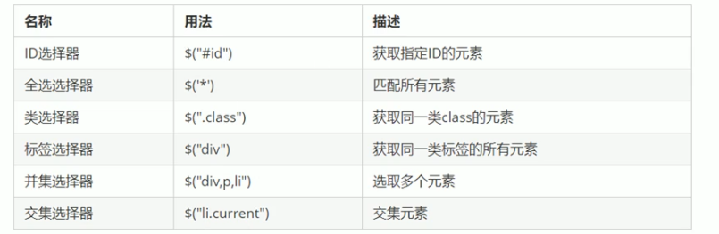
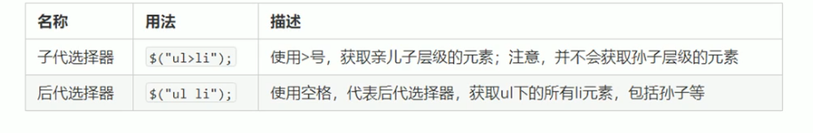
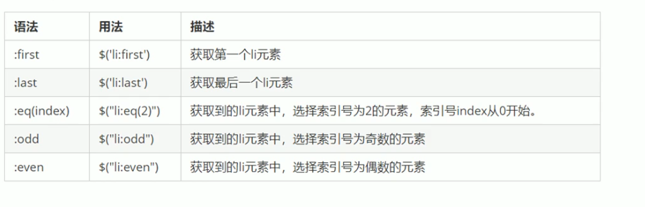
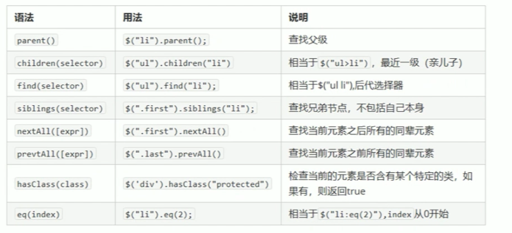
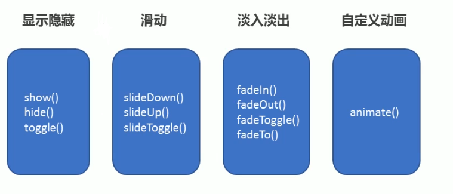
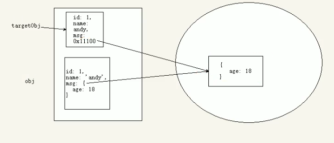
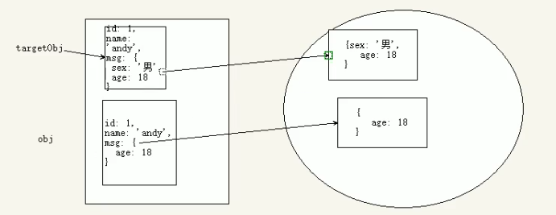

:::warning 前言
jQuery 官网文档中，引号用的都是双引号，所以下面所有单引号按照双引号来看
:::

## jQuery 入门

### JavaScript 库

仓库：可以把很多东西放到这个仓库里面，找东西只需要到仓库里面查找就可以了。 <br />
JavaScript 库：既 library，是一个封装好的特定的集合（方法和集合），从封装一大堆函数的角度理解，就是在这个库中，封装了很多预定义好的函数在里面，比如动画 animate、hide、show，比如获取元素等。 <br />
简单理解：就是一个 JS 文件，里面对我们原生 js 代码进行了封装，存放到里面，这样我们可以快速高效的使用这些封装好的功能。 <br />
比如 jQuery，就是为了快速方便的操作 DOM,里面基本都是函数（）方法。 <br />

<strong>常见的 JavaScript 库: </strong>

- jQuery
- Prototype
- YUI
- Dojo
- Ext JS
- 移动端的 zepto

:::tip 提示
这些库都是对原生 javascript 的封装，内部都是用 javascript 实现的，我们主要学习的是 jQuery.
:::

### jQuery 概述

jQuery 是一个快速、简洁的 javascript 库，其设计的遵旨“write less，Do More”，既倡导写更少的代码，做更多的事情。 <br />

j 就是 javascript，Query 查询，意思就是查询 js，把 js 的 DOM 操作做了封装，我们可以快速的查询使用里面的功能。 <br />
jQuery 封装了 javascript 常用的功能代码，优化了 DOm 操作、事件处理、动画设计和 Ajax 交互。<br />
学习 jQuery 本质，就是学习调用这些函数（方法）。 <br />
jQuery 出现的目的是加快前端人员的开发速度，我们可以很方便的调用和使用它，从而提高开发效率。 <br />

#### jQuery 的优点

- 轻量级，核心文件才几十 KB，不会影响页面加载速度。
- 给浏览器兼容，基本兼容了现在主流的浏览器。
- 链式编程，隐式迭代
- 对事件、样式、动画支持，大大简化了 DOM 操作
- 支持插件扩展开发，有丰富的第三方的插件，例如：树形菜单、日期控件、轮播图等。
- 免费、开源

### jQuery 的基本使用

#### jQuery 的下载

<a href="https://jquery.com/" target="_black"> 官网地址</a>

版本：<br />

- 1x：兼容 IE678 等低版本浏览器，官网不再更新
- 2x：不兼容 IE678 等低版本浏览器，官网不再更新
- 3x：不兼容 IE678 等低版本浏览器，是官网主要更新维护的版本

#### jQuery 的入口函数

```js
$(function() {
  ... // 此处页面DOM加载完成的入口
});
// $(document).ready(function () {
//   $("div").hide();
// })
//等待页面DOM加载完毕再去执行JS 代码
$(function () {
  $("div").hide();
})
```

- 等着 DOM 结构渲染完毕即可执行内部代码，不必等到所有外部资源加载完成，jQuery 帮我们完成了封装。
- 相当于原生 js 中的 DOMContentLoaded。
- 不用于原生 js 中的 load 事件是等待页面文档，外部的 js 文件，csswfjm，图片加载完毕，才执行内部代码。

#### jQuery 的顶级对象 $

- $ 是 jQuery 的别称，在代码中可以使用 jQuery 代替 $ ,但一般为了方便，通常都是直接使用 $

```js
// $(function () {
//   alert(11)
// })
jQuery(function () {
  alert('11')
  // $("div").hide();
  jQuery('div').hide()
})
```

- $ 是 jQuery 的顶级对象，相当于原生 javascript 中的 window，把元素利用 $ 包装成 jQuery 对象，就可以调用 jQuery 的方法。

#### jQuery 对象和 DOM 对象

<strong> 什么是</strong>

- DOM 对象：用原生 JS 获取来的对象就是 DOM 对象
- jQuery 对象：jQuery 方法获取的元素就是 jQuery 对象
- jQuery 对象本质是：利用$对 DOM 对象包装后产生的对象（伪数组形式存储）.
- jQuery 对象只能使用 jQuery 方法，DOM 对象则使用原生的 javascript 属性和方法。

```js
// DOM对象：用原生JS获取来的对象就是DOM对象
var myDiv = document.querySelector('div')
var mySpan = document.querySelector('span')
console.log(myDiv)
//jQuery对象：jQuery方法获取的元素就是jQuery对象,本质：通过$把DOm元素进行了包装
$('div') // 这就是一个jQuery对象
$('span')
console.log($('div'))
```

<strong> DOM 对象和 jQuery 对象之间是可以相互转换的。 </strong> <br />
因为原生 jsbijQuery 更大，原生的一些属性和方法 jQuery 没有给我们封装，想要使用这些属性和方法需要把 jQuery 对象转换为 DOM 对象才能使用。 <br />

- DOM 对象转换为 Jquery 对象：$(DOM 对象)

```js
$(div)
```

- jQuery 对象转换为 DOM 对象（两种方式）

```js
$("div")[index]  index 是索引号
$("div").get(index) index 是索引号
```

```html
<video src="#"></video>
<script>
  // DOM 对象转换为jQuery对象
  // 我们直接过去视频，得到的就是jQuery对象
  $('video')
  // 我们已经使用原生js，获取过来DOM对象
  var myVideo = document.querySelector('video')
  $(myVideo)
  // $(myVideo).play(); jQuery 里面没有play 这个方法
  // jQuery对象转换为DOM对象
  $('video')[0].play()
  $('video').get(0).play()
</script>
```

## jQuery 常用 API

### jQuery 选择器

#### jQuery 基础选择器

原生 js 获取元素方式很多，很杂，而且兼容性情况下不一致，因此 jQuery 给我们做了封装，使获取元素统一标准。<br />

```js
$('选择器') // 里面选择器直接写CSS选择器即可，但是要加引号。
```



```html
<div class="nav">我是nav div</div>
<script>
  $(function () {
    var nav = $('.nav')
    console.log(nav)
  })
</script>
```

#### jQuery 层级选择器



```html
<ul>
  <li>我是 ul 的</li>
  <li>我是 ul 的</li>
</ul>
<script>
  $(function () {
    var lis = $('ul li')
    console.log(lis)
  })
</script>
```

#### 知识铺垫

```js
$('div').css('属性', '值')
```

#### 隐式迭代（重要）

遍历内部 DOM 元素（伪数组形式存储）的过程就叫做隐式迭代。 <br />
简单理解：给匹配到的所有元素进行循环遍历，执行相应的方法，则不用我们进行循环，简化我们的操作，方便我们调用。 <br />

```html
<body>
  <div>我是div</div>
  <div>我是div</div>
  <div>我是div</div>
  <script>
    // 获取四个div元素
    $('div')
    // 给四个div设置背景颜色为pink色 jQuery对象不能使用style
    $('div').css('background-color', 'pink')
    // 隐式迭代，就是把匹配的所有元素内部进行遍历循环，给每一个元素添加css这个方法
  </script>
</body>
```

#### jQuery 筛选选择器



```html
<ul>
  <li>我是li</li>
  <li>我是li</li>
  <li>我是li</li>
</ul>
<script>
  $(function () {
    $('ul li:first').css('color', 'pink')
    $('ul li:last').css('color', 'blue')
    $('ul li:eq(1)').css('color', 'red')
  })
</script>
```

#### jQuery 筛选方法（重点）



```html
<div class="yeye">
  <div class="father">
    <div class="son">儿子</div>
  </div>
</div>
<div class="nav">
  <p>我是p1</p>
  <div>
    <p>我是px2</p>
  </div>
</div>
<script>
  $(function () {
    // 查找父元素方法 parent() 返回的是最近一级的父级元素
    var father = $('.son').parent()
    console.log(father)
    // 查询子元素方法
    // 选择最近一级的子元素 children() 子代选择器 ul > li
    $('.nav').children('p').css('color', 'red')
    // 选择里面所有的子元素，find() 类似后代选择器
    $('.nav').find('p').css('font-size', '20px')
  })
</script>
```

<strong> 案例：下拉菜单 </strong>

```html
<!-- css部分 -->
<style>
  * {
    padding: 0;
    margin: 0;
    list-style: none;
  }

  * a {
    color: black;
    text-decoration: none;
  }

  .nav {
    width: 400px;
    margin: 100px auto;
  }

  .nav > li {
    float: left;
    width: 25%;
  }

  .nav > li > a {
    display: block;
    width: 100%;
    text-align: center;
    border: 1px black solid;
  }

  .nav > li > ul {
    display: none;
  }

  .nav > li > ul > li {
    width: 100px;
    margin-top: -1px;
    text-align: center;
    border: 1px black solid;
  }
</style>
<!-- html部分 -->
<ul class="nav">
  <li>
    <a href="javascript:;">菜单1</a>
    <ul>
      <li><a href="#">内容123</a></li>
      <li><a href="#">内容123</a></li>
      <li><a href="#">内容123</a></li>
    </ul>
  </li>
</ul>
<!-- js部分 -->
<script>
  $(function () {
    // 鼠标经过
    $('.nav>li').mouseover(function () {
      // $(this) jQuery 当前元素 this不加引号
      // shou() 显示元素
      $(this).children('ul').show()
    })
    // 鼠标离开
    $('.nav>li').mouseout(function () {
      // hide() 隐藏元素
      $(this).children('ul').hide()
    })
  })
</script>
```

#### jQuery 里面的排他思想

想要多选一的效果，排他思想：当前元素设置样式，其余的兄弟元素消除样式。 <br />

```html
<button>点击</button>
<button>点击</button>
<button>点击</button>
<button>点击</button>
<script>
  $(function () {
    // 隐式迭代 给所有按钮都绑定了点击事件
    $('button').click(function () {
      // 当前的元素变化背景颜色
      $(this).css('background-color', 'pink')
      // 其余的兄弟去掉背景颜色 隐式迭代
      $(this).siblings('button').css('background-color', '')
    })
  })
</script>
```

<strong> 案例：淘宝服饰精品 </strong>

```html
<!-- css部分 -->
<style>
  * {
    padding: 0;
    margin: 0;
    list-style: none;
  }

  * {
    color: black;
    text-decoration: none;
  }

  .wrapper {
    width: 400px;
    margin: 100px auto;
  }

  #content img {
    width: 200px;
  }

  #content div {
    position: relative;
    top: -85px;
    left: 77px;
    display: none;
  }

  #content .first {
    display: block;
  }

  .wrapper ul {
    width: 80px;
    height: 40px;
  }

  .wrapper li {
    display: inline;
  }

  .wrapper li:hover {
    background-color: brown;
  }
</style>
<!-- html，js部分 -->
<div class="wrapper">
  <ul>
    <li><a href="#">鼠标放置</a></li>
    <li><a href="#">鼠标放置</a></li>
    <li><a href="#">鼠标放置</a></li>
    <li><a href="#">鼠标放置</a></li>
  </ul>
  <div id="content">
    <div class="first">
      <a href="#"></a>
    </div>
    <div>
      <a href="#"></a>
    </div>
    <div>
      <a href="#"></a>
    </div>
    <div>
      <a href="#"></a>
    </div>
  </div>
</div>
<script>
  $(function () {
    // 鼠标经过左边的小li
    $('.wrapper ul li').mouseover(function () {
      // 得到当前小li 的索引号
      var index = $(this).index()
      // console.log(index);
      // 右侧的盒子相应索引号的盒子显示出来
      // $("#content div").eq(index).show()
      // 让其余的图片（其余的兄弟）隐藏
      // $("#content div").eq(index).siblings().hide()
      // 采用链式编程
      $('#content div').eq(index).show().siblings().hide()
    })
  })
</script>
```

#### 链式编程

链式编程是为了节省代码量，看起来更优雅、 <br />

```js
$(this).css('color', 'red').siblings().css('color', '')
```

<strong> 案例： 按钮样式 </strong>

```html
<button>点击</button>
<button>点击</button>
<button>点击</button>
<script>
  $(function () {
    // 隐式迭代 给所有按钮绑定点击事件
    $('button').click(function () {
      // // 使用=当前元素颜色变为红色
      // $(this).css("color", "red")
      // // 其余的兄弟不变色
      // $(this).siblings().css("color", "")
      // 采用链式编程
      $(this).css('color', 'red').siblings().css('color', '')
    })
  })
</script>
```

:::tip 提示
使用链式编程一定注意是哪个对象执行样式。
:::

### jQuery 样式操作

#### 操作 css 方法

jQuery 可以使用 css 方法来修改简单元素样式，也可以操作类，修改多个样式。 <br />

- 参数只写属性名，则是返回属性值

```js
$(this)('color')
$(function () {
  var divw = $('div').css('width')
  console.log(divw) // 200px
})
```

- 参数是属性名，属性值，逗号分隔，是设置一组样式，属性必须加引号，值如果是数字可以不用跟单位和引号

```js
$(this).css("color", "red")；
$(function () {
  var divw = $("div").css("width");
  console.log(divw); // 200px
  $("div").css("width", "300px");
  // $("div").css(height, "300px") // 属性名必须加引号
  $("div").css("height", 300) // 如果属性值是数字，不用引号，单位
})
```

- 参数可以是对象形式，方便设置多组样式，属性名和属性值用逗号隔开，属性可以不用加引号

```js
$(this).css({ color: 'white', fontSize: '20px' })
$(function () {
  $('div').css({
    backgroundColor: 'green',
    width: 100,
    height: 100,
    // 如果是符合属性名必须采用驼峰命名法，如果值不是数字，则需要加引号
  })
})
```

#### 设置类样式方法

作用等同于以前的 classList，可以操作类样式，注意操作类里面的参数不要加点。 <br />

- 添加类

```js
$('div').addClass('current')
```

- 删除类 removeClass()

```js
$('div').removeClass('current')
```

- 切换类 toggleClass()

```js
$('div').toggleClass('current')
```

```html
<!-- css部分 -->
<style>
  div {
    width: 200px;
    height: 200px;
    background-color: brown;
    margin: 100px auto;
    transition: all 0.5s;
  }

  .current {
    background-color: green;
    transform: rotate(360deg);
  }
</style>
<!-- html，js部分 -->
<div class="current"></div>
<script>
  $(function () {
    // 添加类 addClass()
    $('div').click(function () {
      // $(this).addClass("current")
    })
    // 删除类 removeClass()
    $('div').click(function () {
      // $(this).removeClass("current")
    })
    // 切换类 toggleCalee()
    $('div').click(function () {
      $(this).toggleClass('current')
    })
  })
</script>
```

<strong> tab 栏切换 </strong>

```html
<!-- css部分 -->
<style>
  * {
    padding: 0;
    margin: 0;
    list-style: none;
  }

  .tab {
    width: 400px;
    margin: 100px auto;
  }

  .tab_list {
    width: 100%;
    height: 50px;
    background-color: #eee;
  }

  .tab_list ul {
    width: 100%;
  }

  .tab_list ul li {
    text-align: center;
    line-height: 50px;
    width: 25%;
    float: left;
  }

  .current {
    background-color: brown;
  }

  .tab_con .item {
    padding-top: 10px;
    padding-left: 10px;
    width: 100%;
    height: 200px;
    background-color: #aaa;
    display: none;
  }

  #item_one {
    display: block;
  }
</style>
<!-- html，js部分 -->
<div class="tab">
  <div class="tab_list">
    <ul>
      <li class="current">菜单选项1</li>
      <li>菜单选项2</li>
      <li>菜单选项3</li>
      <li>菜单选项4</li>
    </ul>
  </div>
  <div class="tab_con">
    <div class="item" id="item_one">商品介绍页面，商品介绍页面1</div>
    <div class="item">商品介绍页面，商品介绍页面2</div>
    <div class="item">商品介绍页面，商品介绍页面3</div>
    <div class="item">商品介绍页面，商品介绍页面4</div>
  </div>
</div>
<script>
  $(function () {
    $('.tab_list ul li').click(function () {
      // 点击上部的li，当前li 添加current类，其余移除类
      // 链式编程操作
      $(this).addClass('current').siblings().removeClass('current')
      // 点击的同时，得到当前li 的索引号
      var index = $(this).index()
      // 让下部里面相应索引号的item显示，其余的item隐藏
      $('.tab_con .item').eq(index).show().siblings().hide()
    })
  })
</script>
```

#### 类操作与 className 区别

原生 JS 中 className 会覆盖元素原先里面的类名。 <br />
jQuery 里面类操作只是对指定类进行操作，不影响原先的类名。 <br />

```html
<div class="one"></div>
<script>
  // 原生js的
  // var one = document.querySelector('.one');
  // one.className = 'two'
  // jQuery
  $('.one').addClass('two') // 这个addClass相当于追加类名，不影响以前的类名
</script>
```

### jQuery 效果

jQuery 给我们封装了很多动画效果，最为常见的如下：<br />


#### 显示与隐藏效果

- 显示语法规范

```js
shou([speed, [easing], [fn]])
```

- 显示参数

1. 参数都可以省略，无动画直接显示 <br />
2. speed：三种预定速度之一的字符串（'show', 'normal', or 'fast'）或者表示动画时长的毫秒数值(如：1000) <br />
3. easing: (Optional)用来指定切换效果，默认是'swing',可用参数'linear'. <br />
4. fn：回调函数，在动画完成是执行的函数，每个元素执行一次。 <br />

- 隐藏语法规范

```js
hide([speed, [easing], [fn]])
```

- 隐藏参数 同上

- 切换语法规范

```js
toggle([speed, [easing], [fn]])
```

- 切换参数，同上

```html
<button>显示</button>
<button>隐藏</button>
<button>切换</button>
<div></div>
<script>
  $(function () {
    $('button')
      .eq(1)
      .click(function () {
        $('div').hide('fast', function () {
          alert('你好，世界')
        })
      })
    $('button')
      .eq(0)
      .click(function () {
        $('div').show('fast')
      })
    $('button')
      .eq(2)
      .click(function () {
        $('div').toggle('fast')
      })
    // 一般情况下，我们都不加参数直接显示隐藏就可以了
  })
</script>
```

#### 滑动效果

- 下滑效果语法规范

```js
sildeDown([speed, [easing], [fn]])
```

- 下滑效果参数

1. speed：三种预定速度之一的字符串（'show', 'normal', or 'fast'）或者表示动画时长的毫秒数值(如：1000) <br />
2. easing: (Optional)用来指定切换效果，默认是'swing',可用参数'linear'. <br />
3. fn：回调函数，在动画完成是执行的函数，每个元素执行一次。 <br />

- 上滑效果语法规范

```js
sildeUp([speed, [easing], [fn]])
```

- 上滑效果参数 同上

- 切换滑动效果语法规范

```js
sildeTpggle([speed, [easing], [fn]])
```

- 切换滑动效果参数 同上

#### 事件切换

```js
hover([over,]out);
```

- over 鼠标移动到元素上姚处发的函数(相当于 mouseenter)
- out 鼠标移出元素触发的函数（相当于 mouseleave）

```html
<p>鼠标触摸</p>
<div></div>
<script>
  $(function () {
    $('p').hover(function () {
      $('div').slideToggle()
    })
  })
</script>
```

:::tip 提示
如果只写一个参数，那么鼠标离开经过都会触发这个事件，那么可以使用切换的动画。
:::

#### 动画队列及停止排队方法

- 动画或效果队列
  动画过着效果一旦触发就会执行，如果多次触发，就造成多个动画或者效果排队执行

- 停止排队

```js
stop()
```

1. shop() 方法用于停止动画或者效果 <br />
2. 注意：syop() 写到动画或者效果的前面，相当于停止结束上一次的动画。 <br />

```html
<p>鼠标触摸</p>
<div></div>
<script>
  $(function () {
    $('p').hover(function () {
      // stop 方法必须写在动画的前面
      $('div').stop().slideToggle()
    })
  })
</script>
```

#### 淡入淡出效果

- 淡入效果语法规范

```js
fadeIn([speed, [easing], [fn]])
```

- 淡入效果参数

1. speed：三种预定速度之一的字符串（'show', 'normal', or 'fast'）或者表示动画时长的毫秒数值(如：1000) <br />
2. easing: (Optional)用来指定切换效果，默认是'swing',可用参数'linear'. <br />
3. fn：回调函数，在动画完成是执行的函数，每个元素执行一次。 <br />

- 淡出效果语法规范

```js
fadeOut([speed, [easing], [fn]])
```

- 淡出效果参数 同上

- 淡入淡出切换效果语法规范

```js
fadeToggle([speed, [easing], [fn]])
```

- 淡入淡出切换效果参数 同上

#### 渐进方式调整到指定的不透明度

```js
fadeTo([[speed], opacity, [easing], [fn]])
```

1. opacity:透明度必须写，取值[0,1]之间 <br />
2. speed：三种预定速度之一的字符串（'show', 'normal', or 'fast'）或者表示动画时长的毫秒数值(如：1000) , 必须写 <br />
3. easing: (Optional)用来指定切换效果，默认是'swing',可用参数'linear'. <br />
4. fn：回调函数，在动画完成是执行的函数，每个元素执行一次。 <br />

```html
<button>淡入效果</button>
<button>淡出效果</button>
<button>淡入淡出切换</button>
<button>修改透明度</button>
<div></div>
<script>
  $(function () {
    $('button')
      .eq(0)
      .click(function () {
        // 淡入 fadeIn()
        $('div').fadeIn(500)
      })
    $('button')
      .eq(1)
      .click(function () {
        // 淡出 fadeOut()
        $('div').fadeOut(500)
      })
    $('button')
      .eq(2)
      .click(function () {
        // 淡入淡出切换 fadeToggle()
        $('div').stop().fadeToggle(500)
      })
    $('button')
      .eq(3)
      .click(function () {
        // 修改透明度 fadeTo() 这个速度和透明度必须要写
        $('div').fadeTo('normal', 0.5)
      })
  })
</script>
```

<strong> 案例： 突出显示 </strong>

```html
<!-- css部分 -->
<style>
  * {
    padding: 0;
    margin: 0;
    list-style: none;
  }

  body {
    background-color: black;
  }

  .wrap {
    position: relative;
    top: 120px;
    left: 350px;
    padding: 10px;
    width: 640px;
    height: 430px;
    border: 1px white solid;
  }

  .wrap ul li {
    float: left;
    margin-left: 10px;
    margin-top: 10px;
  }

  .wrap ul li a img {
    width: 200px;
  }
</style>
<!-- html，js部分 -->
<div class="wrap">
  <ul>
    <li>
      <a href=""></a>
    </li>
    <li>
      <a href=""></a>
    </li>
    <li>
      <a href=""></a>
    </li>
    <li>
      <a href=""></a>
    </li>
    <li>
      <a href=""></a>
    </li>
    <li>
      <a href=""></a>
    </li>
  </ul>
</div>
<script>
  $(function () {
    $('.wrap li').hover(
      function () {
        $(this).siblings().stop().fadeTo(400, 0.5)
      },
      function () {
        $(this).siblings().stop().fadeTo(400, 1)
      }
    )
  })
</script>
```

#### 自定义动画 animate

- 语法

```js
animate(params, [speed], [easing], [fn])
```

- 参数

1. params 想要改变的样式属性，以对象形式传递，必须写，属性名可以不用带引号，如果是复合属性则需要采用驼峰命名法 borderLeft，其余参数都可以省略。 <br />
2. speed：三种预定速度之一的字符串（'show', 'normal', or 'fast'）或者表示动画时长的毫秒数值(如：1000) , 必须写 <br />
3. easing: (Optional)用来指定切换效果，默认是'swing',可用参数'linear'. <br />
4. fn：回调函数，在动画完成是执行的函数，每个元素执行一次。 <br />

```html
<button>点击运动</button>
<div></div>
<script>
  $(function () {
    $('button').click(function () {
      $('div').animate(
        {
          left: 500,
          top: 300,
          opacity: 0.4,
          width: 600,
        },
        500
      )
    })
  })
</script>
```

<strong> 案例：王者荣耀手风琴效果 </strong>

```html
<!-- css部分 -->
<style>
  * {
    padding: 0;
    margin: 0;
    list-style: none;
  }

  .king {
    margin: 100px auto;
    width: 500px;
    height: 60px;
    background-color: aqua;
  }

  .king ul {
    width: 1000px;
  }

  .king ul li {
    float: left;
    margin-right: 5px;
  }

  .king ul li .small {
    float: left;
    margin-left: 5px;
    width: 60px;
    height: 60px;
    background-color: brown;
  }

  .king ul li .big {
    position: relative;
    top: 0;
    left: -60;
    width: 120px;
    height: 60px;
    background-color: cadetblue;
    display: none;
  }

  .king ul .one .small {
    display: none;
  }

  .king ul .one .big {
    display: block;
  }
</style>
<!-- html，js部分 -->
<div class="king">
  <ul>
    <li>
      <a href="" class="one">
        <div class="small"></div>
        <div class="big"></div>
      </a>
    </li>
    <li>
      <a href="">
        <div class="small"></div>
        <div class="big"></div>
      </a>
    </li>
    <li>
      <a href="">
        <div class="small"></div>
        <div class="big"></div>
      </a>
    </li>
    <li>
      <a href="">
        <div class="small"></div>
        <div class="big"></div>
      </a>
    </li>
    <li>
      <a href="">
        <div class="small"></div>
        <div class="big"></div>
      </a>
    </li>
    <li>
      <a href="">
        <div class="small"></div>
        <div class="big"></div>
      </a>
    </li>
  </ul>
  <script>
    $(function () {
      $('.king li').mouseenter(function () {
        $(this)
          .stop()
          .animate(
            {
              width: 120,
            },
            300
          )
          .find('.small')
          .stop()
          .fadeOut()
          .siblings('.big')
          .stop()
          .fadeIn()
        $(this)
          .siblings()
          .stop()
          .animate(
            {
              width: 70,
            },
            300
          )
          .find('.small')
          .stop()
          .fadeIn()
          .siblings('.big')
          .stop()
          .fadeOut()
      })
    })
  </script>
</div>
```

### jQuery 属性操作

#### 设置或者获取元素固有属性值 prop()

```
所谓元素固有属性就是元素本身自带的属性，比如<a>元素里面的 href，比如<input>元素里面的 type
```

- 获取属性值语法

```js
prop.("属性名")
```

- 设置属性语法

```js
prop.("属性名", "属性值")
```

```html
<a href="https://www.baidu.com" title="你好世界">百度</a>
<input type="checkbox" />
<script>
  $(function () {
    // element.prop("属性名") 获取元素固有的属性值
    console.log($('a').prop('href'))
    $('a').prop('title', 'Hello World')
    console.log($('a').prop('title'))
    $('input').change(function () {
      console.log($(this).prop('checked'))
    })
  })
</script>
```

#### 设置获取元素自定义属性值 attr()

用户自己给元素添加的属性，称为自定义属性，比如给 div 添加 index = “1 <br />

- 获取属性语法

```js
attr('属性名') // 类似原生 getAttribute()
```

- 设置属性值语法

```js
attr('属性名', '属性值') // 类似原生 setAttribute()
```

```html
<div index="1"></div>
<script>
  $(function () {
    console.log($('div').attr('index'))
    $('div').attr('index', 4)
  })
</script>
```

:::tip 提示
这个方法也可以获取 H5 自定义的属性
:::

#### 数据缓存 data()

data() 方法可以在指定的元素上存取数据，并不会修改 DOM 元素结构，一旦页面刷新，之前存放的数据都将被移除。 <br />

- 附加数据语法

```js
data('name', 'value')
```

- 获取数据语法

```jQuery
data('name')
```

<strong> 案例：购物车案例模块 </strong>

```html
<!-- css部分 -->
<style>
  .bigbox {
    width: 100px;
    margin: 100px auto;
  }

  .box {
    width: 100px;
    height: 30px;
    border: 1px black solid;
  }

  .lis {
    margin-top: 20px;
    width: 100px;
    height: 70px;
    border: 1px black solid;
  }
</style>
<!-- html，js部分 -->
<div class="bigbox">
  <div class="box">
    <div class="all"><input type="checkbox" /> <span>全选</span></div>
  </div>
  <div class="lis">
    <div class="li"><input type="checkbox" /> <span>商品1</span></div>
    <div class="li"><input type="checkbox" /> <span>商品2</span></div>
    <div class="li"><input type="checkbox" /> <span>商品3</span></div>
  </div>
  <div class="box">
    <div class="all"><input type="checkbox" /> <span>全选</span></div>
  </div>
</div>
<script>
  $(function () {
    $('.all input').change(function () {
      var check = $(this).prop('checked')
      $('.lis input, .all input').prop('checked', check)
    })
    $('.lis input').change(function () {
      if ($('.lis input:checked').length === $('.lis input').length) {
        $('.all input').prop('checked', true)
      } else {
        $('.all input').prop('checked', false)
      }
    })
  })
</script>
```

### jQuery 文本属性值

主要针对元素内容还有表单的值操作。 <br />

#### 普通元素内容 html() (相当于原生 innerHTML)

```js
html() //获取元素的内容
```

```js
html('内容') // 设置元素内容
```

#### 普通元素文本内容 text() (相当于原生 innerText)

```js
html() //获取元素文本的内容
```

```js
html('内容') // 设置元素文本内容
```

#### 表单值 val() (相当于原生 value)

```js
val() //获取表单内容
```

```js
val('内容') // 设置表单内容
```

```html
<div>
  <span>我是内容</span>
</div>
<input type="text" value="请输入内容" />
<script>
  $(function () {
    // 获取设置元素内容 html()
    console.log($('div').html())
    // $("div").html("你好，世界")
    // console.log($("div").text());
    // 获取设置元素文本内容 text()
    console.log($('div').text())
    $('div').text('你好世界')
    // 获取设置表单值 val()
    console.log($('input').val())
    $('input').val('你好，世界')
  })
</script>
```

<strong> 案例： 购物车增减商品 </strong>

```html
<!-- css部分 -->
<style>
  * {
    padding: 0;
    margin: 0;
    list-style: none;
  }

  * a {
    text-decoration: none;
    color: black;
  }

  .box {
    margin: 50px auto;
    width: 100px;
  }

  .box a,
  input {
    text-align: center;
    line-height: 20px;
    float: left;
    width: 30px;
    height: 20px;
    border: 1px black solid;
  }
</style>
<!-- html，js部分 -->
<div class="box">
  <a href="javascript:;" class="down">-</a>
  <input type="text" class="itxt" value="1" />
  <a href="javascript:;" class="up">+</a>
</div>
<script>
  $(function () {
    $('.up').click(function () {
      var num = $(this).siblings('.itxt').val()
      num++
      $(this).siblings('input').val(num)
    })
    $('.down').click(function () {
      var num = $(this).siblings('.itxt').val()
      if (num == 1) {
        $(this).siblings('input').val(1)
      } else {
        num--
        $(this).siblings('input').val(num)
      }
    })
  })
</script>
```

<strong> 案例：购物车案例模块--修改商品小计 </strong>

```html
<!-- css部分 同上个案例 -->
<div class="box">
  <span class="danjia">单价:￥10.0</span>
  <a href="javascript:;" class="down">-</a>
  <input type="text" class="itxt" value="1" />
  <a href="javascript:;" class="up">+</a>
  <span class="xiaoji">小计:￥10.0</span>
</div>
<script>
  $(function () {
    $('.up').click(function () {
      var num = $(this).siblings('.itxt').val()
      var danjia = $(this).siblings('.danjia').text()
      danjia = danjia.substr(4)
      num++
      $(this).siblings('input').val(num)
      $(this)
        .siblings('.xiaoji')
        .text('小计:￥' + num * danjia + '.0')
    })
    $('.down').click(function () {
      var num = $(this).siblings('.itxt').val()
      var danjia = $(this).siblings('.danjia').text()
      danjia = danjia.substr(4)
      if (num == 1) {
        $(this).siblings('input').val(1)
      } else {
        num--
        $(this).siblings('input').val(num)
        $(this)
          .siblings('.xiaoji')
          .text('小计:￥' + num * danjia + '.0')
      }
    })
    $('.itxt').change(function () {
      var value = $(this).val()
      var danjia = $('.danjia').text()
      danjia = danjia.substr(4)
      console.log(danjia)
      p = (value * danjia).toFixed(2)
      $('.xiaoji').text('小计:￥' + p)
    })
  })
</script>
```

<strong> 返回指定祖先元素 parents("元素名") </strong>

```html
<div class="one">
  <div class="two">
    <div class="three">
      <div class="four">我是four</div>
    </div>
  </div>
</div>
<script>
  $(function () {
    console.log($('.four').parent().parent().parent())
    console.log($('.four').parents('.one'))
  })
</script>
```

### jQuery 元素操作

主要是遍历，创建，添加，删除元素操作。 <br />

#### 遍历元素

jQuery 隐式迭代是对同一类元素做了同样的照做，如果逍遥给同一类元素不同操作，就需要用到遍历。 <br />

- 语法 1：

```js
$('div').each(function (index, domEle) {})
```

- each() 方法遍历匹配每一个元素，主要用 DOM 处理，each 每一个
- 里面的回调函数有两个参数：index 是每个元素的索引号，demEle 是每个 DOMyrsu 对象，不是 jQuery 对象
- 所以要想使用 jQuery 方法，需要给这个 dom 元素转换为 jQuery 对象 $(domEle)

```html
<div>1</div>
<div>2</div>
<div>3</div>
<script>
  $(function () {
    // wzch() 方法遍历元素
    var arr = ['red', 'green', 'blue']
    var sum = 0
    $('div').each(function (index, domEle) {
      // 回调函数第一个参数一定是索引号,可以子级指定索引号名称
      console.log(index)
      // 回调函数第二个参数一定是 DOM对象, domEle 可以子级命名
      $(domEle).css('color', arr[index])
      sum += parseInt($(domEle).text()) // 把字符转换为数字型
    })
    console.log(sum)
  })
</script>
```

- 方法 2：

```js
$.each(object, function (index, element) {})
```

- $.each() 方法可用于遍历任何对象，主要用于数据处理，比如数组，对象
- 里面的函数有两个参数：index 是每个元素的索引号，element：遍历内容

```js
$(function () {
  var arr = ['red', 'green', 'blue']
  // $.each() 方法遍历元素，主要用于遍历数据，处理数据
  // $.each($("div"), function (i, ele) {
  //   console.log(i);
  //   console.log(ele);
  // })
  var obj = {
    name: 'andy',
    age: 18,
  }
  $.each(obj, function (i, ele) {
    console.log(i) // 输出的是name age 属性名
    console.log(ele) // 输出的是andy 18 属性值
  })
})
```

<strong> 案例： 购物穿案例模块--计算总计和总额 </strong>

```html
<!-- css部分 同上 -->
<div class="box">
  <span class="danjia">单价:￥59.8</span>
  <a href="javascript:;" class="down">-</a>
  <input type="text" class="itxt" value="1" />
  <a href="javascript:;" class="up">+</a>
  <span class="xiaoji">小计:￥59.8</span>
</div>

<div class="box ">
  <span class="danjia">单价:￥66.9</span>
  <a href="javascript:;" class="down">-</a>
  <input type="text" class="itxt" value="1" />
  <a href="javascript:;" class="up">+</a>
  <span class="xiaoji">小计:￥66.9</span>
</div>

<div class="box ">
  <span class="danjia">单价:￥9.9</span>
  <a href="javascript:;" class="down">-</a>
  <input type="text" class="itxt" value="1" />
  <a href="javascript:;" class="up">+</a>
  <span class="xiaoji">小计:￥19.9</span>
</div>
<div class="conmuter">
  已选[<span class="zongjian">3</span>]件 <br />
  总价:<span class="zonge">123</span>元
</div>
<script>
  $(function () {
    $('.up').click(function () {
      var num = $(this).siblings('.itxt').val()
      var danjia = $(this).siblings('.danjia').text()
      danjia = parseInt(danjia.substr(4))
      num++
      $(this).siblings('input').val(num)
      $(this)
        .siblings('.xiaoji')
        .text('小计:￥' + num * danjia + '.0')
      getSum()
    })
    $('.down').click(function () {
      var num = $(this).siblings('.itxt').val()
      var danjia = $(this).siblings('.danjia').text()
      danjia = parseInt(danjia.substr(4))
      if (num == 1) {
        $(this).siblings('input').val(1)
      } else {
        num--
        $(this).siblings('input').val(num)
        $(this)
          .siblings('.xiaoji')
          .text('小计:￥' + num * danjia + '.0')
      }
      getSum()
    })
    // 修改input，小计跟随修改
    $('.itxt').change(function () {
      var value = $(this).val()
      var danjia = $(this).siblings('.danjia').text()
      danjia = parseInt(danjia.substr(4))
      p = (value * danjia).toFixed(2)
      $(this)
        .siblings('.xiaoji')
        .text('小计:￥' + p)
      getSum()
    })
    // 计算杂技和总额模块
    function getSum() {
      var count = 0 // 计算总件数
      var money = 0 // 计算总额
      $('input').each(function (i, ele) {
        count += parseInt($(ele).val())
      })
      $('.zongjian').text(count)
      $('.xiaoji').each(function (i, ele) {
        money += parseFloat($(ele).text().substr(4))
        // money = money.toFixed(2)
        $('.zonge').text(money.toFixed(2))
      })
    }
    getSum()
  })
</script>
```

#### 创建元素

- 语法：

```js
$('<li></li>')
```

动态的创建了一个 li 标签

- 添加元素

1. 内部添加 <br />

```js
element.append('内容')
```

把内容放到匹配元素内部最后面，类似原生 appendChild <br />

```js
element.prepend('内容')
```

把内容放到匹配元素内部最前面， <br />

- 外部添加

```js
element.after('内容') // 把内容放入目标元素后面
```

```js
element.before('内容') // 把内容放入目标元素前面
```

:::warning 注意
内部添加元素，生成之后： 它们是父子关系。<br />
外部添加元素，生成之后，它们是兄弟关系。
:::

- 删除元素

```js
element.remove() // 删除匹配的元素（本身）
```

```js
element.empty() // 删除匹配的元素集合中所有子节点
```

```js
element.html('') // 清空匹配的元素内容
```

```html
<ul>
  <li>原先的li</li>
</ul>
<div class="test">我是原来的div</div>
<script>
  $(function () {
    // 创建元素
    var li = $('<li>我是后来li</li>')
    // 添加元素
    // 内部添加
    $('ul').append(li) // 内部添加并且放到内容的最后面
    $('ul').prepend(li) // 内部添加并且放到内容的最前面
    // 外部添加
    var div = $('<div>我是后来的来来的</div>')
    $('.test').after(div)
    $('.test').before(div)
    // 删除元素
    $('ul').remove() //可以删除匹配的元素 自杀
    $('ul').empty() // 删除匹配元素里面的子节点 孩子
    $('ul').htm
    ;('') // 可以删除匹配元素里面的内容
  })
</script>
```

<strong> 案例：购物车案例模块--删除商品模块 </strong>

```html
<!-- css部分 -->
<style>
  *,
  * a {
    padding: 0;
    margin: 0;
    text-decoration: none;
    color: black;
  }

  .bigbox {
    width: 400px;
    margin: 50px auto;
  }

  .box,
  .box2 {
    margin-top: 20px;
    width: 400px;
    height: 30px;
    border: 1px black solid;
    line-height: 30px;
  }

  .lis {
    margin-top: 20px;
  }

  .lis .li {
    margin-top: -1px;
    width: 400px;
    height: 50px;
    border: 1px black solid;
  }

  .lis a {
    position: relative;
    left: 296px;
  }
</style>
<!-- html，js部分 -->
<div class="bigbox">
  <div class="box">
    <div class="all"><input type="checkbox" /> <span>全选</span></div>
  </div>
  <div class="lis">
    <div class="li">
      <input type="checkbox" />
      <span>商品1</span>
      <a href="javascript:;">删除</a>
    </div>
    <div class="li">
      <input type="checkbox" />
      <span>商品2</span>
      <a href="javascript:;">删除</a>
    </div>
    <div class="li">
      <input type="checkbox" />
      <span>商品3</span>
      <a href="javascript:;">删除</a>
    </div>
  </div>
  <div class="box2">
    <div class="all">
      <input type="checkbox" />
      <span>全选</span>
      <a href="javascript:;" class="removex">「删除选中商品』</a>
      <a href="javascript:;" class="removeall">『删除所有商品』</a>
    </div>
  </div>
</div>
<script>
  $(function () {
    $('.all input').change(function () {
      var check = $(this).prop('checked')
      $('.lis input, .all input').prop('checked', check)
    })
    $('.lis input').change(function () {
      if ($('.lis input:checked').length === $('.lis input').length) {
        $('.all input').prop('checked', true)
      } else {
        $('.all input').prop('checked', false)
      }
      if ($('.lis input') == null) {
        $('.all input').prop('checked', false)
      }
    })
    // 删除商品模块
    // 商品后面的删除按钮
    $('.lis a').click(function () {
      $(this).parent('.li').remove()
    })
    // 删除选中的商品
    $('.removex').click(function () {
      var liss = $('.lis input:checked')
      $(liss).parent('.li').remove()
      if ($('.li').length == 0) {
        $('.all input').prop('checked', false)
      }
    })
    // 清理购物车 删除全部商品
    $('.removeall').click(function () {
      $('.lis').remove()
    })
  })
</script>
```

<strong> 案例：购物车案例模块--给选中商品添加背景 </strong>

```html
<!-- css部分 -->
<style>
  *,
  * a {
    padding: 0;
    margin: 0;
    text-decoration: none;
    color: black;
  }

  .bigbox {
    width: 400px;
    margin: 50px auto;
  }

  .box,
  .box2 {
    margin-top: 20px;
    width: 400px;
    height: 30px;
    border: 1px black solid;
    line-height: 30px;
  }

  .lis {
    margin-top: 20px;
  }

  .lis .li {
    margin-top: -1px;
    width: 400px;
    height: 50px;
    border: 1px black solid;
  }

  .lis a {
    position: relative;
    left: 296px;
  }

  .backcolor {
    background-color: rgba(246, 159, 53, 0.771);
  }
</style>
<!-- html，js部分 -->
<div class="bigbox">
  <div class="box">
    <div class="all"><input type="checkbox" /> <span>全选</span></div>
  </div>
  <div class="lis">
    <div class="li">
      <input type="checkbox" />
      <span>商品1</span>
      <a href="javascript:;">删除</a>
    </div>
    <div class="li">
      <input type="checkbox" />
      <span>商品2</span>
      <a href="javascript:;">删除</a>
    </div>
    <div class="li">
      <input type="checkbox" />
      <span>商品3</span>
      <a href="javascript:;">删除</a>
    </div>
  </div>
  <div class="box2">
    <div class="all">
      <input type="checkbox" />
      <span>全选</span>
      <a href="javascript:;" class="removex">「删除选中商品』</a>
      <a href="javascript:;" class="removeall">『删除所有商品』</a>
    </div>
  </div>
</div>
<script>
  $(function () {
    $('.all input').change(function () {
      var check = $(this).prop('checked')
      $('.lis input, .all input').prop('checked', check)
      if ($(this).prop('checked')) {
        $('.li').addClass('backcolor')
      } else {
        $('.li').removeClass('backcolor')
      }
    })
    $('.lis input').change(function () {
      if ($('.lis input:checked').length === $('.lis input').length) {
        $('.all input').prop('checked', true)
      } else {
        $('.all input').prop('checked', false)
      }
      // 给选中商品添加背景
      if ($(this).prop('checked')) {
        $(this).parent('.li').addClass('backcolor')
      } else {
        $(this).parent('.li').removeClass('backcolor')
      }
    })
    // 删除商品模块
    // 商品后面的删除按钮
    $('.lis a').click(function () {
      $(this).parent('.li').remove()
    })
    // 删除选中的商品
    $('.removex').click(function () {
      var liss = $('.lis input:checked')
      $(liss).parent('.li').remove()
      if ($('.li').length == 0) {
        $('.all input').prop('checked', false)
      }
    })
    // 清理购物车 删除全部商品
    $('.removeall').click(function () {
      $('.lis').remove()
      if ($('.lis').length == 0) {
        $('.all input').prop('checked', false)
      }
    })
  })
</script>
```

### jQuery 尺寸、位置操作

#### jQuery 尺寸

- width()/height() : 取得匹配元素宽度和高度值，只算 width/height
- innerWidth(/innerHeight():取得匹配元素宽度和高度值，包含 apdding
- outerWidth()/outerHeight():取得匹配元素宽度和高度值包含 padding、border
- outerWidth()/outerHeight(true):取得匹配元素宽度和高度值，包含 padding、border、margin

```html
<div></div>
<script>
  $(function () {
    // width()/height() : 取得匹配元素宽度和高度值，只算 width/height
    console.log($('div').width())
    $('div').width(300)
    // innerWidth(/innerHeight():取得匹配元素宽度和高度值，包含 apdding
    console.log($('div').innerWidth())
    // outerWidth()/outerHeight():取得匹配元素宽度和高度值包含 padding、border
    console.log($('div').outerWidth())
    // outerWidth()/outerHeight(true):取得匹配元素宽度和高度值，包含 padding、border、margin
    console.log($('div').outerWidth(true))
  })
</script>
```

:::tip 提示
以上参数为空，则是获取元素，返回的是数字型。 <br />
如果参数为数字。，则是修改相应值。 <br />
参数可以不必写单位。
:::

#### jQuery 位置

位置主要有三个：offset()、position()、scrillTop()/scrollLeft(). <br />

- offset() 设置或获取元素偏移

1. offset() 方法设置或返回被选元素相对于文档的便宜坐标，跟父级没有关系。 <br />
2. 该方法有两个属性 left、top、offset().top，用于获取距离文档顶部的距离，offset().left 用于获取距离文档左侧的距离。 <br />
3. 可以设置元素的偏移：offset({top: 10, left: 30})

- position() 获取元素偏移
  position() 方法用于返回被选元素相对于带有定位的父级便宜坐标，如果父级没有定位，则以文档为准。 <br />

```html
<div class="father">
  <div class="son"></div>
</div>

<script>
  $(function () {
    // 获取设置距离文档的位置（偏移） offset
    console.log($('.son').offset())
    console.log($('.son').offset().top)
    $('.son').offset({
      top: 200,
      left: 200,
    })
    // 获取距离带有定位父级位置（偏移），position 如果没有带有定位的父级，则以文档为准
    console.log($('.son').position()) // 只能获取不能设置
  })
</script>
```

- scrollTop()/scrollLeft() 设置或获取元素被卷去的头部和左侧

1. scrollTop() 方法设置或返回被选元素被卷去的头部。 <br />

```html
<div class="father"></div>
<div class="back">返回顶部</div>
<script>
  $(function () {
    // 被卷去的头部，scrollTop() / 被卷去的左侧 scrollLeft()
    // 页面滚动事件

    var boxTop = $('.father').offset().top
    $(window).scroll(function () {
      console.log(boxTop)
      if ($(document).scrollTop() >= boxTop) {
        // $(".back").fadeIn()
        $('.back').fadeIn(400)
      } else {
        $('.back').fadeOut(400)
      }
    })
    // 返回顶部
    // 不能是文档，而是html和body 元素做动画
    $('.back').click(function () {
      $('body, html').stop().animate({
        scrollTop: 0,
      })
    })
  })
</script>
```

<strong> 案例： 品优购电梯导航 </strong>

```html
<!-- css部分 -->
<style>
  *,
  * a {
    padding: 0;
    margin: 0;
    list-style: none;
    text-decoration: none;
    color: black;
  }

  .box {
    margin: 200px auto;
    width: 600px;
  }

  .li {
    margin-top: 20px;
    width: 600px;
    height: 300px;
    background-color: blue;
  }

  h1 {
    position: absolute;
    top: 87px;
    left: 366px;
    width: 600px;
    text-align: center;
  }

  .nav ul {
    position: fixed;
    top: 50%;
    left: 74%;
  }

  .nav {
    display: none;
  }

  .nav ul li {
    text-align: center;
    line-height: 30px;
    width: 50px;
    height: 30px;
    font-size: 14px;
    background-color: burlywood;
  }

  .nav ul .back {
    height: 60px;
    font-size: 18px;
  }

  .changecolor {
    background-color: rgb(234, 97, 29) !important;
  }
</style>
<!-- html，js部分 -->
<h1>欢迎来到我的页面！</h1>
<div class="box">
  <div class="li"></div>
  <div class="li"></div>
  <div class="li"></div>
  <div class="li"></div>
  <div class="li"></div>
</div>
<div class="nav">
  <ul>
    <li class="maun"><a href="javascript:;">菜单1</a></li>
    <li class="maun"><a href="javascript:;">菜单2</a></li>
    <li class="maun"><a href="javascript:;">菜单3</a></li>
    <li class="maun"><a href="javascript:;">菜单4</a></li>
    <li class="maun"><a href="javascript:;">菜单5</a></li>
    <li class="back"><a href="javascript:;">返回顶部</a></li>
  </ul>
</div>
<script>
  $(function () {
    // 当我们点击小li，此时不需要执行 页面滚动事件里面的 li 的背景选择 添加 changecolor
    // 节流阀（互斥锁）
    var flag = true
    // $(document).scrollTop(0);
    var boxTop = $('.li').eq(0).offset().top
    shouHide()
    // 显示隐藏电梯导航栏
    function shouHide() {
      if ($(document).scrollTop() >= boxTop) {
        $('.nav').show(500)
      } else {
        $('.nav').hide(500)
      }
    }
    $(document).scroll(function () {
      shouHide()
      if (flag) {
        $('.li').each(function (i, ele) {
          if ($(document).scrollTop() >= $(ele).offset().top) {
            $('.maun')
              .eq(i)
              .addClass('changecolor')
              .siblings()
              .removeClass('changecolor')
          } else {
            // $(".maun").eq(i).removeClass("changecolor")
          }
        })
      }
    })
    // 返回顶部
    $('.back').click(function () {
      $('body, html').stop().animate({
        scrollTop: 0,
      })
    })
    // var arr = []
    // $(".li").each(function (i, ele) {
    //   arr.push($(ele).offset().top)
    // })
    // $(".nav .maun").each(function (i, ele) {
    //   $(ele).click(function () {
    //     $("body ,html").animate({
    //       scrollTop: arr[i]
    //     }, 300)
    //   })
    // })
    // 点击电梯导航页面可以滚动到相应内容区域
    $('.maun').click(function () {
      flag = false
      // 当我点击小li 就需要计算出页面要去往的位置
      // 选出对应索引号的内容区的盒子，计算它的.offset().top
      var moveTop = $('.li').eq($(this).index()).offset().top
      $('body, html')
        .stop()
        .animate(
          {
            scrollTop: moveTop,
          },
          function () {
            flag = true
          }
        )
      // 点击之后，让当前的小li 添加changecolor类名，其余兄弟删除changecolor类名
      $(this).addClass('changecolor').siblings().removeClass('changecolor')
    })
  })
</script>
```

## jQuer 事件

### jQuery 事件注册

#### 每个事件注册

- 语法：

```js
element.事件(function () {})
```

```js
$('div').click(function () {
  事件处理程序
})
```

其他事件和原生基本一致：<br />
比如：mouseover,mouseout,blur,focus,change,keydown,keyup,resize,scroll 等。

```html
<div></div>
<script>
  $(function () {
    $('div').click(function () {
      $(this).css('background-color', 'red')
    })
    $('div').mouseenter(function () {
      $(this).css('background-color', 'pink')
    })
  })
</script>
```

### jQuery 事件处理

#### 事件处理 on() 绑定事件

on() 方法在匹配元素上绑定一个或多个事件的事件处理函数。 <br />

- 语法：

```js
element.on(events, [selector], fn)
```

1. events：一个或多个用空格分隔的事件类型，如“click”或“keydown” <br />
2. selector: 元素的子元素选择器。 <br />
3. fn 回调函数，既绑定在元素身上的侦听函数

- on() 方法优势 1：
  可以绑定多个事件，多个处理事件处理程序。 <br />

```html
<div></div>
<script>
  $(function () {
    $('div').on({
      mouseenter: function () {
        $(this).css('background-color', 'pink')
      },
      click: function () {
        $(this).css('background-color', 'red')
      },
      mouseleave: function () {
        $(this).css('background-color', 'royalblue')
      },
    })
  })
</script>
```

如果事件处理程序相同. <br />

```html
<div></div>
<script>
  $(function () {
    $('div').on('mouseenter mouseleave', function () {
      $(this).toggleClass('current')
    })
  })
</script>
```

- on()可以事件委派操作、事件委派和定义就是，把原来给子元素身上的事件绑定在父元素身上，就是把时间委派给父元素。 <br />

```html
<ul>
  <li>我们都是ul的孩子</li>
  <li>我们都是ul的孩子</li>
  <li>我们都是ul的孩子</li>
</ul>
<script>
  // on()可以实现事件委托（0委派
  // $("ul li").click()
  $('ul').on('click', 'li', function () {
    alert('你好，世界')
  })
  // click 是绑定给ul身上的，当时触发的对象是ul里面的小li
</script>
```

:::tip 提示
此之前有 bind(),live(),delegate() 等方法来处理事件绑定或者事件委派，最新版本的请用 on 替代它们。
:::

- on() 方法优势 3：
  动态创建的元素，click()没有办法绑定事件，on()可以给未来动态生成的元素绑定事件。<br />

```html
<ol></ol>
<script>
  // $("ol li").click(function () {
  //   alert(11);
  // }) // 没办法弹出
  $('ol').on('click', function () {
    alert(11)
  }) // 可以弹出
  var li = $('<li>我是后来的</li>')
  $('ol').append(li)
</script>
```

<strong> 案例：发布微博案例 </strong>

```html
<!-- css部分 -->
<style>
  * {
    padding: 0;
    margin: 0;
    list-style: none;
  }

  .box {
    text-align: center;
    margin: 50px auto;
    width: 400px;
    padding-bottom: 20px;
    /* height: 260px; */
    border: 1px black solid;
  }

  ul {
    margin-left: 82px;
    width: 95%;
    /* height: 30px; */
  }

  ul li {
    margin-top: 5px;
    display: inline-block;
    width: 70%;
    height: 30px;
    background-color: blanchedalmond;
    border-bottom: 1px black solid;
    display: none;
  }

  ul a {
    line-height: 30px;
    float: right;
    text-decoration: none;
    color: black;
    height: 30ox;
    /* float: left; */
  }
</style>
<!-- html，js部分 -->
<div class="box" id="weibo">
  <span>微博发布</span>
  <textarea name="" class="txt" cols="30" rows="10"></textarea>
  <button class="btn">发布</button>
  <ul></ul>
</div>
<script>
  $(function () {
    // 点击发布按钮，动态创建一个小li，放入放入文本框中内容和删除按钮，并且添加ul中
    $('.btn').on('click', function () {
      var li = $('<li></li>')
      li.html($('.txt').val() + "<a href='javascript:;'> 删除</a>")
      $('ul').prepend(li)
      $('li').slideDown(400)
      $('.txt').val('')
    })
    // 点击删除按钮，可以删除当前的微博留言
    // on可以给动态创建的元素绑定事件
    $('ul').on('click', 'a', function () {
      $(this)
        .parent()
        .slideUp(function () {
          $(this).remove()
        })
    })
  })
</script>
```

#### 事件处理 off() 解绑事件

off() 方法可以移除通过 on()方法添加的事件处理程序。 <br />

```html
<div></div>
<ul>
  <li>我是ul的孩子</li>
  <li>我是ul的孩子</li>
  <li>我是ul的孩子</li>
</ul>
<script>
  $(function () {
    $('div').on({
      click: function () {
        console.log('我被点击了')
      },
      mouseover: function () {
        console.log('我被鼠标经过了')
      },
    })
    $('ul').on('click', 'li', function () {
      console.log('我是li我被点击了')
    })
    // 解绑事件
    // $("div").off() // 解除了div身上的所有事件
    $('div').off('mouseover') // 解除了div身上的 mouseover事件
    $('ul').off('click', 'li') // 解除事件委托
  })
</script>
```

- 如果有的事件只想触发一次，可以使用 one()来绑定事件。

```html
<p>我是p</p>
<script>
  $(function () {
    // one() 只能触发事件一次
    $('p').one('click', function () {
      alert(11)
    })
  })
</script>
```

#### 自动触发事件 grigger()

有些事件希望自己触发，比如轮播图自动播放功能跟点击右侧按钮一致，可以利用定时器自动触发右侧按钮点击事件，不必鼠标点击触发。 <ve />

```js
element.click() // 第一种简写形式
```

```js
element.trigger('type') // 第二种自动触发模式
```

```js
element.triggerGandler('type') // 第三种自动触发事件
```

```html
<div></div>
<input type="text" />
<script>
  $(function () {
    $('div').on('click', function () {
      alert(11)
    })
    // 自动触发事件
    // element.事件()
    $('div').click()
    // element.trigger("type")
    $('div').trigger('click')
    // element.triggerHandler("type") 就是不会触发元素的默认行为
    $('div').triggerHandler('click')
    $('input').on('focus', function () {
      $(this).val('你好，世界')
    })
    // $("input").triggerHandler("focus") // 不可以获取焦点
    $('input').trigger('focus') // 可以获取焦点
  })
</script>
```

### jQuery 事件对象

事件被触发，就会有事件对象的产生。jQuery 的事件对象和之前讲的一样，可以参照之前笔记 <br />

```js
element.on(events, [selector], function (event) {})
```

- 阻止默认行为：event.preventDefault() 或者 return false
- 阻止冒泡：event.stopPropageation()

```html
<div></div>
<script>
  $(function () {
    $(document).on('click', function () {
      console.log('点击了document')
    })
    $('div').on('click', function (event) {
      // console.log(event);
      console.log('点击了div')
      event.stopPropagation()
    })
  })
</script>
```

## jQuery 其他方法

### jQuery 拷贝对象

如果想要把某个对象拷贝（合并）给另外一个对象使用，此时可以使用 $.extend() 方法 <br />

```js
$.extend([depp], target, object1, [objectN])
```

- deep：如果设为 true 为深拷贝，默认为 false 浅拷贝
- target：要拷贝的目标对象
- object1：待拷贝到第一个对象的对象
- objectN：待拷贝到第 N 个对象的对象
- 浅拷贝是把被拷贝的对象复杂数据类型中的地址拷贝给目标对象，修改目标对象会影响被拷贝对象



- 深拷贝，前面加 true，完全克隆（拷贝的对象，而不是地址），修改目标对象不会影响被拷贝对象。



```html
<script>
  $(function () {
    var targetObj = {
      id: 0,
      msg: {
        sex: '男',
      },
    }
    var obj = {
      id: 1, // 覆盖原来对象的数据
      name: 'andy',
      msg: {
        age: 18,
      },
    }
    //浅拷贝把原来对象勉励的复杂数据类型的地址拷贝给目标对象
    $.extend(targetObj, obj)
    console.log(targetObj)
    targetObj.msg.age = 20
    console.log(obj)
    //  深拷贝，前面加 true，完全克隆（拷贝的对象，而不是地址），修改目标对象不会影响被拷贝对象。
    $.extend(true, targetObj, obj)
    console.log(targetObj)
    targetObj.msg.age = 20
    console.log(obj)
  })
</script>
```

### 多库共存

#### 问题概述

jQuery 使用 $ 作为标识符，随着 jQuery 的流行，其他 js 库也会使用 $ 作为标识符，这样一起使用会引起冲突。<br />

#### 客观需求

需要一个解决方案，让 jQuery 和其他的 js 库不存在冲突，可以同时存在，这就叫多库共存。 <br />

#### jQuery 解决方案

1. 把里面的 $ 符号改成 jQuery，比如： jQuery("div") <br />
2. jQuery 变量规定新的名称：$noConflict() var xx = $noConflict(); <br />

```html
<div></div>
<span></span>
<script>
  $(function () {
    function $(ele) {
      return document.querySelector(ele)
    }
    console.log($('div'))
    // 如果 $ 符号冲突了，我们使用 jQuery
    jQuery.each()
    // 让jQuery 释放对 $ 控制权，让用自己设定
    var suibian = jQuery.noConflict()
    console.log(suibian('span'))
  })
</script>
```

### jQuery 插件

jQuery 功能比较有限，想要更复杂 的特效效果，可以借助于 jQuery 插件完成。 <br />

:::warning 注意
这些插件也是依赖于 jQuery 来完成的，所以必须要先引入 jQuery 文件，因此也被称为 jQuery 插件。
:::

#### jQuery 插件常用的网站

<a href="http://www.jq22.com" target="_black">jQuery 插件库 </a><br />
<a href="http://www.htmleaf.com" target="_black">jQuery 之家 </a>

#### jQuery 插件演示

- 瀑布流
- 图片懒加载（图片使用延迟加载可提高网页下载速度，它也能帮助减轻服务器负载）<br />
  当我们页面滑动到可视区域，再显示图片 <br />
  我们使用 jQuery 插件库 EastLazyload。注意，此时的 js 引入和 js 调用必须写到 DOM 元素（图片）最后面 <br />

- 全屏滚动 （fullpage.js）<br />
  <a href=" https://github.com/alvarotrigo/fullPage.js" target="_black">gitHub </a><br /> <a href="https://www.dowebok.com/demo/2014/77/" target="_black">中文翻译网站 </a>

#### bootstrap JS 插件

bootstrap 框架也是依赖于 jQuery 开发的，因此里面的 js 插件使用，必须引入 jQuery 文件。 <br />

## 综合案例

<strong> 案例： toDoList </strong>

- 本地存储分析

```js
// 以数组的形式存储，done存储 是否完成
var todolist = [
  {
    tltle: '我是第一条数据',
    done: false,
  },
  {
    tltle: '我是第二条数据',
    done: false,
  },
]
// JSON,stringify() 这个方法是把数组转换为字符串，因为本都存储只能存字符串
localStorage.setItem('todo0', JSON, stringify(yodolist))
var data = localStorage.getItem('todo')
// 把获取到的字符串转换为原来的数组
data = JSON.parse(data)
```

```html
<!-- css部分 -->
<style>
  *,
  * a {
    padding: 0;
    margin: 0;
    list-style: none;
    text-decoration: none;
    color: black;
  }

  header {
    line-height: 50px;
    text-align: center;
    width: 100%;
    height: 50px;
    background-color: brown;
  }

  header section label {
    text-align: left !important;
    font-size: 30px;
    position: relative;
    left: -96px;
    color: white;
  }

  header section input {
    padding-left: 5px;
    height: 30px;
    width: 300px;
    margin-top: 0;
    position: relative;
    left: -63px;
    top: -5px;
    border: 1px black solid;
    outline: none;
  }

  header section a {
    position: relative;
    left: -58px;
    top: -2px;
    border: 1px black solid;
    background-color: white;
  }

  .box {
    margin: 0 auto;
    width: 60%;
    height: 400px;
    /* background-color: teal; */
    padding-left: 20px;
    padding-top: 20px;
    margin-top: 10px;
  }

  .box h2 {
    width: 100%;
  }

  #todolist {
    width: 100%;
    margin-left: 64px;
  }

  #todolist li {
    width: 80%;
    height: 40px;
    background-color: thistle;
    line-height: 40px;
    vertical-align: middle;
    margin-top: 10px;
    /* display: none; */
  }

  #todolist li .sbox {
    display: inline-block;
    width: 10px;
    height: 100%;
    background-color: brown;
  }

  #todolist li .sbox,
  #todolist input,
  #todolist p,
  #todolist a {
    float: left;
  }

  .inputclass {
    width: 18px;
    height: 18px;
    margin-left: 20px;
    margin-top: 11px;
  }

  #todolist p {
    margin-left: 10px;
    font-size: 20px;
  }

  .textinput {
    width: 480px;
    margin-left: 10px;
    font-size: 20px;
    margin-top: 6px;
    outline: none;
  }

  h2 {
    margin-top: 10px;
    margin-left: 64px;
  }

  #todocount,
  #doneCount {
    position: relative;
    left: 513px;
    text-align: center;
    display: inline-block !important;
    width: 20px;
    height: 100%;
    background-color: black;
    color: white;
  }

  #doneCount {
    left: 538px;
  }

  #todolist a {
    float: right;
    margin-right: 10px;
  }

  ul li {
    background-color: rgba(22, 234, 36, 0.511) !important;
  }
</style>
<!-- html，js部分 -->
<body>
  <header>
    <section>
      <label for="tltle">ToDoList</label>
      <input type="text" id="title" name="title" placeholder="添加ToDo" />
      <a href="javascript:;" class="submit">提交</a>
    </section>
  </header>
  <div class="box">
    <section>
      <h2>正在进行 <span id="todocount">0</span></h2>
      <ol id="todolist" class="demo-box"></ol>
      <h2>已完成 <span id="doneCount">0</span></h2>
      <ul id="todolist"></ul>
    </section>
  </div>
</body>
<script>
  $(function () {
    // 渲染数据到ol中
    load()
    // 点击提交按钮 新增li 把input的内容赋值给li
    $('.submit').on('click', function () {
      if ($('#title').val() == '') {
        alert('请输入内容！')
      } else {
        // 先读取本地存储的数据
        var local = getData()
        // 把local数据进行更鞋，把最新的数据追加给local数组
        local.push({ title: $('#title').val(), done: false })
        // 把新的数组存储给本地存储
        saveData(local)
        // todoLiat 本地存储数据渲染加载到页面
        load()
        $('#title').val('')
      }
    })
    // 读取本地存储的数据
    function getData() {
      var data = localStorage.getItem('todolist')
      if (data !== null) {
        // 本地存储里面的数据是字符串格式，转换为数组
        return JSON.parse(data)
      } else {
        return []
      }
    }

    // 保存本地存储数据
    function saveData(data) {
      localStorage.setItem('todolist', JSON.stringify(data))
    }

    // 渲染加载数据
    function load() {
      var data = getData()
      // 遍历之前要清空ol里面的内容
      $('ol, ul').empty()
      var todoOunt = 0 // 正在进行的个数
      var doneCount = 0 // 已经完成的个数
      // 遍历数据
      $.each(data, function (i, n) {
        if (n.done) {
          $('ul').prepend(
            "<li><div class='sbox'></div>" +
              "<input type='checkbox' class='inputclass' checked=true>" +
              '<p>' +
              n.title +
              '</p>' +
              "<a href='javascript:;' class='removeli' id=" +
              i +
              ' >删除</a></li>'
          )
          doneCount++
        } else {
          $('ol').prepend(
            "<li><div class='sbox'></div>" +
              "<input type='checkbox' class='inputclass'>" +
              '<p>' +
              n.title +
              '</p>' +
              "<a href='javascript:;' class='removeli' id=" +
              i +
              ' >删除</a></li>'
          )
          todoOunt++
        }
      })
      $('#todocount').text(todoOunt)
      $('#doneCount').text(doneCount)
    }

    // 键盘按下回车提交
    $('#title').on('keydown', function (e) {
      if (e.keyCode == 13) {
        $('.submit').click()
      }
    })

    // toDoList 删除
    $('ol, ul').on('click', 'a', function () {
      // 获取本地存储
      var data = getData()
      // 修改数据 splice(从哪个位置开始删除，删除第几个元素)
      var index = $(this).attr('id')
      data.splice(index, 1)
      // 保存到本地存储
      saveData(data)
      /// 重新渲染页面
      load()
    })
    // tiDoList 正在进行和已完成选项操作
    $('ol, ul').on('click', 'input', function () {
      // 获取本地存储
      var data = getData()
      // 修改数据
      var index = $(this).siblings('a').attr('id')
      data[index].done = $(this).prop('checked')
      console.log(data)
      // 保存到本地存储
      saveData(data)
      /// 重新渲染页面
      load()
    })
  })
</script>
```
