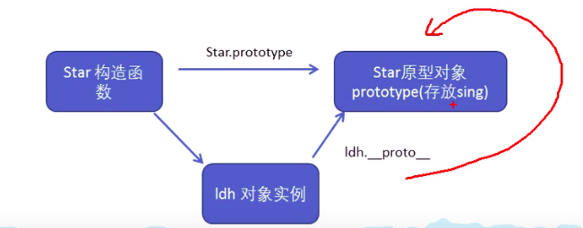

## JavaScript 面向对象

### 面向对象编程介绍

#### 两边编程思想

- 面对过程
- 面向对象

#### 面向过程编程 POP

面向过程就是分析出解决问题所需要的步骤，然后用函数把这些步骤一步一步实现，使用的时候再一个一个的一次调用就可以了。 <br />
举个栗子：将大象装进冰箱，面向过程做法。<br />
打开门---装大象---关闭门 <br />
<strong> 简单理解：面向过程就是按照我们分析好了的步骤，按照步骤解决问题。</strong> <br />

#### 面向对象编程 OOP

面向对象是吧事物分解成为一个个对象，然后由对象之间分工合作。 <br />
举个栗子：将大象装进冰箱，面向对象做法。<br />
先找出对象，并写出这些对象的功能：<br />

1. 大象对象 <br />

- 进去

2. 冰箱对象 <br />

- 打开门
- 关闭门

3. 使用大象和冰箱的功能 <br />

<strong> 简单理解：面向对象是以对象功能来划分问题，不是步骤。 </strong> <br />
在面向对象程序开发思想中，每一个对象都是功能中心，具有明确分工。 <br />
面向对象编程具有灵活、代码可复用、容易维护和开发的优点，更适合多人合作大型软件项目。 <br />

<strong>面对对象的特性： </strong><br />

- 封装性
- 继承性
- 多态性

#### 面对过程和面向对象的对比

##### 面向过程

优点:性能比面向对象高适合跟硬件联系很紧密的东西，例如单片机就采用的面向过程编程。 <br />
缺点:没有面向对象易维护、易复用、易扩展。 <br />

##### 面向对象

优点:易维护易复用易扩展，由于面向对象有封装、继承多态性的特性，可以设计出低耦合的系统，使系统更加灵活、 更加易于维护。 <br/>
缺点:性能比面向过程低。 <br />

:::tip 提示
简单理解：用面对过程的方法写出的程序是一份蛋炒饭，而用面向对象写出来的程序是一份盖浇饭。
:::

### ES6 中的类和对象

#### 面向对象

面向对象更贴近我们的实际生活，可以使用面向对象描述现实世界事物，但是事物分为具体的事物和抽象的事物。 <br />

- 比如：手机，抽象的（泛指谢）,iphone12，具体的（特指的）
  面向对象的思维特点：<br />

1. 抽取（抽象）对象共用的属性和行为组织（封装）成一个类（模板）<br />
2. 对类进行实例化，获取类的对象 <br />
   面向对象编程我们思考的是有哪些对象，按照面向对象的思维特点，不断的创建对象，使用对象，指挥对象做事情。 <br />

#### 对象

现实生活中：万物皆对象，对象是一个具体的事物，看得见摸得着的实物。 <br />
例如：一本书，一辆汽车，一个人，可以是‘对象’，一个数据库，一张网页，一个与远程服务器的链接也可以是‘对象’。<br />
在 javascript 中，对象是一组无序的相关属性和方法的集合，所有事物都是对象。<br />
例如：字符串、数值、数组、函数等。 <br />
对象是由属性和方法组成的：<br />

- 属性：事物的特征，在对象中用属性来表示（常用名词）
- 方法：事物的行为，在对象中用方法来表示（常用动词）

#### 类 class

在 ES6 中新增了类的概念，可以使用 class 类关键字声明一个类，之后以这个类来实例化对象。 <br />
类抽象了对象的公共部分，它泛指某一大类（class）。比如：一辆车的设计图纸 <br />
对象特指某一个，通过类实例化一个具体的对象。比如：一辆法拉利<br />

#### 类的创建

<strong> 语法：</strong>

```js
class name {
  //clas body
}
```

<strong> 创建实例</strong>

```js
var xx = new name()
```

:::warning 注意
类必须使用 new 实例化对象
:::

#### 类 constructor 构造函数

constructor() 方法是类的构造函数（默认方法），用于传递参数，返回实例对象，通过 new 命令生成对象实例时，自动调用该方法，如果没有显示定义，类内部会自动给我们创建一个 constructor()。 <br />

```js
// 创建类 class 创建一个明星类
class Star {
  constructor(uname, age) {
    this.uname = uname
    this.age = age
  }
}
// 使用类创建对象 new
var ldh = new Star('刘德华', 18)
var zxy = new Star('张学友', 20)
console.log(ldh.uname)
console.log(zxy.uname)
console.log(ldh.age)
console.log(zxy.age)
```

:::tip 提示
通过 class 关键字创建类，类名一般习惯定义首字母大写。 <br />
类里面有个 constructor 函数，可以接收传递过来的参数，同时返回实例对象。 <br />
constructor 函数，只要 new 生成实例，就会自动调用这个函数，如果不写这个函数，类也会自动生成这个函数。 <br />
生成实例 new 不能省略。 <br />
最后注意语法规范，创建类，类名后面不要加小括号，生成实例，类名后面加小括号，构造函数不需要加 function().
:::

#### 类添加方法

<strong> 语法：</strong>

```js
class Person {
  constructor(name, age) {
    // constructor 构造器或者构造函数
    this.name = name
    this.age = age
  }
  say() {
    console.log(this.name + '你好')
  }
}
```

```js
// 创建类 class 创建一个明星类
class Star {
  constructor(uname, age) {
    this.uname = uname
    this.age = age
  }
  sing(song) {
    console.log('我唱歌 ' + this.uname + song)
  }
}
// 使用类创建对象 new
var ldh = new Star('刘德华', 18)
var zxy = new Star('张学友', 20)
console.log(ldh.uname)
console.log(zxy.uname)
console.log(ldh.age)
console.log(zxy.age)
ldh.sing('冰雨')
zxy.sing('李香兰')
```

:::tip 提示
类里面所有的函数不需要写 function() <br />
多个函数方法之间不需要添加逗号分隔。
:::

### 类的继承

现实中的继承：子承父业，比如我们继承了父亲的姓。 <br />
程序中的继承：子类可以继承父亲的一些属性和方法。 <br />
<strong> 语法：</strong>

```js
// 父亲
class Father {}
// 子类继承父亲
class Son extends Father {}
```

```js
class Father {
  constructor() {}
  money() {
    console.log(100)
  }
}
class Son extends Father {}
var son = new Son()
son.money() // 100
```

#### super 关键字

super 关键字用于访问和调用对象父亲上的函数，可以调用父亲的构造函数，也可以调用父亲的普通函数。 <br />
<strong> super 对用父亲构造函数 </strong>

```js
class Father {
  constructor(x, y) {
    this.x = x
    this.y = y
  }
  sum() {
    console.log(this.x + this.y)
  }
}
class Son extends Father {
  constructor(x, y) {
    super(x, y)
  }
}
var son = new Son(10, 10)
var son1 = new Son(666, 999)
son.sum() // 20
son1.sum() // 1665
```

<strong> super 对用父亲普通函数 </strong>

```js
class Father {
  say() {
    return '我是Father'
  }
}
class Son extends Father {
  say() {
    // console.log('我是Son');
    console.log(super.say() + '的Son')
  }
}
var son = new Son()
var son = new Son()
son.say()
```

:::tip 提示
继承中的属性或者方法查找原则：就近原则。 <br />
继承中，如果实例化了子类输出一个方法，先看子类有没有这个方法，如果有就先执行子类的。 <br />
继承中，如果子类里面没有，就去查找父亲有没有，如果有，就执行父亲的这个方法（就近原则）
:::
<strong> super 必须仿在 this 之前 </strong>

```js
class Father {
  constructor(x, y) {
    this.x = x
    this.y = y
  }
  sum() {
    console.log(this.x + this.y)
  }
}
// 子类继承父亲的加法方法，同时扩展减法方法
class Son extends Father {
  constructor(x, y) {
    // 利用super调用父类的构造函数
    super(x, y)
    // super 必须在子类this之前调用
    this.x = x
    this.y = y
  }
  subtract() {
    console.log(this.x - this.y)
  }
}
var son = new Son(5, 3)
son.subtract() // 2
son.sum() // 8
```

#### 三个注意点

- 在 ES6 中类没有变量提升，所以必须先定义类，才能通过类实例化对象
- 类里面的共有的属性和方法一定要加 this 使用
- 类里面的 this 指向问题
- constructor 里面的 this 指向实例对象，方法里面的 this 指向这个方法的调用者

```js
class Star {
  constructor(name, age) {
    this.name = name
    this.age = age
    this.sing()
  }
  sing() {
    console.log(this.name)
  }
}
var ldh = new Star('刘德华')
```

```js
class Star {
  constructor(name, age) {
    this.name = name
    this.age = age
    this.btn = document.querySelector('button')
    this.btn.onclick = this.sing // 你好世界
  }
  sing() {
    console.log('你好世界')
  }
}
var ldh = new Star()
```

```js
var that
var that2
class Star {
  constructor(uanme, age) {
    // constructor 里面的this 指向的是创建的实例对象
    that = this
    console.log(this)
    this.uanme = uanme
    this.age = age
    this.btn = document.querySelector('button')
    this.btn.onclick = this.sing // 你好世界
  }
  sing() {
    // 这个sing方法里面的this，所指向的是 btn，这个按钮对用了这个函数
    console.log(this)
    console.log(that.uanme) // that 里面存储的是constructor里面的this
  }
  donce() {
    // 这个dance里面的this，指向的是实例对象，ldh，因为它调用了这个函数
    that2 = this
    console.log(this)
  }
}
var ldh = new Star('刘德华')
console.log(that == ldh) //true
ldh.donce()
console.log(that2 == ldh) //true
```

### 面向对象案例

<strong> 案例：面向对象版 tab 栏切换 </strong>

```html
<!-- css部分 -->
<style>
  * {
    padding: 0;
    margin: 0;
    list-style: none;
  }

  main {
    position: relative;
    margin: 100px auto;
    width: 600px;
    height: 300px;
    background-color: #eee;
    border: 1px black solid;
  }

  main h1 {
    position: absolute;
    top: -63px;
    left: 81px;
  }

  .fisrtnav {
    position: relative;
    top: 0;
    width: 100%;
    height: 50px;
    border-bottom: 1px black solid;
  }

  .fisrtnav ul li {
    position: relative;
    line-height: 49px;
    text-align: center;
    float: left;
    margin-left: -1px;
    margin-top: -1px;
    border: 1px black solid;
    border-bottom: none;
    width: 99px;
    height: 49px;
  }

  .fisrtnav ul li span {
    cursor: pointer;
  }

  .fisrtnav input {
    position: absolute;
    top: 20px;
    left: 13px;
    width: 70px;
    height: 20px;
  }

  .tabadd {
    position: absolute;
    top: 7px;
    left: 573px;
    width: 15px;
    height: 15px;
    border: 1px black solid;
  }

  .tabadd span {
    position: relative;
    top: -4px;
    left: 3px;
    cursor: pointer;
  }

  .closebox {
    position: absolute;
    top: -15px;
    left: 82px;
    margin-right: 10px;
    cursor: pointer;
  }

  .tabscon {
    position: relative;
    padding-top: 10px;
    padding-left: 10px;
  }

  .tabscon section {
    width: 100%;
    height: 330px;
    display: none;
  }

  .tabscon input {
    position: absolute;
    top: 10px;
    left: 10px;
    width: 400px;
    height: 200px;
  }

  .liactive {
    border-bottom: none !important;
    background-color: #eee;
    height: 51px !important;
    z-index: 1;
  }

  .conactive {
    display: block !important;
  }
</style>
<!-- html部分 -->
<body>
  <main>
    <h1>Js 面向对象 动态添加标签页</h1>

    <div class="tapbox" id="tab">
      <!-- tab标签 -->
      <nav class="fisrtnav">
        <ul>
          <li class="liactive">
            <span>测试1</span>
            <div class="closebox">×</div>
          </li>
          <li>
            <span>测试2</span>
            <div class="closebox">×</div>
          </li>
          <li>
            <span>测试3</span>
            <div class="closebox">×</div>
          </li>
        </ul>
        <div class="tabadd">
          <span>+</span>
        </div>
      </nav>

      <!-- tab内容 -->
      <div class="tabscon">
        <section class="conactive">测试1</section>
        <section>测试2</section>
        <section>测试3</section>
      </div>
    </div>
  </main>
</body>
<!-- js部分 -->
<script>
  var that
  var num = 0
  class Tab {
    constructor(id) {
      // 获取元素
      that = this
      this.main = document.querySelector(id)
      this.add = this.main.querySelector('.tabadd')
      this.ul = this.main.querySelector('.fisrtnav ul:first-child')
      this.tabscon = this.main.querySelector('.tabscon')
      this.init()
    }
    // init 初始化操作让相关的元素绑定事件
    init() {
      this.updataNode()
      this.addbutton()
      for (var i = 0; i < this.lis.length; i++) {
        this.lis[i].index = i
        this.lis[i].onclick = this.toggleTab
        this.closebox[i].onclick = this.removeTab
        this.spans[i].ondblclick = this.editTab
        this.sections[i].ondblclick = this.editTab
      }
    }
    // 当lis的长度到达6的时候，隐藏添加按钮
    addbutton() {
      this.add.onclick = this.addTab
      if (this.lis.length == 6) {
        this.add.style.display = 'none'
      } else {
        this.add.style.display = 'block'
      }
    }

    // 因为我们动态的添加元素，需要重新获取对应的元素
    updataNode() {
      this.lis = this.main.querySelectorAll('li')
      this.sections = this.main.querySelectorAll('section')
      this.closebox = this.main.querySelectorAll('.closebox')
      this.spans = this.main.querySelectorAll('.fisrtnav li span:first-child')
    }
    // 具有切换功能
    toggleTab() {
      that.claerCLss()
      this.className = 'liactive'
      that.sections[this.index].className = 'conactive'
    }
    // 清除li 和 section 的类
    claerCLss() {
      for (var i = 0; i < this.lis.length; i++) {
        this.lis[i].className = ''
        this.sections[i].className = ''
      }
    }
    // 具有添加功能
    addTab() {
      that.claerCLss()
      // 创建li元素和section元素
      var random = Math.random()
      var li =
        '<li class="liactive"><span>新建页</span><div class="closebox">×</div></li>'
      var section = '<section class="conactive">测试' + random + '</section>'
      //把这两个元素追加到对应的父元素
      that.ul.insertAdjacentHTML('beforeend', li)
      that.tabscon.insertAdjacentHTML('beforeend', section)
      that.init()
      num++
    }
    // 具有删除功能
    removeTab(e) {
      e.stopPropagation() // 阻止冒泡。防止触发li的切换点击事件
      var index = this.parentNode.index
      // 根据索引号删除对应的li和section, remove()方法可以直接删除指定的元素
      that.lis[index].remove()
      that.sections[index].remove()
      that.init()
      // 当我们删除了选中状态的这个li的时候，让它的前一个li处于选定状态
      index--
      // 手动调用点击事件，不需要鼠标触发
      that.lis[index] && that.lis[index].click()
    }
    // 修改功能
    editTab() {
      var str = this.innerHTML
      //双击禁止选定文字
      window.getSelection
        ? window.getSelection().removeAllRanges()
        : document.selection.empty()
      this.innerHTML = '<input type="text" />'
      var input = this.children[0]
      input.value = str
      input.select() // 文本框里面的文字处于选中状态
      // 当鼠标离开文本框，把文本框里面的文字，再给span
      input.onblur = function () {
        // 判断是否输入内容，如果没有输入，就把原来span的内容赋值给span
        if (this.value == '') {
          this.parentNode.innerHTML = str
        } else {
          this.parentNode.innerHTML = this.value
        }
      }
      //按下回车也可以把文本框里面的值给span
      input.onkeyup = function (e) {
        if (e.keyCode == 13) {
          // 手动调用表单失去焦点事件，不需要鼠标离开操作。
          this.blur()
        }
      }
    }
  }
  var tab = new Tab('#tab')
</script>
```

## 构造函数和原型

### 构造函数和原型

#### 概述

在典型的 OOP 的语言中（例如 java），都存在类的概念，类就是对象的模板，对象就是类的实例，但在 ES6 之前，JS 中并没有引入类的概念。 <br />
ES6,全程 ECMAScript6.0，2015.06 发版，但是目前浏览器的 javascript 是 ES5 版本，大多数高版本的浏览器也支持 ES6，不过只实现了 ES6 的部分特性和功能。 <br />
在 ES6 之前，对象不是基于类创建的，而是用一种称为构造函数的特殊函数来定义对象和它们的特征。<br />

创建对象可以通过三种方式：<br />

- 对象字面量
- new Object()
- 自定义构造函数

```html
<script>
  // 利用 new Object() 创建对象
  var obj1 = new Object()
  // 利用字面量创建对象
  var obj2 = {}
  // 利用构造函数创建对象
  function Star(uname, age) {
    this.uname = uname
    this.age = age
    this.sing = function () {
      console.log('我会唱歌')
    }
  }
  var ldh = new Star('刘德华', 18)
  var zxy = new Star('张学友', 20)
  console.log(ldh)
  console.log(zxy)
  ldh.sing()
  zxy.sing()
</script>
```

new 在执行时会做四件事情：<br />

- 在内存中创建是一个新的空对象
- 让 this 指向这个新对象
- 执行构造函数里面的代码，给这个新对象添加属性和方法
- 返回这个新对象（所以构造函数里面不需要 return）

#### 构造函数

JavaScript 的构造函数中可以添加一些成员，可以在构造函数本身上添加，也可以在构造函数内部的 this 上添加。 <br />
通过这两种方式添加的成员，就分为静态成员和实例成员。 <br />

- 静态成员：在构造函数本身上添加的成员称为静态成员，只能由构造函数本身来访问
- 实例成员：在构造函数内部创建的对象成员称为实例对象，只能由实例化的对象来访问。

```html
<script>
  // 利用构造函数创建对象
  function Star(uname, age) {
    this.uname = uname
    this.age = age
    this.sing = function () {
      console.log('我会唱歌')
    }
  }
  var ldh = new Star('刘德华', 18)
  // 实例成员就是构造函数内部通过this添加的成员，uanme，age，sing 就是实例成员
  // 实例成员只能通过实例化对象来访问
  console.log(ldh.uname)
  ldh.sing()
  // console.log(Star.uname);  不可以通过构造函数来访问实例成员
  // 静态成员，在构造函数本身上添加的成员，sex就是静态成员
  Star.sex = '男'
  console.log(Star.sex)
  console.log(ldh.sex) // 不能通过对象访问
</script>
```

#### 构造函数的问题

- 构造函数方法很好用，但是存在浪费内存的问题。

#### 构造函数原型 prototype

构造函数通过原型分配的函数是所有对象所共享的。 <br />
JavaScript 规定，每一个构造函数都有一个 prototype 属性，指向另一个对象，注意这个 prototype 就是一个对象，这个对象的所有属性和方法，都会被构造函数所拥有。<br />
<strong> 可以把那些不变的方法，直接定义在 prototype 对象上，这样所有对象的实例就可以共享这些方法 </strong>

```html
<script>
  function Star(uname, age) {
    this.uname = uname
    this.age = age
    // this.sing = function () {
    //   console.log('我会唱歌');
    // }
  }
  Star.prototype.sing = function () {
    console.log('我会唱歌')
  }
  Star.prototype.say = function () {
    console.log('Hi~')
  }
  var ldh = new Star('刘德华', 18)
  ldh.sing()
  ldh.say()
  // 一般情况下，公共属性定义到构造函数里面，公共方法放到原型对象身上
</script>
```

#### 对象原型 _proto_

对象都会有一个属性 _proto_ 指向构造函数的 prototype 原型对象，之所以我们对象可以使用构造函数 prototype 原型对象的属性和方法，就是因为对象有 _proto_ 原型的存在。<br />

- _porto_ 对象原型和原型对象 prototype 是等价的
- _proto_ 对象原型的意义在于为对象的查找机制提供了一个方向，或者说一条路线，但是它是一个非标准属性，因此实际开发中，不可以使用这个属性，他只是内部指向原型对象 prototype。

```js
console.log(adh.__proto__ === Star.prototype) // true
```

:::tip 提示
方法的查找规则：首先先看 ldh 对象身上是否有 sing 方法，如果有就执行这个对象的 sing。 <br />
如果没有 sing 这个方法，因为有 _proto_ 的存在，就去构造函数原型对象 prtotype 身上去查找
:::

对象身上系统自己添加一个 _proto_ 指向构造函数的原型对象 prototype. <br />



#### constructor 构造函数

对象模型（_proto_）和构造函数（prototype）原型对象里面有一个属性 constructor 属性，constructor 称为构造函数，因为它指向构造函数本身。 <br />
constructor 主要用于记录对象引用于哪个构造函数，它可以让原型对象重新指向原来的构造函数。<br />

```html
<script>
  function Star(uname, age) {
    this.uname = uname
    this.age = age
  }
  // 很多情况下，我们需要手动的利益constructor 这个属性指回 原来的构造函数
  // 如果修改了原来的原型对象，给原型对象赋值的是一个对象， 则必须手动利用constructor 指回原来的构造函数
  Star.prototype = {
    constructor: Star,
    sing: function () {
      console.log('我会唱歌')
    },
    say: function () {
      console.log('Hi~')
    },
  }
  var ldh = new Star('刘德华', 18)
  console.log(Star.prototype)
</script>
```

#### 构造函数、实例、原型对象三者之间的关系


#### 原型链

Star 原型对象里面 _proto_ 原型指向的是 Object.prototype <br />
Object.prototype 原型对象里面的 _proto_ 原型，指向为 null <br />

```js
console.log(Star.prototype.__prto__ === Object.prtotypr) // true
console.log(Object.prototype.__proto__) // null
```


#### JavaScript 的成员查找机制（规则）

- 当访问一个对象的属性（包括方法）时，首先查找这个对象自身有没有该属性。
- 如果没有就查找它的原型对象（也就是 _proto_ 指向的 prototype 原型对象）
- 如果还没有就查找原型对象的原型（Oject 的原型对象）
- 以此类推---查找到 Object 为止（null）

#### 原型对象 this 指向

在构造函数中，里面 this 指向的是对象实例。 <br />
原型函数里面的 this 指向的也是实例对象。 <br />

#### 扩展内置对象

可以通过原型对象，对原来的内置对象进行扩展自定义方法，比如：给数组增加自定义求偶数和的功能。 <br />

```html
<script>
  // 原型对象应用，扩展内置对象方法
  Array.prototype.sum = function () {
    var sum = 0
    for (var i = 0; i < this.length; i++) {
      sum += this[i]
    }
    return sum
  }
  // Array.prototype = {
  //   sum: function () {
  //     var sum = 0;
  //     for (var i = 0; i < this.length; i++) {
  //       sum += this[i];
  //     }
  //     return sum;
  //   }
  // }
  var arr = [1, 1, 2]
  console.log(arr.sum())
  console.log(Array.prototype)
  var arr1 = new Array(1, 2, 3)
  console.log(arr1.sum())
</script>
```

:::warning 注意
数组和字符串内置对象不能给原型对象覆盖操作 Array。prototype = {}。 <br />
只能是 Array.prototype.xxx = functopn() {}的方式。
:::

### 继承

ES6 之前并没有给我们提供 extends 继承，可以通过构造函数 + 原型对象模拟实现继承，被称为组合继承。 <br />

### call()

调用这个函数，并且修改函数运行的 this 指向。 <br />

```js
fun.call(thisArg, arg1, arg2, ...)
```

- thisArg: 当前调用函数 this 的指向对象
- arg1、arg2：传递的其他参数

```html
<script>
  function fn(x, y) {
    console.log('我想喝咖啡')
    console.log(this)
    console.log(x + y)
  }
  // fn();
  // call() 可以调用函数
  var o = {
    name: 'andy',
  }
  // fn.call();
  // call() 可以改变这个函数的this指向,此时这个函数的this，就指向了o这个对象
  // call第一个参数就是改变this指向，不参与传递参数
  fn.call(o, 1, 2)
</script>
```

#### 借用构造函数继承父类型属性

核心原理，通过 call()把父类型的 this 指向子类型的 this，这样就可以实现子类型继承父类型的属性。 <br />

```html
<script>
  // 父构造函数
  function Father(uanme, age) {
    // this 指向父构造函数的对象实例
    this.uanme = uanme
    this.age = age
  }
  // 字构造函数
  function Son(uanme, age, score) {
    // this 指向字构造函数的对象实例
    Father.call(this, uanme, age)
    this.score = score
  }
  var son = new Son('刘德华', 18, 100)
  console.log(son)
</script>
```

#### 借用原型对象继承父类型方法

```html
<script>
  // 父构造函数
  function Father(uanme, age) {
    // this 指向父构造函数的对象实例
    this.uanme = uanme
    this.age = age
  }
  Father.prototype.money = function () {
    console.log(888888)
  }
  // 字构造函数
  function Son(uanme, age, score) {
    // this 指向字构造函数的对象实例
    Father.call(this, uanme, age)
    this.score = score
  }
  // Son.prototype = Father.prototype; 这样直接赋值会有问题，如果修改了字原型对象，父原型对象也会跟着一起变化。
  Son.prototype = new Father()
  // 如果利用对象的形式修改了原型对象，别忘了利用constructor 指回原来的构造函数
  Son.prototype.constructor = Son
  // 这个是子构造函数专门的方法
  Son.prototype.exam = function () {
    console.log('孩子要考试')
  }
  var son = new Son('刘德华', 18, 100)
  console.log(son)
  console.log(Father.prototype)
  console.log(Son.prototype.constructor)
</script>
```


### 类的本质

- class 本质还是一个函数。
- 类的所有方法都定义在类的 prototype 属性上
- 类创建的实例，里面也有 _proto_ 指向类的 prototype 原型对象
- 所以 ES6 的类它的绝大部分功能，ES5 都可以做到，新的 class 写法只是让对象原型的写法更加清晰，更像面向对象编程的语法而已
- 所以 ES6 的类其实就是语法糖
- 语法糖：语法糖就是一种便捷写法，简单理解，有两种方法可以实现同样的功能，但是一种写法更加 清晰，方便，那么这个方法就是语法糖。
  构造函数的特点：<br />

* 构造函数有原型对象 prototype
* 构造函数原型对象 prototype 里面有 constructor 指向构造函数本身
* 构造函数可以通过原型对象添加方法
* 构造函数创建的实例对象有 _proto_ 原型指向构造函数的原型对象

```html
<script>
  // 在ES6之前通过，构造函数 + 原型实现面向对象编程
  // 造函数有原型对象 prototype
  // 构造函数原型对象 prototype 里面有 constructor 指向构造函数本身
  // 构造函数可以通过原型对象添加方法
  // 构造函数创建的实例对象有 _proto_ 原型指向构造函数的原型对象
  // ES6 通过 类，实现面向对象编程
  class Star {}
  console.log(typeof Star) // function
  // 的本质还是一个函数，可以简单的认为，类就是构造函数的另外一种写法。
  // 类有原型对象 prototype
  console.log(Star.prototype) //也有原型对象
  // 类原型对象 prototype 里面有 constructor 指向构造函数本身
  console.log(Star.prototype.constructor) // 类的本身
  // 类可以通过原型对象添加方法
  Star.prototype.sing = function () {
    console.log('Hi~')
  }
  // 类创建的实例对象有 _proto_ 原型指向构造函数的原型对象
  var ldh = new Star()
  console.dir(ldh)
  console.log(ldh.__proto__ === Star.prototype) // true
</script>
```

### ES5 中的新增方法

#### ES% 新增方法概述

ES5 中新增了一些方法，可以很方便的操作数组或者字符串，这些方法主要包括：<br />

- 数组方法
- 字符串方法
- 对象方法

#### 数组方法

迭代（遍历）方法：forEach()、map()、filter()、some()、every() <br />

<strong> forEach() 方法</strong>

```js
array.forEach(function(currentValue, index, arr))
```

- currenfValue:数组当前项的值
- index：数组当前项的索引
- arr：数组对象本身

```html
<script>
  //forEach 迭代（遍历）数组
  var arr = [1, 2, 3]
  var num = 0
  arr.forEach(function (value, index, array) {
    console.log('每一个数组元素 ' + value)
    console.log('每一个数组索引号 ' + index)
    console.log('这个数组 ' + array)
    num += value
  })
  console.log(num)
</script>
```

<strong> filter() 方法</strong>

```js
array.filter(function(currentValue, index, arr));
```

- filter() 方法创建一个新数组，新数组中的元素时通过检查指定数组中符合条件的所有元素，主要用于筛选数组
- 注意：它直接返回一个新数组

* currenfValue:数组当前项的值
* index：数组当前项的索引
* arr：数组对象本身

```html
<script>
  // filter 筛选数组
  var arr = [12, 66, 4, 88, 3, 7]
  var newarr = arr.filter(function (value, index) {
    // return value >= 20;
    return value % 2 === 0
  })
  console.log(newarr)
</script>
```

<strong> some() 方法</strong>

```js
array.some(function(currentValue, index, arr));
```

- some() 方法用于检测数组中的元素是都满足指定条件，通俗点查找数组中是否有满足条件的元素
- 注意：它返回值是布尔值，如果查找到这个元素，就返回 true，如果查找不到就返回 false
- 如果找到第一个满足条件的元素，则终止循环，不再继续查找
- currenfValue:数组当前项的值
- index：数组当前项的索引
- arr：数组对象本身

```html
<script>
  // some 查找数组中是否有满足条件的元素
  var arr = [10, 30, 4]
  var flag = arr.some(function (value) {
    // return value >= 20;
    return value < 3
  })
  console.log(flag) // false

  var arr1 = ['ews', 'pink', 'blue']
  var flag1 = arr1.some(function (value) {
    return value == 'pink'
  })
  console.log(flag1) // true
</script>
```

<strong> filter 也是查找满足条件的元素，返回的是一个数组，而且是把所有满足条件的元素返回回来</strong>
<strong> some 也是查找满足条件的元素是否存在，返回的是一个布尔值，如果查找到第一个满足条件的元素就终止循环</strong>

<storng> 案例：查询商品 </strong>

```html
<!-- css部分 -->
<style>
  * {
    padding: 0;
    margin: 0%;
  }

  .search {
    width: 500px;
    height: 20px;
    margin: 0 auto;
    font-size: 15px;
  }

  .search input {
    width: 30px;
    height: 15px;
  }

  table {
    margin: 20px auto;
    width: 350px;
    height: 50px;
    border: 1px black solid;
    border-collapse: collapse;
  }

  table tr td,
  table tr th {
    text-align: center;
    border: 1px black solid;
    border-spacing: 0;
  }

  .product {
    width: 50px !important;
  }
</style>
<!-- html部分 -->
<body>
  <div class="search">
    按照价格查询：<input type="text" class="star" />-
    <input type="text" class="end" />
    <button class="search-price">搜索</button>
    按照商品名称查询： <input type="text" class="product" />
    <button class="search-prg">查询</button>
  </div>
  <table>
    <thead cellpadding="“0”" cellspacing="“0”">
      <tr>
        <th>ID</th>
        <th>产品名称</th>
        <th>价格</th>
      </tr>
    </thead>
    <tbody></tbody>
  </table>
</body>
<!-- js部分 -->
<script>
  var data = [
    {
      id: 1,
      pname: '小米',
      price: 3999,
    },
    {
      id: 2,
      pname: 'oppo',
      price: 999,
    },
    {
      id: 3,
      pname: '荣耀',
      price: 1299,
    },
    {
      id: 4,
      pname: '华为',
      price: 3999,
    },
    {
      id: 5,
      pname: 'iphone',
      price: 6599,
    },
  ]
  // 获取相应的元素
  var tbody = document.querySelector('tbody')
  var search_price = document.querySelector('.search-price')
  var star = document.querySelector('.star')
  var end = document.querySelector('.end')
  var product = document.querySelector('.product')
  var search_prg = document.querySelector('.search-prg')
  setData(data)
  // 把数据渲染到页面中
  function setData(mydata) {
    // 先清空tbody里面的数据
    tbody.innerHTML = ''
    mydata.forEach(function (value) {
      var tr = document.createElement('tr')
      tr.innerHTML =
        '<td>' +
        value.id +
        '</td><td>' +
        value.pname +
        '</td><td>' +
        value.price +
        '</td>'
      tbody.appendChild(tr)
    })
  }
  // 根据价格查询商品
  // 当点击按钮，就可以根据商品价格去筛选数组里面的对象
  search_price.addEventListener('click', function () {
    var newdata = data.filter(function (value) {
      return value.price >= star.value && value.price <= end.value
    })
    // 把筛选完之后的对象，渲染到页面中
    setData(newdata)
  })
  // 根据商品名查询商品
  // 当点击按钮，就可以根据商品名去筛选数组里面的对象
  search_prg.addEventListener('click', function () {
    var arr = []
    data.some(function (value) {
      if (value.pname == product.value) {
        arr.push(value)
        return true // return 后面必须写true
      }
    })
    // 把筛选完之后的对象，渲染到页面中
    setData(arr)
  })
</script>
```

#### forEach() 和 some() 的区别

```html
<script>
  var arr = ['rad', 'green', 'blue', 'pink']
  // forEac 迭代，遍历
  arr.forEach(function (value) {
    if (value == 'green') {
      console.log('找到了这个元素')
      return true // forEach 里面的 return 不会终止迭代
    }
    console.log('11')
  })
  // some 迭代，遍历
  arr.some(function (value) {
    if (value == 'green') {
      console.log('找到了这个元素')
      return true // 在some里面 return true 就会终止迭代
    }
    console.log('11')
  })
  // fliter 迭代 遍历
  arr.filter(function (value) {
    if (value == 'green') {
      console.log('找到了这个元素')
      return true // fliter 里面的 return 不会终止迭代
    }
    console.log('11')
  })
</script>
```

#### 字符串方法

trim() 方法会从一个字符串的两端删除空白字符串

```js
str.trim()
```

trim() 方法并不影响原字符串本身，它返回的是一个新的字符串。 <br />

```html
<input type="text" /> <button>点击</button>
<div></div>
<script>
  // trim 方法去除字符串两侧空格
  var str = '   nady    '
  console.log(str)
  var newstr = str.trim()
  console.log(newstr)
  // 小案例
  var input = document.querySelector('input')
  var btn = document.querySelector('button')
  var div = document.querySelector('div')
  btn.onclick = function () {
    var str = input.value.trim()
    if (str === '') {
      alert('请输入内容')
    } else {
      div.innerHTML = str
      console.log(str.length)
    }
  }
</script>
```

#### 对象方法 Object.defineProperty()

定义新属性或者修改原有的属性。 <br />

```js
Oject.defineProperty(obj, prop, descriptot)
```

- obj：必须，目标对象
- prop：必须，需定义或者修改的元素名字
- descriptor：必须，目标属性所拥有的特性

Oject.defineProperty() 第三个参数，descriptor 说明：以对象形式{} 书写 <br />

- value：设置属性的值，默认 undefined
- writable：值是否可以重写，true|false，默认 false
- enumerablee：目标属性是否可以被枚举，true|false，默认 false
- configurable：目标属性是否可以被删除或者是否可以再次修改特性，true|false，默认 false

```html
<script>
  // Object.defineProperty() 定义新属性或者修改原有的属性
  var obj = {
    id: 1,
    pname: '小米',
    price: 1999,
  }
  // 1. 以前的对象添加和修改属性的方式
  // obj.num = 1000;
  // obj.price = 99;
  // console.log(obj);
  // 2. Object.defineProperty() 定义新属性或者修改原有的属性
  Object.defineProperty(obj, 'num', {
    value: 1000,
    enumerable: true,
  })
  Object.defineProperty(obj, 'price', {
    value: 9.9,
  })
  Object.defineProperty(obj, 'id', {
    // 不允许修改这个属性值 ,默认值是false
    writable: false,
  })
  Object.defineProperty(obj, 'address', {
    value: '中国山东找蓝翔xx单元',
    // enumerable 如果false，则不允许遍历，默认的值是false
    enumerable: false,
    // 如果为false，不允许删除和修改第三个里面的特性，默认值为false
    configurable: false,
  })
  console.log(Object.keys(obj))
  delete obj.address
  delete obj.pname
  console.log(obj)
  // Object.defineProperty(obj, 'address', {
  //   value: '中国山东找蓝翔xx单元',
  //   // enumerable 如果false，则不允许遍历，默认的值是false
  //   enumerable: true,
  //   // 如果为false，不允许删除这个属性，默认值为false
  //   configurable: true
  // });
</script>
```

## 函数进阶

### 函数的定义和调用

#### 函数的定义方式

1. 函数声明的方式 function 关键字（命名函数） <br />

```js
function fn() {}
```

2. 函数表达式（匿名函数） <br />

```js
var fn = function () {}
```

3. new Function('参数', '参数 2', '函数体') <br />

```js
var fn = new Function()
var fn = new Function('a', 'b', 'console.log(a + b)')
fn(1, 2)
```

- function 里面参数都必须是字符串的格式
- 第三种方式执行效率低，也不方便书写，因此较少使用
- 所有函数都是 Function 的实例（对象）
- 函数也属于对象


#### 函数的调用方式

1. 普通函数 <br />
2. 对象的方法<br />
3. 构造函数<br />
4. 绑定事件函数<br />
5. 定时器函数<br />
6. 立即执行函数<br />

```html
<script>
  // 普通函数
  function fn() {
    console.log('你好世界')
  }
  fn()
  call()
  // 对象方法
  var o = {
    sayHi: function () {
      console.log('你好世界')
    },
  }
  o.sayHi()
  // 构造函数
  function Star() {}
  new Star()
  // 绑定事件函数
  btn.onclick = function () {} // 点击了按钮就可以调用这个函数
  // 定时器函数
  setInterval(function () {}, 1000) // 这个函数是定时器自动1秒钟调用一次
  // 立即执行函数
  ;(function () {
    console.log('你好世界')
  })()
  //；立即执行函数是自动调用
</script>
```

### this

#### 函数内 this 的指向

这些 this 的指向，是当我们调用函数的时候确定的，调用方式的不同决定了 this 的指向不同。 <br />
一般指向调用者。 <br />

- 普通函数调用：window
- 构造函数调用：实例对象，原型对象里面的方法也指向实例对象
- 对象方法调用：该方法所属对象
- 事件绑定方法：绑定事件对象
- 定时器函数：window
- 立即执行函数：window

```html
<script>
  // 普通函数
  function fn() {
    console.log(this)
  }
  fn()
  fn.call()
  // 对象方法
  var o = {
    sayHi: function () {
      console.log(this)
    },
  }
  o.sayHi()
  // 构造函数 this 指向ldh 这个实例对象 原型对象里面的this 指向的也是ldh这个实例对象
  function Star() {
    console.log(this)
  }
  Star.prototype.sing = function () {}
  var ldh = new Star()
  // 绑定事件函数 this 指向的是函数的调用者
  btn.onclick = function () {} // 点击了按钮就可以调用这个函数
  // 定时器函数 this 指向是window
  setInterval(function () {}, 1000) // 这个函数是定时器自动1秒钟调用一次
  // 立即执行函数 this 指向window
  ;(function () {
    console.log('你好世界')
  })()
  //；立即执行函数是自动调用
</script>
```

#### 改变函数内部 this 指向

javascript 为我们提供了一些函数方法来帮助我们更优雅的处理函数内部 this 的指向问题，常用的有 bind(),call()、apply() 三种方法。 <br />

##### call 方法

call() 方法调用一个对象，简单理解为调用函数的方式，当时它可以改变函数的 this 指向。 <br />

```js
fun.call(thisArg, arg1,arg2, ...)
```

```html
<script>
  var o = {
    uname: 'andy',
  }
  function fn(a, b) {
    console.log(this)
    console.log(a + b)
    console.log(this.uname)
  }
  fn.call(o, 1, 2)
  // call 第一个可以调用函数，第二个可以改变函数中的this指向
  // call 主要作用可以实现继承
  function Father(uanme, age, sex) {
    this.uanme = uanme
    this.age = age
    this.sex = sex
    console.log(this.uanme + this.age + this.sex)
  }
  function Son(uanme, age, sex) {
    Father.call(this, uanme, age, sex)
  }
  var son = new Son('刘德华', 18, ' 男')
  console.dir(son)
</script>
```

##### apply 方法

apply() 方法调用一个函数，简单理解为调用函数的方式，但是它可以改变函数的 this 指向。 <br />

```js
fun.apply(thisArg, [argsArray])
```

- thisArg：在 fun 值函数运行时指定的 this
- argsArray：传递的值，必须包含在数组里面
- 返回值就是函数的返回值，因为它就是调用函数

```html
<script>
  var o = {
    uname: 'andy',
  }
  function fn(arr) {
    console.log(this)
    console.log(arr) // pink
  }
  fn.apply(o, ['pink'])
  // 也是调用函数，第二个可以改变函数内部的this指向
  // 但是它的参数必须是数组（）伪数组
  // apply 主要应用  比如利用 apply 借助于数学内置对象求最大值
  var arr = [1, 0, 5, 9, 10, 1]
  var max = Math.max.apply(Math, arr)
  var min = Math.min(0, 10, 1, 3, 1, -1)
  console.log(max)
  console.log(min)
</script>
```

##### bind 方法

bind() 方法不会调用函数，但是能改变函数内部 this 指向

```js
fun.bind(thisArg,arg1.arg2, ...)
```

- thisSArg：在 fun 函数运行时指定的 this 值。
- arg1，arg2：传递的其他参数
- 返回值有指定的 this 值的初始化参数改造的原函数拷贝

```html
<script>
  var o = {
    uname: 'andy',
  }
  function fn(a, b) {
    console.log(this)
    console.log(a + b)
  }
  var f = fn.bind(o, 1, 2)
  f()
  // 不会调用原来的函数，可以改变原来函数内部的this 指向
  // 返回的是原函数改变this之前产生的新函数
</script>
```

```html
<button>点击</button>
<script>
  var o = {
    uname: 'andy',
  }
  function fn(a, b) {
    console.log(this)
    console.log(a + b)
  }
  var f = fn.bind(o, 1, 2)
  f()
  // 不会调用原来的函数，可以改变原来函数内部的this 指向
  // 返回的是原函数改变this之前产生的新函数
  // 如果有的函数不需要立即调用，但是又想改变这个函数内部的this指向，此时用bind()这个方法
  // 有一个啊按钮， 当点击了之后，就禁用这个按钮，3秒钟之后开启这个按钮
  var btn = document.querySelector('button')
  btn.onclick = function () {
    this.disabled = true // 这个this指向的是 btn这个按钮
    // var that = this;
    setTimeout(
      function () {
        // btn.disabled = false;
        // this.disabled = false; // 定时器里面的this 指向的是window
        this.disabled = false // 此时这个this 指向的是 btn
      }.bind(this),
      3000
    ) // 这个this 指向的是btn 对象
  }
</script>
```

<strong> 案例：多按钮 </strong>

```html
<button>点击</button>
<button>点击</button>
<button>点击</button>
<button>点击</button>
<script>
  var btns = document.querySelectorAll('button')
  for (var i = 0; i < btns.length; i++) {
    btns[i].onclick = function () {
      this.disabled = true
      setTimeout(
        function () {
          this.disabled = false
        }.bind(this),
        3000
      )
    }
  }
</script>
```

##### call apply bind 总结

<strong> 相同点: </strong> <br />

- 都可以改变函数内部的 this 指向

<strong> 区别点: </strong> <br />

- call 和 apply 会调用函数，并且改变函数内部 this 指向
- call 和 apply 传递的参数不一样，call（传递参数 arg1，arg2 形式），apply 必须数组的形式[arr]
- bind 不会调用函数，但可以改变函数内部 this 指向

<strong> 主要应用场景: </strong> <br />

- call 经常继承
- apply 经常跟数组有关系的，，比如：借助于数学对象实现数组最大值最小值
- bind 不调用函数，但是还想改变 this 指向，比如：改变定时器内部的 this 指向

### 严格模式

#### 什么是严格模式

javasript 除了提供正常模式外，还提供了严格模式（strict mode）。ES5 的严格模式是采用具有局限性。 <br />
javascript 变体的一种方式，既在严格的条件下运行 JS 代码。 <br />
严格模式在 IE10 以上版本浏览器中才会被支持，旧版本浏览器中会被忽略。 <br />
严格模式对正常的 javascript 语义做了一些更改。 <br />

- 消除了 javascript 语法的一些不合理，不严谨之外，杰少了一些怪异行为。 <br />
- 消除代码运行的一些不安全之处，保证代码运行的安全
- 提高编译器效率，增加运行速度。
- 禁用了在 ECMAScript 的未来版本中可能会定义的一些语法，为未来新版本的 javascript 做好铺垫，比如：一些保留字如：class、enum、export、extends、import、super 不能做变量名。

#### 开启严格模式

严格模式可以应用到整个脚本或个别函数中，因此在使用时，可以将严格模式分为为脚本开启严格模式和为函数开启严格模式两种情况。 <br />

<strong> 为脚本开启严格模式</strong> <br />
为整个脚本文件开启严格模式，需要在所有语句之前放一个特定语句，"uses trict"; 或者 'uses trict'; <br />

```html
<body>
  <!-- 为整个脚本（script标签）开启严格模式 -->
  <script>
    'use strict'
    // 下面的js 代码就会开启按照严格模式执行代码

  </script>
  <script>
    ;(function () {
      'use strict'
    })()
  </script>
</body>
```

<strong> 为函数开启严格模式</strong> <br />
要给某个函数开启严格模式，需要把'use strict'; 或者 "use strict"; 声明放在函数体所有语句之前。 <br />

```html
<script>
  // 此时只是给fn函数开启严格模式
  function fn() {
    'use strict'
    // 下面的代码按照严格模式执行
  }
  function fun() {
    // 里面的还是按照普通模式执行
  }
</script>
```

#### 严格模式中的变化

严格模式 dvjavascript 的语法和行为，做了一些改变。 <br />

<strong> 变量规定</strong> <br />

1. 在正常模式中，如果一个变量不赋值，默认是全局变量，严格模式禁止这种用法，变量就必须先用 var 命令声明，然后再使用。 <br />
2. 不能随意删除已经声明好的变量。 <br />

```html
<script>
  'use strict'
  // 变量必须先声明再使用。
  // num = 10;
  // console.log(num);

  var num1 = 10
  console.log(num1)
  // 不能随意删除已经声明好的变量
  delete num
</script>
```

<strong> 严格模式下 this 指向问题</strong> <br />

1. 以前全局作用域函数中 this 指向 window 对象 <br />
2. 严格模式下全局作用域中函数中的 this 是 undefined <br />
3. 以前构造函数时不加 new 也可以调用，当普通函数，this 指向全局对象 <br />
4. 严格模式下，如果构造函数不加 new 调用 this 会报错 <br />
5. new 实例化的构造函数指向创建的对象实例 <br />
6. 定时器 this 还是指向 window <br />
7. 事件，对象还是指向调用者 <br />

```html
<script>
  'use strict'
  function fn() {
    console.log(this)
  }
  fn() // undefined

  // 严格模式下，如果 构造函数下不加new调用，this会报错
  function Star() {
    this.sex = '男'
  }
  Star()
  console.log(window.sex)

  setTimeout(function () {
    console.log(this)
  }, 1000)
</script>
```

<strong> 函数变化</strong> <br />

1. 函数不能有重名的参数 <br />

```html
<script>
  'use strict'
  function fn(a, a) {
    console.log(a + a)
  }
  fn(1, 3)
</script>
```

2. 函数必须声明在顶层，新版本的 javascript 会引入”块级作用域“（ES6 中已引入），为了与新版本接轨，不允许在非函数的代码块内声明函数。 <br />

```html
<script>
  'use strict'
  if (i == 0) {
    var fn = function () {} // 语法错误
  }
  var fn = function () {
    var fn2 = function () {} // 可以
  }
</script>
```

### 高阶函数

高阶函数是对其他函数进行操作的函数，它接受函数作为参数或者将函数作为返回值输出。 <br />

```html
<script>
  // 函数作为参数
  function fn(callback) {
    callback && callback()
  }
  fn(function () {
    alert('hi')
  })
  // 函数作为返回值
  function fn() {
    return function () {}
  }
  fn()
  // 此时fn 就是一个高阶函数
</script>
```

:::tip 提示
函数也是一种数据类型，同样可以作为参数，传递给另外一个参数使用，最典型的就是作为回调函数。
:::

<strong> 高阶函数- 函数可以作为参数传递</strong>

```html
<script>
  function fn(a, b, callback) {
    console.log(a + b)
    callback && callback()
  }
  fn(1, 2, function () {
    console.log('我是最会调用的')
  })
</script>
```

### 闭包

#### 变量作用域

变量根据作用域不同分为两种：全局变量和局部变量。 <br />

- 函数内部可以使用全局变量
- 函数外部不可以使用局部变量
- 当函数执行完毕，本作用域的局部变量会销毁

#### 什么是闭包

闭包（closure） 指有权访问另一个函数作用域中变量的函数，---- jacascript 高级程序设计 <br />
简单理解：一个作用域可以访问另一个函数内部的局部变量。 <br />

```html
<script>
  // 闭包（closure） 指有权访问另一个函数作用域中变量的函数
  // 闭包：fun 这个函数作用域，访问了另外一个函数fn 里面的局部变量 num
  // fn 外面的作用域可以访问 fn内部的局部变量
  // 闭包的主要作用：延伸可变量的作用范围
  function fn() {
    var num = 10
    // function fun() {
    //   console.log(num)
    // }
    // fun()
    return function () {
      console.log(num)
    }
  }
  var f = fn()
  f()
  // 类似于
  // var f = function fun() {
  //   console.log(num)
  // }
</script>
```

;


#### 闭包案例

<strong> 循环注册点击事件 </strong>

```html
<ul class="nav">
  <li>榴莲</li>
  <li>臭豆腐</li>
  <li>鲱鱼罐头</li>
  <li>大猪蹄子</li>
</ul>
<script>
  // 闭包应用--点击li输出当前li的索引号
  // 可以利用动态添加属性的方式
  var lis = document.querySelector('.nav').querySelectorAll('li')
  for (var i = 0; i < lis.length; i++) {
    lis[i].index = i
    lis[i].onclick = function () {
      console.log(this.index)
    }
  }
  // 利用闭包的方式，得到当前小li 的索引号
  for (var i = 0; i < lis.length; i++) {
    /// 利用for循环 创建了4个立即执行函数
    // 立即执行函数也称为小闭包，因为立即执行函数里面的任何一个函数都可以使用它的i这个变量
    ;(function (i) {
      // console.log(i);
      lis[i].onclick = function () {
        console.log(i)
      }
    })(i)
  }
</script>
```

<strong> 循环中的 setTimeout() </strong>

```html
<ul class="nav">
  <li>榴莲</li>
  <li>臭豆腐</li>
  <li>鲱鱼罐头</li>
  <li>大猪蹄子</li>
</ul>
<script>
  // 闭包应用--3秒钟之后，打印所有li元素的内容
  var lis = document.querySelector('.nav').querySelectorAll('li')
  for (var i = 0; i < lis.length; i++) {
    ;(function (i) {
      setTimeout(function () {
        console.log(lis[i].innerHTML)
      }, 3000)
    })(i)
  }
</script>
```

<strong> 计算打车价格 </strong>

```html
<script>
  // 闭包应用-- 计算打车价格
  // 打车起步价13（3公里内），之后每多一公里增加5块钱，用户输入公里数就可以计算打车价格
  // 如果有拥堵情况，总价格多收19块钱拥堵费
  // function fn() {};
  // fn();
  var car = (function () {
    var start = 13 // 起步价
    var total = 0 // 总价
    return {
      //正常总价
      price: function (n) {
        if (n <= 3) {
          total = start
        } else {
          total = start + (n - 3) * 5
        }
        return total
      },
      //拥堵的总价
      yd: function (flag) {
        return flag ? total + 10 : total
      },
    }
  })()
  console.log('正常收费 ' + car.price(5)) // 23
  console.log('拥堵收费 ' + car.yd(true)) // 33

  console.log('正常收费 ' + car.price(1)) // 13
  console.log('拥堵收费 ' + car.yd(false)) // 23
</script>
```

<strong> 思考 1 </strong>

```html
<script>
  var name = 'The window'
  var object = {
    name: 'My Object',
    getNaameFune: function () {
      return function () {
        return this.name
      }
    },
  }

  console.log(object.getNaameFune()()) // The window , 没有闭包的产生
  // 类似于
  // var f = object.getNaameFune();
  // var f = function () {
  //   return this.name
  // }
  // f();
</script>
```

<strong> 思考 2 </strong>

```html
<script>
  var name = 'The window'
  var object = {
    name: 'My Object',
    getNaameFune: function () {
      var that = this // 这个this 指向的是 object
      return function () {
        return that.name
      }
    },
  }

  console.log(object.getNaameFune()()) // My object, 有闭包产生
  // 类似于
  // var f = object.getNaameFune()
  // var f = function () {
  //   return that.name
  // }
  // f();
</script>
```

#### 闭包总结

闭包是一个函数（一个作用域可以访问另一个函数的局部变量） <br />
闭包的作用是：延伸变量的作用范围 <br />

### 递归

#### 什么是递归

如果一个函数在内部可以调用其本身，那么这个函数就是递归函数。 <br />
简单理解：函数内部自己调佣自己，这个函数就是递归函数。 <br />
递归函数的作用和循环效果一样。 <br />
由于递归很容易发生 ”栈溢出“错误（stack overflow），所以必须要加退出条件 return。 <br />

```html
<script>
  // 递归函数：函数自己调用自己，这个函数就是递归函数
  var num = 1
  function fn() {
    console.log('我要打印六句话')
    if (num == 6) {
      return // 递归里面必须加退出条件
    }
    num++
    fn()
  }
  fn()
</script>
```

#### 利用递归求数学题

<strong> 求 1 × 2 × 3 ...× n 的阶乘 </strong>

```html
<script>
  var num = 1
  function fn(n) {
    if (n == 1) {
      return 1
    }
    return n * fn(n - 1)
  }
  console.log(fn(4)) // 6
  // 详细思路 如果用户输入的是3
  // return 3 * fn(2)
  // return 3 * (2 * fn(1))
  // return 3 * (2 * 1)
  // return 3 * (2)
  // return 6
</script>
```

<strong> 求斐波那契数列 </strong>

```html
<script>
  // 使用递归函数求斐波那契数列（兔子序列） 1、1、2、3、5、8、13、21、...
  // 用户输入一个数字 n 就可以求出，这个数字对应的兔子序列值
  // 知道用户输入n的前面两项（n-1 n-2）就可以计算n 对应的序列值
  function fn(n) {
    if (n == 1 || n == 2) {
      return 1
    }
    return fn(n - 1) + fn(n - 2)
  }
  console.log(fn(6)) // 8
</script>
```

#### 利用递归求：根据 id 返回对应的数据对象

```html
<script>
  var data = [
    {
      id: 1,
      name: '家电',
      goods: [
        {
          id: 11,
          gname: '冰箱',
          goods: [
            {
              id: 111,
              ganme: '海尔',
            },
            {
              id: 112,
              ganme: '美的',
            },
          ],
        },
        {
          id: 12,
          ganme: '洗衣机',
        },
      ],
    },
    {
      id: 2,
      name: '服饰',
    },
  ]
  // 我们想要做输入id号，就可以返回的数据对象
  // 利用forEach 去遍历里面的每一个对象的
  function getID(json, id) {
    var o = {}
    json.forEach(function (value) {
      // console.log(item); // 两个数组元素
      if (value.id == id) {
        // console.log(value);
        o = value
        return value
        // 我们想要得到里层的数据 11 12 可以利用递归函数
        // 里面应该有godd 这个数组，并且数组长度不为0
      } else if (value.goods && value.goods.length > 0) {
        o = getID(value.goods, id)
      }
    })
    return o
  }
  console.log(getID(data, 1))
  console.log(getID(data, 2))
  console.log(getID(data, 11))
  console.log(getID(data, 12))
  console.log(getID(data, 111))
</script>
```

#### 浅拷贝和深拷贝

- 浅拷贝只是拷贝一层，更深层次对象级别的只能拷贝引用
- Object.assign(target, ... sources) ES6 新增方法可以浅拷贝
- 深拷贝拷贝多层，每一级别的数据都会拷贝

<strong> 浅拷贝 </strong>

```html
<script>
  var obj = {
    id: 1,
    name: 'dndy',
    msg: {
      age: 18,
    },
  }
  var o = {}
  for (var k in obj) {
    // k 是属性名， obj[k]是属性值
    o[k] = obj[k]
  }
  console.log(o)
  o.msg.age = 25 // 修改了o的数据，但是 obj里面的msg 也被修改
  console.log(obj) // msg: 25
</script>
```


<strong> 浅拷贝语法糖 Object.assign(拷贝到哪个对象, 拷贝的目标对象)</strong>

```html
<script>
  var obj = {
    id: 1,
    name: 'dndy',
    msg: {
      age: 18,
    },
  }
  var o = {}
  Object.assign(o, obj) // 浅拷贝语法糖的语法
  console.log(o)
</script>
```

<strong> 深拷贝 </strong>

```html
<script>
  var obj = {
    id: 1,
    name: 'dndy',
    msg: {
      age: 18,
    },
    color: ['pink', 'red'],
  }
  var o = {}
  // 封装函数
  function deepCopy(newobj, oldobj) {
    for (var k in oldobj) {
      // 判断属性值属于哪种数据类型
      // 获取属性值 oldobj[k]
      var item = oldobj[k]
      // 判断这个值是否为数组
      // 因为数组也是一个对象，所以要变判断是否为数组，
      //要是先判断是否为对象，那么就无法按断是数组还是对象
      if (item instanceof Array) {
        newobj[k] = []
        deepCopy(newobj[k], item)
      } else if (item instanceof Object) {
        // 判断这个值是否是对象
        newobj[k] = {}
        deepCopy(newobj[k], item)
      }
      {
        // 两个都不是，那就是简单数据类型
        newobj[k] = item
      }
    }
  }
  deepCopy(o, obj)
  console.log(o)
</script>
```


## 正则表达式

### 正则表达式概述

#### 什么是正则表达式

正则表达式(Regular Expression)是用于匹配字符串中字符组合的模式。<br />
在 JavaScript 中，正则表达式也是对象。 <br />

#### 正则表达式在 javascript 的应用

正则表达式通常用来检索，替换那些符合某个模式（规则）的文本。 <br />

- 例如：验证表单，用户名表单只输入英文字母、数字或者下划线，昵称输入框中可以输入中文（匹配）
- 此外，正则表达式还常用于过滤掉页面内容中的一些敏感词（替换）
- 或从字符串中获取我们想要的特定部分（提取）等

其他语言也会使用正则表达式，本阶段我们主要利用 javascript 正则表达式完成表单验证。 <be />

#### 正则表达式的特点

- 灵活性、逻辑性和功能性非常的强
- 可以迅速地用极简单的方式达到字符串的复杂控制
- 对于刚接触的人来说，比较晦涩难懂
- 实际开发，一般都是直接复制写好的正则表达式，但是要求会使用正则表达式并且根据实际情况修改正则表达式。 <br />

* 比如：/^[a-z0-9\_-](3,16)$/

### 正则表达式在 JavaScript 中的使用

#### 正则表达式的创建

在 javascript 中，可以通过两种方式创建一个正则表达式。 <br />

- 利用 RegExp 对象来创建 正则表达式

```js
var 变量名 = new RegExp(/表达式/)
```

```html
<script>
  var regexp = new RegExp(/123/)
  console.log(regexp)
</script>
```

- 利用字面量创建

```js
var 变量名 = /表达式/
```

#### 测试正则表达式 test

test() 正则对象方法，用于检测字符串是否符合该规则，该对象会返回 true 或 false，其参数是测试字符串。 <br />

```js
regexpObj.test(str)
```

- regexpObj 是是写的正则表达式
- str 是要测试的字串串
- 就是检测 str 文本是否符合我们写的正则表达式规范

```html
<script>
  var regexp = new RegExp(/123/)
  console.log(regexp)
  var rg = /123/
  console.log(rg)
  // test 方法用来检测字符串是否符合正则表达式要求的规范
  console.log(regexp.test(123)) // true
  console.log(regexp.test('abc')) // false
</script>
```

### 正则表达式中的特殊字符

#### 正则表达式的组成

一个正则表达式可以由简单的字符组成，比如：/abc/，也可以是简单和特殊字符的组合，比如：/ab\*c/。 <br />
其中特殊字符也被称为元字符，在正则表达式中是具有特殊意义的专用符号，如：^、$、+等

#### 边界符

正则表达式中的边界符（位置符）用来提示字符所处的位置，主要有两个字符。 <br />

```
^ ：表示匹配行首的文本（以谁开始）
$ ：表示匹配行尾的文本（以谁结束）
```

如果 ^ 和 $在一起，表示必须是精确匹配

```html
<script>
  var rg = /abc/ // 正则表达式里面不需要加引号，不管是数字型还是字符型
  // 只要包含abc这个字符串，返回的都是 true
  console.log(rg.test('abc')) //true
  console.log(rg.test('abcd')) //true
  console.log(rg.test('aabcd')) //true
  console.log('--------------')
  var reg = /^abc/
  console.log(reg.test('abc')) //true
  console.log(reg.test('abcd')) //true
  console.log(reg.test('aabcd')) //flase
  console.log('--------------')
  var reg1 = /^abc$/ // 精确匹配，要求必须是 abc 字符串才符合规范
  console.log(reg1.test('abc')) //true
  console.log(reg1.test('abcd')) //false
  console.log(reg1.test('aabcd')) //flase
  console.log(reg1.test('abcabc')) //false
</script>
```

#### 字符类

字符类表示有一些列字符可供选择，只要匹配其中一个就可以了，所有可供选择的字符都可以放在方括号内。 <br />

- [-] 方括号内部范围符 -

```html
<script>
  var rg = /abc/ // 只要包含abc这个字符串，返回的都是 true
  // 字符类：[]表示有一些系列字符可供选择
  var rg = /[abc]/ // 只要包含有a 或者 b 或者 c 都返回true
  console.log(rg.test('andy')) // true
  console.log(rg.test('baby')) // true
  console.log(rg.test('color')) //true
  console.log(rg.test('red')) //true
  var rg1 = /^[abc]$/ // 三选一，只有是a 或者是 b 或者是 c 这三个字符才返回 true
  console.log(rg1.test('aa')) // false
  console.log(rg1.test('a')) // true
  console.log(rg1.test('b')) // true
  console.log(rg1.test('c')) // true
  console.log(rg1.test('abc')) // false
  console.log('--------------')
  var rg2 = /[a-z]/ // 26个英文字母，任何一个字母返回 true a-z 表示a 到 z的范围
  console.log(rg2.test('a')) // true
  console.log(rg2.test('z')) // true
  console.log(rg2.test(1)) // false
  console.log(rg2.test('Z')) // false
</script>
```

<strong> 字符组合 </strong>

```js
;/^[a-z0-9]$/.test('a') // true
```

<strong> [^] 方括号内部取反符 ^ </strong>

```js
;/^[^abc]$/.test('a') // false
```

```html
<script>
  // 字符组合
  var rg2 = /^[a-zA-Z0-9_-]$/ // 26个英文字母（大写小写都可以），任何一个字母返回 true
  console.log(rg2.test('a')) // true
  console.log(rg2.test('z')) // true
  console.log(rg2.test(1)) // true
  console.log(rg2.test('Z')) // true
  console.log(rg2.test('_')) // true
  console.log(rg2.test('!')) // false
  console.log('--------------')
  // 如果[]里面有^ 表示取反的意思，千万和我们 边界符 ^ 别混淆
  var rg3 = /^[^a-zA-Z0-9_-]$/
  console.log(rg3.test('a')) // false
  console.log(rg3.test('z')) // false
  console.log(rg3.test(1)) // false
  console.log(rg3.test('Z')) // false
  console.log(rg3.test('_')) // false
  console.log(rg3.test('!')) // true
</script>
```

<strong> 量词符 </strong>
量词符：用原来某个模式出现的次数
简单理解：就是让下面的 a 这个字符重复多少次

```
* ：重复零次或者多次
+ ：重复一次或更多次
？ ：重复0次或者一次
{n} ： 重复n次
{n,} ：重复n次或者更多次
n,m ： 重复n到m次
```

```html
<script>
  // 量词符：用原来某个模式出现的次数
  // 简单理解：就是让下面的 a 这个字符重复多少次
  // var reg = /~a$/;

  // * 相当于 >=0 可以出现0次或者很多次
  var reg = /^a*$/
  console.log(reg.test('')) // true
  console.log(reg.test('a')) // true
  console.log(reg.test('aaaa')) // true

  // + 相当于 >=1 可以出现0次或者很多次
  var reg2 = /^a+$/
  console.log(reg2.test('')) // false
  console.log(reg2.test('a')) // true
  console.log(reg2.test('aaaa')) // true

  // ? 相当于 1 || 0
  var reg3 = /^a?$/
  console.log(reg3.test('')) // true
  console.log(reg3.test('a')) // true
  console.log(reg3.test('aaaa')) // false

  // {3} 就是重复 3次
  var reg4 = /^a{3}$/
  console.log(reg4.test('')) // false
  console.log(reg4.test('a')) // false
  console.log(reg4.test('aaaa')) // false
  console.log(reg4.test('aaa')) // true

  // {3,} 大于等于3
  var reg5 = /^a{3,}$/
  console.log(reg5.test('')) // false
  console.log(reg5.test('a')) // false
  console.log(reg5.test('aaaa')) // true
  console.log(reg5.test('aaa')) // true

  // {3,16} 大于等于3 并且 小于16
  var reg5 = /^a{3,16}$/
  console.log(reg5.test('')) // false
  console.log(reg5.test('a')) // false
  console.log(reg5.test('aaaa')) // true
  console.log(reg5.test('aaa')) // true
  console.log(reg5.test('aaaaaaaaaaaaaaaa')) // true
</script>
```

<strong> 量词设定某个模式出现的次数 </strong>

```html
<script>
  // 量词是设定某个模式出现的次数
  var reg = /^[a-zA-Z0-9_-]$/ // 用户只能输入英文字母 数字 下划线 短横线
  // 但是有边界符和[] 这就限定了只能选一个
  console.log(reg.test('a')) // true
  console.log(reg.test('aa')) //false

  var reg2 = /^[a-zA-Z0-9_-]{6,16}$/ // {6,16} 中间不要有空格
  console.log(reg2.test('andy-red')) // true
  console.log(reg2.test('andy_red')) //true
  console.log(reg2.test('andy007')) //true
</script>
```

<strong> 案例：用户名验证 </strong>

```html
<!-- css 部分 -->
<style>
  soan {
    color: #aaa;
    font-size: 14px;
  }

  .right {
    color: green;
  }

  .wrang {
    color: red;
  }
</style>
<!-- html,js部分 -->
<input type="text" class="uname" /> <span>请输入用户名</span>
<script>
  var uname = document.querySelector('.uname')
  var span = document.querySelector('span')
  var reg = /^[a-zA-Z0-9_-]{6,16}$/
  uname.onblur = function () {
    if (reg.test(this.value)) {
      span.className = 'right'
      span.innerHTML = '用户名输入正确'
    } else {
      span.className = 'wrang'
      span.innerHTML = '用户名输入错误'
    }
  }
</script>
```

#### 括号总结

<a href="https://c.runoob.com/front-end/854" target="_black"> 正则表达式在线测试</a>

- 大括号，量词符，里面表示重复次数
- 中括号 字符集合，匹配方括号中的任意字符
- 小括号 表示优先级

```html
<script>
  // 中括号 字符集合，匹配方括号中的任意字符
  var reg = /^[a-zA-Z]0-9$/ // a || b || c

  // 大括号， 量词符， 里面表示重复次数
  var reg2 = /^abc{3}$/ //它只是让c重复三次，abccc
  console.log(reg2.test('abc')) // flase
  console.log(reg2.test('abcabcabc')) // flase
  console.log(reg2.test('abccc')) //true

  // 小括号，表示优先级
  var reg3 = /^(abc){3}$/ // 它让abc重复三次 abcabcabc
  console.log(reg3.test('abc')) // flase
  console.log(reg3.test('abcabcabc')) // true
  console.log(reg3.test('abccc')) //false
</script>
```

<a href="https://c.runoob.com/front-end/854" target="_black"> 正则表达式在线测试</a>

#### 预定义

预定义类指的是某些常见模式的简写方式

```
\d :匹配0-9之间的任一数字，相当于[0-9]
\D :匹配所有0-9以外的字符，相当于[^0-9]
\w :匹配任一的字母、数字和下划线，相当于 [A-Za-z0-9]
\W :除所有字母、数字和下划线以外的字符，相当[^A-Za-z0-9]
\s :匹配空格（包括换行符、制表符、空格符号）,相当于[\t\r\n\v\f]
\S :匹配非空格的字符，相当于 [^\t\r\n\v\f]
```

<strong> 案例：座机号码验证 </strong>

```html
<script>
  // 座机号验证：全国座机号码 两种格式：010-12345678 或者 0530-1234567
  // 正则里面的或者符号 |
  var reg = /^\d{3}-\d{8}|\d{4}-\d{7}$/
  var reg = /^\d{3,4}-\d{7,8}$/
</script>
```

<strong> 案例：表单验证 </strong>

```html
<!-- css部分 -->
<style>
  ul {
    width: 500px;
    height: 400px;
    margin: 100px 100px;
  }

  ul li {
    list-style: none;
    margin-top: 10px;
  }

  ul p {
    display: inline-block;
    width: 240px;
    text-align: right;
    /* margin-left: 0; */
  }

  .colorgrrend {
    color: green;
  }

  .colorred {
    color: red;
  }
</style>
<!-- html,js部分 -->
<ul>
  <li>
    <p>手机号：</p>
    <input type="text" class="inum" /><span class="sinum"></span>
  </li>
  <li>
    <p>QQ：</p>
    <input type="text" class="qqnum" /><span></span>
  </li>
  <li>
    <p>邮箱：</p>
    <input type="text" class="emnum" /><span></span>
  </li>
  <li>
    <p>昵称：</p>
    <input type="text" class="uname" /><span></span>
  </li>
  <li>
    <p>短信验证码：</p>
    <input type="text" class="duanxin" /><span></span>
  </li>
  <li>
    <p>登录密码：</p>
    <input type="password" class="passwoed" /><span></span>
  </li>
  <li>
    <p>确认密码：</p>
    <input type="password" class="qrpasswoed" /><span></span>
  </li>
</ul>
<script>
  var ipnum = document.querySelector('.inum')
  var qqnum = document.querySelector('.qqnum')
  var emlnum = document.querySelector('.emnum')
  var uname = document.querySelector('.uname')
  var duanxin = document.querySelector('.duanxin')
  var passwoed = document.querySelector('.passwoed')
  var qrpasswoed = document.querySelector('.qrpasswoed')
  var inum = /^1[3|4|5|7|8]\d{9}$/
  var qnum = /^[1-9]\d{4,}$/
  var emnum = /^\w+([-+.]\w+)*@\w+([-.]\w+)*\.\w+([-.]\w+)*$/
  var suname = /^[\u4e00-\u9fa5a-zA-z0-9]{2,8}$/
  var sduanxin = /^\d{6}$/
  var spassword = /^\w{6,16}$/
  function change(element, item) {
    element.onblur = function () {
      if (item.test(this.value)) {
        this.nextElementSibling.className = 'colorgreen'
        this.nextElementSibling.innerHTML = '正确 ✅'
      } else {
        this.nextElementSibling.className = 'colorred'
        this.nextElementSibling.innerHTML = '错误 ❌'
      }
    }
  }
  change(ipnum, inum)
  change(qqnum, qnum)
  change(emlnum, emnum)
  change(uname, suname)
  change(duanxin, sduanxin)
  change(passwoed, spassword)

  qrpasswoed.onblur = function () {
    if (passwoed.value == this.value) {
      this.nextElementSibling.className = 'colorgreen'
      this.nextElementSibling.innerHTML = '正确 ✅'
    } else {
      this.nextElementSibling.className = 'colorred'
      this.nextElementSibling.innerHTML = '密码不相同 ❌'
    }
  }
</script>
```

### 正则表达式中的替换

#### replace 替换

replace() 方法可以实现替换字符串，用来替换的参数可以是一个字符串或者是一个正则表达式。 <br />

```js
stringObject.replace(regexp / substr, replacement)
```

- 第一个参数：被替换的字符串 或者正则表达式
- 第二个参数：替换为的字符串
- 返回值是一个替换完毕的新字符串

```html
<textarea name="" id="message" cols="30" rows="10"></textarea
><button>提交</button>
<div></div>
<script>
  // 替换 replace
  var str = 'andy和red'
  // var newstr = str.replace('andy', 'baby')
  var newstr = str.replace(/andy/, 'baby')
  console.log(newstr)
  var text = document.querySelector('textarea')
  var btn = document.querySelector('button')
  var div = document.querySelector('div')
  btn.addEventListener('click', function () {
    var newtext = text.value.replace(/激情|cnm/g, '**')
    div.innerHTML = newtext
  })
</script>
```

#### 正则表达式参数

```js
/表达式/[switch]
```

switch （也称为修饰符）按照什么样的模式来匹配，有三种值： <br />

- g： 全局匹配
- i：忽略大小写
- gi：全局匹配忽略大小写
