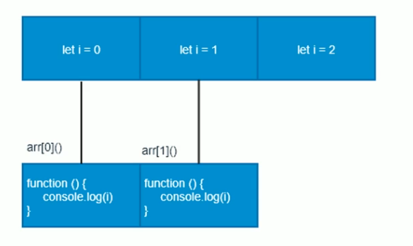

## ES6

### ES6 简介

#### 什么是 ES6

ES 的全称是 ECMAScript，它是由 ECMA 国际标准组织指定的一项脚本语言的标准化规范。 <br />


ES6 实际上是一个泛指，泛指 ES2015 及后续的版本。 <br />

#### 什么使用 ES6

每一次标准的诞生意味着语言的完善，功能的加强，javascript 语言本身也有一些令人不满意的地方。 <br />

- 变量提升特性增加了程序运行时的不可预测性
- 语法过于松散，实现相同的功能，不同的人可能会写出不同的代码
-

### ES6 的新增语法

#### let

ES6 中新增的用于声明变量的关键字。<br />

- let 声明的变量只在所处于的块级有效
- 使用 var 声明的变量不具备块级作用域特性
- 防止循环变量变成全局变量

```html
<script>
  // let 关键字就是用来声明变量的
  // 使用let关键字声明的变量具有换机作用域
  // let a = 10;
  // console.log(a);
  if (true) {
    let b = 20
    console.log(b)
    if (true) {
      let c = 30
    }
    console.log(c) // 无法访问
  }
  console.log(b) // 无法访问
</script>
```

:::tip 注意
使用 let 关键字声明的变量才具有块级作用域，使用 var 声明的变量不具备块级作用域特性
:::

```html
<script>
  // 使用 let 关键字声明的变量才具有块级作用域，使用 var 声明的变量不具备块级作用域特性
  if (true) {
    let num = 100
    var abc = 200
  }
  console.log(abc) // 200
  console.log(num) // 不能访问
</script>
```

```html
<script>
  // 防止循环变量变成全局变量
  // for (var i = 0; i < 2; i++) {}
  // console.log(i); // 2
  for (let i = 0; i < 2; i++) {}
  console.log(i) // 无法访问
</script>
```

- let 声明的变量，不存在变量提升

```js
console.log(a) // a 不是一个变量
let a = 20
```

- let 声明的变量，暂时性死区

```html
<script>
  // let 声明的变量，暂时性死区
  var tmp = 123
  if (true) {
    console.log(tmp)
    let tmp = 'abc'
  }
</script>
```

<strong> 经典面试题 1.0 </strong>

```js
var arr = []
for (var i = 0; i < 2; i++) {
  arr[i] = function () {
    console.log(i)
  }
}
arr[0]() // 2
arr[1]() // 2
```


:::tip 提示
经典面试题图解：此题的关键点在于变量 i 是全局的，函数执行时输出的都是全局作用域下的值。
:::
<strong> 经典面试题 2.0 </strong>

```js
let arr = []
for (let i = 0; i < 2; i++) {
  arr[i] = function () {
    console.log(i)
  }
}
arr[0]() // 0
arr[1]() // 1
```


:::tip 提示
经典面试题图解：此题关键在于每次循环都会产生一个块级作用域，每个块级作用域的变量都是不同的，函数执行时输出的是自己上一级（循环产生的块级作用域）作用域的值。
:::

#### const

作用：声明常量、常量就是值（内存地址），不能变化的量。 <br />

- 具有块级作用域

```html
<script>
  // const 关键字声明的常量具有块级作用域
  if (true) {
    const a = 10
    if (true) {
      const a = 20
      console.log(a) // 20
    }
    console.log(a) // 10
  }
  console.log(a) // 无法访问
</script>
```

- 声明常量时必须赋值

```html
<script>
  // 使用const 关键字声明的常量必须附初始值
  const PI // Missing initializer in const declaration
</script>
```

- const 关键字 声明的常量赋值后，值不能修改
  简单数据类型不能更改;，但是复杂数据类型，可以单独更改里面的值， 但是复杂数据类型的常量不能直接赋值。

```html
<script>
  // 使用const 关键字 声明的常量赋值后，值不能修改
  const PI = 3.14
  // PI = 100; // 不可更改 Assignment to constant variable.
  const arr = [100, 200]
  arr[0] = 'a'
  arr[1] = 'b'
  console.log(arr) // ["a", "b"]
  // arr 被给予一个新数组，内存地址发生变化，这是不被允许的
  arr = ['a', 'b'] // 不可更改 Assignment to constant variable.
</script>
```

#### let、const、var 的区别

- 使用 var 声明的变量，其作用域为该语句所在的函数内，且存在变量提升现象。
- 使用 let 声明的变量，其作用域为该语句所在的代码块内，不存在变量提升
- 使用 const 声明的是常量，在后面出现的代码块中不能再修改该常量的值。。


#### 解构赋值

ES6 中允许从数组中提取值，按照对应位置，对变量赋值，对象也可以实现解构。<br />

##### 数组解构

数组解构允许我们按照一一对应的关系从数组中提取值然后将值赋值给变量. <br />

```js
// 数组解构允许我们按照一一对应的关系从数组中提取值然后将值赋值给变量
let arr = [1, 2, 3]
let [a, b, c] = arr
// var [a, b, c] = [1, 2, 3];
console.log(a) // 1
console.log(b) // 2
console.log(c) // 3
```

如果解构不成功，变量的值为 undefined

```js
// 如果解构不成功，变量的值为undefined
let [foo] = []
console.log(foo) // undefined
let [bar, foo2] = [1]
console.log(bar) // 1
console.log(foo2) // undefined
```

##### 对象解构

对象解构允许我们使用变量的名字匹配对象属性，匹配成功将对象属性的值赋值给变量。 <br / >

```js
let person = { name: 'zhangsan', age: 20 }
let { name, age } = person
console.log(name) // 'zhangsan'
console.log(age) // 20
//对象解构允许我们使用变量的名字匹配对象属性，匹配成功将对象属性的值赋值给变量。
let { name: myName, age: myAge } = person
console.log(myName) // zhangsan
console.log(myAge) // 20
```

#### 箭头函数

ES6 新增的定义函数的方式. <br />

```js
;() => {}
const fn = () => {}
// 箭头函数是用来简化函数定义语法的
const fn = () => {
  console.log('你好，世界')
}
fn() // 你好，世界
```

<strong> 箭头函数的特点： </strong>

- 函数体中只有一句代码，且代码的执行结果就是返回值，可以省略大括号

```js
// 之前定义
function sum(num1, num2) {
  return num1 + num2
}
// 接头函数的写法
const sum = (num1, num2) => num1 + num2
// 函数体中只有一句代码，且代码的执行结果就是返回值，可以省略大括号
const num = (a, b) => a + b
const result = num(1, 2)
console.log(result) // 3
```

- 如果形参只有一个，可以省略小括号

```js
// 传统方式
function fn(n) {
  return n
}
// ES6 方式
const fn = (v) => v
// 在箭头函数中，如果形参只有一个，形参外侧的小括号也是可以省略的
const fn = (v) => {
  alert(v)
}
fn('你好，世界')
```

<strong> 箭头函数不绑定 this 关键字，箭头函数中的 this，指向的是函数定义位置上下文 this。 </strong> <br />

```html
<script>
  // 箭头函数不绑定this，箭头函数没有自己的this关键字，如果在箭头函数中使用this。
  // this关键字将指向箭头函数定义位置中的this
  const obj = { name: 'zhangsan' }
  function fn() {
    console.log(this)
    return () => {
      console.log(this)
    }
  }
  const resFn = fn.call(obj) // 第一个输出语句 ，this指向 obj
  resFn() // 第二个输出语句（箭头函数里的输出语句），this指向 obj
</script>
```

<strong> 箭头函数的面试题 </strong>

```html
<script>
  var age = '你好，世界'
  var obj = {
    age: 20,
    say: () => {
      alert(this.age) // this 指向window
    },
  }
  obj.say() // 你好，世界
</script>
```

#### 剩余参数

剩余参数语法允许我们将一个不定数量的参数表示为一个数组。 <br />

```js
function sum(first, ...args) {
  console.log(first) // 10
  console.log(args) // [20, 30]
}
sum(10, 20, 30)

const sum = (...args) => {
  let total = 0
  args.forEach((item) => (total += item))
  return total
}
console.log(sum(10, 20))
console.log(sum(10, 20, 30))
```

#### 剩余参数

剩余参数和解构配合使用 <br />

```js
let students = ['wangwu', 'zhangsan', 'lis']
let [s1, ...s2] = students
console.log(s1) //wangwu
console.log(s2) //["zhangsan", "lis"]
```

### ES6 的内置对象扩展

#### Array 的扩展方法

- 扩版运算符（展开语法）
  扩版运算符可以将数组或者对象转为用逗号分隔的参数序列。 <br />

```js
// 扩版运算符可以将数组拆分成以逗号分隔的参数序列
let arr = ['a', 'b', 'c']
// ...arr // 'a', 'b', 'c'
console.log(...arr) // a b c
// 相当于
console.log('a', 'b', 'c') // a b c
```

- 扩展运算符的应用
  扩版运算符可以应用于合并数组。<br />

```js
// 方法一
// 扩展运算符应用于数组合并
let arr1 = [1, 2, 3]
let arr2 = [4, 5, 6]
// ...arr1 // 1, 2, 3
// ...arr2 // 4, 5, 6
let arr3 = [...arr1, ...arr2]
console.log(arr3) // [1, 2, 3, 4, 5, 6]
// 方法二
let arr1 = [1, 2, 3]
let arr2 = [4, 5, 6]
// 相当于
arr1.push(4, 5, 6)
arr1.push(...arr2)
console.log(arr1) // [1, 2, 3, 4, 5, 6]
```

- 扩展运算符应用场景，将伪数组或者遍历对象转换为真正的数组

```html
<div>1</div>
<div>2</div>
<div>3</div>
<div>4</div>
<script>
  // 伪数组不可以使用数组方法，但是转换成数组以后，可以使用数组的方法
  let oDivs = document.getElementsByTagName('div')
  console.log(oDivs)
  var arr = [...oDivs]
  arr.push('a')
  console.log(arr)
</script>
```

- 构造函数方法：Array.from()
  将类数组或者可遍历对象转换为真正的数组。 <br />

```js
let arrayLike = {
  0: '张三',
  1: '李四',
  2: '王五',
  length: 3,
}
let arr2 = Araay.from(arrayLike) // ["a", "b", "c"]
```

Array.from() 方法可以接收第二个参数，作用类似于数组 map 方法，用来对每个元素处理，将处理后的值放入返回的数组。 <br />

```js
let arrayLike = {
  0: '1',
  1: '2',
  2: '3',
  length: 3,
}
let newArr = Array.from(arrayLike, (item) => item * 2)
console.log(newArr) // [2, 4, 6]
```

<strong> 实例方法： fund() </strong>
用于找出第一个符合条件的数组成员，如果没有找到返回 undefined。 <br />

```js
let arr = [
  {
    id: 1,
    name: '张三',
  },
  {
    id: 2,
    name: '李四',
  },
]
let target = arr.find((item, index) => item.id == 2)
console.log(target)
```

<strong> 实例方法： findindex() </strong>
用于找出第一个符合条件的数组成员的位置，如果没有找到返回-1 <br />

```js
let arr = [1, 5, 10, 15]
let index = arr.findIndex((value, index) => value > 9)
console.log(index) // 2
```

<strong> 实例方法： includes() </strong>
表示某个数组是否包含给定的值，返回布尔值。 <br />

```js
let arr = [1, 2, 3]
console.log(arr.includes(2)) // false
console.log(arr.includes(4)) //true
```

- String 的扩展方法
  </strong> 模板字符 </strong>
  ES5 新增的创建字符串的方式，使用反引号(tab 键上面的那个键的符号)定义。 <br />

```js
let name = `这是一个模板字符串`
console.log(name) // 这是一个模板字符串
// 特点1 可以使用${} 来调用变量
let name = `张三`
let sayHello = `Hrllo,我的名字叫做 ${name}`
console.log(sayHello) // Hrllo,我的名字叫做 张三

// 特点2 可以保持换行
// html
  <div>
    <span></span>
    <span></span>
  </div>
// js
let result = {
  name: 'zhangsan',
  age: 20
}
let html = `
<div>
  <span>${result.name}</span>
  <span>${result.age}</span>
</div>
`;
console.log(html);
// 最后输出结果如下
// <div>
//   <span>zhangsan</span>
//   <span>20</span>
// </div>

//特点3 模板字符串中可以调用函数
const fn = function() {
  return '我是一个函数'
}
let greet = `${fn()} 我是一个模板字符串`
console.log(greet) // 我是一个函数 我是一个模板字符串
```

<strong> 实例方法：statsWith() 和 endsWith() </strong>

starsWith() : 表示参数字符串是否在原字符串的头部，返回布尔值。 <br />
endsWith() : 表示参数字符串是否在源字符串的尾部，返回布尔值。 <br />

```js
let str = 'Hello World!'
var r1 = str.startsWith('Hello') // true
console.log(r1)
var r2 = str.endsWith('!') // true
console.log(r2)
```

<strong> 实例方法：repeat() </strong>
repeat 方法表示将原来字符串重复 n 次，返回一个新字符串. <br />

```js
let str = '你好'
let newstr = str.repeat(3)
console.log(newstr) // 你好你好你好
console.log('6'.repeat(6)) //666666
```

#### Set 数据结构

ES6 提供了新的数据结构 Set，它类似于数组，但是成员的值都是唯一的，没有重复的值。 <br />

Set 本身是一个构造函数，用来生成 Set 数据结构。 <br />

```js
const s = new Set()
console.log(s1.size) // 0
```

Set 函数可以接受一个数组作为参数，用来初始化. <br />

```js
const s2 = new Set([1, 2, 3, 4, 4])
console.log(s2) // {1, 2, 3, 4}
console.log(s2.size) // 4
```

利用 Set 可以数组去重。 <br />

```js
let arr = [1, 1, 2, 2, 3, 3]
let newarr = new Set(arr)
let newnewarr = [...newarr]
console.log(newnewarr) // [1, 2, 3]
```

##### 实例方法

- add(value): 添加某个值，返回 Set 结构本身
- delete(value): 删除某个值，返回一个布尔值，表示删除是否成功
- has(value): 返回一个布尔值，表示该值是否为 Set 成员
- clear()： 清除所有成员，没有返回值

```js
const s = new Set()
s.add(1).add(2).add(3) // 向set 结构中添加值
s.delete(1) // 删除set 结构中的1值
a, has(2) // 表示set 结构中是否有 2 这个值，返回布尔值
s.clear() // 清除set 结构中所有值
```

- 遍历
  Set 结构的实例与数组一样，也拥有 forEach 方法，用于每个成员执行某种操作，没有返回值。 <br />

```js
const s = new Set()
s.add('Hello World').add('你好 世界')
s.forEach((value) => console.log(value))
const s5 = new Set(['a', 'b', 'c'])
s.forEach((value) => console.log(value))
```
