## HTML 语法规范
#### 1.成对出现
```html
<html> </html>
<br />
```
#### 2.标签关系
1.包含关系
```html
<head>
    <title> </title>
</head>
```
2.并列关系
```html
<head> </head>
<body> </body>
```
## HTML 基本结构标签
html---根标签
head---文档头部
title---文档标题
body---文档主体

```html
<html> 
    <head> 
        <title>我的第一个页面</title>
    </head>
    <body>
        我的第一个HTML页面。
    </body>
</html>
```
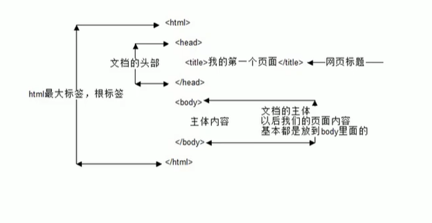 

## 标题语义

#### 1.标题标签
特点：独占一行，加粗，一共六级。 
```html
<h1> </h1>
```
#### 2.段落和换行标签
```html
<p> </p>
<br />
```
#### 3.文本格式化
需求：突出重点
```html
 <strong> </strong> <!--加粗标签,语义比下面的强烈-->
 <b> </b> <!--加粗标签--> 
 <em> </em> <!--倾斜标签,语义比下面的强烈-->
 <i> </i> <!--倾斜标签-->
 <del> </del> <!--删除标签,语义比下面的强烈-->
 <s> </s> <!--删除标签-->
 <ins> </ins><!--下划线标签-->
 <u> </u> <!--下划线标签,语义比下面的强烈-->
```
#### 4.div和span标签
特色：没有语义
div：一个占一行，超大的盒子。
span:一行可以放好多，所以叫跨行。
```html
<div> </div> <!--表示分割，分区-->
<span> </span> <!--跨度，跨距-->
```
#### 5.图像标签和路径 （标签）
src是标签的必须属性。
```html

```
img 的 <strong>alt</strong> 属性：替换文本档图片不显示使用文字替换。
```html

```
img 的 <strong>tltle</strong> 属性：鼠标放到图片上，提示的文字。
```html

```
img 的 <strong>width</strong> 属性：给图片设定宽度。
```html

```
img 的 <strong>height</strong> 属性：给图片设定高度。
```html

```
<b>提示：一般情况下宽度换高度只设定一个</b>
img 的 <strong>border</strong> 属性：给图片设定边框。
```html

```
<b>提示：属性之间没有循序之分，但是属性之间必须要有 空格</b>

#### 6.图像标签和路径 （路径）
<b>1.目录</b>
含有HTML文件夹叫目录文件夹 <br />
打开目录文件夹的这个目录叫根目录 <br />
<b>2.路径</b> <br />
(1)相对路径 <br />
同级路径：/图片名 <br />
下一级路径 ：文件夹名/图片名 <br />
上一级路径 ：../图片名 <br />
(2)绝对路径 <br />
图片的超链 <br />
完整的图片路径 用到的 <b>\</b> <br />

#### 7.超链接标签
链接：外部链接和内部链接 <br />
空连接
```html
<a href="#' target="目标窗口弹出的方式" > </a>
```
网页元素链接
```html
<a href="#' > </a>
```
锚点链接：快速定位页面的某个位置
```html
<a href="#two'> </a>
<h1 id+"teo"> </h1>
```
作用：从一个页面链接到另一个页面 <br />
<b>href</b> 属性：必要属性 <br />
<b>target</b> 属性：目标窗口弹出的方式 <br />
target="_self" 当前窗口打开，这个是默认的  <br />
target="_blank" 新建窗口打开 <br />
```html
<a href="目标地址' target="目标窗口弹出的方式" > </a>
```

#### 8.注释标签
```html
<!--注释的文件-->
```

#### 9. 特殊字符
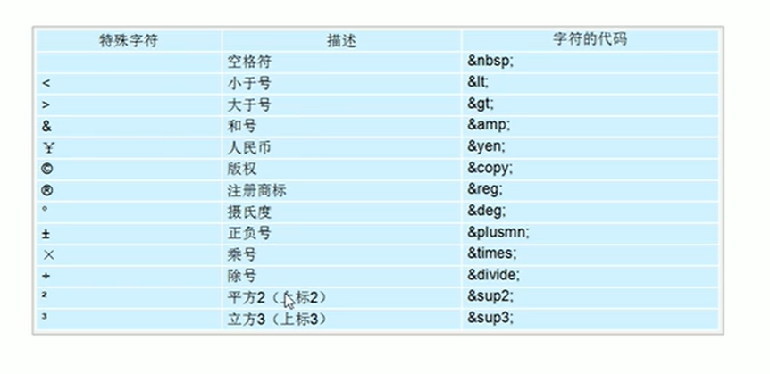

## 表格标签
#### 1.表格的主要作用
表格主要用于<strong>显示、展示数据</strong>
#### 2.表格的基本语法
<strong>table:是用于定义表格标签<br />
tr:用于定义表格中的行，必须镶嵌在table标签中。<br />
td：用于定义表格中的单元格，必须镶嵌在tr标签中。<br />
</strong>
```html
<table>
    <tr>
        <td>单元格内的文字</td>
        ...
    </tr>
    ...
</table>
```

#### 3.标头单元格标签
一般表头单元格位于表格的第一行或者第一列，表头单元格里面的内容<strong>加粗居中显示</strong>来突出重要性
```html
<table>
    <tr>
        <th>姓名</th>
        ...
    </tr>
    ...
</table>
```
#### 4.表格属性
aligen:位于网页left(左对齐)、center(居中)、right（右对齐）
border：加边框
cellpadding:文字到单元边框的距离
cellspacing:单元表框到单元边框的距离 默认值为2
with,heght;改变单元格的宽和高
```html
<table aligen=“center” border="1" cellpadding=“2” cellspacing=“0” with="500" height="500">
    <tr>
        <th>姓名</th>
        ...
    </tr>
    ...
</table>
```

#### 5.表格结构标签
```html
<table>
    <thead>
        <tr>
            <th>姓名</th>
            ...
        </tr>
    </thead>
    <tbody>
        <tr>
            <td>表格内容</td>
            ...
        </tr>
        ...
    </tbody>
</table>
```

#### 6.合并单元格
在特殊情况下，可以把多个单元格合并成一个单元格 <br />
（1）合并单元的方式 <br />
跨行合并：rowspan="合并单元格的个数" <br />
跨列合并：colspan="合并单元格的个数" <br />
（2）目标单元格 <br />
跨行合并：最上侧单元格为目标单元格，写合并代码 <br />
跨列合并：最左侧单元格为目标单元格，写合并代码 <br />
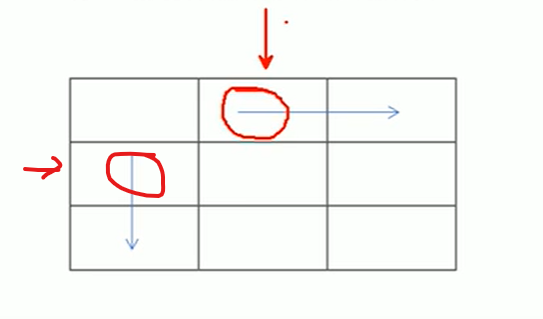
（3）合并单元格的步骤
1,先确定跨行，还是跨列 <br />
2.找到目标单元格 <br />
```html
 <td clospan="2"></td>
```
3.删除多余的单元格

#### 7.表格总结
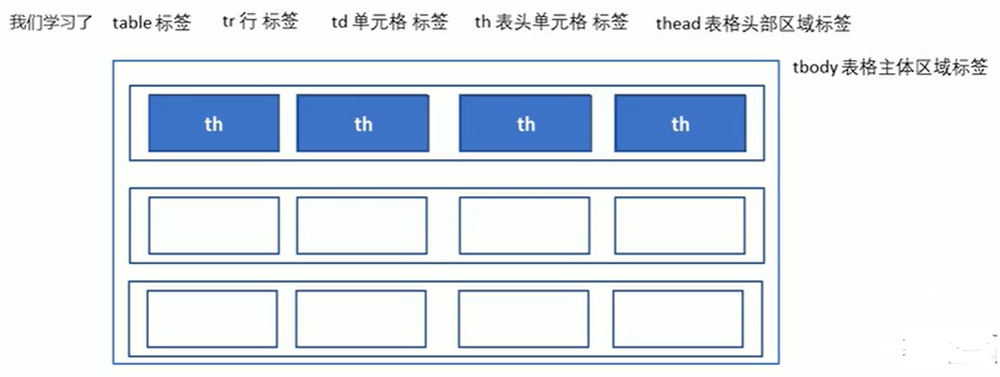

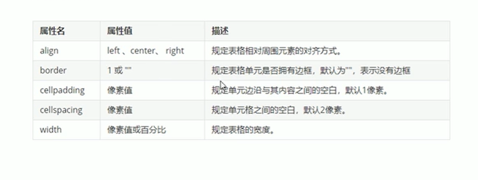

## 列表标签

#### 1.无须列表（重点）
没有循序之分，是并列的。
```html
<ul>
    <li>列表1</li>
    <li>列表2</li>
    <li>列表3</li>
</ul>
```
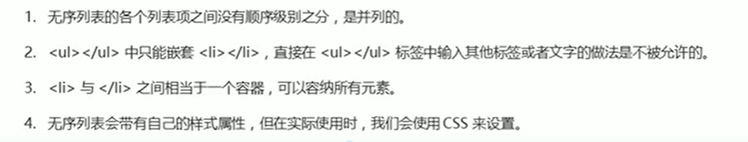

#### 2.有序列表（理解）

```html
<ol>
    <li>列表1</li>
    <li>列表2</li>
    <li>列表3</li>
</ol>
```

#### 30自定义列表（重点）
```html
<dl>
    <dt>名词1</dt>
    <dd>名词1解释2</dd>
    <dd>名词1解释2</dd>
</dl>

```
## CSS
### 1. 语法规范
有两部分组成：选择器和申明的样式
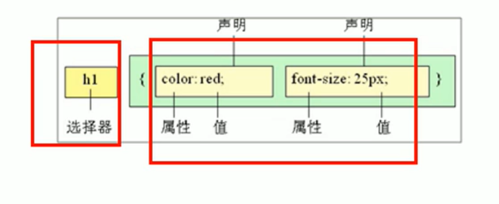

```html
<head>
    <style>
    /* CSS代码：给谁改样式 { 改什么样式} */
    </style>
</head>
```

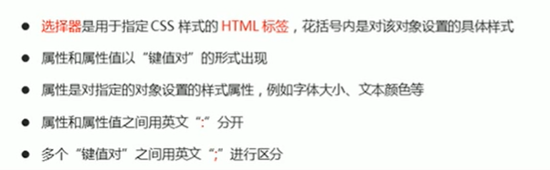

### 2.CSS基础选择器
（1）选择器的作用 <br />
更具不同需求不同标签然后选择出来 <br />

（2）选择器的分类 <br />
基础选择器:标签选择器，类选择器，通配符选择器，id选择器 <br />
标签选择器语法:
```css
标签名{
    属性1：属性值1；
    属性2：属性值2；
    属性3：属性值3；
}
```
类选择器：可以单独选一个或者多个标签 <br />
语法：<strong>注意选择的时候类名前面有一个" ."</strong> <br />
<a href="https://www.cnblogs.com/menggirl23/archive/2019/12/09/12012351.html" target="_blank">类命名规范</a>
```css
.类名{
    属性1：属性值1；
    ...
}
<div class="类名"></div>
```
类选择器--多类名 <br />
使用方法：标签中可写多个类名，但是类名之间必须要用 <strong>空格</strong> 隔开 <br />

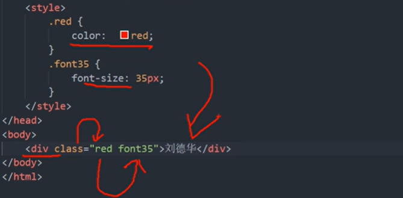

id选择器：<br />
<srtong>id只能调用一次</strong>

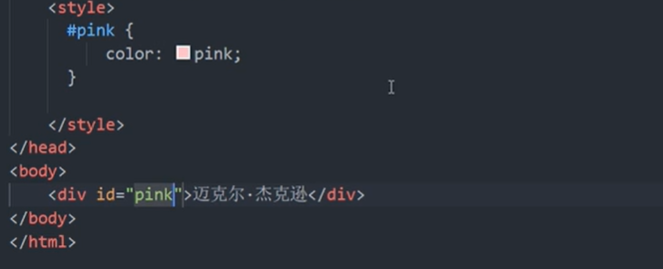

通配符选择器：<br />
可以选取页面的所有元素。<br />
语法 
```css
* {
    属性1：属性值1；
    ...
}
```
<strong>总结</strong>

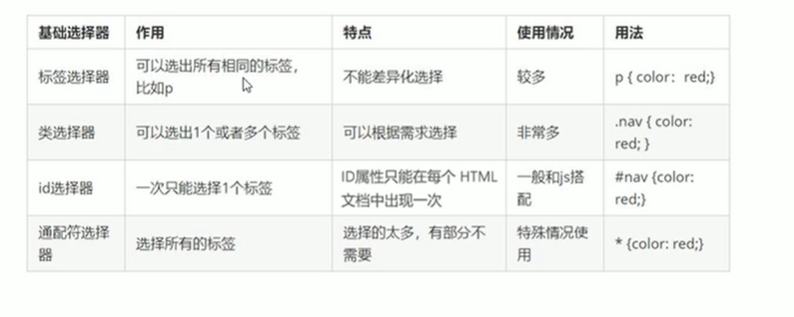
复合选择器<br />

### 3.CSS字体属性
（1）字体系列 <br />
语法：
```css
p{
    font-famly:"微软雅黑"；
}
div{
    font-famly:“字体1”,“字体2”,“字体3”;
}
```
（2）字体大小 <br />
如果需要单独去修改标题的字体大小需要单独去修改。 <br />
语法：
```css
p {
    font-size:18px;
}
```
(3)字体粗细 <br />
语法：
```css
font-weight: bold(加粗)；
font-weight: 700（加粗）;
font-weight:normal(正常)；
font-weight:400(正常);
```
（4）文字样式 <br />
语法：
```css
font-stlye:italic(斜体);
font-stlye:normal(正常);
```
（5）字体复属性
```css
正常使用：
div {
    font-style:italic;
    font-weight:700;
    font-size:16px;
    font-family:"Microsoft YaHei";
}
复合属性，注意顺序不能替换,字体大小和字体样式不能省：
div {
    font:font-stlye font-weight font-size/line-height font-family;
    font:italic 700 16px "Microsoft YaHei"；
    font:16px "Microsoft YaHei"
}
```

（6）字体属性总结
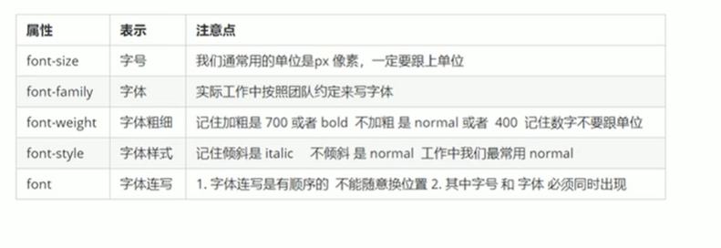

### 4.CSS文本属性
（1）文本颜色

```css
color:pink;
color:#ff0000;
color:rgb(255,0,0,);
```

（2）文本对齐<br />
<trong>text-align</strong> 属性只能设置水平对齐方式。

```css
text-align:left 左对齐
text-align:right 右对齐
text-align:center 居中对齐
```
(3)装饰文本<br />
<strong>text-decoration</strong>属性是添加文本修饰的，可以给文本添加下划线，删除线，上划线等。

```
text-decoration: none 默认
text-decoration: underline 下划线
text-decoration: overline 上划线
text-decoration: line-through 删除线
```

（4）文本缩进 <br />
<strong>text-indent</strong>属性雨来文本的第一行缩进

```css
text-indent:20px;
2em是当前文字两个字大小的距离
text-indent:2em;
```

（5）行间距 <br />
<strong>line-height</strong>属性用具设置行间的距离

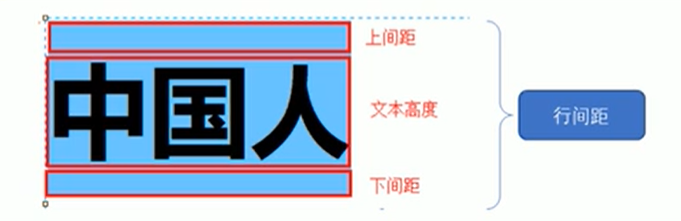
```css
line-height:20px;
```

### 5.CSS引入方式
（1）行内样式表（行内式）

```css
<style>
    样式
</style>
```
（2）内部样式表（嵌入式）

```css
<div style="color: pink font-size:18px;"> </dev>
```
（3）外部样式表（链接式） <br />
1.新建一个CSS文件 <br />
2.引入CSS

```css
<link rel="stylesheet" href="CSS文件的路径">
```

### 6.Emmet语法

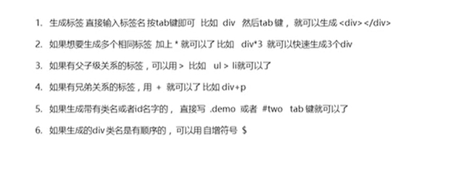

### 7.CSS复合选择器
(1)后代选择器
```css
ol li {
    color: pink;
}

<ol>
    <li> </li>
</ol>

.nav li{
    color: pink;
}

<ol class="nav">
    <li> </li>
</ol>
```

(2))子选择器
```css
.nav>a {
    color:pink;
}
<div class="nav">
    <a href="#">我是儿子</a> （选择出这个）
    <p>
        <a href="#">我是孙子</a>
    </p>
<div>
```
（3）并级选择器
```css
div,
p {
    color:pink;
}
<div> </div>
<p> </p>
```

（4）伪类选择器
<strong>这几个顺序不能替换</strong>
```css
/* 选择0未被访问的链接 */
a:link{
    color:#333;
    text-decoration: none; 
}
a:visited  选择已被访问的链接
a:hover  选择鼠标指针位于其上的链接
a:active  选择活动链接
```

### 8.CSS的元素显示模式
（1）块元素 <br />
常见的块有<strong>h1~h6,dev,p,ul,ol,li</strong> 其中div是典型的块元素 <br />
块元素的特点：<br />

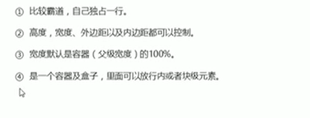

（2）行内元素 <br />
块元素的特点：<br />
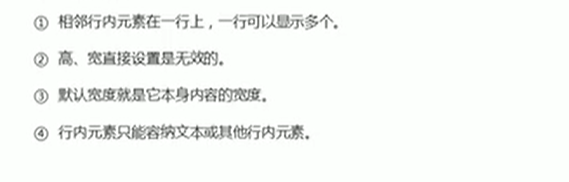

（3）行内块元素 <br />
常见的行内块元素：<strong>img</strong> <br />
行内块元素的特点：

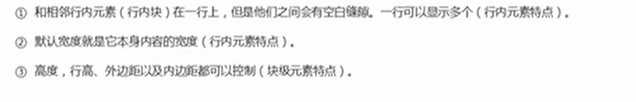

(4)元素显示模式的转换

```css
display:block; 转换为块元素
display:inline; 转换为行内元素
display:inline-block; 转换为行内块元素
```

（5）小技巧，单行文字垂直居中
<strong>让文字的行高等于盒子的高度</strong>

```css
height:40px;
line-height:40px;
```
原理：
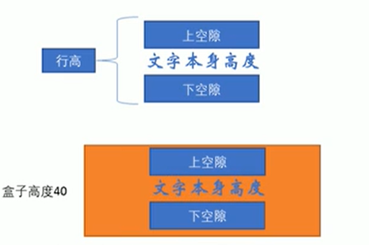

### 9.CSS的背景
背景属性可以设置背景颜色，背景图片，背景平铺，背景图片位置，背景图片固定等 <br />

(1)背景颜色
```css
background-color:transparent；透明，默认。
background-color:颜色值；
```

（2）背景图片
```css
background-image:none; 默认
background-image:url(图片地址);
```

（3）背景平铺
```css
background-repeat: repeat; 平铺，默认。
background-repeat: no-repeat; 不平铺
background-repeat: repeat-x; x轴平铺
background-repeat: repeat-y; y轴平铺
```

（4）背景图片的位置 <br />
<strong>background-position</strong>属性可以改变图片在背景中的位置。

```css
参数代表的意思：x坐标和y坐标，可以使用 '方位名词"或者"精确坐标"
background-position: center top; 可以无顺序，如果省略一个，另一个默认值是居中。 
background-position: x y; 必须以 x，y的顺序。
background-position: 20px 50px; 必须以 x，y的顺序。
background-position: 20px center; 可以是混合的但是顺序必须是 x，y的顺序。
```

（5）背景图像固定 （背景附着） <br />
这个图像是随着页面的滚动还是固定

```css
background-attachment: scroll; 滚动，默认。
background-attachment: fixed; 固定；
```

（5）背景复合写法 <br />
下面的顺序 没有特定的顺序，但是一般习惯为下面的顺序。
```css
backgroud:背景颜色 背景图片地址 背景平铺 背景图像滚动 背景图片位置
```

(6) 背景色半透明 <br />
修改的是背景颜色，盒子内容不受影响。
实现方法：
```css
background:rgba(0,0,0,0.3); a是alpha透明度的意思，取值为0~1之间。
```
### 10 CSS的三大特性
（1）层叠性 <br />
样式冲突：就近原则，那个样式离结构近，就执行那个样式。 <br />
样式不冲突：不会层叠。 <br />
(2)继承性 <br />
子标签会继承一些父标签的样式。 <br />
子标签可以继承父元素的（text,font,line 这些元素开头的可以继承，以及color属性）
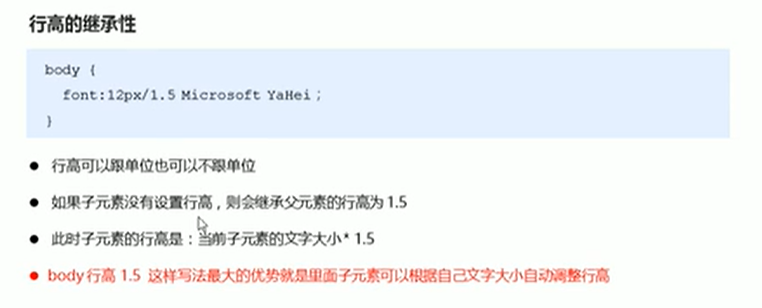

（3）优先级 <br />
选择器相同时，则执行层叠性。 <br />
选择器不同时，根据选择器权重执行。 <br />
```css
通配符选择器 < 元素选择器 < 类选择器和伪类选择器 < ID选择器 < 行内样式 < ！important
div {
    color:pink!important;
}
```
<strong>在有继承性的权重会变为0，复合选择器会有权重叠加的问题。</strong>

### 11.CSS盒子模型
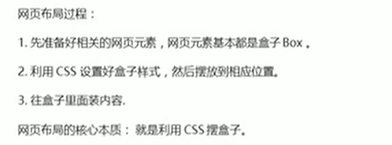

（1）盒子模型的组成 <br />
包括：<strong>border</strong> 边框，<strong>content</strong> 外边距，<strong>padding</strong> 内边距 和 <strong>margin</strong> 实际内容 <br />

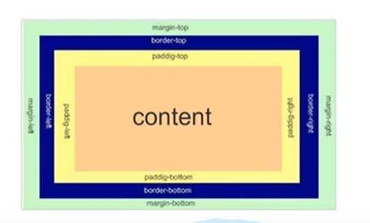

(2)边框（border） <br />
边框组成：边框粗细，边框样式，边框颜色。

```css
border-width: 5px; 边框的粗细
border-style: soild；实线边框 dashed; 虚线边框 dotted; 点线边框
border-volor: pink; 边框颜色
```
边框复合写法：<br />
没有规定顺序，一般以下的写法。
```css
border: 1px soild red;
border-top: 5px soild pink;
border-bottom: 10px soild red;
```
表格的细线边框：<br />
以下代码表示相邻边框合并一起。
```css
border-collapse:collapse;
```
<strong>边框会影响盒子的大小</strong>

（3）内边距(padding) <br />
```css
padding-left: 20px;
padding-top: 20px;
padding-right: 20px;
padding-bottom: 20px;
padding: 5px; 上下左右都有5px的内边距。
padding: 5px 10px; 上下是5px，左右是10px；
padding：5px 10px 20px; 上是5px，左右是10px，下是20px；
padding: 5px 10px 20px 30px; 上是5px，右是10px，下是20px，左是30px，
```
<strong> 内边距会影响盒子的大小 </strong>

(3) 外边距（margin）
```css
margin-left: 20px;
margin-top: 20px;
margin-right: 20px;
margin-bottom: 20px;
marfin: 5px; 上下左右都有5px的外边距。
margin: 5px 10px; 上下是5px，左右是10px；
margin：5px 10px 20px; 上是5px，左右是10px，下是20px；
margin: 5px 10px 20px 30px; 上是5px，右是10px，下是20px，左是30px，
```
外边距典型应用：<br />
使盒子水平居中，满足两个条件：<br />
盒子指定了宽度，盒子的左右外边距都设置为auto。

```css
.header {
    width:960px;
    margin: 0 auto;
}
```
外边距合并：<br />
相邻块元素垂直外边距的合并 <br />
解决方法：尽量只给一个盒子添加 <strong> margin </strong> <br />
镶嵌块元素垂直外边距的塌陷 <br />
解决方法：<br />
给父元素定义上边框 <br />
给父元素定义上内边距 <br />

```css
overflow: hidder; 给父元素添加
```

（4）清除网页元素的内外边距 <br />
```
* {
    apdding:0; 清除内边距
    margin: 0; 清除外边距
}
```
<strong>小提示：行内块元素尽量只设置左右的外边距</strong>

### 12.PS基本操作

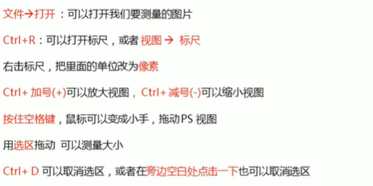

### 13.圆角边框
语法：
```css
border-radius: 10px；
border-radius: 50%；
border-radius: 10px 20px 30px 40px; 依次是左上 右上 右下 左下，按顺时针。
border-radius: 10px 20px； 左上右下10px，右上左下20px，对角相同数值。
```

### 14.盒子阴影
语法：
```css
box-shadow: h-shadow v-shadow blur spread color;
box-shadow: 10px 10px 10px 10px rgba(0,0,0,0.3);
```
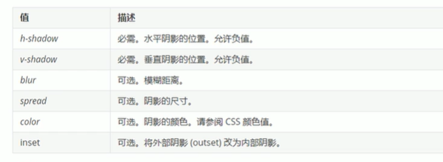

<strong>不影响盒子的大小 和 盒子的位置 </strong>

### 15.CSS盒子浮动

<strong>浮动（float）</strong> <br />
(1)传统网页布局的三种方式 <br />
普通流，浮动，定位。 <br />

(2) 浮动 <br />
浮动可以改变标签博人的排列方式。 <br />
<strong>网页布局的第一准则：多个块级元素纵向排列找标准流，多个块级元素横向排列找浮动</strong> <br />
语法：<br />
```
float: none; 不浮动，默认值。
float: left; 元素向左浮动。
float: right; 元素向右浮动。
```
（2）浮动的特性 <br />
1.浮动元素会脱离标准流的控制（脱标） <br />
<strong>浮动的盒子不保留原先的位置</strong> <br />

2.所有浮动的元素会一行内显示并且元素顶部对齐 <br />

3.浮动的元素会具有行内块元素的特性 <br />
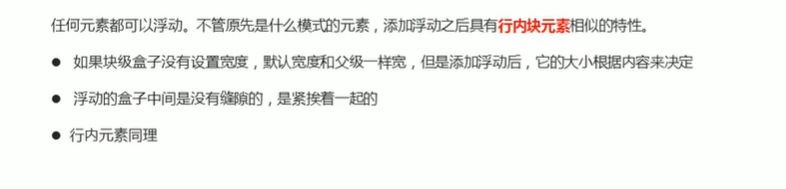

（3）浮动元素经常和标准流父级搭配使用 <br />
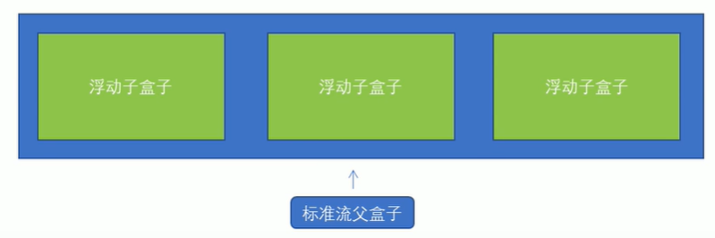

(4)常见网页布局

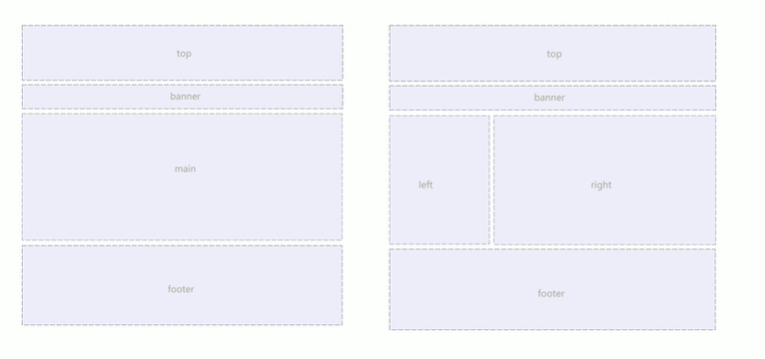

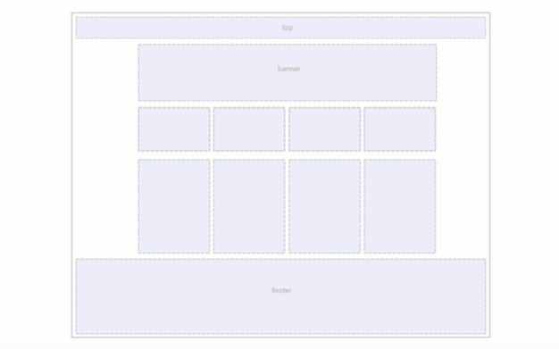

（5）浮动布局注意点 <br />
1. 浮动和标准流的父盒子搭配使用。 <be />
2. 一个元素浮动了，理论上的其余的兄弟元素也要浮动。 <br />
<strong> 浮动的盒子只会影响浮动盒子后面的标准流，不会影响前面的标准流。</strong>

（6）清除浮动<br />
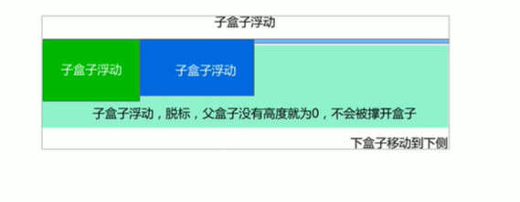

清除浮动的策略是：闭合浮动。 <br />

清除浮动的方法： <br />
1. 额外标签法也称为隔墙法，是W3C推荐的做法 <br />
```css
<style>
    .clear {
        clear: both;
    }
</style>
<div>
    最后一个浮动的盒子。
    <div class="clear"></div> 这个额外标签，必须为块级元素。
</div>
```

2. 父级添加 <strong>overflow </strong>属性 <br />
```css
<style>
    .box {
        overflow:hidden;
    }
</style>
<div class="box">
    浮动的盒子。
    ...
</div>
```

3. 腹肌添加<strong> :affter </strong>伪元素 <br />
```css
<style>
    .clearfix:after {
        content: "";
        display: block;
        height: 0;
        clear: both;
        visibility: hidden;
    }
</style>
<div class="clearfix">
    浮动的盒子。
    ...
</div>
```

4. 父级添加双伪元素 <br />
```css
<style>
    .clearfix:after,
    .clearfix:before {
        content: "";
        display: table;
    }

    .clearfix:after {
        clear: both;
    }
</style>
<div class="clearfix">
    浮动的盒子。
    ...
</div>
```

(7) 清除浮动总结 
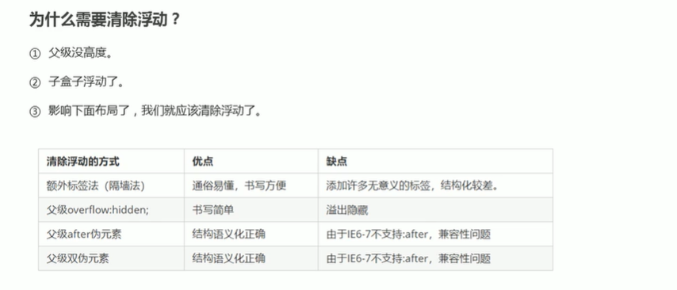

### 16.PS截图

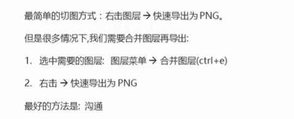

PS切图工具：<a href="https://www.cutterman.cn/zh/cutterman" target="_blank">下载 </a>

### 17. CSS书写顺序
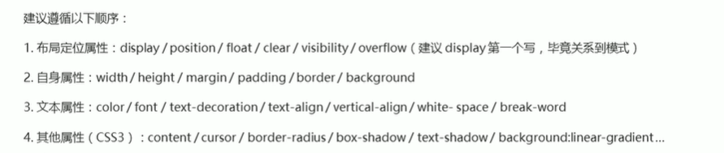

### 18.定位
定义：将盒子固定到某个位置。 <br />
（1）定位的组成 <br />
定位模式：用指定一个元素在文档中的定位方式<br />
边偏移:则决定了该元素的最终位置<br />

（2）静态定位 static <br />
<strong>特点：</strong> <br />
静态定位按照标准流特性摆放位置，没有边偏移。 <br />
静态定位在布局中很少用到。 <br />
语法: <br />

```css
position: staric;
```

(3)相对定位 relative <br />
<strong>特点：</strong> <br />
相对定位的元素在移动位置的时候，相对于 自己原来的位置来移动的。 <br />
虽然相对元素移动了，但是原来的位置依旧<strong>占有</strong>。 <br />
语法：
```
position: relative;
```
(4)绝对定位 absolute <br />
绝对定位是元素移动的时候，是相对于他的 <strong>相对元素</strong> 来说的。 <br />
<strong>特点：</strong> <br />
如果没有<storng>祖先元素</strong>或者祖先元素没有定位，则以浏览器为准定位。 <br />
如果祖先元素有定位（相对、绝对、固定定位），则以最近一级的有定位的祖先元素为参考点移动。 <br />
绝对定位移动了，原有位置<strong>不保留</strong>。 <br />
语法： 
```css
position: absolute;
```

(5)子绝父相的由来 <br />
子级绝对定位，不会占有位置，可以放到父盒子的里面的任何一个地方,不会影响其他的兄弟盒子。<br />
父盒子需要加定位限制子盒子在父盒子内显示。 <br />
父盒子在布局时，需要占有位置，因此父盒子只能加相对定位。 <br />

(6)固定定位 fixed <br />
固定定位可以使元素固定与浏览器可视区的位置，主要使用场景：可以在浏览器滚动时元素的位置不会改变。 <br />
<strong>特点：</strong> <br />
是以浏览器可视窗口为参照点移动位置。 <br />
跟父元素没有任何关系。 <br />
不随滚动条而滚动。 <br />
固定定位不占有原来的位置 <br />
语法：
```css
position: fixed;
```
<strong>小技巧：固定在版心右侧位置</strong> <br />
1. 让固定定位的盒子left：60%，走到浏览器的可视区的一般的位置。 <br />
2. 让固定定位的盒子margin-left：版心宽度的一般位置。多走版心宽度的一半。 <br />
<strong>特点：</strong> <br />
以浏览器的可视窗口为参考点移动位置。 <br />
粘性定位是<>strong占有原来的位置</strong>的。 <br />
必须添加 top、left、right、bottom 其中的一个才有效果。 <br />

(7)粘性定位 sticky <br />
语法：
```css
position: sticky; 
top:10px;
```

(8)定位的总结 <br />

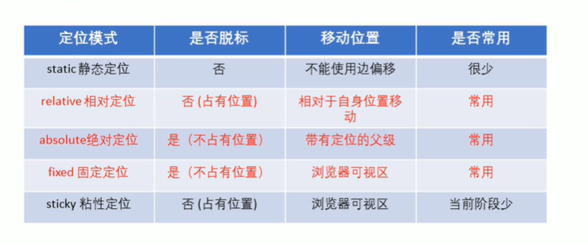

(9)定位的叠放顺序 <br />
在使用定位布局的时候，可能会出现盒子重叠的情况，此时，可以使用<strong>z-index </strong> 来控制盒子的前后顺序 (z轴) <br />
语法:
```
选择器 {
    z-index: 1;
}
```
数值可以是正整数，负整数或者是 0 默认值是auto，数值越大，盒子越靠上。 <br>
如滚属性值相同，则按照书写顺序，后来居上。 <br />

(9) 定位的拓展 <br />
1. 绝对定位的盒子居中 <br />
加了绝对定位的盒子不能通过<strong>margin: 0 auto; </strong> 水平居中。 <br />
```css
position: absolute;
left: 50%;
margin-left: 盒子宽度的一半;
```

2.定位的特殊特性 <br />
行内元素添加绝对或者固定定位，可以直接设置高度和宽度。<br />
块级元素添加绝对或固定定位，如果不给高度宽度，默认大小是内容大小 <br />

3.绝对定位（固定定位）会完全压住盒子 <br />
浮动元素不同，只会压住它下面标准流的盒子，但是不会压住标准流盒子里面的文字或者图片。 <br />
但是绝对定位（固定定位）会完全压住标准流所有内容。 <br />

(10) 元素的显示与隐藏 <br />
1. display 属性。 <br />
特性: 隐藏元素以后，不再占有原来的位置。 <br />
语法：
```css
display: none; 隐藏元素
display: block; 除了转换块级元素，还可以显示元素
```

2. visibility 可见性 <br />
特性：隐藏元素以后，还是占有原来的位置。 <br />
语法：
```css
visibility: visible; 元素可见
visibility: hidden; 耶稣隐藏
```

3. overflow 溢出 <br />
语法：
```css
overflow: visible; 显示溢出的部分
overflow: hidden; 隐藏溢出的部分
overflow:  scroll; 溢出的部分显示滚动条，不溢出也显示滚动条
overflow: auto; 在需要的时候添加滚动条
```

## CSS高级技巧

(1)精灵图 <br />

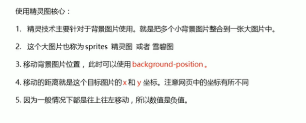

(2)CSS三角 <br />
语法：
```css
div {
    width: 0px;
    height: 0px;
    line-height: 0; 照顾兼容性
    font-size: 0; 照顾兼容性
    border: 5px soild transparent;
    border-left-color: pink;
}
```

（3） CSS用户界面样式 <br />
1. 鼠标样式 cursor <br />
语法：
```css
cursor: default; 小白 默认
cursor: pointer 小手
cursor: move 移动
cursor: text 文本
cursor: not-allowed 禁止
```

2.轮廓线 <br />
语法： 
```css
outline: none; 取消鼠标停放轮廓线
textarea {
    resize: none; 防止拖拽文本域
    outline: none;
}
```

（4）vertical-align 属性应用 <br />
用于设置一个元素的垂直对齐方式，但是指针对行内元素或者行内块元素。 <br />
语法：
```css
img {
    vertical-align: bottom; 文字和图片底线对齐
    vertical-align: middle; 文字和图片中线对齐
    vertical-align: top; 文字和图片顶线对齐
}
```

（5）溢出文字省略号显示 <br />
语法：
```
white-space: nowrap; 强制一行内显示文本，默认 normal 自动换行
overflow: hidden; 超出部分隐藏
text-overflow: ellipsis; 文字用省略号替代超出的部分
```
(6)多行文本溢出显示省略号 <br />
语法：
```css
overflow: hiffen; 超出部分隐藏
text-overflow: ellipsis; 文字用省略号替代超出的部分
display: -webkit-box; 弹性伸缩盒子模型显示
-webkit-line-clamp: 2; 限制在一个块元素显示的文本的行数
-webkit-box-orient: wertical; 设置或检索伸缩盒对象的子元素的排列方式
```

（7）常见布局技巧 <br />
1. margin 负值应用 <br />
如果几个有边框的盒子一起浮动会出现边框1+1=2<br />
如果这几个盒子都加左浮动-1 边框就会重叠。
语法：
```
margin: -1;
```
2. 行内块巧妙用云 <br />
可视方便的使块级元素水平居中 <br />
语法：
```css
.box {
    text-align: center;
}
.box a{
    display: inline-block;
    text-align: center;
}
```

3. CSS三角强化 <br />
语法：
```css
div {
    width: 0px;
    height: 0px;
    width: 0;
    height: 0;
    border-color: transparent red transparent transparent;
    border-style: solid;
    border-width: 100px 50px 0 0 ;
}
```
4. CSS初始化 <br />
CSS初始化是指重设浏览器的样式 <br />
```css
/* 把我们所有标签的内外边距清零 */
* {  
    margin: 0;
    padding: 0;
}

/* em 和 i 倾斜的文字不倾斜 */
em, 
i {
    font-style: normal;
}

/* 去掉 li 的小圆点 */
li {
    list-style:none;
}

/* 取消图片底侧有空白缝隙的问题 */
img {
    vertical-align: middle;
}

/* 改变链接的默认颜色，去除下划线 */
a {
    color: #666;
    text-decoration: none;
}
```

## HTML5的新特性

（1）html5 新增的语义化标签
```html
<header>  头部标签
<nav> 导航标签
<article> 内容标签
<section> 定义文档某各区域
<aside> 侧标栏标签
<footer> 尾部标签
```
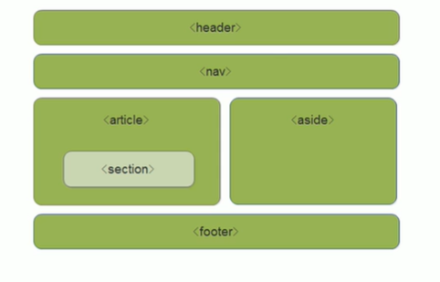

## CSS3的新特性

新增选择器 <br />
（1）属性选择器： <br />
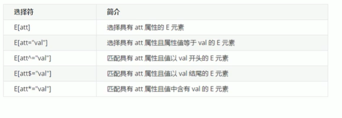

(2)结构伪类选择器 <br />
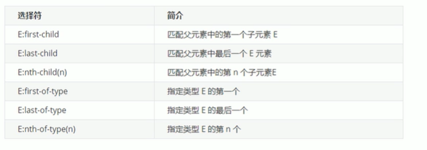
```css
:nth-child(n) 选择某个父元素一个或多个特定的子元素 
n可以是数字，关键词和公式 
n如果是数字，就是选择第n个子元素，里面数字从1开始... 
n可以是关键词，even偶数，odd奇数 
```
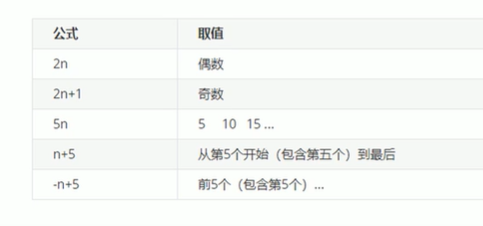

(3)伪元素选择器 <br />
伪元素选择器可以利用CSS创建新标签元素，而不需要html标签，从而简化html结构。<br /> <br />
::befor  在元素内部的前面插入内容 <br />
::after 在元素内部的后面插入内容 <br />
vefore和after 创建一个元素，但是属于行内元素 <br />
before和after 必须有content的属性 <br />
伪元素选择器和标签选择器一样，权重为。 <br />
语法： 
```css
div::before{
    content: '';
}
```

(4) 盒子模型 <br />
因为给一个盒子加外边距和内边距会使盒子变大。 <br />
语法:
···css
box-sizing: border-box; 设置盒子大小为width
···

(5) 滤镜filter <br />
语法：
```
filter: blur(); blur是一个函数，括号内数越大，图像变得越模糊。
```

（6）calc 函数 <br />
这个函数让你申明CSS属性值时执行一些计算 <br />
```css
width: calc(100% - 80px); 使子盒子的宽度一直是父盒子宽度减去80px 
括号里可以进行加减乘除的简单计算。
```

（7）CSS 过度 <br />
<strong>过度（transition）</strong>在不使用javascript的情况下，当一个元素样式变换为另一种样式时为元素添加效果。 <br />
过度动画：是从一个状态 渐渐的过度到另外一个状态。 <br />
<strong>我们现在经常和 hover 一起搭配使用 </strong>
语法： 

```css
transition: 要过度的属性 花费时间 运动曲线 何时开始
transition: wieth 0.5s ease 0s,height 0.5s ease 0s;
```
要过度的属性：想要变化的CSS属性，宽度高度 背景颜色 内外边距都可以。<br />
花费时间：单位是 <strong>秒</strong>必须写单位，比如0.5s。 <br />
运动曲线：默认是 <strong>ease</strong> 可以省略
何时开始： 单位是 <strong>秒</strong> 必须写单位，可以设置延迟触发时间 默认是 0s 可以省略。 <br />

<strong>谁做过度给谁加 </strong>

```css
.box1 {
    float: left;
    width: 200px;
    height: 200px;
    background-color: aqua;
    transition: background-color 0.5s ease 0s;
}
.box1:hover {
    background-color: brown;
}
```

(8) 2D转换 transform<br />
二位坐标系：在二维平面上改变位置和形状。 <br />

1. 2D转换之移动 translate <br />
作用：可以改变耶稣在页面中的位置，类似定位。<br />
语法：
```css
transform: translate(x,y);或者可以分开写
transform: translateX(n);
transform: translateY(n);
```
n可以用百分号，但是移动的值是更具自身的高度和宽度来移动的。 <br />
优点: 不会影响其他元素的位置。 <br />
缺点：对行内元素没有效果。 <br />

2. 2D转换之旋转 rotate <br />
语法：
```css
transform: rotate(度数);
```
重点： <br />
rotate 里面的度数，单位是deg 比如retate(45deg) <br />
度数为正时，顺时针，负时， 为逆时针。 <br />
默认旋转的中心点是元素的中心点。 <br />

3. 设置旋转中心点 transform-origin
语法：
```css
transform-origin: x y;
```
重点：
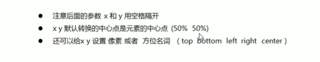

(9) 2D转换之缩放 scale <br />
语法：
```css
transform: scale(x,y);
```
注意;
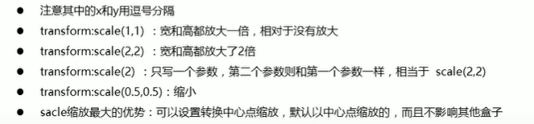

（10）2D转换综合写法
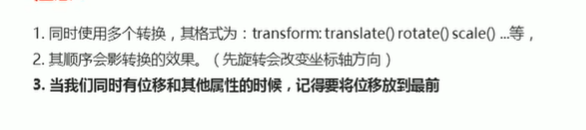

（11）2D转换总结<br />
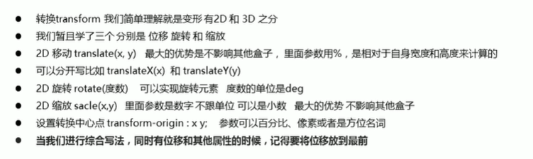

(12) 动画 animation 
语法：
```css
/* 定义动画 keyframes 翻译过来的意思是关键帧的意思 */
@keyframes 动画名称 {
    0% {
        width: 100px;
    }
    100% {
        width: 200px;
    }
}
/* 使用动画 */
div {
    width: 200px;
    height: 200px;
    background-color:aqua;
    margin:100px  auto;
    /* 调用动画 */
    animation-name: 动画名称;
    /* 持续时间 */
    animation-duration: 持续时间; 单位是秒 数字后面必须添加s， 比如5s。
}
```
动画的基本使用：
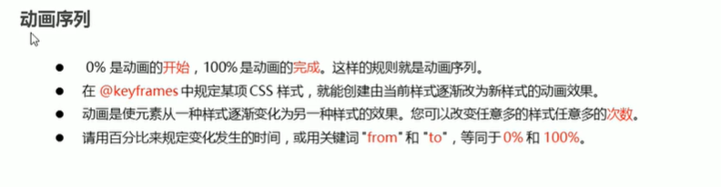

动画常用属性： <br />
```css
{}
/* 使用动画 */
div {
    width: 200px;
    height: 200px;
    background-color:aqua;
    margin:100px  auto;
    /* 调用动画 */
    animation-name: 动画名称,动画属性。
    /* 持续时间 */
    animation-duration: 持续时间;，单位是秒或者是毫秒 数字后面必须添加s或ms， 比如5s，5mx。动画属性。
    animation-timing-function: ease;运动曲线，动画属性。
    animation-delay:1s; 何时开始动画，动画属性。
    animation-iteration-count: infinite;  循环无限次 动画循环的次数，默认是1，动画属性。
    animation-direction: alternate; 逆向播放  默认值是normal，从开头动画，动画属性。
    animation-fill-mode:forwards;停留在最后位置， 默认值是backwards，回到其实位置，
```

动画简写： <br />
```
anmiation: 动画名称 持续时间 运动曲线 播放次数 是否反方向 动画起始或者结束状态
```
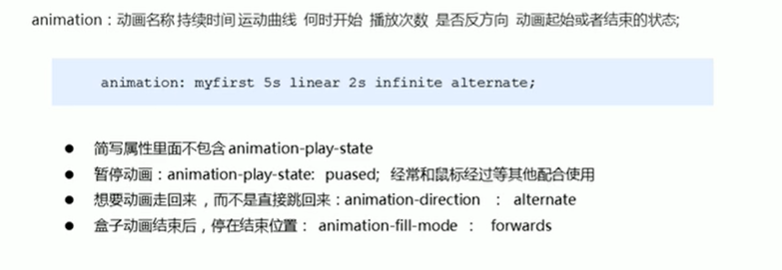

动画常用属性 ：
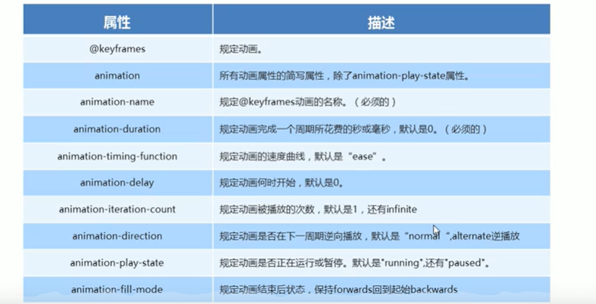

速度曲线细节： 
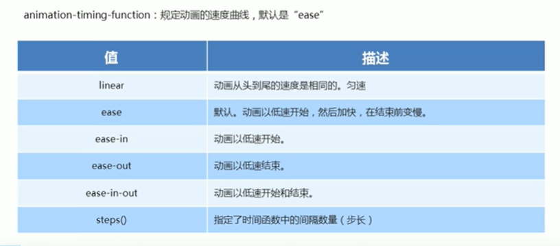


(13) 3D转换 <br />

1. 3D移动 translate3d <br />
语法：
```CSS
<div>
    transform:  translateX(100px);
    transform:  translateY(100px);
    transform:  translateZ(100px);
    transform:  translateZ3d(x,y,z);
</div>
```

2. 3D 透视 perspective <br />
语法：
```css
perspective: 100px; 数值越小物体越大，反之越小
```


透视写到被观察元素的父盒子上面<br />

3. 3D旋转 rotate3d <br />
3d 旋转 指的是可以让元素在三维平面内沿着 x轴 y轴 z轴或者自定义轴进行旋转。 <br />
左手准则： <br />
大拇指指向X轴正方向 ，其他手指指向的是正方向。 <br />
大拇指指向y轴正方向 ，其他手指指向的是正方向。 <br />
大拇指指向z轴正方向 ，其他手指指向的是正方向。 <br />
语法：
```css
transform: rotateX(45deg); 沿着x轴正方向旋转45度
transform: rotateY(45deg); 沿着y轴正方向旋转45度
transform: rotateZ(45deg); 沿着z轴正方向旋转45度
transform: rotate3d(x,y,z,deg) 沿着自定义轴旋转deg 度
transform: rotate3d(1,0,0,45deg)  沿着X轴旋转45度
transform: rotate3d(1,,1,45deg)  沿着对角线旋转45度
```

4. 3D呈现 transform-style <br />
控制子元素是否开启三维立体环境 <br />
语法：
```css
transform-style: flat; 子元素默认不开启3d立体空间
transform-style: preserve-3d; 子元素开启立体空间
```
代码写给父级，但是影响的是子盒子。 <br />

（14）私有前缀 <br />
浏览器私有前缀是为了兼容老版本的写法，比较新的浏览器无需添加。 <br />
```css
-moz-: 代表fiirebox 浏览器私有属性
-ms-: 代表ie 浏览器私有属性
-webkit-: 代表safari、chrome 浏览器私有属性
-o-： 代表Opera 浏览器私有属性
提倡写法：
-moz-：border-radius: 10px;
-ms-：border-radius: 10px;
-webkit-：border-radius: 10px;
-o-：border-radius: 10px;
border-radius: 10px;
```

:::important 结束语
HTML 和 CSS的基础结束。
:::
