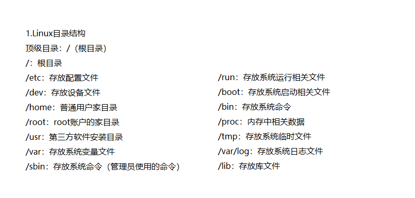
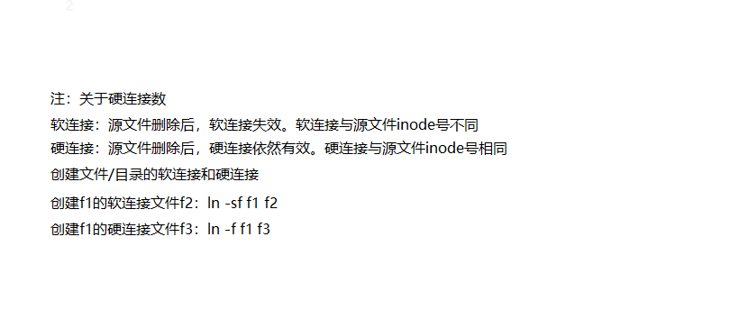
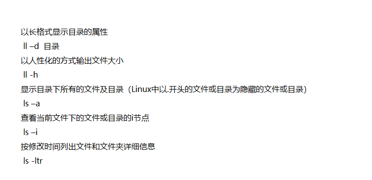

## Linux安装

#### 1.准备

<strong>1. VMware15.5 与 CentOS7镜像</strong>
<strong>2. BOIS 开启虚拟技术</strong>

#### 2.安装

<strong>1. VMware15.5 安装的时候没有注意的东西。</strong>
<strong>2. CentOS7 </strong>根据步骤傻瓜式安装。

## 配置网卡

#### 1.查看网卡配置文件

使用<strong>“ls”</strong> 命令查看该目录中的网卡配置文件。
```s
cd /etc/sysconfig/network-scripts/
```

#### 2.修改网络配置文件

使用<strong>“vi”</strong>命令打开ifcfg-ensxx <strong><u>提示：这里的ensxx中的xx每台电脑不一样</u></strong>
输入<strong>“i”</strong>进入插入模式进行修改。
<strong>修改内容如下：</strong>
```
ONBOOT=yes
```

#### 3.重启网络

```
systemctl restart network
```

#### 4.检查网络是否成功配置

```
ping www.baidu.com
```

## 安装net-tools 网络工具包

#### 1.挂载光驱

```
mount /dev/cdrom /mnt
```

#### 2.查看软件源位置

进入<strong>“/mnt/Packages/”</strong>使用”ls”查看软件包

#### 3.使用rpm安装net-tools

```
rpm –ivh net-tools-2.0-0.24.20131004git.el7.x86_64.rpm
```

## 修改IP

#### 1.查看网络配置
```
ifconfig
```

#### 2.将动态获取方式改为静态
```
vi ifcfg-ensxx
```

<strong>修改内容如下：</strong>
```
BOOTPROTO=static
```

<strong><u>提示：这里的ensxx中的xx每台电脑不一样</u></strong>

#### 3.设置静态ip地址

```
vi ifcfg-ensxx
```
<strong>添加代码如下：</strong>

```
ONBOOT=yes
IPADDR=192.168.17.200
NETMASK=255.255.255.0
GATEWAY=192.168.17.1
```

#### 4.重启网络

```
systemctl restart network
```
#### 5.关闭安全子系统(selinux)、

进入<strong>selinux</strong>配置文件
```
vi /etc/selinux/config
```

<strong>修改内容如下：</strong>
```
SELINUX=disabled
```

#### 6.关闭防火墙

```
systemctl stop firewalld
```
#### 7.防止开机启动

```
systemctl disable firewalld
```
#### 8.查看selinux是否启动

<strong><u>提示：需要reboot重启linux才能生效</u></strong>
```
getenforce
```

## 安装apache服务和samba服务器

#### 1.挂载光驱
```
mount /dev/cdrom /mnt
```
#### 2.建立一个备份的文件夹

<strong><u>提示：backup是自定义文件夹名</u></strong>
```
cd /etc/yum.repos.d
mkdir backup
```
#### 3.备份yum源
<strong><u>提示：将以Centos-开头的所有文件移动到backup目录中</u></strong>
```
mv CentOS-* backup/ 
```

#### 3.建立软件包配置文件

<strong><u>提示：backup是自定义文件夹名</u></strong>
```
vi centos-7.repo
```
<strong>添加代码如下：</strong>
```
[centos-7] 名称和文件名一致
name=centos-7 描述
baseurl=file:///mnt 挂载点/mnt目录
enabled=1    启用该yum源
gpgcheck=0   不检查数字签名
```

#### 4.检查yum源是否生效使用

```
yum list 
```
#### 5.安装apache服务

```
yum -y install httpd
```
启动apache服务
```
systemctl start httpd
```
设置开机自动启动
```
systemctl enable httpd
```
#### 6.安装samba服务器

```
yum -y install samba
```
启动samba服务器
```
systemctl start smb
```
设置开机自动启动
```
systemctl enable smb
```

## 配置samba服务器

#### 1.检查进程服务是否启动

<strong><u>提示：如果这里没有启动，可以尝试重启liunx</u></strong>
```
netstat -napt
```

#### 2.配置samba文件

```
vi /etc/samba/smb.conf
```
<strong>在文档最下面添加代码：</strong>
<strong><u>这里的tom是可以自定的</u></strong>
```
[test]
    comment = this is share
    path = /home/tom
    valid users = tom
    public = yes
    write list = yes
    writable = yes
```

#### 3.建立一个用户用于方samba服务器

```
useradd  tom
```
#### 4.对于tom账号设置一个samba密码

```
smbpasswd -a  tom
```
#### 5.重启smb服务

```
systemctl restart smb
```
#### 5.修改tom的权限

```
chmod 766 tom
```
## Linux文件管理命令
#### 1.关闭firewalld及selinux
firewalld概述:<br />
firewalld是Linux下的一个动态防火墙软件。为了后面实验的结果不受firewalld的干扰，我们需要 关闭firewalld
查看 firewalld当前状态
```
systemctl stop firewalld
```
关闭 firewalld
```
 systemctl status firewalld
 ```
禁止firewalld开机启动
```
systemctl disable firewalld
```
#### 2.目录管理相关命令


（1）查看当前工作路径
```
pwd
```
（2）切换工作目录

```
cd 目标路径
cd ../ 切换至上级目录
cd~ 或 cd 切换至用户家目录
cd ./ 切换至当前目录
cd - 切换至上一次工作路径
```

（3）查看当前目录下的内容  

```
ls
```
(4)关于硬软链接

(5)查看内容指令


#### 3.文件管理相关命令

（1）创建目录

```
mkdir 目录名：创建目录
mkdir -p 多级目录名：创建多级目录
```
（2）删除目录
```
rmdir 目录名：删除空目录
rm -rf 目录名：删除目录或文件（忽略提示）
```
(3)创建文件

```
touch 文件名：修改文件的时间戳，如果文件不存在，则先创建该文件
```
（4）移动与复制
```
mv 文件 目标路径
mv 目录 目标路径
```
(5)复制文件或目录
```
cp 文件 目标路径 
cp -r 目录 目标路径
cp -p 文件 目标路径：复制文件时，不改变文件的权限
```
## Linux破解开机密码

1.重新启动机器，重新启动机器才有机会进入到选单模式。<br />
2.首先建议按上下键，停留在<strong>开机选项</strong>，然后选择第一项然后按字母 “E”.<br />
3.在下面找到 <strong>Linux16</strong> 开头的一行，在<strong>UTF-8</strong>末尾 空格 输入 <strong>rd.break</strong> 就可以了。<br />
4.按 Ctr-x 保存并启动。<br />
5.
```
mount -o remount,rw /sysroot 挂载目录
chroot /sysroot 切换到目录
passwd 修改密码
touch /.autorelabel
exit 退出
reboot 重启
```
## 使用VIM一些指令
懒得整理，网太慢，自行百度。
:<a href="https://www.cnblogs.com/dongxiaodong/p/10078725.html" target="_blank">请点击链接</a>

## Linux分区
#### 1.建立分区
1.查看分区
```
fdisk -l
```
2.进入磁盘分区配置
```
fdisk /dev/分区的区号
```
下面是一些常用的指令
```  
a、输入m查看帮助
b、输入一个n建立分区
c、选择p建立一个主分区
d、起始大小按照默认直接回车
e、直接输入大小        +5G  
f、输入t设置分区的模式，使用l查看代码号，直接输入代码号设置分区模式
g、输入p可以查看分区的详细信息
h、输入w保存退出
```
分区 进入配置输入<strong>“n”</strong>根据提示建立分区
3.分区格式化
```
mkfs.ext4 格式化分区的地址
```
4.使用mount进行挂着使用 
```
mount 挂载分区的地址 /mnt
```
5.查看挂载是否成功
```
df -hT
```
#### 2.建立逻辑分区
前提逻辑分区是建立在扩展分区上的，先建立扩展分区<br />
1、
```
fdisk /dev/分区的区号
命令(输入 m 获取帮助)：n
Partition type:
   p   primary (1 primary, 0 extended, 3 free)
   e   extended
```
2、
```
Select (default p): e
分区号 (2-4，默认 2)：2
起始 扇区 (8390656-41943039，默认为 8390656)：
将使用默认值 8390656
Last 扇区, +扇区 or +size{K,M,G} (8390656-41943039，默认为 41943039)：
将使用默认值 41943039
分区 2 已设置为 Extended 类型，大小设为 16 GiB
```
3、
```
命令(输入 m 获取帮助)：n
Partition type:
   p   primary (1 primary, 1 extended, 2 free)
   l   logical (numbered from 5)
```
4、
```
Select (default p): l
添加逻辑分区 5
起始 扇区 (8392704-41943039，默认为 8392704)：
将使用默认值 8392704
Last 扇区, +扇区 or +size{K,M,G} (8392704-41943039，默认为 41943039)：+2G
分区 5 已设置为 Linux 类型，大小设为 2 GiB
```
如果建立多个逻辑分区重复上述步骤
5、
令(输入 m 获取帮助)：w （保存退出）

## Linux磁盘存储技术
#### 1.RAID技术
具体介绍：<a href="https://blog.csdn.net/ensp1/article/details/81318135" target="_blank">RAID技术全解图解</a>
Mdadm常见参数:<a href="https://blog.csdn.net/zlj121212/article/details/88828973" target="_blank">请点击链接</a>
配置过程:
```
mdadm -Cv /dev/md0 -l5 -n3 -c128 /dev/sdb /dev/sdc /dev/sdd -x1 /dev/sde
more /proc/mdstat（查看建立过程）-等待
mkfs.ext4 /dev/md0 (格式化分区)
mount /dev/md0 /mnt （挂载分区）
mdadm /dev/md0 -f /dev/sdb （模拟硬盘坏损备份盘自动替换）
more /proc/mdstat（查看替换过程） -等待
mdadm /dev/md0 -r /dev/sdb（删除坏损磁盘）
mdadm /dev/md0 -a /dev/sdb （增加磁盘）
```
#### 2.逻辑卷
1.具体介绍：<a href="https://zhidao.baidu.com/question/1371088451383613419.html" target="_blank">linux系统逻辑卷是什么意思？</a>
2.逻辑卷配置
（1）初始化物理卷
```
pvcreate /dev/md0 (磁盘盘符)
```
（2）创建卷组
<strong>提示：vgcreate 卷组名 磁盘挂载点</strong>
```
vgcreate cg0 /dev/md0
```
（3）创建逻辑分区
<strong>提示：lvcreate -n 逻辑分区名 -L 大小 卷组名<br />
在vg0卷组下创建一个名称为date的逻辑卷大小为1G</strong>
```
lvcreate -n date -L 1G vg0
```
（4）查看卷组
```
vgdisplay
```
(5)查看逻辑卷
```
lvdisplay
```
(6)格式化逻辑分区
```
mkfd.ext4 /dev/vg0/date
```
(7)挂载逻辑卷
```
mount /dev/vg0/date /mnt
```
（8）增加date逻辑卷容量
<strong>提示：lvextend -L 容量 扩容挂载点</strong>
```
lvextend -L +1G /dev/vg0/date
```
（9）扩容后刷新
<strong>提示：如果没有显示扩容，刷新一下</strong>
```
resize2fs /dev/vg0/date
```
(10)查看逻辑卷
<strong>提示：查看一下扩容是否成功</strong>
```
lvdisplay
```
:::warning 重点
这里重点说一下：在一个磁盘创建卷组。在卷组上创建1GB的逻辑卷。
然后格式化逻辑分区，挂载逻辑分区。
最后增加逻辑分区的容量，是从卷组未分配的容量分给逻辑分区的。
:::

3.home目录的扩容<br />
（1）初始化物理卷
```
pvcreate /dev/sdd (磁盘盘符)
```
（2）增加Free容量<br />
<strong>vgextend centos /dev/sdd<br />sdd是盘符<br />centos是卷组</strong>
```
vgextend centos /dev/sdd
```
（3）增加hexo容量<br />
<strong>提示：lvextend -L 容量 文件系统<br />/dev/mapper/centos-root是/home的文件系统</strong>
```
lvextend -L +5G /dev/mapper/centos-root
```

## windows 2016 集群配置
详细教程点击：
<a href="./word/windows 2016 集群配置.docx" download="windows 2016 集群配置.docx">下载</a>