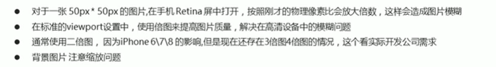
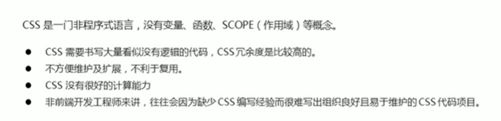
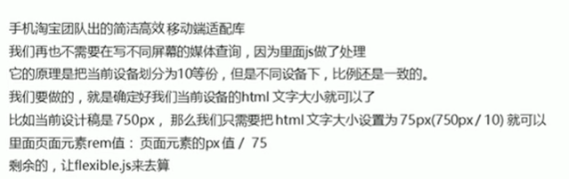

:::note 前言
学完了 HTML CSS 的基础，让我们来了解和学习一下手机端 Web 前端的知识。
:::

## 移动端基础

### 1. 视口

视口<strong> viewport </strong> 就是浏览器显示页面内容的屏幕区域，视口可以分为布局视口、视觉视口和理想视口。 <br />

(1) 布局视口 layout viewport <br />
解决早期电脑端原棉在手机端显示的问题。 <br />
但是显示的元素很小，一般默认可以通过手指缩放网页。 <br />

(2)视觉视口 visual wiewport <br />
它的意思是用户正在看到的网站的区域，<strong>注意：是网站的区域 </strong> <br />
我们可以通过缩放去操作视觉视口，但不会影响布局视口，布局视口任保持原来的空宽度。 <br />

(3)理想视口 ideal viewport <br />
为了使网站在移动端有最理想的浏览换阅读宽度而设定 <br />
理想视口，对设备来讲，是最理想的视口尺寸。 <br />
需要手动填写 meta 视口标签通知浏览器操作。 <br />
meta 视口标签的主要目的：布局视口的宽度应该与理想视口一致，简单理解就是设备视口有多宽，布局的视口就有多宽。 <br />

(4) meta 视口标签 <br />
语法：

```css
<meta name="viewport" countent="width=device-width, initial-scale-1.0,
maximum-scale-1.0, minimum-scale-1.0, user-scalable=no">
width: 宽度设置的是viewport宽度，可以设置device-width特殊值。
initial-scale： 初始化放比，大于0的数字。
maximum-scale: 最大放比，大于0的数字。
minimum-scale; 最小放比，大于0的数字。
user-scalable: 用户是否可以缩放，yes或no (1或0).
```

(5)二倍图 <br />

1. 物理像素&物理像素比 <br />
   

2. 多背图 <br />
   

(6) 背景缩放 background-size <br />
语法：

```css
div {
    width: 500px;
    height: 500px;
    border: 2px solid red;
    background: url(图片地址) no-repeat;
    background-size: 图片的宽度 图片的高度;
    background-size: 500px; 只写一个参数，设置的是宽度，最够会等比例缩放。
    background-size: 50%; 也可以写百分比。
    background-size: cover; 要完全覆盖div盒子，可能有部分背景图片显示不全。
    background-size: contain; 把图片扩展到最大尺寸，宽度和高度完全适应内容区域，、
    可能会有空白区域，
}
```

（7） 移动端主流方案 <br />

1. 单独制作移动端页面 <br />
2. 响应式页面兼容移动端 <br />

（8） 移动端技术解决方案 <br />

1. CSS 初始化 normalize.CSS <br />
   移动端 CSS 初始化推荐使用 normalize.CSS <br />
   <a href="https://necolas.github.io/normalize.css/" target="_blank">官网地址 </a> <br />\

2. CSS2 盒子模型 box-sizing <br />
   语法:

```css
div {
    box-sizing: border-box; 有了这句话使盒子变成 CSS3。padding 和 border 不会在撑大盒子了。
    width: 200px;
    height: 200px;
    background-color: pink;
    padding: 10px;
}
```

3. 特殊样式 <br />
   在手机端，链接点击的时候会出现背景高亮。 <br/>
   去除代码如下：

```css
a {
  -webkit-tap-highlight-color: transparent;
}
```

(9) 移动端技术造型 <br />
1 单独制作移动端页面：<br />
流式布局、flex 弹性布局、less+rem+媒体查询布局、混合布局<br />
响应式页面兼容移动端：<br />
媒体查询、bootstarp<br />

(1)流式布局 （百分比布局） <br />

演示：

```css
div {
    width: 100%
    max-width: 900px; 盒子拉伸最大宽度
    min-width: 320px; 盒子拉伸最小宽度
}
div .box {
    width: 50%;
    height: 200px;
}
```

(2) flex 布局 <br />

1. 传统布局 VS flex 布局
   

2. 布局原理 <br />
   flex 是 flexblr box 的缩写，意思是“弹性布局“，用来为盒状模型提供最大的灵活性，任何一个容器都可以指定为 flex 布局。 <br />
   当我们为父盒子设为 flex 布局以后，子元素的 float、clear 和 vertical-align 属性将会失效。 <br />
   伸缩布局 = 弹性布局=伸缩盒布局 = 弹性盒布局 = flex 布局 <br />
   采用 flex 布局的元素，称为 flex 容器，简称“容器”，他的所有子元素自动称为容器成员，称为 flex 项目。 <br />
   <strong> 总结 flex 布局原理：<br />
   通过给父盒子添加 flex 属性，来控制子盒子的位置和排列方式 </strong>

3. flex 布局父项常见属性 <br />

```css
flex-direction: 设置主轴的方向。
justify-content: 设置主轴上的子元素排列方式
flex-wrap： 设置子元素是否换行
align-content： 设置侧轴上的子元素的排列方式（多行）
align-items： 设置侧轴上的子元素排列方式 (单行)
flex-flow： 复合属性，相当于同时设置了flex-direction和flex-wrap。
```

flex-direction 设置主轴的方向 <br />
默认主轴方向就是 x 轴方向，水平向右。默认 x 轴 <br />
默认恻轴方向就是 y 轴方向，水平向下。 <br />
语法：

```css
<!-- 给父级添加flex属性 -->
div {
    display: flex;
    flex-direction: row; 默认为（x方向的正方向）主轴
    flex-direction: row-reverse; 翻转方向。
    flex-direction: column; 设置为（y方向的正方向）主轴
}
div span {

}
```

justify-content: 设置主轴上的子元素排列方式 <br />
justify-content 属性定义了恻轴在主轴的排列方式 <br />
<storng> 注意：使用这个属性之前一定要确定好主轴是哪个。 </strong> <br />
语法：

```css
div {
    display: flex;
    flex-direction: row;
    justify-content: flex-start; 是设置主轴上子元素的排列方式。从头部开始排列，默认值。
    justify-content: flex-end; 从尾部开始排列。
    justify-content: center; 居中对齐；
    justify-content: space-around; 平均分配剩余空间；
    justify-content: space-between; 先两边贴边 在评分剩余空间。
}
div span {
}
```

flex-wrap 设置子元素是否换行 <br />
在默认的情况下，项目都在一条线上。 flex-wrap 属性定义，flex 布局中默认是不换行的，如果装不开，会缩小子元素的宽度。 <br />
语法：

```css
div {
    display: flex;
    flex-direction: row;
    flex-wrap: nowrap; 默认不换行显示
    flex-wrap: wrap; 如果子元素显示不开，就会换行显示。
}
div span {
}
```

align-items 设置恻轴上的子元素排列方式（单行） <br />
改属性是控制子项在恻轴（默认是 y 轴）上的排列方式， 在子项为单项的时候用。 <br />
语法：

```css
div {
    display: flex;
    /* 默认的主轴是x轴 row */
    justify-content:center; 主轴居中
    /* 我们需要恻轴居中 */
    align-items: center;
}
div span {
}
```

align-content 设置恻轴上的子元素排列方式 （多行） <br />
设置子项恻轴上的排列方式并且只能用于子项出现<strong>换行</strong> 的情况（多行），在单行下是没有效果的。 <br />
语法：

```css
div {
    display: flex;
    flex-wrap: wrap; 换行
    /* 因为有了换行，此时我们恻轴上控制子元素的对齐方式 align-content */
    align-content: flex-start; 从左到右对齐
    align-content: center; 居中对齐
    align-content: space-between; 贴着上下最两边对齐
    align-content: space-around; 上下距离两边平均距离
}
div span {
}
```

align-content 和 align-items 的区别 <br />


flex-flow <br />
flex-flow 属性是 flex-direction 和 flex-wrap 属性的复合属性。
语法：

```css
div {
  display: flex;
  flex-flow: column wrap;
}
div span {
}
```


3. flex 布局子项常见属性 <br />

flex 属性 <br />
flex 属性定义子项目分配剩余空间，用 flex 表示占多少份额。 <br />
语法：

```css
.item {
    flex: 份额数字; 默认值是0.
}
```

align-self 控制子项自己在恻轴上的排列方式 <br />
y 语法：

```css
div span:nth-child(1) {
    align-self: flex-end; 单独控制一个子项在恻轴的对齐方式。
}
```

order 属性定义项目的排列顺序 <br />
数值越小，排列越靠前，默认为 0. <br />
<strong> 注意：和 z-index 不一样 </strong> <br />
y 语法：

```css
div span:nth-child(2) {
    order: -1; 把第二个盒子放到第一个，默认是0.
}
```

（3）rem 适配布局 <br />

1. rem 基础 <br />
   rem 单位 <br />
   em 相对于父元素 的字体大小来说的 <br />
   rem 相对于 html 元素 字体大小来说的 <br />
   rem 的优点： <br />
   就是可以通过修改 html 里面的文字大小来改变页面中元素的大小，可以整体控制 <br />

(4) 媒体查询 <br />
媒体查询 Media query 是 CSS 新语法。 <br />
使用@media 查询 可以针对不同的媒体类型定义不同的样式。 <br />
@media 可以针对不同的屏幕尺寸设置不同样式。 <br />
当你重置浏览器大小的过程中，页面也会根据浏览器的宽度和高度重新渲染页面。 <br />
目前针对很多苹果手机，安卓手机， 平板电脑等设备都用得到多媒体查询。 <br />

语法规范：

```css
@media mediatype and|not|only (media feature) {
    css-Code;
}
/* 在我们屏幕上并且 显示宽度小于等于800px，设置我们想要的样式 */
@media screen and (max-width： 800px) {
    css-Code;
}
```

<strong>
用 @media 开头注意@符号。 <br />
mediatype 媒体类型 <br />
关键词 and not only <br />
media feature 媒体特性 必须有小括号包含 <br />
</strong>

mediatype 语法规范： <br />

```css
/* 不同的终端设备分成不同的类型，称为媒体类型。 */
all 用于所有设备。
print 用于打印机和打印预览
screen 用于电脑屏幕、平板电脑、智能手机
```

关键词 语法规范：

```css
and 可以多个媒体特性链接在一起，相当于“且”的意思
not 排除某个媒体类型，相当于“非”的意思，可以省略
only 指定某个特定的媒体类型，可以省略
```

媒体特性 语法规范：

```css
width 定义输出设备页面可见区域的宽度
min-width 定义输出设备中页面最小可见区域宽度
max-width 定义输出设备中页面最大可见区域宽度
```

（5）媒体查询+rem 实现元素动态大小变化。 <br />

```css
@media screen and (min-width: 320px) {
  html {
    font-size: 50px;
  }
}
@media screen and (min-width: 540px) {
  html {
    font-size: 100px;
  }
}
.top {
  height: 1rem;
  font-size: 0.5rem;
  background-color: green;
  color: #fff;
}
```

(6) 引入资源 <br />
当样式比较多的时候，我们可以针对不用的媒体使用不用 stylesheets（样式表）。 <br />
原理，就是直接在 link 中判断设置的尺寸，然后引用不用的 css 文件。 <br />
语法：

```css
<link rel-"stylesheet" href="style320.css" medie="screen and (min-width: 320px)">
<link rel-"stylesheet" href="style640.css" medie="screen and (min-width: 640px)">
```

(7)less 基础 <br />

维护 css 的弊端：



Less 介绍： <br />


<strong> less 是一门 CSS 预处理语言，它扩展了 CSS 的动态特性。 </strong>

Less 使用 <br />

1. less 变量； <br />
   变量是指没有固定值，可以改变的，因为我们 CSS 中的一些颜色数值等经常使用。 <br />
   语法：

```
@变量名： 值；
```

使用规范：<br/>
必须有@为前缀 <br/>
不能包含特殊字符 <br/>
不能以数字开头 <br/>
大小写敏感 <br/>

Less 编译 <br />


<strong>vscode Less 插件： </strong> <br />
Easy Less 插件用来把 less 文件编译为 css 文件。 <br />
安装完毕插件，重新加载一下 vscode，只要保存 less 文件，会自动生成 CSS 文件。 <br />

Less 嵌套 <br />

```less
.header {
  width: 200px;
  height: 200px;
  background-color: pink;
  a {
    color: red;
    &:hover {
      color: blue;
    }
  }
}

.nav {
  .logo {
    color: green;
  }
  &::vefore {
    content: '';
  }
}
```

Less 运算 <br />
任何数字，颜色或者变量都可以参与运算，就是 Less 提供了 加 减 乘 除 算数运算 <br />

```less
@border: 5px +5;
div {
  width: 200px - 50;
  height: 200px * 2;
  border: @border solid red;
}
img {
  width: 82 / 50rem;
  height: 82 / 50rem;
}
```

<strong>注意： <br />
乘号（\*）和除号（/）的写法 <br />
运算符中间左右有个空格隔开，比如 1px + 5 <br />
对于两个不同的单位的值之间的运算，运算结棍的值取第一个值得单位 <br />
如果两个值之间只有一个值有单位，则运算结果取该单位。 <br />

rem 适配方案 <br />
方案 1：less+媒体查询+rem。 <br />
方案 2： flexiblr.js+rem. <br />

1. 方案 1：less+媒体查询+rem。 <br />
   设计稿常见尺寸宽度：

```
iphone 4、5：640px;
iphone:678: 750px;
安卓：320px、360px、375px、384px、400px、414px、500px、720px
```

动态设置 html 标签 font-size 大小：


元素大小取值方法：


2. 方案 2： flexiblr.js+rem. <br />
   <a href="https://github.com/amfe/lib-flexible"  target="_blanck"> flexiblr.js 开源地址 </a>
   

响应式布局 <br />

1. 响应式开发原理
   就是使用媒体查询针对不同宽度的设备进行布局和样式的设置，从而适配不同的设备的目的。 <br />
   

2. 响应式布局容器 <br />
   响应式需要一个父级作为布局容器，来配合子级元素来实现变化效果。 <br />
   通过媒体查询来改变这个布局容器的大小，再改变里面子元素的排列方式和大小，从而实现不同屏幕下，看到不用的页面布局和样式变化。 <br />
   平时我们的响应式尺寸划分 <br />
   

Bootstrap 前端开发框架 <br />

<a href="https://www.bootcss.com/" target="_blanck"> Bootstrap 中文网 </a>

1. Bootstrap 使用 <br />
   现阶段我们还没有接触 JS 相关课程，所以我们只考虑使用它的样式库。 <br />
   控制权在框架本身，使用者要按照框架所规定的某种钙规范进行开发。 <br />
   <strong>bootsrap 使用四部曲： <br /> 1.创建文件夹结构 <br /> 2.创建 html 骨架结构 <br /> 3.引入相关样式文件 <br /> 4.书写内容 <br /> </strong>

2. 布局容器 <br />
   bootstarp 需要为页面的内容和栅格系统包裹一个 .container 容器，Bootstarp 预先定义号这个类，叫.container ，它提供了两个作此用处的类。 <br />

3. 栅格系统介绍 <br />


4. 栅格选项参数 <br />
   栅格系统用于通过一系列的行(row) 与 列 的组合来创建页面布局，你的内容就可以放入这些创建好的布局中。<br />


5. 列嵌套 <br />


6. 列偏移 <br />


7. 列排序 <br />


8. 响应式工具


:::note 结束
HTML CSS 移动端开发的所有基础，非常感谢黑马程序员的 pink 老师，如果你是一个前端开发的小白，非常推荐你 pink 老师的课程。哔哩哔哩直接搜索 pink 老师就可以啦。❤ <br />
一切才刚刚开始，让我们一起努力。
:::
