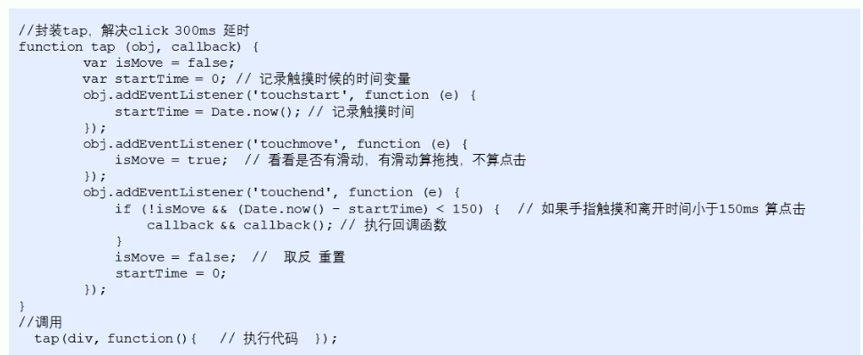

## 触屏事件

### 触屏事件该是

移动端浏览器兼容性较好，不需要考虑以前的兼容性问题，可以放心的使用原生 JS 书写效果。但是移动端也有自己独特的地方，比如触屏事件 touch（触摸事件），Android 和 ios 都有。<br />

- touchstart：手指触屏到一个 DOM 元素时触发
- touchmove：手指的的一个 DOM 元素上移动时触发
- touchend：手指从一个 DOM 元素上移开时触发

```html
<div></div>
<script>
  var div = document.querySelector('div')
  div.addEventListener('touchstart', function () {
    console.log('我摸了你')
  })
  div.addEventListener('touchmove', function () {
    console.log('我继续触发')
  })
  div.addEventListener('touchend', function () {
    console.log('我走了')
  })
</script>
```

### 触摸事件对象（TouchEvent）

TouchEvent 是一类标书手指在触摸平面（触摸屏、触摸板等）的状态变化事件。 <br />
这类事件用于描述一个或多个触点，是开发者可以检测触电的移动，触点的增加和杰少，等等。 <br />
touchstar、touchmove、touchend 三个事件都会各自有事件对象。 <br />

#### touch 手指触摸 DOM 元素事件

触摸事件对象重点有三个常见对象：<br />

- touches：在触摸屏幕的所有手指的一个列表
- targetTouches：正在触摸当前 DOM 元素上的手指的一个列表
- changeTouches：手指状态发生了改变的列表，从无到有，从有到无变化
  :::tip 提示
  因为平时都是给元素注册触摸事件，所以重点记记住 targetTouches。
  :::

### 移动端拖动元素

- touchstart、touchmove、touchend 可以实现拖动元素。
- 但是拖动元素需要当前手指的坐标值，可以使用 targetTouches[0]里面的 pageX 和 pageY。
- 移动端移动原理：手指移动中，计算出手指移动的距离，然后用盒子原来的位置 加 手指移动的距离
- 手指移动的距离：手指滑动中的位置 减去 手指刚开始触摸的位置
  拖动元素三部曲：
- 触摸元素 touchstar：获取手指初始坐标，同时获得盒子原来的位置
- 移动手指：touchmove：计算手指的滑动距离，并且移动盒子
- 离开手指 touchend

:::warning 注意
手指移动也会触发滚动屏幕，所以这里要要阻止默认的屏幕滚动 e.preventDefault();
:::

```html
<div></div>
<script>
  var div = document.querySelector('div')
  // 获取手指初始坐标
  var startX = 0
  var startY = 0
  // 获得盒子原来的位置
  var x = 0
  var y = 0
  div.addEventListener('touchstart', function (e) {
    startX = e.targetTouches[0].pageX
    startY = e.targetTouches[0].pageY
    x = this.offsetLeft
    y = this.offsetTop
  })
  div.addEventListener('touchmove', function (e) {
    // 计算手指的移动距离，手指移动之后的坐标 减 手指初始坐标
    var moveX = e.targetTouches[0].pageX - startX
    var moveY = e.targetTouches[0].pageY - startY
    // 移动盒子
    this.style.left = x + moveX + 'px'
    this.style.top = y + moveY + 'px'
    // 防止拖动盒子的同时拖动屏幕
    e.preventDefault()
  })
</script>
```

## 移动端常见特效

<strong> 案例： 移动端轮播图 </strong>

```html
<!-- css部分 -->
<style>
  * {
    list-style: none;
    padding: 0;
    margin: 0;
  }

  ul {
    list-style: none;
    margin: 0;
    padding: 0;
  }

  a {
    text-decoration: none;
    color: #222;
  }

  div {
    box-sizing: border-box;
  }

  body {
    max-width: 540px;
    min-width: 320px;
    margin: 0 auto;
    font: normal 14px/1.5 Tahoma, 'Lucida Grande', Verdana, 'Microsoft Yahei', STXihei,
      hei;
    color: #000;
    background: #f2f2f2;
    overflow-x: hidden;
    -webkit-tap-highlight-color: transparent;
  }

  .goBack {
    display: none;
    position: fixed;
    bottom: 50px;
    right: 20px;
    width: 38px;
    height: 38px;
    background: url(../images/back.png) no-repeat;
    background-size: 38px 38px;
  }

  .focus {
    position: relative;
    padding-top: 44px;
    overflow: hidden;
  }

  .focus img {
    width: 100%;
  }

  .focus ul {
    overflow: hidden;
    width: 500%;
    margin-left: -100%;
  }

  .focus ul li {
    float: left;
    width: 20%;
  }

  .focus ol {
    position: absolute;
    bottom: 5px;
    right: 5px;
    margin: 0;
  }

  .focus ol li {
    display: inline-block;
    width: 5px;
    height: 5px;
    background-color: #fff;
    list-style: none;
    border-radius: 2px;
    transition: all 0.3s;
  }

  .focus ol li.current {
    width: 15px;
  }
</style>
<!-- html部分 -->
<div class="focus">
  <ul>
    <li>
      <a href="javascript:;"></a>
    </li>
    <li>
      <a href="javascript:;"></a>
    </li>
    <li>
      <a href="javascript:;"></a>
    </li>
    <li>
      <a href="javascript:;"></a>
    </li>
    <li>
      <a href="javascript:;"></a>
    </li>
  </ul>
  <!-- 小圆点 -->
  <ol>
    <li class="current"></li>
    <li></li>
    <li></li>
  </ol>
</div>
<!-- js部分 -->
<script>
  window.addEventListener('load', function () {
    // alert(1);
    // 1. 获取元素
    var focus = document.querySelector('.focus')
    var ul = focus.children[0]
    // 获得focus 的宽度
    var w = focus.offsetWidth
    var ol = focus.children[1]
    // 2. 利用定时器自动轮播图图片
    var index = 0
    var timer = setInterval(function () {
      index++
      var translatex = -index * w
      ul.style.transition = 'all .3s'
      ul.style.transform = 'translateX(' + translatex + 'px)'
    }, 2000)
    // 等着我们过渡完成之后，再去判断 监听过渡完成的事件 transitionend
    ul.addEventListener('transitionend', function () {
      // 无缝滚动
      if (index >= 3) {
        index = 0
        // console.log(index);
        // 去掉过渡效果 这样让我们的ul 快速的跳到目标位置
        ul.style.transition = 'none'
        // 利用最新的索引号乘以宽度 去滚动图片
        var translatex = -index * w
        ul.style.transform = 'translateX(' + translatex + 'px)'
      } else if (index < 0) {
        index = 2
        ul.style.transition = 'none'
        // 利用最新的索引号乘以宽度 去滚动图片
        var translatex = -index * w
        ul.style.transform = 'translateX(' + translatex + 'px)'
      }
      // 3. 小圆点跟随变化
      // 把ol里面li带有current类名的选出来去掉类名 remove
      ol.querySelector('.current').classList.remove('current')
      // 让当前索引号 的小li 加上 current   add
      ol.children[index].classList.add('current')
    })

    // 4. 手指滑动轮播图
    // 触摸元素 touchstart： 获取手指初始坐标
    var startX = 0
    var moveX = 0 // 后面我们会使用这个移动距离所以要定义一个全局变量
    var flag = false
    ul.addEventListener('touchstart', function (e) {
      startX = e.targetTouches[0].pageX
      // 手指触摸的时候就停止定时器
      clearInterval(timer)
    })
    // 移动手指 touchmove： 计算手指的滑动距离， 并且移动盒子
    ul.addEventListener('touchmove', function (e) {
      // 计算移动距离
      moveX = e.targetTouches[0].pageX - startX
      // 移动盒子：  盒子原来的位置 + 手指移动的距离
      var translatex = -index * w + moveX
      // 手指拖动的时候，不需要动画效果所以要取消过渡效果
      ul.style.transition = 'none'
      ul.style.transform = 'translateX(' + translatex + 'px)'
      flag = true // 如果用户手指移动过我们再去判断否则不做判断效果
      e.preventDefault() // 阻止滚动屏幕的行为
    })
    ul.addEventListener('touchend', function () {
      if (flag) {
        if (Math.abs(moveX) > 50) {
          if (moveX > 0) {
            index--
          } else {
            index++
          }
          var translateX = -index * w
          ul.style.transition = 'all .5s'
          ul.style.transform = 'translateX(' + translateX + 'px)'
        } else {
          var translateX = -index * w
          ul.style.transition = 'all 1s'
          ul.style.transform = 'translateX(' + translateX + 'px)'
        }
      }
    })
    clearInterval(timer)
    imer = setInterval(function () {
      index++
      var translatex = -index * w
      ul.style.transition = 'all .3s'
      ul.style.transform = 'translateX(' + translatex + 'px)'
    }, 2000)
  })
</script>
```

### classList 属性

classList 属性是 HTML5 新增的一个属性，返回元素的类名，但是 ie10 以上版本支持。 <br />
该属性用于在元素中添加，移除及切换 CSS 类，有以下方法： <br />

- 添加类 element.classList.add('类名')；在后面追加类名，不会覆盖之前的类名
- 删除类 element.classList.remove('类名')；
- 切换类 element.classList.toggle('类名')；

````html
<style>
  .bg {
    background-color: black;
  }
</style>
<button>点击</button>
<div class="one two"></div>
<script>
  // classList 返回元素的类名
  var div = document.querySelector('div')
  // 添加类名
  div.classList.add('three')
  // 删除类名
  div.classList.remove('three')
  console.log(div.classList)
  // 切换类
  var btn = document.querySelector('button')
  btn.addEventListener('click', function () {
    document.body.classList.toggle('bg')
    e.preventDefault()
  })
</script>
``` ### click 延时解决方案 移动端 click 事件会有 300ms
的延时，原因是移动端屏幕双击会缩放（double tap to zoom）页面。 <br />

- 禁止缩放，浏览器禁用默认的双击缩放行为并且去掉 300ms 的点击延迟。 ```html
<meta name="viewport" content="user-scalable=no" />
````

- 利用 touch 事件自己封装这个事件解决 300ms 延迟
  原理就是： <br />

1. 当我们手指触摸屏幕，记录当前触摸时间。 <br />
2. 当我们手指离开屏幕，用离开的时间减去触摸的时间 <br />
3. 如果事件小于 150ms，并且没有滚动过屏幕，那么我们就定义为点击 <br />
   

## 移动端常用开发插件

### 什么是插件

移动端要求的快速开发，所以我们经常会借助于一些插件来帮我完成操作。 <br />
JS 插件就是 js 文件，它遵循一定的规范编写，方便程序展示效果，拥有特定功能且方便调用，如轮播图和瀑布流插件。<br />
特点：它一般是为了解决某个问题而专门存在，其功能单一，并且比较小。 <br />
fastclick 插件解决 300ms 延迟，使用延迟。 <br />
<a href="https://github.com/fflabs/fastclick" target="_block">GitHub 官网地址 </a>

### Swiper 插件的使用

<a href="https://www.swiper.com.cn" target="_block">中文官网地址 </a>

- 引入插件相关文件。
- 按照规定语法使用

### 其他移动端常见插件

- <a href="http://www.superslide2.com/" target="_block">superslide </a>
- <a href="https://github.com/cubiq/iscroll" target="_block">iscroll </a>

### 插件的使用总结

- 确认插件实现的功能
- 去官网查看使用说明
- 下载插件
- 打开 demo 实例文件，查看需要引入的相关文件，并且引入
- 复制 demo 实例文件中的结构 html，样式 css 以及 js 代码

## 移动端常用开发框架

### 框架概述

框架，顾名思义就是一套架构，它会基于自身的特点向用户提供一套较为完整的解决方案。框架的控制权在框架本身，使用者要按照框架所规定的某种规范进行开发。<br />
插件一般是为了解决某个问题而专门存在，其功能单一，并且比较小。 <br />
前端常用的框架有 Bootstrap、Vue、Angula、rReact 等。既能开发 PC 端，也能开发移动端. <br />
前端常用的移动端插件有 swiper、superslide、iscrol 等。<br />
框架:大而全，一整套解决方案。<br />
插件:小而专一，某个功能的解决方案。<br />

## 本都存储

随着互联网的快速发展，基于网页的应用越来越普遍，同时也变得越来越复杂，为了满足各种各样的需求，会经常在本都存储大量的数据，HTML5 规范提出了相关解决方案。 <br />

### 本地存储特性

- 数据存储在用户浏览器中
- 设置、读取方便、甚至页面刷新不丢失
- 容量较大 sessionStorage 大约 5M、localStorage 大约 20M
- 只能存储字符串，可以将对象 JSON.stringify() 编码后存储

### window.sessionStorage

- 生命周期为关闭浏览器窗口
- 在同一个窗口（页面）下数据可以共享
- 以键值对的形式存储使用
  <strong> 存储数据 </strong>

```html
window.sessionStorageml.setItem(key, balue);
```

<strong> 获取数据 </strong>

```html
window.sessionStorage.getIttem(key);
```

<strong> 删除数据 </strong>

```html
window.sessionStorage.removeItem(key);
```

<strong> 删除所有数据 </strong>

```html
window.sessionStorage.clear(key);
```

```html
<body>
  <input type="text" />
  <button class="set">存储数据</button>
  <button class="get">获取数据</button>
  <button class="remove">删除数据</button>
  <button class="del">清空所有数据</button>
</body>
<script>
  var text = document.querySelector('input')
  var set = document.querySelector('.set')
  var get = document.querySelector('.get')
  var remove = document.querySelector('.remove')
  var del = document.querySelector('.del')
  set.addEventListener('click', function () {
    var val = text.value
    sessionStorage.setItem('Uname', val)
  })
  get.addEventListener('click', function () {
    var getUanme = sessionStorage.getItem('Uname')
    alert(getUanme)
  })
  remove.addEventListener('click', function () {
    sessionStorage.removeItem('Uname')
  })
  del.addEventListener('click', function () {
    sessionStorage.clear()
  })
</script>
```

### indow.localStorage

- 生命周期永久生效，除非手动删除否则关闭页面也会存在
- 可以多窗口（页面）共享（同一浏览器可以共享）
- 以键值对的形式存储使用

  <strong> 存储数据 </strong>

```html
window.localStorage.setItem(key, balue);
```

<strong> 获取数据 </strong>

```html
window.localStorage.getIttem(key);
```

<strong> 删除数据 </strong>

```html
window.localStorage.removeItem(key);
```

<strong> 删除所有数据 </strong>

```html
window.localStorage.clear(key);
```

```html
<body>
  <input type="text" />
  <button class="set">存储数据</button>
  <button class="get">获取数据</button>
  <button class="remove">删除数据</button>
  <button class="del">清空所有数据</button>
</body>
<script>
  var text = document.querySelector('input')
  var set = document.querySelector('.set')
  var get = document.querySelector('.get')
  var remove = document.querySelector('.remove')
  var del = document.querySelector('.del')
  set.addEventListener('click', function () {
    var val = text.value
    localStorage.setItem('Uname', val)
  })
  get.addEventListener('click', function () {
    var getUanme = localStorage.getItem('Uname')
    alert(getUanme)
  })
  remove.addEventListener('click', function () {
    localStorage.removeItem('Uname')
  })
  del.addEventListener('click', function () {
    localStorage.clear()
  })
</script>
```

<strong> 案例： 记住用户名 </strong>

```html
<body>
  <input type="text" id="username" />
  <input type="checkbox" id="remeber" />记住用户名
</body>
<script>
  var username = document.querySelector('#username')
  var remeber = document.querySelector('#remeber')
  if (localStorage.getItem('username')) {
    username.value = localStorage.getItem('username')
    remeber.checked = true
  }
  remeber.addEventListener('change', function () {
    if (this.checked) {
      localStorage.setItem('username', username.value)
    } else {
      localStorage.removeItem('username')
    }
  })
</script>
```
